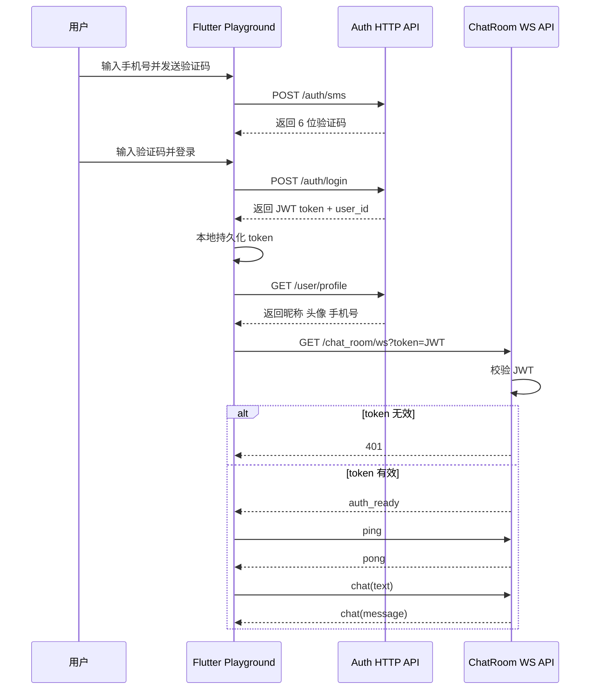

# Playground IM 聊天室整合开发汇报

## 1. 本次目标

本次整合的目标是把现有两块独立能力真正接起来：

- `JWT 用户认证`
- `WebSocket 心跳通信`

最终产物不是继续扩展原来的单点 demo，而是在 `playground` 中新增一个独立的 IM 模块，完整覆盖下面这条链路：

1. 手机号 + 验证码登录
2. 登录成功后保存 JWT Token
3. 使用 JWT 请求用户资料
4. 使用 JWT 建立聊天室 WebSocket 连接
5. 建连成功后进行心跳保活与消息收发
6. 前端以 `聊天室`、`我的` 两个 Tab 组织页面

## 2. 最终结果

目前已经完成以下能力：

- 服务端新增 `GET /chat_room/ws`
- `chat_room/ws` 在握手阶段校验 JWT
- token 缺失或无效时直接返回 `401`
- token 有效时允许升级为 WebSocket
- 连接建立后服务端返回 `auth_ready`
- 客户端可发送 `ping`，服务端返回 `pong`
- 客户端可发送 `chat` 文本消息，服务端广播消息
- 服务端会模拟一个聊天室对端用户进行回复
- Flutter playground 新增独立模块：`IM 聊天室整合`
- 登录后进入带底部导航的微信风格界面
- 底部导航包含 `聊天室` 和 `我`
- `聊天室` 页面整合 JWT + WebSocket + 心跳 + 消息输入
- `我` 页面通过 `/user/profile` 拉取并展示用户信息
- 退出登录时清除本地 token，并回到登录页

## 3. 端到端流程



## 4. 后端实现

### 4.1 新增接口

服务端在 `server/src/main.rs` 中新增了：

- `GET /chat_room/ws`

这个接口不再是“裸连就可用”，而是在升级前先读取 query 中的 `token`：

- 有 token：继续做 JWT 校验
- 无 token：直接返回 `401`
- token 非法或过期：直接返回 `401`
- token 合法：升级为 WebSocket，并把连接与 `user_id` 绑定

### 4.2 WebSocket 消息模型

当前聊天室约定了最小消息协议：

客户端发：

- `{"type":"ping"}`
- `{"type":"chat","text":"你好"}`

服务端回：

- `auth_ready`
- `pong`
- `system`
- `chat`
- `error`

### 4.3 心跳与聊天整合方式

这次没有把“心跳”单独留在另一个 demo 里，而是放进真实聊天室连接中：

- 建连成功后，客户端启动定时心跳
- 定时向 `/chat_room/ws` 发送 `ping`
- 服务端返回 `pong`
- 聊天消息与心跳共用同一条已鉴权连接

这和正式 IM 的方向是一致的：

- HTTP 登录负责签发 token
- WebSocket 连接负责验 token
- 业务消息和心跳都跑在同一条连接里

## 5. 前端实现

### 5.1 新增 playground 模块

新增模块目录：

```text
client/lib/playground/demos/im_playground/
```

分层保持和现有 playground 一致：

- `data`
  - `chat_room_api.dart`
  - `chat_room_repository.dart`
  - `models/chat_room_socket_frame.dart`
- `domain`
  - `chat_room_connection_status.dart`
  - `chat_room_event.dart`
  - `chat_room_message.dart`
- `presentation`
  - `im_playground_page.dart`

首页入口已接入：

- `client/lib/playground/playground_home_page.dart`

入口名称：

- `IM 聊天室整合`

### 5.2 登录态处理

登录页继续复用认证模块现有的认证能力：

- 发送验证码：`/auth/sms`
- 登录：`/auth/login`
- token 存储：`SharedPreferencesAuthSessionStore`

处理流程：

1. 进入页面先检查本地 token
2. 无 token 时展示登录页
3. 登录成功后保存 token
4. 使用 token 拉取 `/user/profile`
5. 用户资料拉取成功后进入 Tab Shell

### 5.3 聊天室页面

聊天室页面风格按微信截图做了轻量化还原：

- 顶部标题居中显示联系人名
- 背景使用浅灰色聊天底
- 左右消息气泡分离
- 底部输入栏使用微信式布局
- 支持文本消息发送
- 连接状态以小字展示在标题下方

为了让页面在 playground 阶段更接近截图观感，页面初始化时会插入一组本地种子消息：

- 文本
- 图片
- 转账卡片
- 时间系统消息

之后真实 WebSocket 收到的新消息会继续追加到消息流中。

### 5.4 我的页面

`我` 页面参考微信个人页做了基础还原：

- 顶部头像、昵称、微信号区块
- 状态 / 朋友等胶囊标签
- 服务、收藏、朋友圈、视频号、订单与卡包、表情、设置等 cell
- 退出登录按钮

这里的数据来源不再是本地假数据，而是直接请求：

- `GET /user/profile`

## 6. 关键文件

本次整合主要涉及这些文件：

- 后端
  - `server/src/main.rs`
  - `server/Cargo.toml`
  - `server/Cargo.lock`
- 前端
  - `client/lib/playground/playground_home_page.dart`
  - `client/lib/playground/demos/im_playground/data/chat_room_api.dart`
  - `client/lib/playground/demos/im_playground/data/chat_room_repository.dart`
  - `client/lib/playground/demos/im_playground/data/models/chat_room_socket_frame.dart`
  - `client/lib/playground/demos/im_playground/domain/chat_room_connection_status.dart`
  - `client/lib/playground/demos/im_playground/domain/chat_room_event.dart`
  - `client/lib/playground/demos/im_playground/domain/chat_room_message.dart`
  - `client/lib/playground/demos/im_playground/presentation/im_playground_page.dart`
- 测试
  - `client/test/playground/im_playground/data/chat_room_api_test.dart`
  - `client/test/playground/im_playground/data/chat_room_repository_test.dart`

## 7. 测试与验证

本次已完成以下验证：

### 7.1 服务端

执行：

```bash
cargo test
cargo clippy --all-targets -- -D warnings
```

结果：

- `4` 个测试全部通过
- `clippy` 通过

服务端验证覆盖了：

- 登录后拿 profile
- token 缺失或非法时返回 `401`
- `chat_room/ws` 非法 token 拒绝升级
- `chat_room/ws` 有效 token 时支持 `auth_ready / ping / pong / chat`

### 7.2 Flutter

执行：

```bash
flutter analyze
flutter test test/playground/auth test/playground/im_playground
```

结果：

- `flutter analyze` 通过
- 认证与 IM playground 的相关测试全部通过

Flutter 侧重点验证了：

- 认证 API 解析
- 认证 repository 映射
- 聊天室 WebSocket API 建连与消息解析
- 聊天室 repository 事件映射与种子消息构建

## 8. 当前方案的价值

这次整合的关键价值不在于“多了一个聊天页面”，而在于把两条原本分开的技术链路收拢成了一条真正可演练的 IM 主链路：

- 用户先登录拿 token
- token 被本地保存
- 资料请求自动携带 token
- 聊天室 WebSocket 用同一个 token 建连
- 心跳与聊天共用同一条已鉴权连接

这意味着后续继续往上叠功能时，基础链路已经成立，可以继续扩展：

- 多消息类型
- 历史消息拉取
- 重连与断线恢复
- 在线状态
- 多端登录策略
- 已读回执

## 9. 结论

本次 playground 已完成一个更接近正式 IM 产品形态的整合模块：

- 后端有真实 JWT 校验的聊天室 WebSocket
- 前端有真实登录态、资料请求、WS 建连、心跳与消息流
- 界面结构和视觉风格已向微信靠拢
- 代码仍然保持在 playground 边界内，没有污染正式产品入口

下一步如果继续演进，建议优先补：

1. 历史消息接口与首次进入拉取
2. WebSocket 断线重连策略
3. 消息发送中的本地回显与发送态
4. 多端登录和踢下线策略
