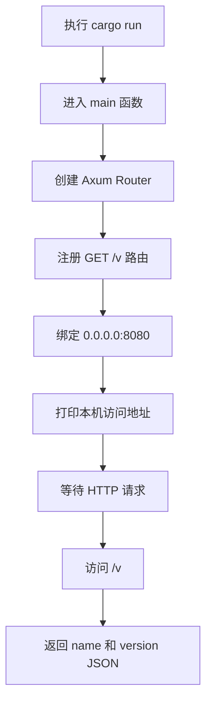

# 第一个 Axum 服务接口：`/v`

## 1. 这份文档解决什么问题

本文面向 Rust 后端新手，说明如何启动本项目的第一个 Axum 服务，并访问 `/v` 接口查看后端系统信息。

当前接口目标很简单：

- 启动一个 Rust 后端服务
- 提供 `GET /v`
- 返回后端项目的 `name` 和 `version`
- 服务启动后在终端打印可访问的 `IP + 端口`

## 2. 项目位置

后端项目位于仓库根目录：

```text
server/
```

核心文件：

```text
server/Cargo.toml
server/src/main.rs
```

## 3. 当前技术栈

| 技术 | 作用 |
| --- | --- |
| Rust | 后端开发语言 |
| Cargo | Rust 项目管理、依赖管理、构建运行工具 |
| Tokio | Rust 异步运行时 |
| Axum | Web 服务框架 |
| Serde | JSON 序列化 |
| local-ip-address | 获取本机局域网 IP，方便手机或其他设备访问 |

## 4. `/v` 接口说明

### 请求

```http
GET /v
```

### 响应

```json
{
  "name": "server",
  "version": "0.1.0"
}
```

字段说明：

| 字段 | 说明 |
| --- | --- |
| `name` | 来自 `Cargo.toml` 的 package name |
| `version` | 来自 `Cargo.toml` 的 package version |

## 5. 启动服务

在项目根目录执行：

```bash
cd server
cargo run
```

第一次运行时，Cargo 会下载依赖并编译项目，时间会稍长。后续再次运行会快很多。

启动成功后，终端会打印类似内容：

```text
server started
local:   http://127.0.0.1:8080/v
network: http://192.168.x.x:8080/v
```

含义：

- `local`：只能在当前电脑访问
- `network`：同一个局域网下的手机、平板、其他电脑可以尝试访问

如果 `network` 没有打印出来，通常是本机 IP 检测失败，不影响本机访问 `127.0.0.1`。

## 6. 访问接口

### 方法一：浏览器访问

打开浏览器，访问：

```text
http://127.0.0.1:8080/v
```

如果服务正常，会看到：

```json
{"name":"server","version":"0.1.0"}
```

### 方法二：终端访问

打开另一个终端，执行：

```bash
curl http://127.0.0.1:8080/v
```

预期输出：

```json
{"name":"server","version":"0.1.0"}
```

## 7. 代码执行流程



## 8. 关键代码解释

### 8.1 路由注册

```rust
let app = Router::new().route("/v", get(version));
```

这行代码的意思是：

- 创建一个 Axum 路由器
- 注册一个 `/v` 路径
- 当收到 `GET /v` 请求时，调用 `version` 函数

### 8.2 返回 JSON

```rust
async fn version() -> Json<VersionResponse> {
    Json(VersionResponse {
        name: env!("CARGO_PKG_NAME"),
        version: env!("CARGO_PKG_VERSION"),
    })
}
```

这里有两个重要点：

- `Json(...)` 会让 Axum 自动返回 JSON 响应
- `env!("CARGO_PKG_NAME")` 和 `env!("CARGO_PKG_VERSION")` 会在编译时读取 `Cargo.toml` 中的包名和版本号

### 8.3 监听地址

```rust
const HOST: &str = "0.0.0.0";
const PORT: u16 = 8080;
```

`0.0.0.0` 表示监听本机所有网卡。

实际效果：

- 当前电脑可以用 `127.0.0.1:8080` 访问
- 同一局域网设备可以用当前电脑的局域网 IP 访问

如果只监听 `127.0.0.1`，其他设备通常访问不到。

## 9. 常见问题

### 9.1 端口被占用

如果看到类似 `Address already in use`，说明 `8080` 端口已经被其他程序占用。

可以先查占用：

```bash
lsof -i :8080
```

如果确认可以停止对应进程，再处理端口占用。

### 9.2 手机访问不了 `network` 地址

先检查：

- 手机和电脑是否在同一个 Wi-Fi
- macOS 防火墙是否拦截了入站连接
- 浏览器访问的地址是否带了 `/v`

正确格式类似：

```text
http://192.168.x.x:8080/v
```

### 9.3 修改版本号后接口没变化

版本号来自 `server/Cargo.toml`：

```toml
[package]
name = "server"
version = "0.1.0"
```

修改后重新运行：

```bash
cargo run
```

## 10. 后续建议

这个 `/v` 接口是后端服务的最小健康检查雏形。后续可以继续扩展：

| 接口 | 用途 |
| --- | --- |
| `/health` | 返回服务是否存活 |
| `/ready` | 返回数据库、Redis 等依赖是否可用 |
| `/metrics` | 暴露 Prometheus 指标 |

当前阶段先把 `/v` 跑通，确认 Axum 服务、路由、JSON 返回和本机访问链路都正常。
