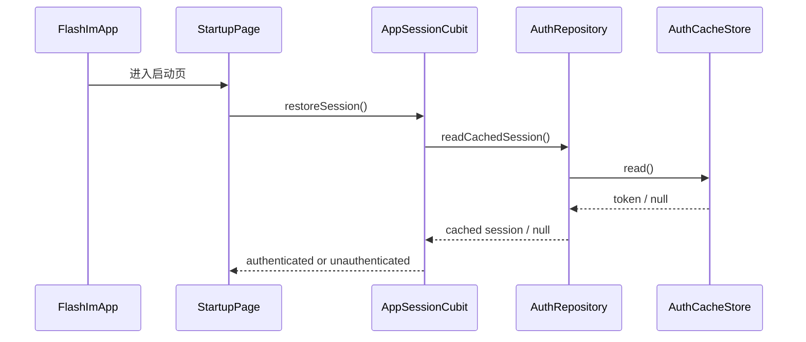
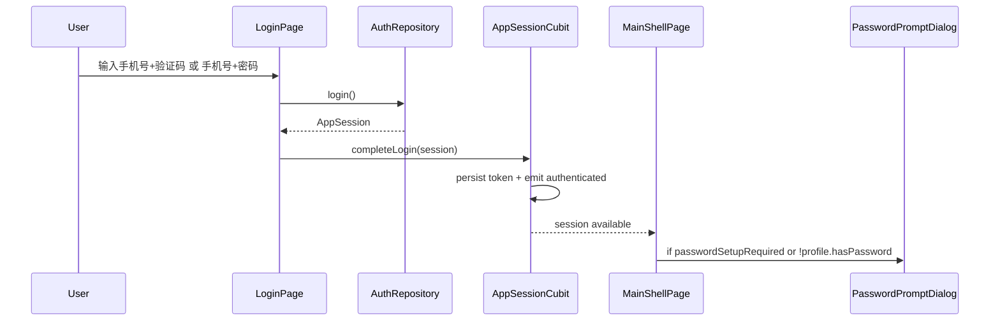
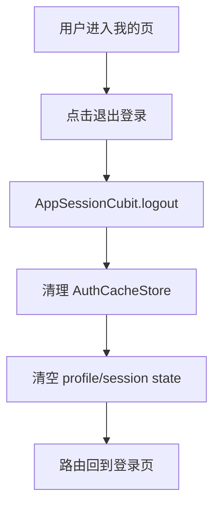
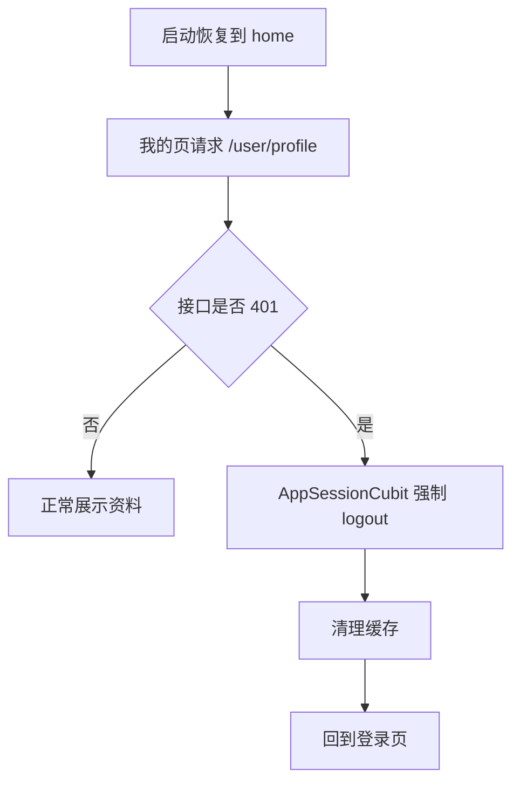

# app-auth-shell — client 设计报告

## 1. 目标

- 在正式应用中落地简约风格的登录认证页面，支持手机号验证码登录和密码登录两条链路。
- 将认证 Token 持久化到本地，并在下次启动时保持登录态。
- 登录成功后进入正式应用主壳层，底部提供 `消息 / 通讯录 / 我的` 三个 Tab。
- 为未设置密码的用户提供登录后提示框，并支持在提示框内完成密码设置。
- 状态管理只保留必要的全局会话层，页面内短生命周期状态使用局部状态处理，避免过度设计。

## 2. 现状分析

- 当前正式应用已经有启动模块，位于 `client/lib/features/startup/`，但 `/login` 和 `/home` 仍是占位页。
- 当前正式入口 [`client/lib/app/flash_im_app.dart`](/Users/rainyjiang/AndroidStudioProjects/flash_im/client/lib/app/flash_im_app.dart) 已通过 `StartupPage` 进入正式应用流，而不是直接落到 playground。
- 成熟交互目前集中在 `client/lib/playground/demos/auth/`：
  - 登录页支持短信验证码登录和密码登录
  - 资料页支持读取用户资料和退出登录
  - Token 已通过 `shared_preferences` 做了 playground 级持久化
- 当前 playground 认证实现的问题：
  - 状态分散在页面 `State` 中，且直接服务于 playground，不适合作为正式应用主链路
  - 缓存 key 带有 playground 语义，不能直接作为正式应用长期方案
  - “我的”页面仍带有 Token 展示等调试视角
  - 主应用没有正式的底部 Tab 壳层和全局会话中心
- 后端接口能力已经基本具备：
  - `POST /auth/sms`
  - `POST /auth/login`
  - `POST /auth/password/set`
  - `GET /user/profile`

## 3. 状态边界与数据模型

### 状态边界

本版本把“登录”拆成两层：

1. 全局共享状态：`AppSessionCubit`
   - 是否已登录
   - token 恢复与持久化
   - 退出登录
   - token 失效后的统一回收
   - 登录成功后是否需要提示设置密码

2. 页面私有状态：页面内局部状态
   - 登录页输入框内容
   - 登录方式切换
   - 发送验证码 loading / 倒计时
   - 登录提交 loading / inline error
   - 设置密码弹窗输入与提交状态
   - 底部 Tab 当前索引
   - “我的”页资料加载与刷新

这样做的原因很直接：
- 登录页本质上是在获取 token，输入与倒计时只存在于当前页面生命周期内，没有复杂共享需求。
- 真正跨页面、跨启动周期共享的是“会话状态”，因此只为它保留一个全局 Cubit。

### 数据模型

```dart
enum AuthStatus {
  initial,
  restoring,
  unauthenticated,
  authenticated,
  failure,
}

enum LoginMethod {
  smsCode,
  password,
}

class AppSession {
  const AppSession({
    required this.token,
    required this.accountId,
    required this.passwordSetupRequired,
  });

  final String token;
  final int accountId;
  final bool passwordSetupRequired;
}

class AuthProfile {
  const AuthProfile({
    required this.accountId,
    required this.nickname,
    required this.avatarUrl,
    required this.phone,
    required this.hasPassword,
  });

  final int accountId;
  final String nickname;
  final String avatarUrl;
  final String phone;
  final bool hasPassword;
}

class AppSessionState {
  const AppSessionState({
    required this.status,
    this.session,
    this.profile,
    this.errorMessage,
    this.shouldPromptPasswordSetup = false,
  });

  final AuthStatus status;
  final AppSession? session;
  final AuthProfile? profile;
  final String? errorMessage;
  final bool shouldPromptPasswordSetup;
}
```

### 唯一保留的全局状态管理

```dart
class AppSessionCubit extends Cubit<AppSessionState> { ... }
```

## 4. 接口契约

### 客户端依赖 API

- `POST /auth/sms`
- `POST /auth/login`
- `POST /auth/password/set`
- `GET /user/profile`

### 1. 发送验证码

`POST /auth/sms`

请求：

```json
{
  "phone": "13800138000"
}
```

响应：

```json
{
  "phone": "13800138000",
  "code": "123456"
}
```

客户端约束：
- 正式 UI 不需要显式展示验证码卡片。
- 开发阶段可在本地直接把返回 code 填回输入框，便于调试。

### 2. 登录

`POST /auth/login`

短信验证码登录请求：

```json
{
  "login_type": "sms_code",
  "phone": "13800138000",
  "code": "123456"
}
```

密码登录请求：

```json
{
  "login_type": "password",
  "identifier": "13800138000",
  "password": "new-password"
}
```

成功响应：

```json
{
  "token": "jwt-token",
  "account_id": 10001,
  "password_setup_required": true
}
```

客户端行为：
- 登录成功后立刻持久化 token。
- 登录页只把结果交给 `AppSessionCubit`，不自己持有全局会话事实。
- 若 `password_setup_required = true`，进入主壳层后弹出设置密码提示框。

### 3. 设置密码

`POST /auth/password/set`

请求头：

```text
Authorization: Bearer <token>
```

请求：

```json
{
  "new_password": "new-password"
}
```

成功响应：

```json
{
  "password_setup_required": false,
  "updated_at": "2026-06-14T10:30:00Z"
}
```

客户端行为：
- 成功后刷新 `AppSessionCubit` 中的 `shouldPromptPasswordSetup` 和 profile 密码状态。
- 关闭提示弹窗，保留在当前主壳层页面。

### 4. 获取用户资料

`GET /user/profile`

成功响应：

```json
{
  "account_id": 10001,
  "nickname": "13800138000",
  "avatar": "https://picsum.photos/seed/10001/120/120",
  "phone": "13800138000",
  "has_password": false
}
```

客户端行为：
- “我的”页展示头像、昵称、手机号和账户 ID。
- 若接口返回 `401`，清理本地登录态并跳回登录页。

### 错误与异常响应

| 场景 | 状态码 | 客户端处理 |
| --- | --- | --- |
| 手机号/验证码/密码字段不完整 | `400` | 登录页显示 inline error，不跳页。 |
| 验证码错误或过期 | `401` | 登录页提示错误信息。 |
| 密码错误 | `401` | 登录页提示“手机号或密码错误”。 |
| 本地 token 已失效 | `401` | `AppSessionCubit` 清理缓存并回退登录页。 |
| 已设置密码却再次调用设置密码 | `409` | 关闭提示框并刷新资料状态。 |
| 服务不可用或网络异常 | `5xx` / transport error | 保持当前页面，显示简洁错误提示。 |

## 5. 核心流程

### 场景一：应用启动恢复登录态



边界条件：
- 启动阶段只依赖本地缓存，不阻塞在远端鉴权。
- 如果本地没有 token，直接进入登录页。

### 场景二：登录成功并弹出设置密码提示



边界条件：
- 登录页的输入、loading、倒计时都只在页面内维护。
- 登录成功后先持久化 token，再切页。

### 场景三：退出登录



### 场景四：缓存存在但 token 失效



## 6. 项目结构与职责划分

### 项目结构

```text
client/lib/
├── app/
│   ├── flash_im_app.dart
│   └── app_router.dart
├── core/
│   ├── auth/
│   │   └── auth_cache_store.dart
│   ├── config/
│   │   └── app_config.dart
│   └── network/
│       └── dio_factory.dart
├── features/
│   ├── auth/
│   │   ├── cubit/
│   │   │   └── app_session_cubit.dart
│   │   ├── data/
│   │   │   ├── auth_api.dart
│   │   │   ├── auth_repository.dart
│   │   │   └── models/
│   │   ├── domain/
│   │   │   ├── app_session.dart
│   │   │   ├── auth_profile.dart
│   │   │   ├── login_method.dart
│   │   │   └── auth_status.dart
│   │   └── presentation/
│   │       ├── login_page.dart
│   │       ├── widgets/
│   │       ├── dialogs/password_setup_prompt.dart
│   │       └── me/me_page.dart
│   ├── main_shell/
│   │   └── presentation/main_shell_page.dart
│   ├── contacts/
│   │   └── presentation/contacts_placeholder_page.dart
│   └── messages/
│       └── presentation/messages_placeholder_page.dart
└── test/
    └── features/
        ├── auth/
        └── main_shell/
```

### 职责划分

- `FlashImApp` 负责根级依赖装配和 `AppSessionCubit` 注入。
- `StartupPage` 只负责品牌启动页展示，并触发 `AppSessionCubit.restoreSession()`。
- `AppSessionCubit` 负责会话恢复、持久化、退出登录、全局鉴权失败回收。
- `LoginPage` 使用页面局部状态维护输入、验证码倒计时、提交 loading 和错误文案。
- `PasswordSetupPromptDialog` 使用页面局部状态维护输入和提交状态。
- `MainShellPage` 使用页面局部状态维护当前 tab index。
- `MePage` 使用页面内异步加载或 `FutureBuilder` 维护资料读取与刷新。
- `AuthRepository` 负责 API DTO 和 domain 对象映射，不承担页面导航。

依赖方向：

- `presentation -> repository -> api`
- `app -> features/auth + features/main_shell`
- `main_shell` 不反向依赖 `login`

明确禁止：

- 在 `login_page.dart` 中直接读写 `SharedPreferences`
- 在 `MainShellPage` 内直接发起登录请求
- 在“我的”页沿用 playground 的 Token 调试展示

## 7. 技术决策

| 决策 | 方案 | 理由 |
| --- | --- | --- |
| 全局状态管理 | `flutter_bloc` + 单个 `AppSessionCubit` | 只为真正跨页面共享的会话状态建模，避免把登录页局部行为过度抽象。 |
| 登录页状态 | `StatefulWidget` 局部状态 | 输入、倒计时、loading 都只活在当前页面，没有复杂共享需求。 |
| “我的”页状态 | 页面内异步加载 / `FutureBuilder` | 当前只有资料读取和退出登录，不需要额外 Cubit。 |
| 底部导航 | `StatefulWidget + currentIndex` | 只有 3 个固定 Tab，不需要再引入单独状态层。 |
| 启动登录态恢复 | 复用正式 `AuthCacheStore`，由 `AppSessionCubit` 主导 | 避免同时维护 `StartupCoordinator` 和会话态两套事实源。 |
| 登录成功后的无密码引导 | 主壳层弹窗提示 + 内联设置密码流程 | 符合“弹出设置提示框”要求，也避免做成重型 onboarding。 |

第三方依赖清单：

| 依赖 | 用途 | 已有/需新增 |
| --- | --- | --- |
| `flutter_bloc` | 仅用于 `AppSessionCubit` 根注入与状态分发 | 需新增 |
| `shared_preferences` | Token 持久化 | 已有 |
| `dio` | 认证接口请求 | 已有 |

## 8. 暂不实现

| 功能 | 理由 |
| --- | --- |
| 消息页真实列表与会话逻辑 | 本期只搭建正式应用壳层，消息页先留白。 |
| 通讯录真实联系人能力 | 同上，先用占位页保证壳层完整。 |
| 修改密码、忘记密码、注册流程 | 当前只要求“无密码提示并设置”，不扩展完整账号体系。 |
| Refresh Token / 自动续签 | 当前后端与客户端都未进入这一步，不能在本期提前设计复杂会话体系。 |
| 远端配置和启动期联网校验 token | 会扩大冷启动链路，偏离本期快速进入正式应用的目标。 |
| 为登录页、我的页、Tab 壳层分别建立独立 Cubit | 当前共享收益不足，会增加代码层级与维护成本。 |
| 沿用 playground 作为正式产品入口 | 当前目标就是脱离 playground，不能再把 demo 页面塞回正式主链路。 |
