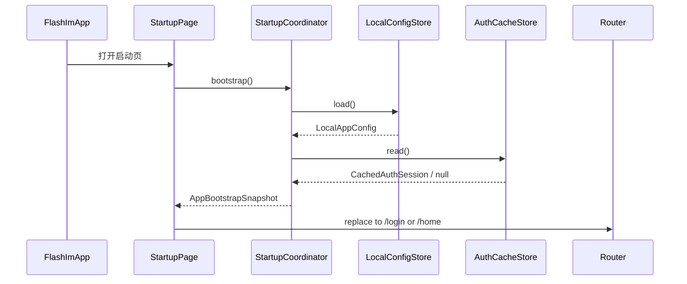
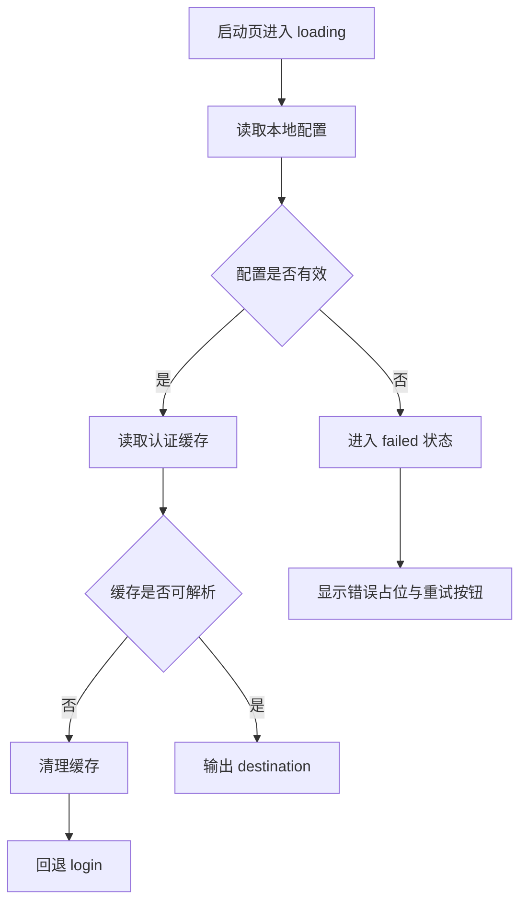
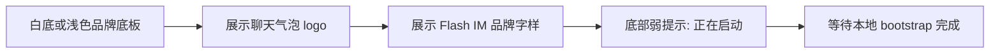

# app-startup — client 设计报告

## 1. 目标

> 让读者 3 秒内知道这个版本要交付什么。

- 为轻聊 APP 建立脱离 playground 的正式启动入口，首屏展示 logo + `Flash IM` 品牌文字。
- 在启动阶段统一加载本地配置与缓存资源，至少覆盖认证数据读取。
- 根据启动期结果做首次页面分流，先落地“登录页空白占位”和“主页面空白占位”。
- 让启动模块具备清晰分层、单向数据流和可持续扩展的启动决策能力。

## 2. 现状分析

> 让读者理解我们从哪里出发，为什么要做这些。

- 当前客户端入口为 [`client/lib/main.dart`](/Users/rainyjiang/AndroidStudioProjects/flash_im/client/lib/main.dart)，应用直接启动 [`client/lib/app/flash_im_app.dart`](/Users/rainyjiang/AndroidStudioProjects/flash_im/client/lib/app/flash_im_app.dart)。
- 当前 `FlashImApp` 的 `home` 直接指向 `PlaygroundHomePage`，说明项目仍处于调试台阶段，没有正式应用壳层。
- 认证缓存能力已经存在于 [`client/lib/playground/demos/auth/data/auth_session_store.dart`](/Users/rainyjiang/AndroidStudioProjects/flash_im/client/lib/playground/demos/auth/data/auth_session_store.dart)，当前仅保存 token，且 key 带有明显 playground 语义。
- 当前没有启动期状态机、没有统一的本地配置读取入口、也没有“启动后该去哪里”的决策模块。
- Flutter 侧基础设施已具备：
  - `shared_preferences` 已接入，可承载认证 token 和轻量本地配置。
  - 现有项目已能启动 MaterialApp，适合扩展为正式 `AppShell + StartupFlow`。
- 本期是新模块设计，不做后端协议新增；启动决策只依赖本地数据，不阻塞于远端接口。

## 3. 数据模型与接口

> 定义系统的骨架，说明数据长什么样，对外暴露什么能力。

### 数据模型

#### Client：核心状态与数据对象

```dart
enum StartupStage {
  idle,
  loading,
  ready,
  failed,
}

enum LaunchDestination {
  login,
  home,
}

class CachedAuthSession {
  const CachedAuthSession({
    required this.token,
    this.accountId,
  });

  final String token;
  final int? accountId;
}

class AppBootstrapSnapshot {
  const AppBootstrapSnapshot({
    required this.destination,
    required this.hasAuthSession,
    required this.config,
  });

  final LaunchDestination destination;
  final bool hasAuthSession;
  final LocalAppConfig config;
}

class LocalAppConfig {
  const LocalAppConfig({
    required this.appName,
    required this.apiBaseUrl,
    required this.enableDebugTools,
  });

  final String appName;
  final String apiBaseUrl;
  final bool enableDebugTools;
}
```

#### 启动模块对外接口

```dart
abstract interface class StartupCoordinator {
  Future<AppBootstrapSnapshot> bootstrap();
}

abstract interface class LocalConfigStore {
  Future<LocalAppConfig> load();
}

abstract interface class AuthCacheStore {
  Future<CachedAuthSession?> read();
  Future<void> clear();
}
```

#### 页面路由表面

- `StartupPage`
- `LoginPlaceholderPage`
- `HomePlaceholderPage`

建议命名：
- `/startup`
- `/login`
- `/home`

#### 关键设计选择

| 决策 | 理由 |
| --- | --- |
| 启动模块只产出 `LaunchDestination`，不直接负责复杂页面导航 | 让启动层只做判断，不侵入后续业务页面实现。 |
| 启动阶段仅依赖本地配置和本地认证缓存 | 当前需求明确是“加载本地配置、缓存资源”，避免过早引入网络阻塞。 |
| 把认证缓存抽成 `AuthCacheStore`，不直接复用 playground 命名 | 后续正式应用与 playground 应当彻底解耦，避免 key、目录、职责继续污染。 |
| 使用 `AppBootstrapSnapshot` 聚合启动结果 | 避免页面层到处各读一次配置、一次 token，保证启动结果单次计算、统一分发。 |
| 启动 logo 视图与启动流程状态分离 | 启动页视觉层只关注展示，状态变化由 coordinator/view model 驱动，便于后续加动画或超时策略。 |

### 接口契约

#### 启动模块内部契约

1. `StartupCoordinator.bootstrap()`

输入：无

输出：

```json
{
  "destination": "login",
  "hasAuthSession": false,
  "config": {
    "appName": "Flash IM",
    "apiBaseUrl": "http://127.0.0.1:9600",
    "enableDebugTools": false
  }
}
```

行为约束：
- 成功时一定返回 `AppBootstrapSnapshot`。
- 若本地配置损坏、认证缓存解析失败等异常不可恢复，则进入 `failed` 状态，由启动页展示错误占位与重试动作。

2. `LocalConfigStore.load()`

输入：无

输出：

```json
{
  "appName": "Flash IM",
  "apiBaseUrl": "http://127.0.0.1:9600",
  "enableDebugTools": false
}
```

来源约束：
- 本期可先从应用内默认值或本地静态配置读取。
- 不要求支持远端配置拉取。

3. `AuthCacheStore.read()`

输出一：存在认证缓存

```json
{
  "token": "jwt-token",
  "accountId": 10001
}
```

输出二：无认证缓存

```json
null
```

决策规则：
- 有可用 token：跳转 `home`
- 无 token：跳转 `login`

#### 页面级占位契约

- `LoginPlaceholderPage`
  - 页面中心仅展示 `登录页占位` 文案。
- `HomePlaceholderPage`
  - 页面中心仅展示 `主页面占位` 文案。

#### 错误状态

| 场景 | 来源 | 启动层处理 |
| --- | --- | --- |
| 本地配置读取失败 | 配置文件格式异常、必填项缺失 | 进入 `failed`，展示“启动失败，请重试”。 |
| 认证缓存解析失败 | 缓存数据被破坏、结构不兼容 | 清理缓存后回退 `login`，不要卡死在错误态。 |
| 本地资源加载超时 | 未来可能引入更大资源包 | 本期预留超时兜底，但默认不引入复杂超时动画。 |

## 4. 核心流程

> 把关键业务路径画出来，让 AI 理解数据怎么流转。

### 场景一：正常启动并按认证缓存分流



边界条件：
- 启动页至少展示品牌信息，直到本地读取流程完成。
- 路由跳转使用替换而非叠加，避免用户回退到启动页。

### 场景二：缓存损坏或配置失败



边界条件：
- “缓存损坏”优先按可恢复问题处理，避免因为本地 token 脏数据导致 App 无法进入登录页。
- “配置失败”属于启动骨架级异常，应允许用户重试。

### 场景三：启动页视觉表现



补充规则：
- logo 使用用户提供的蓝色聊天气泡图形，作为正式品牌资产输入。
- 本期不追求复杂 Lottie 或启动动画，先保证识别度、稳定性和后续可替换性。

## 5. 项目结构与技术决策

> 明确代码怎么组织、职责怎么分、为什么这么选。

### 项目结构

```text
client/lib/
├── app/
│   ├── flash_im_app.dart                 # 应用壳层，注册主题与根路由
│   └── app_router.dart                   # /startup /login /home 的根路由配置
├── core/
│   ├── config/
│   │   ├── app_config.dart               # LocalAppConfig 定义
│   │   └── local_config_store.dart       # 本地配置读取接口与默认实现
│   └── auth/
│       └── auth_cache_store.dart         # 正式应用认证缓存接口与实现
├── features/
│   └── startup/
│       ├── data/
│       │   └── startup_coordinator_impl.dart
│       ├── domain/
│       │   ├── app_bootstrap_snapshot.dart
│       │   ├── launch_destination.dart
│       │   └── startup_stage.dart
│       └── presentation/
│           ├── startup_page.dart         # logo + Flash IM 启动页
│           ├── login_placeholder_page.dart
│           └── home_placeholder_page.dart
└── assets/
    └── branding/
        └── flash_im_logo.png             # 用户提供的正式 logo 资源
```

### 职责划分

- `main.dart` 只负责 `runApp`，不参与启动决策。
- `FlashImApp` 负责应用壳、主题和根导航注册，不直接读取缓存。
- `StartupPage` 只订阅启动状态和渲染启动 UI，不直接访问 `shared_preferences`。
- `StartupCoordinator` 负责串联本地配置与认证缓存，产出唯一启动结果。
- `LocalConfigStore` 与 `AuthCacheStore` 只做数据读写，不包含导航逻辑。

依赖方向：

- `presentation -> domain`
- `data -> domain`
- `data -> core`
- `app -> features/startup`

明确禁止：

- `app/flash_im_app.dart` 直接读取认证缓存。
- `StartupPage` 直接依赖 playground 下的 auth repository。
- placeholder 页面反向调用 startup data 层。

### 技术决策

| 决策 | 方案 | 理由 |
| --- | --- | --- |
| 根入口改造 | `MaterialApp(home: StartupPage())` 或根命名路由先落 `/startup` | 让正式应用先建立启动骨架，再逐步替换掉 playground 首页。 |
| 启动状态管理 | 轻量 coordinator + page state | 当前只涉及一次性启动流程，没必要一开始引入重状态框架。 |
| 认证缓存存储 | `shared_preferences` | 现有依赖已具备，足够承载 token 和 accountId。 |
| 配置读取 | 本地默认配置 + 独立 `LocalConfigStore` | 先保证启动期结构清晰，后续接环境化配置时改动最小。 |
| 跳转策略 | `pushReplacement` / `replace` | 避免返回键回到启动页。 |
| logo 资源管理 | 本地 asset 管理 | 用户已提供正式 logo，适合纳入资产目录统一引用。 |

第三方依赖清单：

| 依赖 | 用途 | 已有/需新增 |
| --- | --- | --- |
| `shared_preferences` | 读取认证缓存与本地配置 | 已有 |
| `flutter` | 根导航、页面渲染 | 已有 |
| `dio` | 本期启动阶段不直接使用，但后续登录/主页会复用 | 已有 |

## 6. 暂不实现

> 给 AI 编码画红线，防止过度发挥。

| 功能 | 理由 |
| --- | --- |
| 启动期远端配置拉取 | 当前需求明确是“加载本地配置、缓存资源”，不应把启动链路扩展到网络初始化。 |
| 自动校验 token 是否过期并请求服务端刷新 | 本期只按本地是否存在认证数据做分流，不实现 refresh token 体系。 |
| 真正的登录页和主页面业务 UI | 用户已明确本期先用文字空白页占位。 |
| 多阶段动画、Lottie、品牌动态过场 | 容易过度设计，先保证启动链路和分层稳定。 |
| 将 playground 能力直接并入正式应用首页 | 当前目标是脱离 playground，而不是把 playground 包成正式入口。 |
