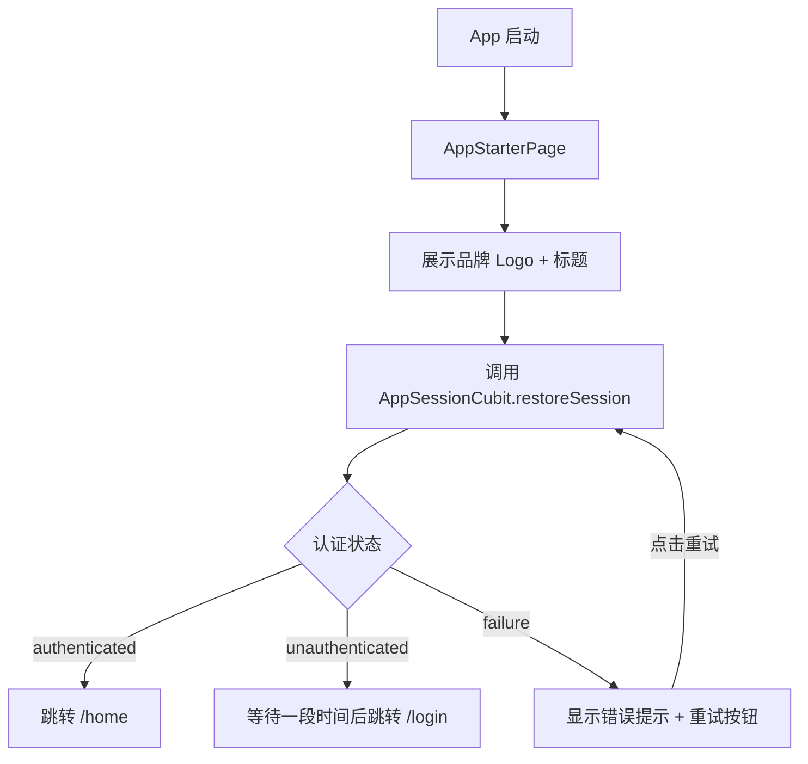
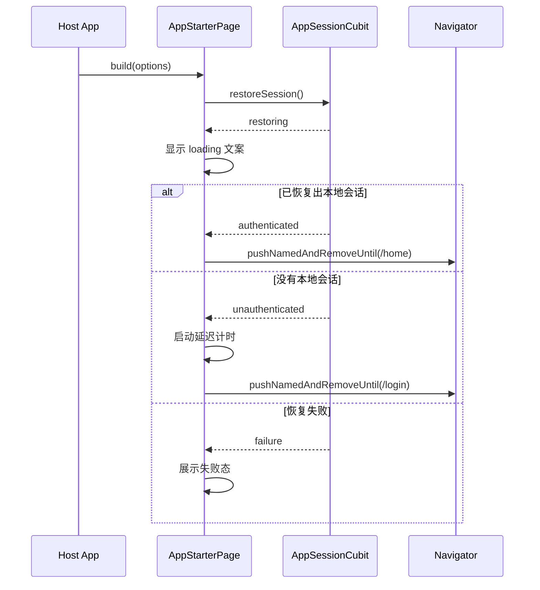

# app_starter 模块 — Client 设计报告

## 1. 目标

- 将当前正式应用的启动页能力抽成独立本地 package，落到 `client/modules/app_starter`
- 启动时展示品牌形象（Logo + 应用名 + 简短文案）
- 集中承载正式产品的启动流程：恢复登录态、分流登录页/主页、失败重试
- 让宿主 app 通过配置接入 `app_starter`，而不是直接依赖宿主 `features/startup`
- 与 `flash_auth` 形成清晰边界：`app_starter` 只负责启动，不负责认证数据实现

---

## 2. 现状分析

- 当前正式产品已经脱离 playground，但启动逻辑仍然写在宿主应用目录 `client/lib/features/startup/`
- 当前真实生效的启动流程不是 `StartupCoordinator`，而是 `StartupPage` 直接调用 `AppSessionCubit.restoreSession()`，再根据认证状态跳转 `/login` 或 `/home`
- 当前 `startup` 目录里还保留了一套旧抽象：`StartupCoordinator / AppBootstrapSnapshot / LaunchDestination`，但这套已经不属于正式运行主链路
- 当前启动页还直接依赖宿主应用里的：
  - `AppRoutes`
  - `assets/branding/flash_im_logo_alpha.png`
  - 启动文案和延迟常量
- 当前认证模块已经独立为 `client/modules/flash_auth`，如果启动模块继续留在宿主 `lib/features` 中，模块边界会不对称
- 所以 `app_starter v0.1.0` 的目标不是发明一套新启动架构，而是把当前真实可运行的启动链路模块化、去宿主耦合、形成独立 package

---

## 3. 数据模型与接口

### 数据模型

启动阶段状态：

- `AppStarterIdle` / `AppStarterLoading` / `AppStarterReady` / `AppStarterFailed`
- 当前实现不需要复杂事件总线，只需要页面内部维护阶段状态，并监听 `flash_auth` 的 `AppSessionCubit`

启动配置：

- `AppStarterRoutes` — 宿主传入登录页路由和主页路由
- `AppStarterBranding` — 宿主传入 Logo、标题、副标题文案
- `AppStarterOptions` — 聚合启动页所需配置：品牌、路由、未登录等待时长、失败文案

建议模型：

- `AppStarterRoutes(loginRouteName, homeRouteName)`
- `AppStarterBranding(logo, title, idleSubtitle, loadingSubtitle)`
- `AppStarterOptions(routes, branding, unauthenticatedDelay, failureMessage, retryLabel)`

### 接口契约

`app_starter` 不直接持有认证仓库，不读取 token，不自己实现缓存恢复。它只依赖 `flash_auth` 暴露出来的会话状态：

- `AppSessionCubit.restoreSession()`
- `AppSessionState.status`
- `AppSessionState.errorMessage`
- `AuthStatus.initial / restoring / authenticated / unauthenticated / failure`

对外页面接口建议为：

```dart
class AppStarterPage extends StatefulWidget {
  const AppStarterPage({
    super.key,
    required this.options,
  });

  final AppStarterOptions options;
}
```

宿主应用负责：

- 提供 `BlocProvider<AppSessionCubit>`
- 传入 `AppStarterOptions`
- 注册 `/login` 和 `/home` 路由

### 模块边界

- `app_starter` 知道“认证状态”
- `app_starter` 不知道“认证实现细节”
- `flash_auth` 负责恢复会话
- 宿主 app 负责组装路由和品牌配置

### 关键设计选择

| 决策 | 理由 |
|------|------|
| `app_starter` 直接依赖 `flash_auth` 的 `AppSessionCubit` | 当前正式产品已经以它为真实启动状态源，复用最稳 |
| 路由名由宿主传入 | package 不再反向 import `AppRoutes` |
| 品牌资源由宿主传入 | package 不和 `Flash IM` 资源路径硬绑定 |
| v0.1.0 只迁移“真实生效链路” | 不把已经脱离主链路的旧 `StartupCoordinator` 体系继续带进新模块 |

---

## 4. 核心流程

### 启动流程



### 启动时序



### 关键规则

- 启动页首帧后再触发 `restoreSession()`，避免在 build 期间直接拉起状态变化
- 未登录时仍保留当前产品已有的延迟跳转行为
- 已登录时直接进入主页，不额外等待
- 跳转使用替换式导航，不允许用户返回启动页
- 页面销毁时必须取消未登录延迟 timer，避免误跳转
- 重试只重新触发 `restoreSession()`，不额外引入第二套恢复逻辑

### UI 线框

```text
┌─────────────────────────────┐
│                             │
│                             │
│         [logo widget]       │
│           Flash IM          │
│        轻量即时通讯          │
│                             │
│       正在恢复登录状态       │
│                             │
│   失败时展示错误 + 重试按钮   │
│                             │
└─────────────────────────────┘
```

- 居中品牌主体
- 正常情况下只显示启动内容
- 失败时在底部展示错误信息与重试按钮

---

## 5. 项目结构与技术决策

### 项目结构

```text
client/
├── modules/
│   ├── flash_auth/
│   └── app_starter/
│       ├── lib/
│       │   ├── app_starter.dart
│       │   └── src/
│       │       ├── domain/
│       │       │   ├── app_starter_branding.dart
│       │       │   ├── app_starter_options.dart
│       │       │   ├── app_starter_routes.dart
│       │       │   └── app_starter_stage.dart
│       │       └── presentation/
│       │           ├── app_starter_page.dart
│       │           └── widgets/
│       │               ├── starter_brand_panel.dart
│       │               └── starter_failure_panel.dart
│       └── test/
│           └── app_starter_test.dart
├── lib/
│   ├── app/
│   │   ├── app_router.dart
│   │   └── flash_im_app.dart
│   ├── features/
│   │   ├── home/
│   │   └── mine/
│   └── core/
│       ├── config/
│       └── network/
```

### 职责划分

- `flash_auth` — 负责恢复会话、认证状态流转
- `app_starter` — 负责启动页 UI、失败态、延迟跳转、启动流程驱动
- `app_router.dart` — 负责注册 `/startup /login /home`
- `flash_im_app.dart` — 负责把品牌配置、路由名和 `AppSessionCubit` 组装给 `app_starter`

依赖方向：

- `flash_im app -> app_starter`
- `flash_im app -> flash_auth`
- `app_starter -> flash_auth`
- `flash_auth` 不反向依赖 `app_starter`

### 技术决策

| 决策 | 方案 | 理由 |
|------|------|------|
| 模块形态 | 本地 path package | 与 `flash_auth` 保持一致，便于持续模块化 |
| 启动状态源 | `AppSessionCubit` | 复用当前真实生效链路 |
| 路由接入 | 宿主传 route name | 降低 package 对宿主 app 的直接耦合 |
| 品牌接入 | 宿主传 `Widget + 文案` | 保留换皮能力，避免 package 硬编码品牌资源 |
| 失败态处理 | 保留在 starter package 内 | 启动体验应完整归属于启动模块 |

---

## 6. 暂不实现

| 功能 | 理由 |
|------|------|
| 将 `LocalConfigStore` 一并迁入 `app_starter` | 当前配置读取属于宿主基础设施，不是 v0.1.0 的最小目标 |
| 将旧 `StartupCoordinator / AppBootstrapSnapshot / LaunchDestination` 继续做强兼容 | 当前正式产品主链路已不依赖它们，继续保留只会制造双轨结构 |
| 远端配置拉取 / 热更新 / 版本检查 | 启动模块本期只处理本地恢复与页面分流 |
| 启动动画、引导页、首次安装流程 | 这属于后续体验增强，不是本模块独立化的首要目标 |
| 完全脱离 `flash_auth` 再抽一层 session protocol | 现阶段收益低，会让启动链路多出一层无意义抽象 |

