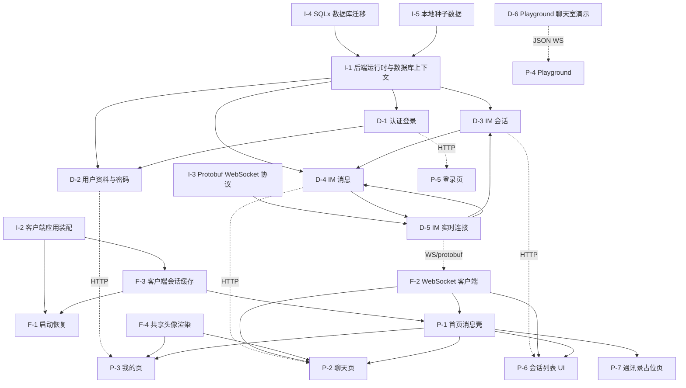

# Flash IM 功能网归档

最后更新：2026-07-09

## 节点编号表

| 编号 | 功能节点 | 层级 | 所属域 | 状态 | 局域网络 |
|------|---------|------|--------|------|----------|
| I-1 | 后端运行时与数据库上下文 | 基础设施 | database/core | ✅ | [database/server.md](modules/database/server.md) |
| I-2 | 客户端应用装配 | 基础设施 | app-startup | ✅ | [app-startup/client.md](modules/app-startup/client.md) |
| I-3 | Protobuf WebSocket 协议 | 基础设施 | ws | ✅ | [ws/server.md](modules/ws/server.md) / [ws/client.md](modules/ws/client.md) |
| I-4 | SQLx 数据库迁移 | 基础设施 | database | ✅ | [database/server.md](modules/database/server.md) |
| I-5 | 本地种子数据 | 基础设施 | database | ✅ | [database/server.md](modules/database/server.md) |
| D-1 | 认证登录 | 领域 | auth | ✅ | [auth/server.md](modules/auth/server.md) / [auth/client.md](modules/auth/client.md) |
| D-2 | 用户资料与密码 | 领域 | session | ✅ | [session/server.md](modules/session/server.md) / [session/client.md](modules/session/client.md) |
| D-3 | IM 会话 | 领域 | conversation | ✅ | [conversation/server.md](modules/conversation/server.md) / [conversation/client.md](modules/conversation/client.md) |
| D-4 | IM 消息 | 领域 | message | ✅ | [message/server.md](modules/message/server.md) / [message/client.md](modules/message/client.md) |
| D-5 | IM 实时连接 | 领域 | ws | ✅ | [ws/server.md](modules/ws/server.md) / [ws/client.md](modules/ws/client.md) |
| D-6 | Playground 聊天室演示 | 领域 | playground | ✅ | [playground/server.md](modules/playground/server.md) / [playground/client.md](modules/playground/client.md) |
| F-1 | 启动恢复 | 前端基础 | app-startup | ✅ | [app-startup/client.md](modules/app-startup/client.md) |
| F-2 | WebSocket 客户端 | 前端基础 | ws | ✅ | [ws/client.md](modules/ws/client.md) |
| F-3 | 客户端会话缓存 | 前端基础 | session | ✅ | [session/client.md](modules/session/client.md) |
| F-4 | 共享头像渲染 | 前端基础 | shared | ✅ | [session/client.md](modules/session/client.md) / [message/client.md](modules/message/client.md) |
| P-1 | 首页消息壳 | 前端业务 | app-startup/conversation | ✅ | [app-startup/client.md](modules/app-startup/client.md) |
| P-2 | 聊天页 | 前端业务 | message | ✅ | [message/client.md](modules/message/client.md) |
| P-3 | 我的页 | 前端业务 | session | ✅ | [session/client.md](modules/session/client.md) |
| P-4 | Playground | 前端业务 | playground | ✅ | [playground/client.md](modules/playground/client.md) |
| P-5 | 登录页 | 前端业务 | auth | ✅ | [auth/client.md](modules/auth/client.md) |
| P-6 | 会话列表 UI | 前端业务 | conversation | ✅ | [conversation/client.md](modules/conversation/client.md) |
| P-7 | 通讯录占位页 | 前端业务 | contacts | ⚠️ 占位 | [conversation/client.md](modules/conversation/client.md) |

## 全局网络图

说明：
- 实线表示模块内或客户端包依赖。
- 虚线表示 HTTP、WebSocket 或跨端通信。
- `/chat_room/ws` 属于 Playground；正式 IM 实时链路是 `/ws/im`。

## 存档记录

| 版本 | 日期 | 节点数 | 摘要 | 快照 |
|------|------|--------|------|------|
| v0.1.0 | 2026-06-04 | 5 | 用户认证与 Playground 聊天室成型 | [v0.1.0_2026-06-04.md](trace/v0.1.0_2026-06-04.md) |
| v0.2.0 | 2026-06-07 | 6 | 服务端认证登录类型拆分，前端补齐密码登录 | [v0.2.0_2026-06-07.md](trace/v0.2.0_2026-06-07.md) |
| v0.3.0 | 2026-06-12 | 8 | 后端认证系统升级，开始形成正式认证文档链 | [v0.3.0_2026-06-12.md](trace/v0.3.0_2026-06-12.md) |
| v0.4.0 | 2026-06-14 | 10 | 客户端启动到认证闭环，产品启动壳成型 | [v0.4.0_2026-06-14.md](trace/v0.4.0_2026-06-14.md) |
| v0.5.0 | 2026-06-15 | 13 | 前后端模块隔离，建立 app_starter 与服务端模块化边界 | [v0.5.0_2026-06-15.md](trace/v0.5.0_2026-06-15.md) |
| v0.5.1 | 2026-06-29 | 15 | 认证、会话资料与服务端 core/user 模块进一步拆分 | [v0.5.1_2026-06-29.md](trace/v0.5.1_2026-06-29.md) |
| v0.6.0 | 2026-07-01 | 18 | Protobuf 协议与 WebSocket 连接管理接入主应用 | [v0.6.0_2026-07-01.md](trace/v0.6.0_2026-07-01.md) |
| v0.7.0 | 2026-07-07 | 20 | 会话列表、种子数据与接口测试链补齐 | [v0.7.0_2026-07-07.md](trace/v0.7.0_2026-07-07.md) |
| v0.8.0 | 2026-07-08 | 22 | 消息收发前后端链路打通，并补齐会话/消息测试链 | [v0.8.0_2026-07-08.md](trace/v0.8.0_2026-07-08.md) |
