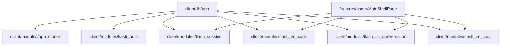
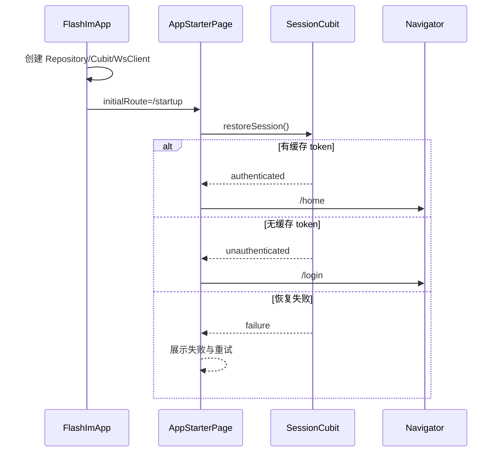

# app-startup — client 局域网络

涉及节点：I-2, F-1, P-1

---

## 一、远景：模块与依赖

> 骨骼怎么连？不打开源码，只看配置文件和目录结构就能回答。

### 涉及模块

| 模块 | 位置 | 职责（一句话） |
|------|------|--------------|
| 宿主 App | `client/lib/app/flash_im_app.dart` | 装配主题、路由、Repository、Cubit、WsClient |
| 路由表 | `client/lib/app/app_router.dart` | 注册启动、登录、首页、资料、密码、聊天路由 |
| 启动 package | `client/modules/app_starter` | 展示品牌启动页，监听会话恢复状态并分流 |
| 会话 package | `client/modules/flash_session` | 提供 `SessionCubit.restoreSession()` 与会话状态 |
| 首页壳 | `client/lib/features/home/presentation/main_shell_page.dart` | 管理 Tab、会话列表 Cubit、WS 连接副作用 |

### 依赖关系

⚠️ 当前 `client/modules/app_starter/pubspec.yaml` 的 `name` 是 `starter`，但代码里通过 `package:app_starter/app_starter.dart` 导入；这是配置与引用命名不一致的风险点。

### 节点详情

| 编号 | 功能节点 | 模块 | 职责 |
|------|---------|------|------|
| I-2 | 客户端应用装配 | `FlashImApp` | 统一创建运行时依赖 |
| F-1 | 启动恢复 | `AppStarterPage` | 恢复本地 token 并决定初始路由 |
| P-1 | 首页消息壳 | `MainShellPage` | 管理首页 Tab、IM 连接、资料刷新和密码提示 |

---

## 二、中景：数据通道与事件流

### 数据通道

| 通道 | 协议 | 方向 | 特点 | 例子 |
|------|------|------|------|------|
| 本地配置 | 内存/本地存储 | App 主动读取 | 启动时决定 baseUrl、appName | `DefaultLocalConfigStore().load()` |
| 会话缓存 | shared_preferences | App 主动读取 | 判断是否已登录 | `SessionRepository.readCachedSession()` |
| 全局状态 | Cubit | Session -> 页面 | 启动、首页、我的页共享 | `SessionCubit` |
| 路由 | Flutter Navigator | 页面主动 | 替换式导航避免返回启动页 | `/startup`、`/login`、`/home` |

### 关键事件流

### 边界接口

**Dart 抽象**

| 接口 | 定义节点 | 实现节点 | 作用 |
|------|---------|---------|------|
| `SessionCubit` | `flash_session` | `SessionCubit` | 统一会话状态源 |
| `AuthRepository` | `flash_auth` | `DefaultAuthRepository` | 登录请求 |
| `ConversationRepository` | `flash_im_conversation` | `DioConversationRepository` | 首页会话列表 |
| `MessageRepository` | `flash_im_chat` | `DioMessageRepository` | 聊天历史 |
| `WsClient` | `flash_im_core` | `WsClient` | 实时连接 |

---

## 三、近景：生命周期与订阅

### 核心对象生命周期

| 对象 | 创建时机 | 销毁时机 | 生命跨度 |
|------|---------|---------|---------|
| `FlashImApp` 默认 Repository | `FutureBuilder` 拿到 config 后 | App 销毁 | 应用级 |
| `SessionCubit` | `FlashImApp` 构建依赖时 | `FlashImApp.dispose()` | 应用级 |
| `WsClient` | `FlashImApp` 构建依赖时 | `FlashImApp.dispose()` | 应用级 |
| `ConversationListCubit` | `MainShellPage.initState()` | `MainShellPage.dispose()` | 首页级 |
| 未登录跳转 Timer | `AppStarterPage` 收到 unauthenticated | `dispose()` 或状态变化 | 启动页级 |

### 订阅关系

| 订阅者 | 监听目标 | 订阅时机 | 取消时机 | 是否成对 |
|--------|---------|---------|---------|---------|
| `AppStarterPage` | `SessionCubit` 状态 | build 中 `BlocListener` | Widget 卸载 | 是 |
| `MainShellPage` | `SessionCubit` 状态 | build 中 `BlocListener` | Widget 卸载 | 是 |
| `ConversationListCubit` | `WsClient.conversationUpdateStream` | 构造函数 | `close()` | 是 |
| `AppStarterPage` | 未登录延迟 Timer | unauthenticated | `dispose()` / 重新调度 | 是 |

---

## 四、版本演进

| 版本 | 变更 |
|------|------|
| v0.0.1 | 建立正式启动入口与基础分流设计 |
| v0.0.2 | 抽出 `app_starter` package，启动页变成可配置模块 |
| v0.8.0 | 当前归档：启动壳已接入 `flash_session`、正式首页与 IM 连接副作用 |
