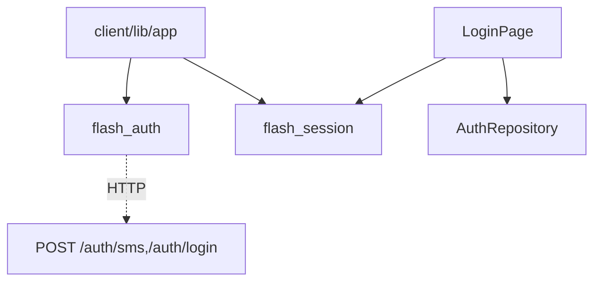
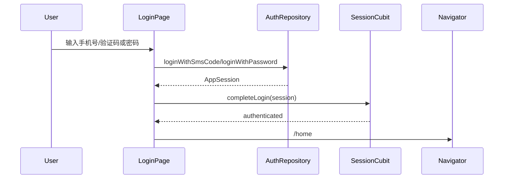

# auth — client 局域网络

涉及节点：D-1, P-5

---

## 一、远景：模块与依赖

### 涉及模块

| 模块 | 位置 | 职责（一句话） |
|------|------|--------------|
| `flash_auth` | `client/modules/flash_auth` | 登录 API、登录仓储、登录页 UI |
| 宿主路由 | `client/lib/app/app_router.dart` | 登录成功后切首页 |
| `flash_session` | `client/modules/flash_session` | 接收登录结果并持久化 token |

### 依赖关系

### 节点详情

| 编号 | 功能节点 | 模块 | 职责 |
|------|---------|------|------|
| D-1 | 认证登录 | `flash_auth` | 封装验证码/密码登录网络请求 |
| P-5 | 登录页 | `LoginPage` | 登录模式切换、验证码倒计时、错误提示 |

---

## 二、中景：数据通道与事件流

### 数据通道

| 通道 | 协议 | 方向 | 特点 | 例子 |
|------|------|------|------|------|
| 验证码 | HTTP | 客户端主动 | debug 模式可自动填码 | `DioAuthApi.sendSmsCode` |
| 登录 | HTTP | 客户端主动 | 返回 `AppSession` | `DioAuthApi.loginWithPassword` |
| 登录结果 | callback | `LoginPage` -> 宿主 | 不直接持久化，由宿主传入回调 | `onLoginSuccess` |

### 关键事件流

### 边界接口

**HTTP 接口**

| 接口 | 提供节点 | 消费节点 |
|------|---------|---------|
| `POST /auth/sms` | `flash_auth` server | `DioAuthApi.sendSmsCode` |
| `POST /auth/login` | `flash_auth` server | `DioAuthApi.loginWithSmsCode/loginWithPassword` |

**Dart 抽象**

| 接口 | 定义节点 | 实现节点 | 作用 |
|------|---------|---------|------|
| `AuthRepository` | `flash_auth` | `DefaultAuthRepository` | 登录用例抽象 |
| `AuthApi` | `flash_auth` | `DioAuthApi` | HTTP 适配 |
| `AuthCacheStore` | `flash_auth` | `SharedPreferencesAuthCacheStore` | 供 session 层复用缓存能力 |

---

## 三、近景：生命周期与订阅

### 核心对象生命周期

| 对象 | 创建时机 | 销毁时机 | 生命跨度 |
|------|---------|---------|---------|
| `TextEditingController` | `LoginPage.initState()` | `dispose()` | 页面级 |
| 验证码倒计时 Timer | 发送验证码成功 | 倒计时结束或 `dispose()` | 页面级 |
| `AuthRepository` | `FlashImApp` 装配 | App 销毁 | 应用级 |

### 订阅关系

| 订阅者 | 监听目标 | 订阅时机 | 取消时机 | 是否成对 |
|--------|---------|---------|---------|---------|
| `LoginPage` | 输入框 controller | `initState()` | `dispose()` | 是 |
| `LoginPage` | 倒计时 Timer | `_startCountdown()` | `dispose()` / 到期 | 是 |

---

## 四、版本演进

| 版本 | 变更 |
|------|------|
| v0.0.2 | 登录响应接入密码设置引导语义 |
| v0.0.3 | 设计层规划邮箱验证码和统一登录参数；当前代码仍以现有 `DioAuthApi` 路由为准 |
