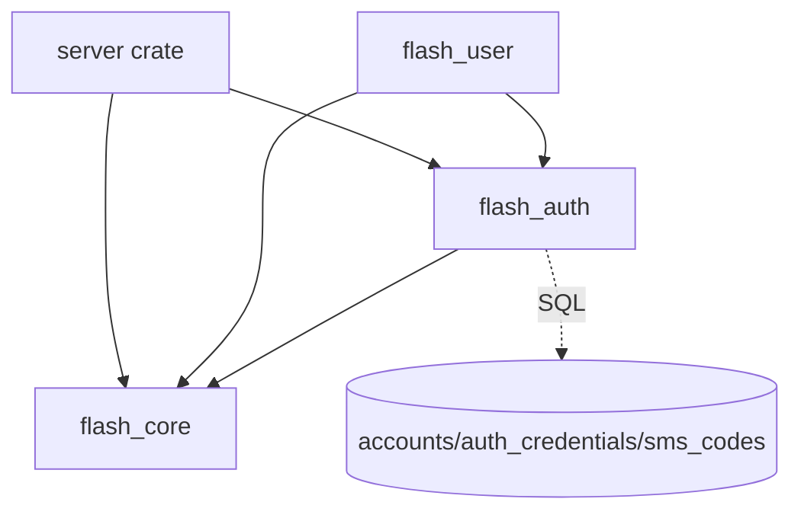
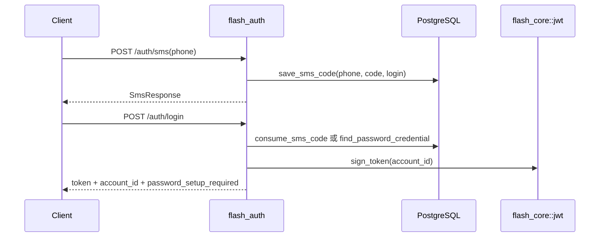

# auth — server 局域网络

涉及节点：D-1, I-1

---

## 一、远景：模块与依赖

### 涉及模块

| 模块 | 位置 | 职责（一句话） |
|------|------|--------------|
| `flash_auth` | `server/modules/flash_auth` | 验证码、密码登录、JWT 签发、认证仓储 |
| `flash_core` | `server/modules/flash_core` | 配置、PostgreSQL、JWT 提取、统一错误响应 |
| `flash_user` | `server/modules/flash_user` | 用户资料与密码管理，消费认证仓储 |
| 主路由 | `server/src/routes/mod.rs` | 合并认证、用户、IM 路由 |

### 依赖关系

### 节点详情

| 编号 | 功能节点 | 模块 | 职责 |
|------|---------|------|------|
| D-1 | 认证登录 | `flash_auth` | 发验证码、登录、签发 JWT |
| I-1 | 后端运行时与数据库上下文 | `flash_core` | 为认证提供配置、数据库池、JWT secret |

---

## 二、中景：数据通道与事件流

### 数据通道

| 通道 | 协议 | 方向 | 特点 | 例子 |
|------|------|------|------|------|
| 验证码发送 | HTTP | 客户端主动 | 本地调试可返回 code | `POST /auth/sms` |
| 登录 | HTTP | 客户端主动 | sms_code/password 两种类型 | `POST /auth/login` |
| 认证数据 | SQL | 服务端内部 | accounts 为主体，credentials 承载登录方式 | `auth_credentials` |
| JWT | Header | 客户端 -> 服务端 | 后续接口 Bearer token | `Authorization: Bearer <token>` |

### 关键事件流

### 边界接口

**HTTP 接口**

| 接口 | 提供节点 | 消费节点 |
|------|---------|---------|
| `POST /auth/sms` | `flash_auth::routes::auth::send_sms_code` | `DioAuthApi.sendSmsCode` |
| `POST /auth/login` | `flash_auth::routes::auth::login` | `DioAuthApi.loginWithSmsCode/loginWithPassword` |

**Rust trait / Dart 抽象**

| 接口 | 定义节点 | 实现节点 | 作用 |
|------|---------|---------|------|
| `AuthStore` | `flash_auth` | `PostgresAuthStore` | 抽象认证数据读写 |
| `SharedAuthStore` | `flash_auth` | `Arc<dyn AuthStore>` | 路由层共享仓储 |

---

## 三、近景：生命周期与订阅

服务端认证模块没有长生命周期订阅；请求以 Axum handler 为边界，生命周期由 HTTP 请求驱动。

### 核心对象生命周期

| 对象 | 创建时机 | 销毁时机 | 生命跨度 |
|------|---------|---------|---------|
| `PostgresAuthStore` | `server/src/main.rs` 启动时 | 进程退出 | 应用级 |
| `SharedAuthStore` Extension | `build_app` 注册路由时 | 进程退出 | 应用级 |
| 登录请求上下文 | 每次 HTTP 请求 | 请求结束 | 请求级 |

### 订阅关系

| 订阅者 | 监听目标 | 订阅时机 | 取消时机 | 是否成对 |
|--------|---------|---------|---------|---------|
| 无 | 无 | 无 | 无 | 是 |

---

## 四、版本演进

| 版本 | 变更 |
|------|------|
| v0.0.2 | 认证数据 PostgreSQL 化，账号主体与多凭据模型成型 |
| v0.0.3 | 设计层规划邮箱验证码与统一验证码表，当前归档以当前代码实际路由为准 |
