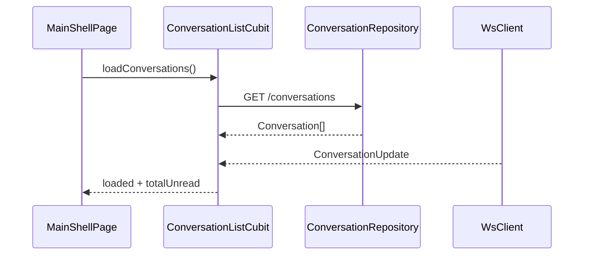

# conversation — client 局域网络

涉及节点：D-3, P-1, P-6, P-7

---

## 一、远景：模块与依赖

### 涉及模块

| 模块 | 位置 | 职责（一句话） |
|------|------|--------------|
| `flash_im_conversation` | `client/modules/flash_im_conversation` | 会话模型、仓储、列表 Cubit、列表 UI |
| 消息页宿主 | `client/lib/features/messages/presentation/messages_placeholder_page.dart` | 展示用户头部、连接状态和会话列表 |
| 首页壳 | `client/lib/features/home/presentation/main_shell_page.dart` | 创建 `ConversationListCubit` 并打开聊天 |
| 联系人占位 | `client/lib/features/contacts/presentation/contacts_placeholder_page.dart` | 当前仅占位 |

### 依赖关系

```mermaid
graph TD
    Home[MainShellPage] --> Conv[flash_im_conversation]
    Messages[MessagesPlaceholderPage] --> Conv
    Conv --> Core[flash_im_core]
    Conv --> Shared[flash_shared]
    Conv -. HTTP .-> Server[/conversations]
```

### 节点详情

| 编号 | 功能节点 | 模块 | 职责 |
|------|---------|------|------|
| P-1 | 首页消息壳 | `MainShellPage` | 组织会话列表和打开聊天 |
| P-6 | 会话列表 UI | `ConversationListPage` | 展示会话、未读、分页 |
| P-7 | 通讯录占位页 | `ContactsPlaceholderPage` | 明确联系人未实现 |

---

## 二、中景：数据通道与事件流

### 数据通道

| 通道 | 协议 | 方向 | 特点 | 例子 |
|------|------|------|------|------|
| 会话列表 | HTTP | 客户端主动 | 分页加载 | `getList(limit, offset)` |
| 会话更新 | WS stream | 服务端推送 | 更新 preview/time/unread | `conversationUpdateStream` |
| 已读 | HTTP | 客户端主动 | 点击会话后清零 | `markRead(id)` |

### 关键事件流



### 边界接口

**HTTP 接口**

| 接口 | 提供节点 | 消费节点 |
|------|---------|---------|
| `GET /conversations` | `im-conversation` | `DioConversationRepository.getList` |
| `GET /conversations/{id}` | `im-conversation` | `_hydrateConversation` |
| `POST /conversations/{id}/read` | `im-conversation` | `markConversationRead` |

**Dart 抽象**

| 接口 | 定义节点 | 实现节点 | 作用 |
|------|---------|---------|------|
| `ConversationRepository` | `flash_im_conversation` | `DioConversationRepository` | 会话数据源 |
| `ConversationListCubit` | `flash_im_conversation` | `ConversationListCubit` | 会话列表状态机 |

---

## 三、近景：生命周期与订阅

### 核心对象生命周期

| 对象 | 创建时机 | 销毁时机 | 生命跨度 |
|------|---------|---------|---------|
| `ConversationListCubit` | `MainShellPage.initState()` | `MainShellPage.dispose()` | 首页级 |
| `ConversationUpdate` 订阅 | Cubit 构造时 | `Cubit.close()` | 首页级 |

### 订阅关系

| 订阅者 | 监听目标 | 订阅时机 | 取消时机 | 是否成对 |
|--------|---------|---------|---------|---------|
| `ConversationListCubit` | `WsClient.conversationUpdateStream` | 构造函数 | `close()` | 是 |
| `HomeNavigationBar` | `ConversationListCubit` state | build | Widget 卸载 | 是 |

---

## 四、版本演进

| 版本 | 变更 |
|------|------|
| v0.0.2 | 正式会话列表接入 `/conversations` |
| v0.0.3 | 接入实时 `ConversationUpdate` 和未读联动 |
