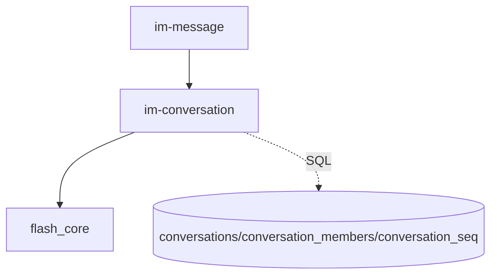
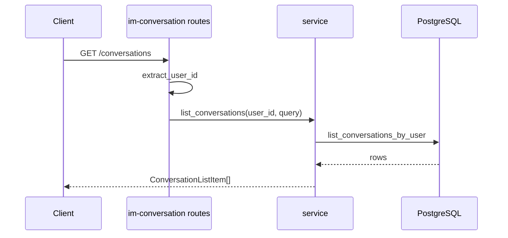

# conversation — server 局域网络

涉及节点：D-3

---

## 一、远景：模块与依赖

### 涉及模块

| 模块 | 位置 | 职责（一句话） |
|------|------|--------------|
| `im-conversation` | `server/modules/im-conversation` | 会话列表、详情、已读、成员服务 |
| `im-message` | `server/modules/im-message` | 写消息后调用会话服务更新摘要和未读 |
| `flash_core` | `server/modules/flash_core` | 鉴权和数据库上下文 |

### 依赖关系

### 节点详情

| 编号 | 功能节点 | 模块 | 职责 |
|------|---------|------|------|
| D-3 | IM 会话 | `im-conversation` | 列表、详情、已读、成员与未读 |

---

## 二、中景：数据通道与事件流

### 数据通道

| 通道 | 协议 | 方向 | 特点 | 例子 |
|------|------|------|------|------|
| 会话列表 | HTTP | 客户端主动 | limit/offset 分页 | `GET /conversations` |
| 会话详情 | HTTP | 客户端主动 | 用于补全骨架会话 | `GET /conversations/{id}` |
| 标记已读 | HTTP | 客户端主动 | 清零当前用户 unread | `POST /conversations/{id}/read` |
| 成员服务 | Rust 调用 | `im-message` -> `im-conversation` | 校验成员、查询成员、更新未读 | `ConversationMessageService` |

### 关键事件流

### 边界接口

**HTTP 接口**

| 接口 | 提供节点 | 消费节点 |
|------|---------|---------|
| `GET /conversations` | `im-conversation` | `DioConversationRepository.getList` |
| `GET /conversations/{id}` | `im-conversation` | `DioConversationRepository.getById` |
| `POST /conversations/{id}/read` | `im-conversation` | `DioConversationRepository.markRead` |

**Rust trait / Dart 抽象**

| 接口 | 定义节点 | 实现节点 | 作用 |
|------|---------|---------|------|
| `ConversationMessageService` | `im-conversation` | `ConversationMessageService` | 给消息模块提供会话成员和未读能力 |

---

## 三、近景：生命周期与订阅

服务端会话模块无常驻订阅；请求级查询和消息模块内部调用为主。

### 核心对象生命周期

| 对象 | 创建时机 | 销毁时机 | 生命跨度 |
|------|---------|---------|---------|
| `ConversationMessageService` | 消息服务处理时 | 调用结束 | 请求/业务级 |
| 会话查询结果 | HTTP 请求内 | 响应完成 | 请求级 |

### 订阅关系

| 订阅者 | 监听目标 | 订阅时机 | 取消时机 | 是否成对 |
|--------|---------|---------|---------|---------|
| 无 | 无 | 无 | 无 | 是 |

---

## 四、版本演进

| 版本 | 变更 |
|------|------|
| v0.0.2 | 会话列表、分页、详情、已读主链路 |
| v0.0.3 | 为消息模块提供成员、未读、会话摘要更新服务 |
