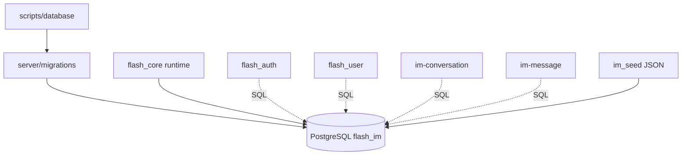
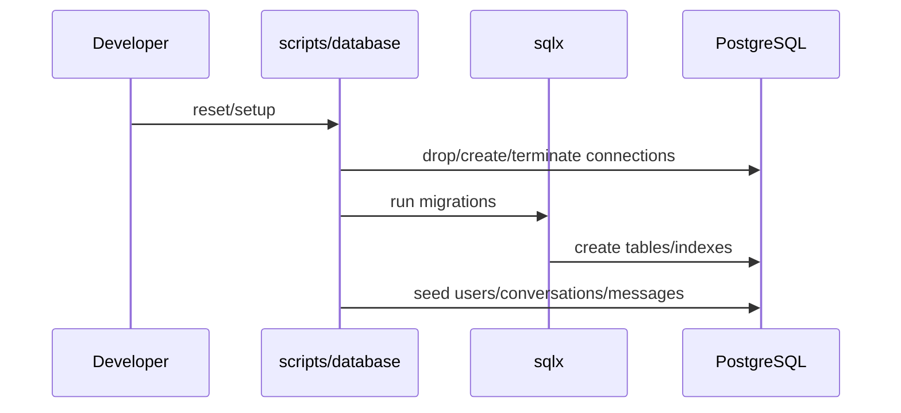

# database — server 局域网络

涉及节点：I-1, I-4, I-5

---

## 一、远景：模块与依赖

### 涉及模块

| 模块 | 位置 | 职责（一句话） |
|------|------|--------------|
| migrations | `server/migrations` | 管理 auth、conversation、message schema |
| database scripts | `scripts/database` | 本地安装、启动、setup/reset、seed |
| `flash_core` runtime | `server/modules/flash_core/src/runtime/postgres.rs` | PostgreSQL 连接池 |
| seed data | `scripts/database/im_seed` | 本地 IM 用户和会话数据 |

### 依赖关系

### 节点详情

| 编号 | 功能节点 | 模块 | 职责 |
|------|---------|------|------|
| I-1 | 后端运行时与数据库上下文 | `flash_core` | 配置和连接池 |
| I-4 | SQLx 数据库迁移 | `server/migrations` | 建表与索引 |
| I-5 | 本地种子数据 | `scripts/database/im_seed` | 本地演示数据 |

---

## 二、中景：数据通道与事件流

### 数据通道

| 通道 | 协议 | 方向 | 特点 | 例子 |
|------|------|------|------|------|
| 迁移 | SQLx | 脚本/后端 -> PostgreSQL | 版本化 schema | `20260708000100_im_messages.sql` |
| 后端访问 | SQLx pool | 服务端内部 | 模块共享连接池 | `context.postgres.pool()` |
| seed | Bash + JSON | 本地脚本 -> PostgreSQL | 重建测试数据 | `seed_im_conversations.sh` |

### 关键事件流

### 边界接口

**数据库表**

| 表 | 生产节点 | 消费节点 |
|------|---------|---------|
| `accounts` | auth migration/seed | `flash_auth`, `flash_user` |
| `user_profiles` | auth migration/seed | `flash_user`, `im-ws` sender profile |
| `auth_credentials` | auth migration/seed | `flash_auth`, `flash_user` |
| `sms_codes` | auth migration | `flash_auth` |
| `conversations` | IM migration/seed | `im-conversation`, `im-message` |
| `conversation_members` | IM migration/seed | `im-conversation`, `im-message` |
| `conversation_seq` | IM migration | `im-message` |
| `messages` | IM migration/seed | `im-message` |

---

## 三、近景：生命周期与订阅

数据库模块无事件订阅，生命周期由进程和脚本控制。

### 核心对象生命周期

| 对象 | 创建时机 | 销毁时机 | 生命跨度 |
|------|---------|---------|---------|
| PostgreSQL pool | `AppContext::from_config` | 后端进程退出 | 应用级 |
| migration | setup/reset 执行 | 执行完成 | 脚本级 |
| seed data | seed 脚本执行 | 下次 reset/seed 覆盖 | 环境级 |

### 订阅关系

| 订阅者 | 监听目标 | 订阅时机 | 取消时机 | 是否成对 |
|--------|---------|---------|---------|---------|
| 无 | 无 | 无 | 无 | 是 |

---

## 四、版本演进

| 版本 | 变更 |
|------|------|
| v0.0.2 | auth PostgreSQL 持久化 |
| v0.0.2 | conversation schema |
| v0.0.3 | message schema 与 conversation_seq |
| v0.8.0 | 当前归档：数据库支撑认证、资料、会话、消息主链路 |
