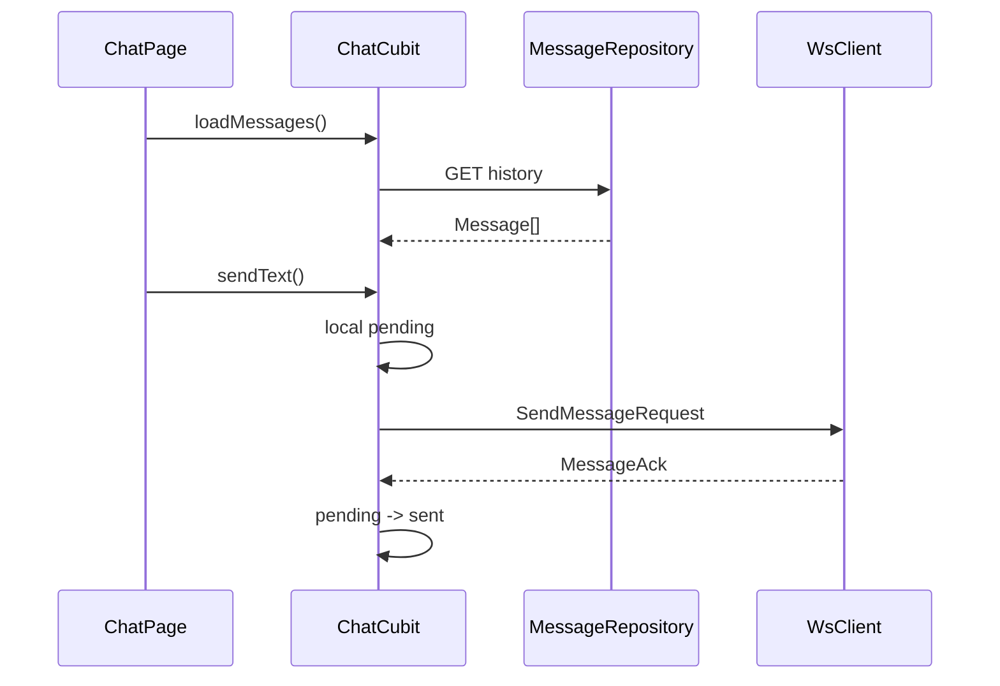

# message — client 局域网络

涉及节点：D-4, F-4, P-2

---

## 一、远景：模块与依赖

### 涉及模块

| 模块 | 位置 | 职责（一句话） |
|------|------|--------------|
| `flash_im_chat` | `client/modules/flash_im_chat` | 消息模型、仓储、ChatCubit、聊天页 |
| `flash_im_core` | `client/modules/flash_im_core` | WS 发送和 typed streams |
| `flash_im_conversation` | `client/modules/flash_im_conversation` | 聊天页入参会话对象 |
| `flash_shared` | `client/modules/flash_shared` | 头像渲染 |

### 依赖关系

```mermaid
graph TD
    Chat[flash_im_chat] --> Core[flash_im_core]
    Chat --> Conversation[flash_im_conversation]
    Chat --> Shared[flash_shared]
    Chat -. HTTP .-> History[/conversations/id/messages]
    Chat -. WS .-> Server[/ws/im]
```

### 节点详情

| 编号 | 功能节点 | 模块 | 职责 |
|------|---------|------|------|
| P-2 | 聊天页 | `ChatPage/ChatCubit` | 历史、发送、本地状态、实时接收 |
| F-4 | 共享头像渲染 | `flash_shared` | 聊天消息头像 |

---

## 二、中景：数据通道与事件流

### 数据通道

| 通道 | 协议 | 方向 | 特点 | 例子 |
|------|------|------|------|------|
| 历史消息 | HTTP | 客户端主动 | seq 升序展示 | `MessageRepository.getMessages` |
| 发送消息 | WS/protobuf | 客户端 -> 服务端 | 本地乐观上屏 | `sendChatMessage` |
| ACK | WS stream | 服务端 -> 客户端 | pending -> sent | `messageAckStream` |
| 新消息 | WS stream | 服务端 -> 客户端 | 过滤当前会话和自己消息 | `chatMessageStream` |

### 关键事件流



### 边界接口

**Dart 抽象**

| 接口 | 定义节点 | 实现节点 | 作用 |
|------|---------|---------|------|
| `MessageRepository` | `flash_im_chat` | `DioMessageRepository` | 历史消息 HTTP 数据源 |
| `ChatCubit` | `flash_im_chat` | `ChatCubit` | 聊天页状态机 |
| `MessageStatus` | `flash_im_chat` | `Message` | sending/sent/failed |

---

## 三、近景：生命周期与订阅

### 核心对象生命周期

| 对象 | 创建时机 | 销毁时机 | 生命跨度 |
|------|---------|---------|---------|
| `ChatCubit` | `ChatPage` build 创建 | 路由 pop | 页面级 |
| ACK timer | 发送本地消息 | ACK 或超时或 close | 单条消息级 |
| pending local id | 发送本地消息 | ACK 或超时 | 单条消息级 |

### 订阅关系

| 订阅者 | 监听目标 | 订阅时机 | 取消时机 | 是否成对 |
|--------|---------|---------|---------|---------|
| `ChatCubit` | `WsClient.chatMessageStream` | 构造函数 | `close()` | 是 |
| `ChatCubit` | `WsClient.messageAckStream` | 构造函数 | `close()` | 是 |
| `ChatCubit` | ACK timers | 发送消息 | `close()` / ACK / timeout | 是 |

---

## 四、版本演进

| 版本 | 变更 |
|------|------|
| v0.0.3 | 聊天页、历史消息、文本发送、ACK 和失败态 |
