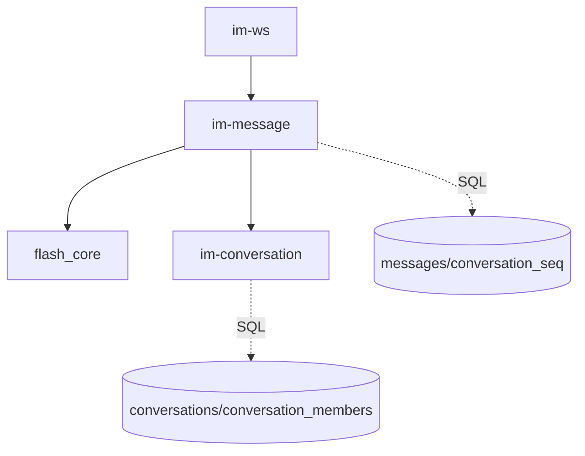
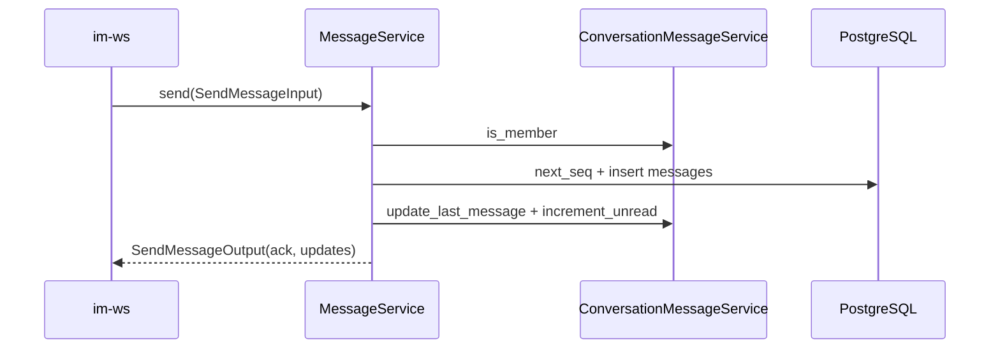

# message — server 局域网络

涉及节点：D-4

---

## 一、远景：模块与依赖

### 涉及模块

| 模块 | 位置 | 职责（一句话） |
|------|------|--------------|
| `im-message` | `server/modules/im-message` | 消息历史、发送编排、ACK 和广播 payload |
| `im-conversation` | `server/modules/im-conversation` | 会话成员、摘要、未读 |
| `im-ws` | `server/modules/im-ws` | 接收 CHAT_MESSAGE，发送 ACK 和广播 |
| `flash_core` | `server/modules/flash_core` | 鉴权和数据库上下文 |

### 依赖关系

### 节点详情

| 编号 | 功能节点 | 模块 | 职责 |
|------|---------|------|------|
| D-4 | IM 消息 | `im-message` | 历史、发送、ACK、推送数据构造 |

---

## 二、中景：数据通道与事件流

### 数据通道

| 通道 | 协议 | 方向 | 特点 | 例子 |
|------|------|------|------|------|
| 历史消息 | HTTP | 客户端主动 | before_seq + limit 分页 | `GET /conversations/{id}/messages` |
| 发送消息 | WS/protobuf | 客户端 -> 服务端 | 实时发送，服务端持久化 | `SendMessageRequest` |
| 广播接口 | Rust trait | `im-message` -> `im-ws` | 解耦业务与传输 | `MessageBroadcaster` |

### 关键事件流

### 边界接口

**HTTP 接口**

| 接口 | 提供节点 | 消费节点 |
|------|---------|---------|
| `GET /conversations/{id}/messages` | `im-message` | `DioMessageRepository.getMessages` |

**Rust trait / Dart 抽象**

| 接口 | 定义节点 | 实现节点 | 作用 |
|------|---------|---------|------|
| `MessageBroadcaster` | `im-message` | `WsBroadcaster` | 把消息业务事件广播到在线连接 |

---

## 三、近景：生命周期与订阅

服务端消息模块请求级运行，无常驻订阅；实时连接生命周期由 `im-ws` 管理。

### 核心对象生命周期

| 对象 | 创建时机 | 销毁时机 | 生命跨度 |
|------|---------|---------|---------|
| `MessageService` | WS 连接认证后或 HTTP 请求内 | 调用结束/连接结束 | 连接/请求级 |
| `SendMessageOutput` | 发送消息成功 | ACK/广播后 | 业务级 |

### 订阅关系

| 订阅者 | 监听目标 | 订阅时机 | 取消时机 | 是否成对 |
|--------|---------|---------|---------|---------|
| 无 | 无 | 无 | 无 | 是 |

---

## 四、版本演进

| 版本 | 变更 |
|------|------|
| v0.0.3 | 文本消息持久化、历史分页、ACK、会话联动 |
