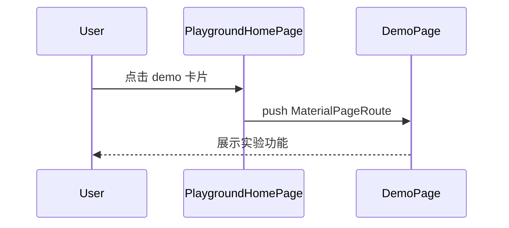

# playground — client 局域网络

涉及节点：P-4

---

## 一、远景：模块与依赖

### 涉及模块

| 模块 | 位置 | 职责（一句话） |
|------|------|--------------|
| playground home | `client/lib/playground/playground_home_page.dart` | demo 卡片入口 |
| auth demo | `client/lib/playground/demos/auth` | playground 登录和 token 持久化 |
| conversation demo | `client/lib/playground/demos/conversation` | 旧会话请求演示 |
| heartbeat demo | `client/lib/playground/demos/heartbeat` | `/ws` 心跳/echo 测试 |
| im playground | `client/lib/playground/demos/im_playground` | `/chat_room/ws` 聊天室 demo |
| fireworks demo | `client/lib/playground/demos/fireworks` | 本地全屏烟花场景 |

### 依赖关系

```mermaid
graph TD
    Home[PlaygroundHomePage] --> Auth[auth demo]
    Home --> Conversation[conversation demo]
    Home --> Heartbeat[heartbeat demo]
    Home --> Im[im_playground]
    Home --> Fireworks[fireworks]
    Im -. JSON WS .-> Server[/chat_room/ws]
    Heartbeat -. WS .-> Echo[/ws]
```

### 节点详情

| 编号 | 功能节点 | 模块 | 职责 |
|------|---------|------|------|
| P-4 | Playground | `client/lib/playground` | 聚合演示入口，隔离正式产品 |

---

## 二、中景：数据通道与事件流

### 数据通道

| 通道 | 协议 | 方向 | 特点 | 例子 |
|------|------|------|------|------|
| demo 路由 | Navigator | 用户主动 | 从卡片进入 demo | `PlaygroundHomePage` |
| 聊天室 | WS/JSON | 双向 | 过滤传输噪声，仅展示聊天事件 | `/chat_room/ws` |
| 烟花 | 本地渲染 | 用户触摸 | 无网络依赖 | `FireworksShowScene` |

### 关键事件流



### 边界接口

**HTTP/WS 接口**

| 接口 | 提供节点 | 消费节点 |
|------|---------|---------|
| `/ws` | server echo WS | heartbeat demo |
| `/chat_room/ws` | server chat room | im playground |

---

## 三、近景：生命周期与订阅

### 核心对象生命周期

| 对象 | 创建时机 | 销毁时机 | 生命跨度 |
|------|---------|---------|---------|
| demo page | 点击卡片 push | pop | 页面级 |
| fireworks scene | 页面展示 | pop | 页面级 |
| playground WS 连接 | demo 连接按钮/进入页面 | demo dispose/断开 | 页面级 |

### 订阅关系

| 订阅者 | 监听目标 | 订阅时机 | 取消时机 | 是否成对 |
|--------|---------|---------|---------|---------|
| 各 WS demo | WebSocket stream | demo 启动连接 | demo dispose/断开 | 应按 demo 实现成对 |

---

## 四、版本演进

| 版本 | 变更 |
|------|------|
| v0.1.0 | auth、conversation、heartbeat、IM chatroom demo |
| v0.8.0 | 当前归档：保留为实验区，和正式产品入口隔离 |
