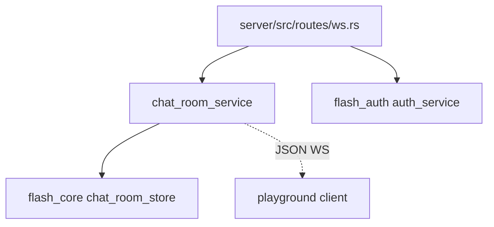
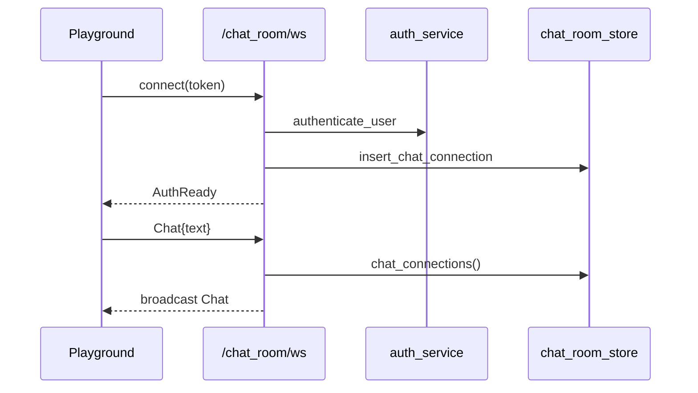

# playground — server 局域网络

涉及节点：D-6

---

## 一、远景：模块与依赖

### 涉及模块

| 模块 | 位置 | 职责（一句话） |
|------|------|--------------|
| playground ws 路由 | `server/src/routes/ws.rs` | `/ws` echo 与 `/chat_room/ws` demo |
| chat room service | `server/src/services/chat_room_service.rs` | JSON 聊天室连接、ping/pong、广播 |
| runtime store | `flash_core::runtime::chat_room` | 内存连接表 |
| `flash_auth` | `server/modules/flash_auth` | `/chat_room/ws` token 认证 |

### 依赖关系

### 节点详情

| 编号 | 功能节点 | 模块 | 职责 |
|------|---------|------|------|
| D-6 | Playground 聊天室演示 | `chat_room_service` | 内存广播聊天室 |

---

## 二、中景：数据通道与事件流

### 数据通道

| 通道 | 协议 | 方向 | 特点 | 例子 |
|------|------|------|------|------|
| echo WS | WebSocket 文本 | 双向 | 最小心跳/echo demo | `/ws` |
| 聊天室 | WebSocket JSON | 双向 | token query 鉴权，内存广播 | `/chat_room/ws?token=` |
| 连接表 | 内存 | 服务端内部 | 进程内保存 sender | `chat_room_store` |

### 关键事件流

### 边界接口

**HTTP/WS 接口**

| 接口 | 提供节点 | 消费节点 |
|------|---------|---------|
| `/ws` | `server/src/routes/ws.rs` | heartbeat playground |
| `/chat_room/ws` | `server/src/routes/ws.rs` | IM chatroom playground |

---

## 三、近景：生命周期与订阅

### 核心对象生命周期

| 对象 | 创建时机 | 销毁时机 | 生命跨度 |
|------|---------|---------|---------|
| `ChatRoomConnection` | WebSocket 认证成功 | socket 断开/发送失败 | 连接级 |
| write task | 连接建立后 | socket 断开 abort | 连接级 |

### 订阅关系

| 订阅者 | 监听目标 | 订阅时机 | 取消时机 | 是否成对 |
|--------|---------|---------|---------|---------|
| `handle_chat_room_socket` | ws_receiver | 连接建立后 | socket 断开 | 是 |
| write task | outgoing channel | 连接建立后 | abort | 是 |
| chat room store | connection sender | 认证成功 | remove connection | 是 |

---

## 四、版本演进

| 版本 | 变更 |
|------|------|
| v0.1.0 | Playground 认证与聊天室演示 |
| v0.8.0 | 当前归档：明确 playground 和正式 IM 路径分离 |
