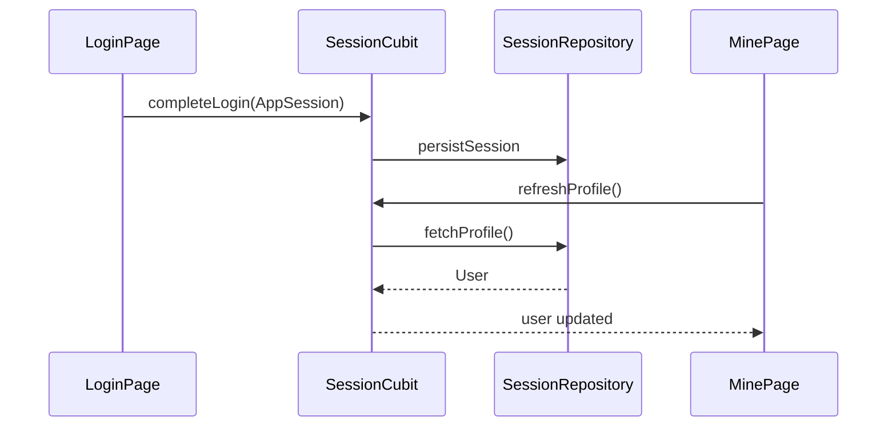

# session — client 局域网络

涉及节点：D-2, F-3, F-4, P-3

---

## 一、远景：模块与依赖

### 涉及模块

| 模块 | 位置 | 职责（一句话） |
|------|------|--------------|
| `flash_session` | `client/modules/flash_session` | token 缓存、资料 API、SessionCubit、资料/密码页面 |
| `flash_auth` | `client/modules/flash_auth` | 提供 `AppSession` 与缓存 store 类型 |
| 我的页 | `client/lib/features/mine` | 组合用户卡片、资料入口、密码入口、退出 |
| 启动页 | `client/modules/app_starter` | 消费 `SessionCubit.restoreSession()` |

### 依赖关系

```mermaid
graph TD
    App[client/lib/app] --> Session[flash_session]
    Session --> Auth[flash_auth]
    Mine[features/mine] --> Session
    Starter[app_starter] --> Session
    Session -. HTTP .-> UserApi[/user/profile,/user/password]
```

### 节点详情

| 编号 | 功能节点 | 模块 | 职责 |
|------|---------|------|------|
| D-2 | 用户资料与密码 | `flash_session` | 资料、签名、头像、密码状态 |
| F-3 | 客户端会话缓存 | `SessionRepository` | token 读写、清理 |
| F-4 | 共享头像渲染 | `UserAvatar/IdenticonAvatar` | 本地头像协议渲染 |
| P-3 | 我的页 | `MinePage` | 用户卡片、资料编辑、密码入口、退出 |

---

## 二、中景：数据通道与事件流

### 数据通道

| 通道 | 协议 | 方向 | 特点 | 例子 |
|------|------|------|------|------|
| 会话缓存 | shared_preferences | 客户端内部 | token 持久化 | `readCachedSession()` |
| 用户资料 | HTTP | 客户端主动 | Header Bearer token | `DioSessionApi.fetchProfile` |
| 用户状态 | Cubit | `SessionCubit` -> UI | 全局共享 | `SessionState.user` |

### 关键事件流



### 边界接口

**HTTP 接口**

| 接口 | 提供节点 | 消费节点 |
|------|---------|---------|
| `GET /user/profile` | `flash_user` | `DioSessionApi.fetchProfile` |
| `PUT /user/profile` | `flash_user` | `DioSessionApi.updateProfile` |
| `POST /user/password` | `flash_user` | `DioSessionApi.setPassword` |
| `PUT /user/password` | `flash_user` | `DioSessionApi.changePassword` |

**Dart 抽象**

| 接口 | 定义节点 | 实现节点 | 作用 |
|------|---------|---------|------|
| `SessionRepository` | `flash_session` | `DefaultSessionRepository` | 会话和用户资料用例 |
| `SessionCubit` | `flash_session` | `SessionCubit` | 全局会话状态 |

---

## 三、近景：生命周期与订阅

### 核心对象生命周期

| 对象 | 创建时机 | 销毁时机 | 生命跨度 |
|------|---------|---------|---------|
| `SessionCubit` | `FlashImApp` | `FlashImApp.dispose()` | 应用级 |
| `MinePage` profile refresh | `initState()` post-frame | 页面卸载 | 页面级 |
| 资料/密码页面 | 路由 push | pop | 页面级 |

### 订阅关系

| 订阅者 | 监听目标 | 订阅时机 | 取消时机 | 是否成对 |
|--------|---------|---------|---------|---------|
| `MinePage` | `SessionCubit` | `BlocConsumer` build | Widget 卸载 | 是 |
| `MessagesPlaceholderPage` | `SessionCubit` | `BlocBuilder` build | Widget 卸载 | 是 |
| `AppStarterPage` | `SessionCubit` | `BlocListener` build | Widget 卸载 | 是 |

---

## 四、版本演进

| 版本 | 变更 |
|------|------|
| v0.0.2 | 拆出 `flash_session`，资料、密码和会话缓存从 `flash_auth` 分离 |
| v0.8.0 | 当前归档：我的页、资料刷新、密码设置提示与主壳联动完成 |
