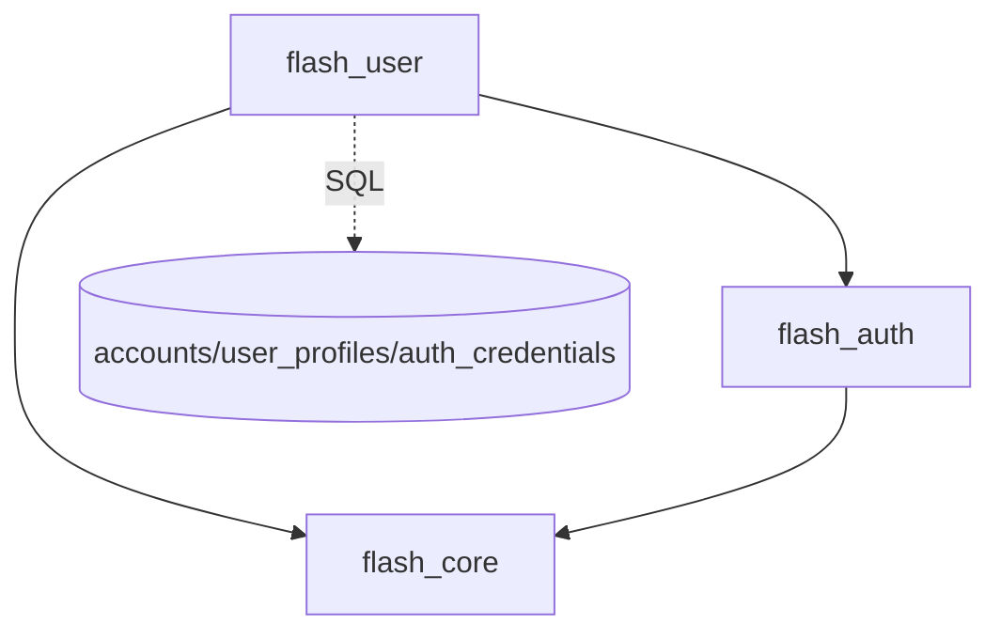
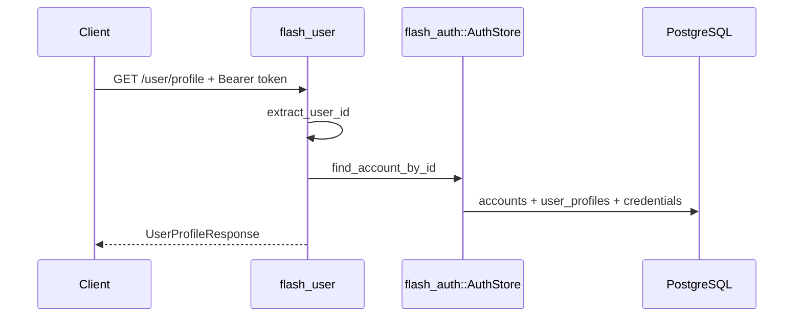

# session — server 局域网络

涉及节点：D-2

---

## 一、远景：模块与依赖

### 涉及模块

| 模块 | 位置 | 职责（一句话） |
|------|------|--------------|
| `flash_user` | `server/modules/flash_user` | 用户资料、密码设置、密码修改 |
| `flash_auth` | `server/modules/flash_auth` | 认证仓储、密码哈希、凭据查询 |
| `flash_core` | `server/modules/flash_core` | JWT 用户提取、统一错误 |

### 依赖关系

### 节点详情

| 编号 | 功能节点 | 模块 | 职责 |
|------|---------|------|------|
| D-2 | 用户资料与密码 | `flash_user` | 资料查询/编辑、设置/修改密码 |

---

## 二、中景：数据通道与事件流

### 数据通道

| 通道 | 协议 | 方向 | 特点 | 例子 |
|------|------|------|------|------|
| 用户资料 | HTTP | 客户端主动 | token 鉴权，返回完整资料 | `GET /user/profile` |
| 编辑资料 | HTTP | 客户端主动 | 字段可选，返回完整资料 | `PUT /user/profile` |
| 密码管理 | HTTP | 客户端主动 | set/change 分离 | `POST/PUT /user/password` |
| 认证仓储 | Rust trait | `flash_user` -> `flash_auth` | 复用凭据与密码哈希逻辑 | `AuthStore` |

### 关键事件流

### 边界接口

**HTTP 接口**

| 接口 | 提供节点 | 消费节点 |
|------|---------|---------|
| `GET /user/profile` | `flash_user` | `DioSessionApi.fetchProfile` |
| `PUT /user/profile` | `flash_user` | `DioSessionApi.updateProfile` |
| `POST /user/password` | `flash_user` | `DioSessionApi.setPassword` |
| `PUT /user/password` | `flash_user` | `DioSessionApi.changePassword` |

---

## 三、近景：生命周期与订阅

服务端 session 域无常驻订阅，HTTP 请求内完成用户加载、校验、写入。

### 核心对象生命周期

| 对象 | 创建时机 | 销毁时机 | 生命跨度 |
|------|---------|---------|---------|
| `AccountAggregate` | 每次资料/密码请求 | 请求结束 | 请求级 |
| password hash | 设置/修改密码时 | 写入凭据后 | 请求级 |

### 订阅关系

| 订阅者 | 监听目标 | 订阅时机 | 取消时机 | 是否成对 |
|--------|---------|---------|---------|---------|
| 无 | 无 | 无 | 无 | 是 |

---

## 四、版本演进

| 版本 | 变更 |
|------|------|
| v0.0.2 | `flash_user` 承接资料与密码接口，和 `flash_auth` 分离 |
| v0.8.0 | 当前归档：资料、签名、头像标记、密码设置/修改已经接入客户端 |
