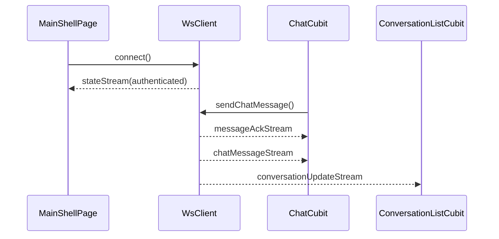

# ws — client 局域网络

涉及节点：I-3, F-2, P-1, P-2, P-6

---

## 一、远景：模块与依赖

### 涉及模块

| 模块 | 位置 | 职责（一句话） |
|------|------|--------------|
| `flash_im_core` | `client/modules/flash_im_core` | WS 配置、连接、protobuf typed streams |
| 首页壳 | `client/lib/features/home/presentation/main_shell_page.dart` | 登录态驱动连接/断开 |
| 会话列表 | `client/modules/flash_im_conversation` | 消费会话更新流 |
| 聊天页 | `client/modules/flash_im_chat` | 消费消息流与 ACK 流 |

### 依赖关系

```mermaid
graph TD
    App[FlashImApp] --> Core[flash_im_core]
    Home[MainShellPage] --> Core
    Conversation[flash_im_conversation] --> Core
    Chat[flash_im_chat] --> Core
    Core -. WS/protobuf .-> Server[/ws/im]
```

### 节点详情

| 编号 | 功能节点 | 模块 | 职责 |
|------|---------|------|------|
| F-2 | WebSocket 客户端 | `WsClient` | 连接、认证、心跳、重连、typed streams |
| P-1 | 首页消息壳 | `MainShellPage` | 登录态触发连接并展示状态 |
| P-2 | 聊天页 | `ChatCubit` | 发送消息、监听 ACK 和新消息 |
| P-6 | 会话列表 UI | `ConversationListCubit` | 监听会话更新 |

---

## 二、中景：数据通道与事件流

### 数据通道

| 通道 | 协议 | 方向 | 特点 | 例子 |
|------|------|------|------|------|
| WS 连接 | WebSocket | 客户端主动 | 从 apiBaseUrl 推导 wsUrl | `ImConfig.fromApiBaseUrl` |
| 认证 | protobuf | 客户端 -> 服务端 | 首帧 AUTH | `AuthRequest` |
| typed stream | Dart stream | `WsClient` -> feature cubit | 分流业务帧 | `chatMessageStream` |
| 状态流 | Dart stream | `WsClient` -> UI | 展示连接状态 | `stateStream` |

### 关键事件流



### 边界接口

**Dart 抽象**

| 接口 | 定义节点 | 实现节点 | 作用 |
|------|---------|---------|------|
| `TokenProvider` | `flash_im_core` | `FlashImApp` | 提供当前 token |
| `WebSocketChannelFactory` | `flash_im_core` | 默认/测试注入 | 建立 socket |
| `WsClient` | `flash_im_core` | `WsClient` | IM 实时客户端 |

---

## 三、近景：生命周期与订阅

### 核心对象生命周期

| 对象 | 创建时机 | 销毁时机 | 生命跨度 |
|------|---------|---------|---------|
| `WsClient` | `FlashImApp` 装配 | `FlashImApp.dispose()` | 应用级 |
| `_channelSubscription` | `connect()` 成功后 | `_closeChannel()` | 连接级 |
| heartbeat timer | AUTH 成功 | disconnect/timeout | 连接级 |
| reconnect timer | 异常断开 | connect/dispose | 连接级 |

### 订阅关系

| 订阅者 | 监听目标 | 订阅时机 | 取消时机 | 是否成对 |
|--------|---------|---------|---------|---------|
| `WsClient` | channel stream | connect | `_closeChannel()` | 是 |
| `ConversationListCubit` | conversationUpdateStream | 构造函数 | `close()` | 是 |
| `ChatCubit` | chatMessageStream | 构造函数 | `close()` | 是 |
| `ChatCubit` | messageAckStream | 构造函数 | `close()` | 是 |
| UI | stateStream | build/StreamBuilder | Widget 卸载 | 是 |

---

## 四、版本演进

| 版本 | 变更 |
|------|------|
| v0.0.1 | 建立客户端 WS 连接与状态展示 |
| v0.0.3 | 增加消息、ACK、会话更新 typed stream |
