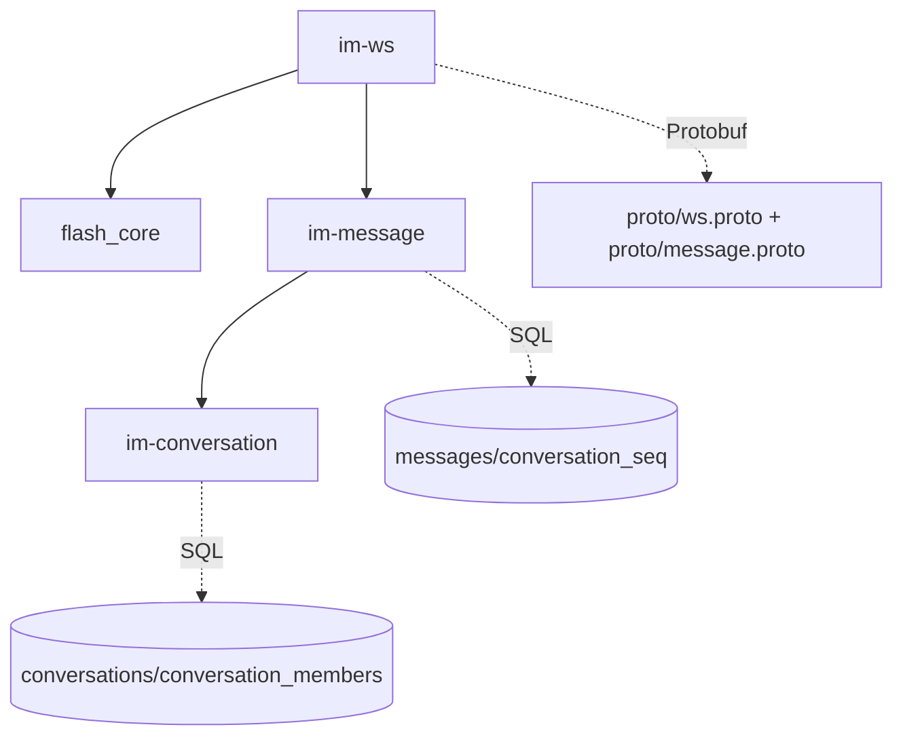
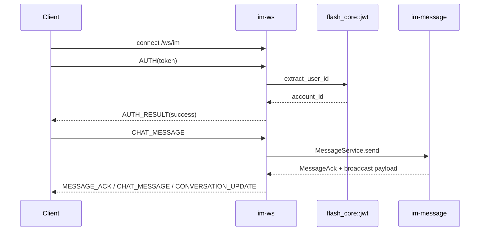

# ws — server 局域网络

涉及节点：I-3, D-5

---

## 一、远景：模块与依赖

### 涉及模块

| 模块 | 位置 | 职责（一句话） |
|------|------|--------------|
| `im-ws` | `server/modules/im-ws` | 正式 IM WebSocket 认证、帧分发、广播 |
| `im-message` | `server/modules/im-message` | 消息发送业务和广播 trait |
| `im-conversation` | `server/modules/im-conversation` | 成员校验、会话摘要、未读 |
| `flash_core` | `server/modules/flash_core` | JWT 与共享上下文 |
| proto | `proto/ws.proto`, `proto/message.proto` | WS 二进制协议定义 |

### 依赖关系

### 节点详情

| 编号 | 功能节点 | 模块 | 职责 |
|------|---------|------|------|
| I-3 | Protobuf WebSocket 协议 | `im-ws::proto` | 帧类型与 payload 编解码 |
| D-5 | IM 实时连接 | `im-ws` | AUTH、PING/PONG、CHAT_MESSAGE、ACK、会话更新 |

---

## 二、中景：数据通道与事件流

### 数据通道

| 通道 | 协议 | 方向 | 特点 | 例子 |
|------|------|------|------|------|
| 认证帧 | WS/protobuf | 客户端 -> 服务端 | 连接后 10 秒内必须先发 AUTH | `AuthRequest(token)` |
| 业务帧 | WS/protobuf | 双向 | 二进制帧，按 `WsFrameType` 分发 | `CHAT_MESSAGE` |
| 广播 | mpsc channel | 服务端内部 | 按 account_id 注册连接 | `WsState.send_to_user` |

### 关键事件流

### 边界接口

**Protobuf 协议**

| 结构 | 文件 | 生产节点 | 消费节点 |
|------|------|---------|---------|
| `WsFrame` | `proto/ws.proto` | client/server | client/server |
| `AuthRequest` | `proto/ws.proto` | client | `im-ws` |
| `ChatMessage` | `proto/message.proto` | `im-message`/`im-ws` | client |
| `MessageAck` | `proto/message.proto` | `im-message`/`im-ws` | client |
| `ConversationUpdate` | `proto/message.proto` | `im-message`/`im-ws` | client |

---

## 三、近景：生命周期与订阅

### 核心对象生命周期

| 对象 | 创建时机 | 销毁时机 | 生命跨度 |
|------|---------|---------|---------|
| socket connection | `/ws/im` 升级成功 | socket close/error | 连接级 |
| `connection_id` | 连接开始 | unregister | 连接级 |
| `WsState` 注册项 | AUTH 成功 | socket 断开 | 连接级 |
| outbound receiver | 注册连接时 | loop break | 连接级 |

### 订阅关系

| 订阅者 | 监听目标 | 订阅时机 | 取消时机 | 是否成对 |
|--------|---------|---------|---------|---------|
| `handle_authenticated_socket` | socket recv | AUTH 成功后 | socket 断开 | 是 |
| `handle_authenticated_socket` | outbound mpsc receiver | 注册连接后 | socket 断开 | 是 |
| `WsState` | account connection | AUTH 成功后 | `unregister` | 是 |

---

## 四、版本演进

| 版本 | 变更 |
|------|------|
| v0.0.1 | 建立 protobuf 与 WS 基础连接 |
| v0.0.3 | 接入消息发送、ACK、会话更新广播 |
