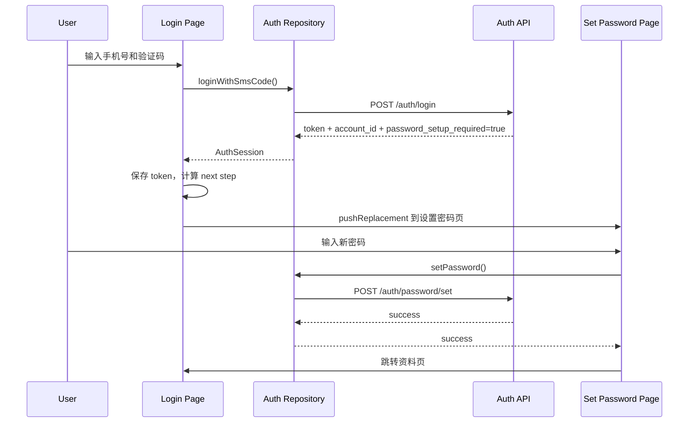
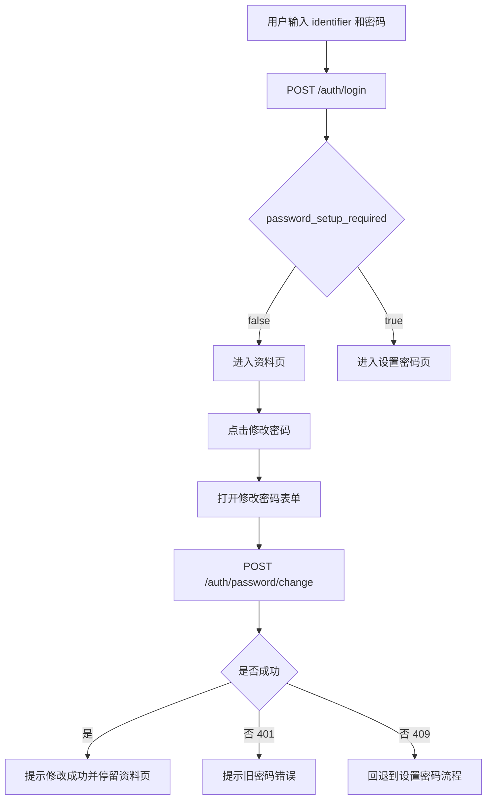

# auth-system-upgrade — client 设计报告

## 1. 目标

> 让读者 3 秒内知道这个版本要交付什么。

- 消费新的登录响应标识，在登录成功后引导未设置密码的用户先完成密码设置。
- 在现有认证 playground 中增加“设置密码”和“修改密码”交互路径。
- 将密码登录入口从示例账号模式收敛到“identifier + 密码”模式，先支持手机号，后续兼容邮箱 / 微信等凭据扩展。
- 在资料页感知密码状态，支持后续再次进入设置/修改密码流程。

## 2. 现状分析

> 让读者理解我们从哪里出发，为什么要做这些。

- 当前客户端认证模块集中在 `client/lib/playground/demos/auth/`。
- 当前 `AuthPlaygroundPage` 有两种登录方式：
  - 短信验证码登录
  - 账号密码登录
- 当前密码登录界面基于示例账号 `rainy/alice/bob`，不是账户主体 + 多凭据体系。
- 当前 `AuthSessionDto` / `AuthSession` 只包含 `token` 和 `userId`，无法承接登录后的密码引导分支，也不能和新的 `account_id` 语义对齐。
- 当前登录成功后统一跳转 `AuthProfilePage`，中间没有“设置密码”流程。
- 当前资料页只展示个人资料和 token，不展示密码状态，也没有修改密码入口。

## 3. 数据模型与接口

> 定义系统的骨架，说明数据长什么样，对外暴露什么能力。

### 数据模型

#### Client：核心数据类与状态

```dart
class AuthSession {
  const AuthSession({
    required this.token,
    required this.accountId,
    required this.passwordSetupRequired,
  });

  final String token;
  final int accountId;
  final bool passwordSetupRequired;
}

class AuthProfile {
  const AuthProfile({
    required this.accountId,
    required this.nickname,
    required this.avatarUrl,
    required this.phone,
    required this.hasPassword,
  });

  final int accountId;
  final String nickname;
  final String avatarUrl;
  final String phone;
  final bool hasPassword;
}

enum AuthLoginNextStep {
  openProfile,
  setupPassword,
}
```

#### 关键设计选择

| 决策 | 理由 |
| --- | --- |
| 登录态中新增 `passwordSetupRequired` | 登录成功后的引导决策发生在客户端跳转前，这个标识必须跟随登录响应进入 domain 层。 |
| 资料模型中新增 `hasPassword` | 避免客户端只依赖一次性登录响应，资料页和设置页可恢复密码状态。 |
| `AuthLoginNextStep` 作为页面跳转意图 | 让页面层只消费结果，不把“是否该去设置密码”的判断散落在多个 widget 中。 |
| 密码登录统一为 `identifier + password` | 先兼容手机号，后续扩展邮箱或其他凭据时不需要再改客户端表单协议。 |

### 接口契约

#### 客户端依赖的 API

- `POST /auth/sms`
- `POST /auth/login`
- `POST /auth/password/set`
- `POST /auth/password/change`
- `GET /user/profile`

#### 登录接口响应变更

```json
{
  "token": "jwt-token",
  "account_id": 10001,
  "password_setup_required": true
}
```

客户端行为：
- `true`：保存 token 后先进入设置密码页。
- `false`：保存 token 后直接进入资料页。

#### 设置密码接口

请求：

```json
{
  "new_password": "new-password"
}
```

响应：

```json
{
  "password_setup_required": false,
  "updated_at": "2026-06-12T15:30:00Z"
}
```

#### 修改密码接口

请求：

```json
{
  "old_password": "old-password",
  "new_password": "new-password"
}
```

响应：

```json
{
  "updated_at": "2026-06-12T15:35:00Z"
}
```

#### 用户资料接口响应补充

```json
{
  "account_id": 10001,
  "nickname": "13800138000",
  "avatar": "https://picsum.photos/seed/10001/120/120",
  "phone": "13800138000",
  "has_password": true
}
```

#### 错误与异常响应

| 场景 | 状态码 | 客户端处理 |
| --- | --- | --- |
| 验证码或密码错误 | `401` | 在登录页展示 inline error，不跳转。 |
| token 失效 | `401` | 资料页和密码页回到登录页。 |
| 已设置密码却调用设置接口 | `409` | 跳转资料页并刷新 `hasPassword` 状态。 |
| 尚未设置密码却调用修改接口 | `409` | 切回设置密码页。 |
| 表单校验失败 | `400` | 显示字段级错误或统一提示。 |

## 4. 核心流程

> 把关键业务路径画出来，让 AI 理解数据怎么流转。

### 场景一：短信登录后进入设置密码引导



边界条件：
- 登录成功后先保存 token，再进入设置密码页，避免该页重复要求短信登录。
- 若设置密码接口返回 `409 password already set`，客户端应直接回资料页并刷新资料。

### 场景二：密码登录与资料页修改密码



边界条件：
- `password_setup_required` 只决定首次登录后的分流。
- 资料页仍通过 `has_password` 决定展示“设置密码”还是“修改密码”入口。
- 修改密码成功后本期不强制重新登录，避免破坏当前演示流程。

## 5. 项目结构与技术决策

> 明确代码怎么组织、职责怎么分、为什么这么选。

### 项目结构

```text
client/lib/playground/demos/auth/
├── data/
│   ├── auth_api.dart                    # 新增 set/change password 请求
│   ├── auth_repository.dart             # 映射 next step 与密码状态
│   ├── auth_session_store.dart          # 继续只负责 token 存取
│   └── models/
│       ├── auth_session_dto.dart        # 补 password_setup_required
│       ├── auth_profile_dto.dart        # 补 has_password
│       ├── set_password_result_dto.dart # 设置密码返回值
│       └── change_password_result_dto.dart
├── domain/
│   ├── auth_session.dart                # 补 accountId 与 passwordSetupRequired
│   ├── auth_profile.dart                # 补 hasPassword
│   └── auth_login_next_step.dart        # 登录后的跳转意图
└── presentation/
    ├── auth_playground_page.dart        # 登录后分流逻辑
    ├── auth_profile_page.dart           # 密码状态与修改入口
    ├── auth_set_password_page.dart      # 新增设置密码页
    └── auth_change_password_sheet.dart  # 新增修改密码交互
```

### 职责划分

- Presentation → Repository → API
- `auth_playground_page.dart` 负责表单交互与登录后跳转，不直接解析原始 JSON。
- `auth_repository.dart` 负责 DTO 到 domain 的映射，以及“登录后下一步是什么”的统一判断。
- `auth_session_store.dart` 继续只负责 token 持久化，不额外保存密码引导标识。
- `auth_profile_page.dart` 负责展示资料与密码入口，不直接编排登录逻辑。

### 技术决策

| 决策 | 方案 | 理由 |
| --- | --- | --- |
| 状态恢复 | `passwordSetupRequired` 只存在于登录结果，`hasPassword` 来自资料接口 | 既满足首次登录引导，也支持刷新/重进后的恢复。 |
| token 存储 | 继续使用 `SharedPreferencesAuthSessionStore` | 本期不扩展到 refresh token，多存一层状态没有收益。 |
| UI 入口位置 | 设置密码走登录后强引导，修改密码放在资料页 | 区分“首次补齐凭证”和“已登录用户维护密码”两种语义。 |
| 密码登录标识 | 使用 `identifier` 输入框，当前文案默认指向手机号 | 既满足本期手机号落地，也避免后续改邮箱登录时重新改协议。 |

第三方依赖清单：

| 依赖 | 用途 | 已有/需新增 |
| --- | --- | --- |
| `dio` | 调用认证接口 | 已有 |
| `shared_preferences` | 保存 token | 已有 |
| Flutter Material | 页面与表单交互 | 已有 |

## 6. 暂不实现

> 给 AI 编码画红线，防止过度发挥。

| 功能 | 理由 |
| --- | --- |
| 忘记密码页 / 重置密码流程 | 当前需求只覆盖设置密码和修改密码。 |
| 密码强度评分、复杂度可视化 | 会显著拉长 UI 和交互范围，不是本期关键路径。 |
| 生物识别登录 | 依赖更完整的设备安全方案，本期不展开。 |
| Refresh Token 与自动续签 | 服务端本期未重构 token 生命周期。 |
| 邮箱登录 / 微信登录 UI | 本期先按新账户模型兼容协议，不落实际入口与授权页面。 |
| 生产短信收码体验 | 当前仍允许 playground 使用调试验证码显示。 |
