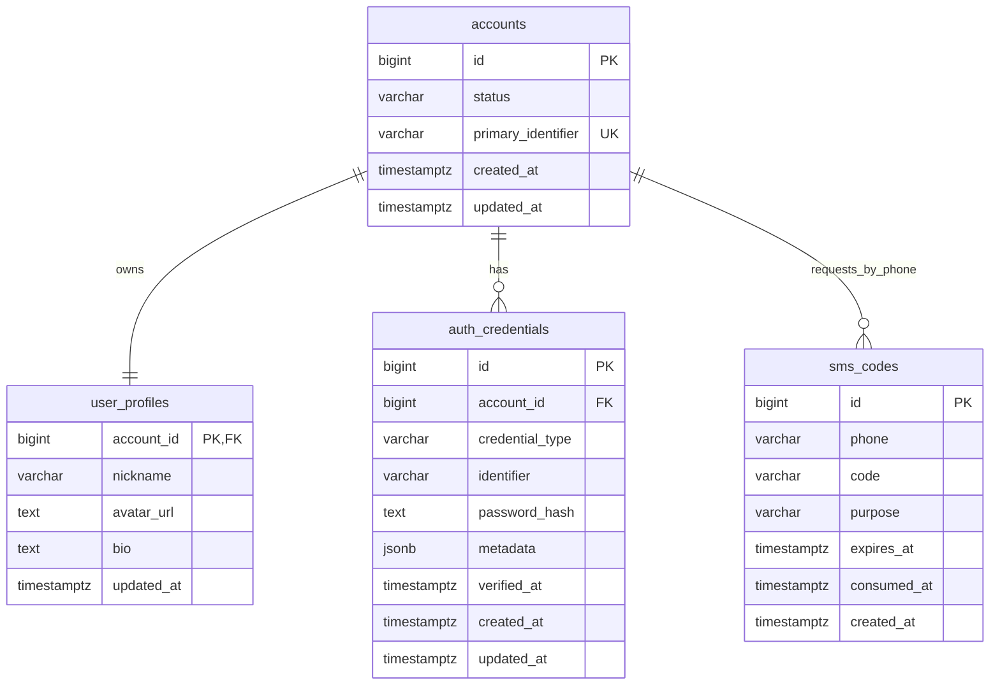
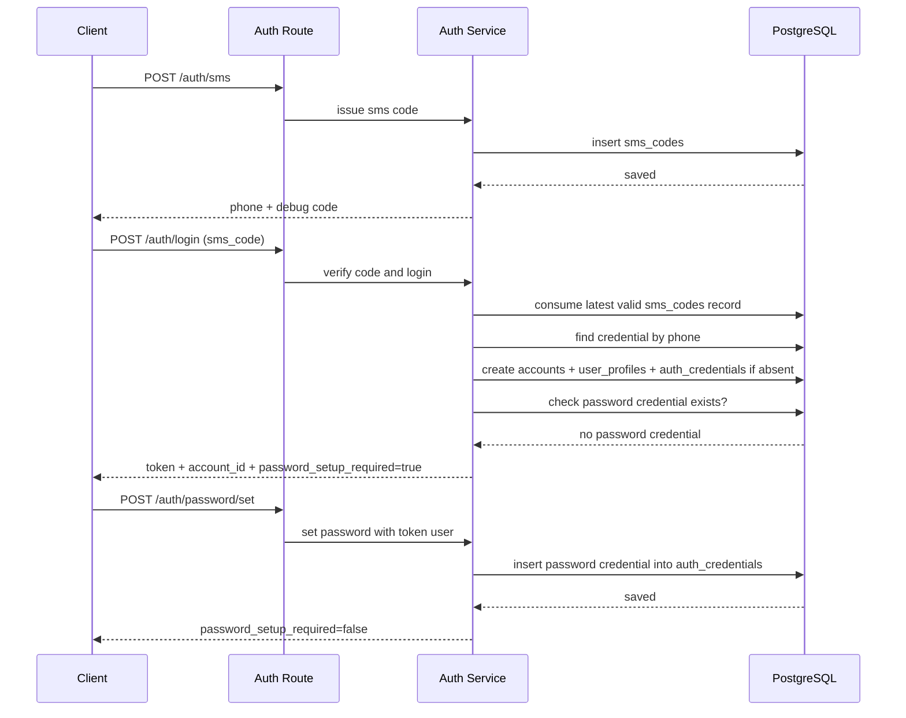
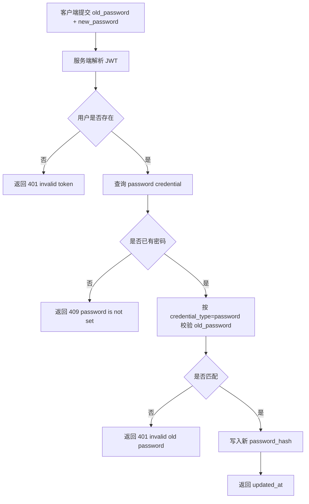

# auth-system-upgrade — server 设计报告

## 1. 目标

> 让读者 3 秒内知道这个版本要交付什么。

- 将认证相关数据从内存存储切换为 PostgreSQL 持久化存储。
- 将认证数据重构为以 `accounts` 为主体、`auth_credentials` 承载多登录方式的账户模型。
- 在现有短信登录能力上补齐密码设置接口和密码修改接口。
- 调整登录成功响应，额外返回密码设置引导标识，供客户端判断是否进入设置密码流程。
- 保持现有 JWT 鉴权主链路不变，避免本期把认证升级扩散到消息与会话业务。

## 2. 现状分析

> 让读者理解我们从哪里出发，为什么要做这些。

- 当前服务端认证数据全部在 `server/src/store/memory.rs` 的 `InMemoryStore` 中维护：
  - 短信验证码存在 `sms_codes`
  - 用户数据存在 `users_by_id` / `user_ids_by_phone`
  - 密码账号存在 `password_accounts`
- 当前密码账号来自 `server/src/auth/password.rs` 的 seed 数据，密码为明文示例账号，不具备真实持久化与安全性。
- 当前 `POST /auth/login` 只返回 `token` 和 `user_id`，客户端无法区分“登录成功但尚未设置密码”的用户，也无法为后续邮箱 / 微信等登录方式提供统一账户主体。
- 当前 `GET /user/profile` 只返回基础资料，不返回密码状态。
- 基础设施方面：
  - Rust + Axum + JWT 主链路已经工作正常
  - 本地开发环境已具备 PostgreSQL 实例，可通过 `DATABASE_URL` 指向 `flash_im`
  - 仓库当前尚无数据库连接池、迁移文件和持久化仓储实现

## 3. 数据模型与接口

> 定义系统的骨架，说明数据长什么样，对外暴露什么能力。

### 数据模型

#### Server：核心表结构

```sql
CREATE TABLE accounts (
    id BIGSERIAL PRIMARY KEY,
    status VARCHAR(32) NOT NULL DEFAULT 'active',
    primary_identifier VARCHAR(128) NOT NULL UNIQUE,
    created_at TIMESTAMPTZ NOT NULL DEFAULT NOW(),
    updated_at TIMESTAMPTZ NOT NULL DEFAULT NOW()
);

CREATE TABLE user_profiles (
    account_id BIGINT PRIMARY KEY REFERENCES accounts(id) ON DELETE CASCADE,
    nickname VARCHAR(64) NOT NULL,
    avatar_url TEXT NOT NULL,
    bio TEXT NOT NULL DEFAULT '',
    updated_at TIMESTAMPTZ NOT NULL DEFAULT NOW()
);

CREATE TABLE auth_credentials (
    id BIGSERIAL PRIMARY KEY,
    account_id BIGINT NOT NULL REFERENCES accounts(id) ON DELETE CASCADE,
    credential_type VARCHAR(32) NOT NULL,
    identifier VARCHAR(128) NOT NULL,
    password_hash TEXT NULL,
    metadata JSONB NOT NULL DEFAULT '{}'::jsonb,
    verified_at TIMESTAMPTZ NULL,
    created_at TIMESTAMPTZ NOT NULL DEFAULT NOW(),
    updated_at TIMESTAMPTZ NOT NULL DEFAULT NOW(),
    UNIQUE (credential_type, identifier)
);

CREATE TABLE sms_codes (
    id BIGSERIAL PRIMARY KEY,
    phone VARCHAR(20) NOT NULL,
    code VARCHAR(6) NOT NULL,
    purpose VARCHAR(32) NOT NULL DEFAULT 'login',
    expires_at TIMESTAMPTZ NOT NULL,
    consumed_at TIMESTAMPTZ NULL,
    created_at TIMESTAMPTZ NOT NULL DEFAULT NOW()
);

CREATE INDEX idx_sms_codes_phone_purpose
    ON sms_codes (phone, purpose, created_at DESC);
```

#### ER 关系图



#### 关键设计选择

| 决策 | 理由 |
| --- | --- |
| `accounts` 作为账户主体 | 先稳定唯一身份，再把手机号、邮箱、微信等登录方式挂到 `auth_credentials`，能避免未来继续拆表迁移。 |
| `user_profiles` 与 `accounts` 1:1 拆分 | 展示资料与认证主体职责不同，拆分后更利于后续做资料扩展和审计隔离。 |
| `auth_credentials` 统一承载多种登录方式 | 手机号、邮箱、微信、本地密码都可以落在同一张表的不同 `credential_type` 中，扩展成本最低。 |
| 不在 `accounts` 冗余 `has_password` 字段 | 是否已设置密码可通过 `auth_credentials` 中是否存在带 `password_hash` 的记录推导，避免双写。 |
| `sms_codes` 独立表 | 验证码生命周期短、用途独立，单独建表更清晰，也避免污染长期身份数据。 |
| 密码只存哈希值 | 避免明文密码，满足最基本的认证安全要求。 |

### 接口契约

#### API 一览

- `POST /auth/sms`
- `POST /auth/login`
- `POST /auth/password/set`
- `POST /auth/password/change`
- `GET /user/profile`

#### 1. 发送短信验证码

`POST /auth/sms`

请求：

```json
{
  "phone": "13800138000"
}
```

响应：

```json
{
  "phone": "13800138000",
  "code": "123456"
}
```

说明：
- `code` 仅用于当前 playground / 本地调试链路。
- 正式短信通道接入不在本期范围内。

#### 2. 登录

`POST /auth/login`

短信验证码登录请求：

```json
{
  "login_type": "sms_code",
  "phone": "13800138000",
  "code": "123456"
}
```

密码登录请求：

```json
{
  "login_type": "password",
  "identifier": "13800138000",
  "password": "new-password"
}
```

成功响应：

```json
{
  "token": "jwt-token",
  "account_id": 10001,
  "password_setup_required": true
}
```

字段约束：
- `account_id`：账户主体 ID，后续所有认证态与资料查询都基于它。
- `password_setup_required = true`：本次登录命中的账户尚无可用密码凭据，客户端应立即引导设置密码。
- `password_setup_required = false`：该账户已具备密码凭据，或本次就是密码凭据登录。

#### 3. 设置密码

`POST /auth/password/set`

请求头：

```text
Authorization: Bearer <token>
```

请求：

```json
{
  "new_password": "new-password"
}
```

成功响应：

```json
{
  "password_setup_required": false,
  "updated_at": "2026-06-12T15:30:00Z"
}
```

行为约束：
- 仅允许“当前用户尚未设置过密码”时调用成功。
- 若用户已有密码，返回冲突错误，客户端应改走修改密码流程。

#### 4. 修改密码

`POST /auth/password/change`

请求头：

```text
Authorization: Bearer <token>
```

请求：

```json
{
  "old_password": "old-password",
  "new_password": "new-password"
}
```

成功响应：

```json
{
  "updated_at": "2026-06-12T15:35:00Z"
}
```

#### 5. 查询用户资料

`GET /user/profile`

成功响应：

```json
{
  "account_id": 10001,
  "nickname": "13800138000",
  "avatar": "https://picsum.photos/seed/10001/120/120",
  "phone": "13800138000",
  "has_password": true
}
```

增加 `has_password` 的原因：
- 登录成功标识只覆盖“刚登录完成”场景。
- 资料接口补充密码状态后，客户端在资料页或设置页可恢复正确引导状态。

#### 错误码与异常响应

| 场景 | 状态码 | 响应示例 |
| --- | --- | --- |
| 缺少必填字段 | `400` | `{"message":"phone is required"}` |
| 验证码错误或过期 | `401` | `{"message":"invalid or expired code"}` |
| 密码错误 | `401` | `{"message":"invalid phone or password"}` |
| 未携带或携带非法 token | `401` | `{"message":"invalid token"}` |
| 已设置过密码却调用设置接口 | `409` | `{"message":"password already set"}` |
| 尚未设置密码却调用修改接口 | `409` | `{"message":"password is not set"}` |
| 数据库或签发 token 失败 | `500` | `{"message":"internal server error"}` |

## 4. 核心流程

> 把关键业务路径画出来，让 AI 理解数据怎么流转。

### 场景一：短信登录成功后引导设置密码



边界条件：
- 同一手机号只消费最新且未过期、未使用的验证码。
- 短信首登时，服务端一次性创建 `accounts`、`user_profiles` 和“手机号 credential”。
- 设置密码成功后不强制重新登录，本期保持 token 可继续使用。

### 场景二：已设置密码用户修改密码



边界条件：
- 修改密码必须校验旧密码，避免“短信已登录即直接覆盖密码”。
- 本期不做 token 轮换和其他设备踢下线，先保持最小行为变更。

## 5. 项目结构与技术决策

> 明确代码怎么组织、职责怎么分、为什么这么选。

### 项目结构

```text
server/
├── migrations/
│   └── 0001_auth_tables.sql      # accounts/user_profiles/auth_credentials/sms_codes
└── src/
    ├── config.rs                 # 读取 DATABASE_URL、验证码调试开关
    ├── state.rs                  # 注入 store 抽象、JWT secret、数据库连接池
    ├── models/
    │   ├── auth.rs               # 请求/响应 DTO，补 account_id 与密码状态字段
    │   └── user.rs               # 用户资料 DTO，补 has_password
    ├── routes/
    │   ├── auth.rs               # 登录、设置密码、修改密码路由
    │   └── user.rs               # 资料接口
    ├── services/
    │   ├── auth_service.rs       # 认证编排、JWT 签发、密码状态计算
    │   └── user_service.rs       # 用户查找/创建逻辑
    ├── store/
    │   ├── mod.rs                # 认证存储接口
    │   ├── memory.rs             # 开发/测试回退实现
    │   └── postgres.rs           # PostgreSQL 持久化实现
    └── auth/
        ├── jwt.rs                # JWT 能力保持
        └── password.rs           # 哈希与校验能力
```

### 职责划分

- Route → Service → Store
- `routes/auth.rs` 只负责 HTTP 入参/出参，不直接操作数据库。
- `services/auth_service.rs` 负责认证流程编排、状态判断、JWT 签发。
- `store/postgres.rs` 负责 SQL 查询与持久化，不承载业务分支判断。
- `auth/password.rs` 负责密码哈希与校验，不感知 HTTP 与数据库上下文。
- `chat_room_service` 和会话/消息路由不直接依赖新的认证存储实现，只消费既有 JWT 鉴权结果。

### 技术决策

| 决策 | 方案 | 理由 |
| --- | --- | --- |
| 持久化数据库 | PostgreSQL | 前期调研已明确 PostgreSQL 更适合后续账户、设备、会话、消息的持续扩展。 |
| Rust 数据访问 | `sqlx` | 与当前 async Rust 栈匹配，查询清晰，适合本项目从简单表开始演进。 |
| 密码算法 | `argon2` | 相比明文或简单摘要更符合密码存储场景。 |
| Store 演进方式 | 在 `store` 下补 `postgres.rs` 并抽象接口 | 保留当前目录结构，减少一次性大范围搬家。 |
| 账户建模 | `accounts` + `user_profiles` + `auth_credentials` | 把身份主体、展示资料、登录凭据拆开，能自然支持手机号/邮箱/微信等多登录方式。 |
| 密码状态恢复 | `login` 返回 `password_setup_required`，`profile` 返回 `has_password` | 同时覆盖首次登录分流和后续页面恢复场景。 |

第三方依赖清单：

| 依赖 | 用途 | 已有/需新增 |
| --- | --- | --- |
| `sqlx` | PostgreSQL 连接、查询、迁移 | 需新增 |
| `argon2` | 密码哈希与校验 | 需新增 |
| `tokio` | 异步运行时 | 已有 |
| `jsonwebtoken` | JWT 签发与解析 | 已有 |
| `rand` | 验证码生成 | 已有 |

## 6. 暂不实现

> 给 AI 编码画红线，防止过度发挥。

| 功能 | 理由 |
| --- | --- |
| 忘记密码 / 找回密码 | 当前需求只覆盖设置密码与修改密码，不包含重置链路。 |
| Refresh Token / 会话续签体系 | 本期仅扩展登录返回和密码能力，不重构整套 token 生命周期。 |
| 多设备登录管理 / 踢下线 | 会扩展到设备表与会话表，超出本期范围。 |
| 正式短信供应商接入 | 当前 playground 仍以调试验证码链路为主。 |
| 完整第三方微信 OAuth 交换流程 | 本期只在数据模型上预留 `credential_type=wechat`，不实现完整第三方登录联调。 |
| 认证数据之外的业务表持久化 | 当前只升级认证相关数据，聊天室和消息存储单独规划。 |
