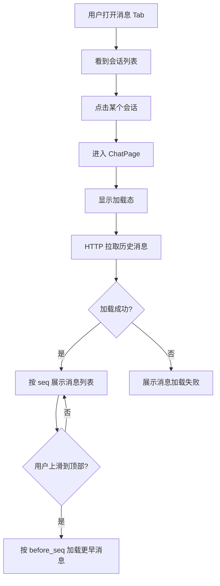
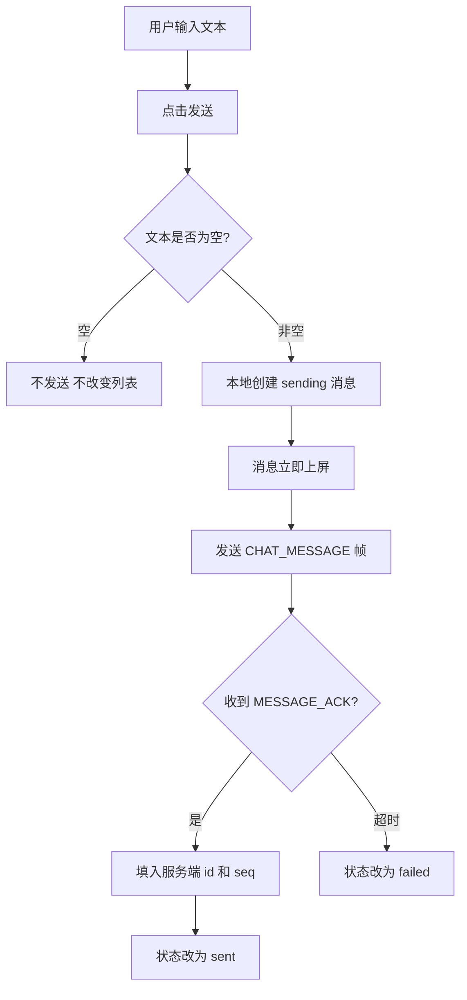
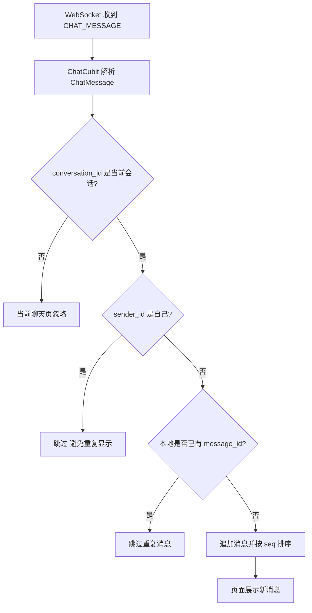
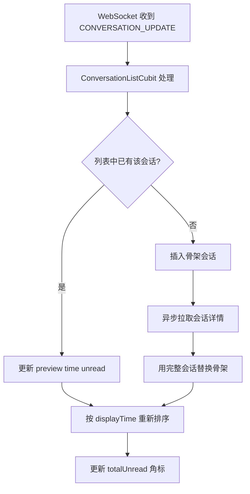
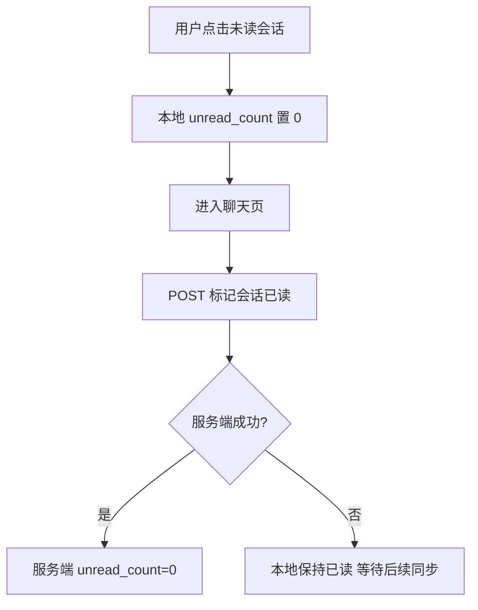

# IM Core v0.0.3 消息收发 — 功能分析

## 概述

IM Core v0.0.3 解决的是文本消息从“用户发送”到“服务端持久化、实时投递、会话列表联动、历史可追溯”的完整闭环。当前版本以 WebSocket 承担实时收发与事件推送，以 HTTP 承担历史分页、会话详情补全和已读清零；服务端以 `messages` 和 `conversation_seq` 作为权威事实源，客户端以 `ChatCubit`、`ConversationListCubit` 和 `WsClient` 维护页面状态。

本分析依据当前 v0.0.3 设计与实现边界：只支持文本消息；不实现图片、文件、语音、撤回、已读回执、消息搜索、本地 SQLite 缓存、新消息浮层、失败重试和长按菜单。当前 `MESSAGE_ACK` 不返回 `client_id`，客户端按发送顺序匹配本地 pending 消息。

## 一、交互链

### 场景 1：从会话列表进入聊天页并加载历史

**用户故事**：作为已登录用户，我想从消息列表点开一个会话，以便查看这个会话里的历史消息并继续聊天。

用户进入首页的“消息”Tab 后看到会话列表。用户点击某个会话项，应用进入聊天页，聊天页先显示加载态，然后通过接口读取最近一页历史消息。加载成功后，页面按会话内 `seq` 顺序展示消息；如果消息不足一屏，内容靠上展示；如果还有更早消息，用户向上滚动时继续按 `before_seq` 拉取。

### 场景 2：发送一条文本消息

**用户故事**：作为聊天用户，我想输入文字后立即看到消息出现在聊天页里，以便获得即时反馈，而不是等待网络返回。

用户在输入框输入文本并点击发送。客户端先校验文本非空，创建本地临时消息，状态为 `sending`，立刻追加到当前消息列表。随后客户端通过 `WsClient.sendChatMessage` 发送 `CHAT_MESSAGE` 帧。服务端确认后返回 `MESSAGE_ACK`，客户端把最早的 pending 本地消息更新为服务端 `message_id` 和 `seq`，状态从 `sending` 变为 `sent`。如果 12 秒内没有收到 ACK，本地消息变为 `failed`。

### 场景 3：当前聊天页实时收到对方消息

**用户故事**：作为正在聊天的用户，我想在当前会话里实时看到对方发来的消息，以便不中断对话。

用户停留在某个聊天页时，客户端已经订阅 `chatMessageStream`。当 WebSocket 收到 `CHAT_MESSAGE` 帧，`ChatCubit` 先判断消息是否属于当前会话，再判断发送者是否为自己。如果不是当前会话或是自己发送的消息，则当前聊天页不展示；如果是对方消息且本地未重复，转换为 `Message` 后追加到消息列表，并按 `seq` 排序显示在底部。

### 场景 4：会话列表收到消息更新并同步未读

**用户故事**：作为消息列表用户，我想在别人发新消息时看到会话预览、时间和未读角标更新，以便知道哪个会话有新内容。

无论用户是否停留在消息列表，只要主壳层持有的 `ConversationListCubit` 处于加载完成状态，它会监听 `conversationUpdateStream`。收到 `CONVERSATION_UPDATE` 后，如果本地已有该会话，则更新最后消息预览、最后消息时间和该会话未读数，并用服务端给出的 `total_unread` 更新底部消息 Tab 角标；如果本地还没有该会话，则先插入骨架会话，随后调用 `GET /conversations/:id` 异步补全昵称、头像等详情。

### 场景 5：进入聊天页后清零当前会话未读

**用户故事**：作为用户，我点进一个有未读消息的会话后，希望这个会话不再显示未读，以便消息角标反映我已经查看过。

用户从会话列表点击进入聊天页时，客户端先把当前会话本地未读数清零，降低底部消息角标；同时调用 `POST /conversations/:id/read` 通知服务端清零该用户在该会话里的 `unread_count`。如果接口失败，用户已经在聊天页内，客户端不把未读状态弹回，等待后续刷新或推送重新对齐。

## 二、逻辑树

### 事件流：打开聊天页与历史分页

| 时刻 | 事件 | 处理 | 产生的新事件 |
| --- | --- | --- | --- |
| T1 | 用户点击会话列表项 | `MessagesPlaceholderPage` 触发会话点击回调，路由进入聊天页 | 创建 `ChatPage` 和 `ChatCubit` |
| T2 | `ChatCubit.loadMessages()` | 进入 `ChatLoading`，调用 `MessageRepository.getMessages(conversationId, limit=50)` | HTTP `GET /conversations/{id}/messages` |
| T3 | 服务端收到历史消息请求 | `im-message/routes.rs` 提取 token 中的用户 ID，校验会话成员关系 | 查询 `messages` 和 `user_profiles` |
| T4 | 历史查询成功 | 服务端按 `seq DESC` 查询后返回 JSON；客户端转换为 `Message` 并按 `seq` 升序排序 | `ChatLoaded(messages, hasMore)` |
| T5 | 用户向上滚动加载更多 | 客户端取当前最小有效 `seq` 作为 `before_seq` | 再次 HTTP 分页请求 |
| T6 | 查询失败或数据格式异常 | 客户端捕获异常 | 初始加载显示 `ChatError`，加载更多显示 `errorMessage` |

### 事件流：发送文本消息

| 时刻 | 事件 | 处理 | 产生的新事件 |
| --- | --- | --- | --- |
| T1 | 用户点击发送 | `ChatCubit.sendText` trim 文本，空文本直接返回 | 非空时创建本地 `Message.local` |
| T2 | 本地消息创建 | 消息 ID 使用本地临时 ID，`seq=0`，`status=sending`，加入 `_pendingLocalIds` | 页面立即展示 sending 消息 |
| T3 | 客户端发送 WebSocket 帧 | `WsClient.sendChatMessage` 封装 `SendMessageRequest` 到 `CHAT_MESSAGE` | 服务端 `im-ws/dispatcher.rs` 接收 |
| T4 | 服务端处理 `CHAT_MESSAGE` | 解析 `conversation_id` 和 `extra`，调用 `MessageService.send` | 消息业务流程开始 |
| T5 | 服务端业务校验 | 校验内容非空、`type=0`、发送者是会话成员 | 进入序列号生成 |
| T6 | 服务端写入消息 | `conversation_seq` 原子递增，插入 `messages`，更新 `conversations` 摘要，累加非发送者未读 | 生成 `MessagePayload`、`MessageAck` 和会话更新 |
| T7 | 服务端推送 | 给发送者回复 `MESSAGE_ACK`，给其他成员推送 `CHAT_MESSAGE`，给成员分别推送 `CONVERSATION_UPDATE` | 客户端状态更新 |
| T8 | 客户端收到 ACK | `ChatCubit._handleAck` 取出最早 pending 本地 ID，填入服务端 ID 和 `seq` | 消息状态 `sending -> sent` |
| T9 | ACK 超时 | 12 秒计时器触发 `_markFailed` | 本地消息状态 `sending -> failed` |

### 事件流：实时接收消息

| 时刻 | 事件 | 处理 | 产生的新事件 |
| --- | --- | --- | --- |
| T1 | 服务端广播 `CHAT_MESSAGE` | `WsBroadcaster` 为消息补 sender_name、sender_avatar 后按成员连接投递，排除发送者 | 接收方 WebSocket 收到二进制帧 |
| T2 | 客户端帧分发 | `WsClient` 根据 `WsFrameType.CHAT_MESSAGE` 解析为 `ChatMessage`，写入 `chatMessageStream` | `ChatCubit._handleIncomingMessage` 被触发 |
| T3 | 当前会话过滤 | 判断 `conversation_id` 是否等于当前会话 ID | 非当前会话忽略 |
| T4 | 自己消息过滤 | 判断 `sender_id` 是否等于当前用户 ID | 自己消息忽略，避免和 ACK 后本地消息重复 |
| T5 | 去重与追加 | 判断本地是否已有相同 `message_id`，没有则转换为 `Message` | 追加并按 `seq` 排序 |

### 事件流：会话更新与未读同步

| 时刻 | 事件 | 处理 | 产生的新事件 |
| --- | --- | --- | --- |
| T1 | 服务端消息入库成功 | `MessageService.send` 更新会话摘要和成员未读 | 构造每个成员的 `ConversationUpdate` |
| T2 | 服务端推送会话更新 | `WsBroadcaster` 为每个用户查询 `total_unread`，推送 `CONVERSATION_UPDATE` | 客户端 `conversationUpdateStream` 收到事件 |
| T3 | 客户端已有会话 | 更新本地会话的 `lastMessagePreview`、`lastMessageAt`、`unreadCount` | 会话列表重新排序 |
| T4 | 客户端没有会话 | 插入 `Conversation.placeholder`，避免丢失实时变化 | 异步 `GET /conversations/{id}` 补全详情 |
| T5 | 补全成功 | 用完整会话对象替换骨架会话 | 显示昵称、头像、类型等完整信息 |
| T6 | 补全失败 | 保留骨架会话 | 等待下次刷新或推送恢复 |

### 事件流：标记会话已读

| 时刻 | 事件 | 处理 | 产生的新事件 |
| --- | --- | --- | --- |
| T1 | 用户进入会话 | `MainShellPage` / 会话点击链路调用 `markConversationRead` | 本地清零该会话未读 |
| T2 | 客户端请求服务端 | `ConversationRepository.markRead` 调用 `POST /conversations/{id}/read` | 服务端更新 `conversation_members.unread_count=0` |
| T3 | 服务端成功 | 当前用户该会话未读被持久清零 | 下次刷新不恢复旧未读 |
| T4 | 服务端失败 | 客户端吞掉异常 | 本地不反弹，后续同步再校正 |

### 状态流转

| 实体 | 触发事件 | 前状态 | 后状态 |
| --- | --- | --- | --- |
| `ChatState` | 打开聊天页 | `ChatInitial` | `ChatLoading` |
| `ChatState` | 历史消息加载成功 | `ChatLoading` | `ChatLoaded(messages, hasMore)` |
| `ChatState` | 历史消息加载失败 | `ChatLoading` | `ChatError("消息加载失败，请稍后重试")` |
| 本地消息 | 用户发送非空文本 | 不存在 | `Message(id=local_id, seq=0, status=sending)` |
| 本地消息 | 收到 `MESSAGE_ACK` | `sending` | `sent`，并替换为服务端 `message_id` 和 `seq` |
| 本地消息 | ACK 超时 | `sending` | `failed` |
| 服务端消息 | `CHAT_MESSAGE` 通过校验 | 不存在 | `messages.status=0`，写入 `conversation_id/sender_id/seq/content` |
| `conversation_seq` | 消息写入前 | `current_seq=N` | `current_seq=N+1` |
| `conversations` | 消息写入成功 | 旧 `last_message_preview/last_message_at` | 新摘要和新时间 |
| 接收者 `conversation_members` | 发送者消息写入成功 | `unread_count=N` | `unread_count=N+1` |
| 当前用户 `conversation_members` | 进入会话并标记已读 | `unread_count=N` | `unread_count=0` |
| `ConversationListState` | 会话列表加载成功 | `ConversationListLoading` | `ConversationListLoaded(conversations, hasMore)` |
| 本地会话项 | 收到已存在会话更新 | 旧 preview/time/unread | 新 preview/time/unread |
| 本地会话项 | 收到未知会话更新 | 不存在 | 骨架会话，随后异步补全 |
| `WsClient` | 连接并认证成功 | `connecting/authenticating` | `authenticated` |
| `WsClient` | 心跳超时或连接断开 | `authenticated` | `disconnected`，允许自动重连 |

### 异常流与回退

| 异常 | 触发条件 | 用户反馈 | 系统回退 |
| --- | --- | --- | --- |
| 空文本发送 | 输入内容 trim 后为空 | 不新增消息，不提示 | 不发送 WebSocket 帧 |
| 不支持消息类型 | `SendMessageRequest.type != 0` | 当前客户端不会主动发送；异常来自服务端错误 | 服务端返回 bad request，不写入消息 |
| 会话不存在或非成员 | 发送或拉历史时成员校验失败 | 历史页表现为加载失败；发送消息等待 ACK 后可能超时失败 | 服务端不写入消息，不广播 |
| `conversation_id` 非 UUID | WebSocket 发送帧解析失败 | 本地消息最终 ACK 超时失败 | 服务端返回 bad request，不进入业务流程 |
| `extra` 非合法 JSON | WebSocket payload 中 extra 解析失败 | 本地消息最终 ACK 超时失败 | 服务端拒绝请求 |
| 历史消息接口失败 | 网络错误、鉴权失败、服务端错误 | 初始加载显示失败；加载更多显示“更多消息加载失败” | 保持已有消息列表 |
| WebSocket 断开 | 网络断开、心跳超时、认证失败 | 连接状态组件显示断开/重连态 | `WsClient` 指数退避重连 |
| ACK 未返回 | 服务端未确认、连接中断、帧丢失 | 发送气泡变为失败状态 | 当前版本不自动重试 |
| 未知会话详情补全失败 | `GET /conversations/{id}` 失败 | 会话列表保留预览和未读，但昵称头像可能缺失 | 下次刷新或后续推送再修正 |
| 标记已读失败 | `POST /conversations/{id}/read` 失败 | 用户仍在聊天页，不反弹未读 | 本地保持已读，后续同步校正 |

## 三、功能编号与网络定位

### 本次新增节点

| 编号 | 功能节点 | 层级 | 简介 |
| --- | --- | --- | --- |
| I-1 | WebSocket 业务帧分发 | 基础设施 | 在已有认证、心跳、重连基础上增加 `CHAT_MESSAGE`、`MESSAGE_ACK`、`CONVERSATION_UPDATE` typed stream 和服务端 dispatcher。 |
| I-2 | 会话内消息序列号 | 基础设施 | 使用 `conversation_seq` 为每个会话生成单调递增 `seq`，支撑排序和历史分页。 |
| D-1 | 文本消息持久化 | 领域 | 写入 `messages`，记录会话、发送者、序号、类型、内容、扩展、状态和创建时间。 |
| D-2 | 消息发送事务编排 | 领域 | 校验成员关系、生成序号、入库、更新会话摘要、累加未读、构造 ACK 和推送事件。 |
| D-3 | 历史消息查询 | 领域 | 通过 `GET /conversations/{id}/messages` 按 `before_seq` 和 `limit` 查询历史，并补充发送者信息。 |
| D-4 | 会话更新与未读聚合 | 领域 | 消息写入后更新会话 preview/time/unread，并为用户计算 `total_unread`。 |
| D-5 | 会话已读清零 | 领域 | 进入会话后通过 `POST /conversations/{id}/read` 清零当前用户的会话未读。 |
| F-1 | 客户端消息模型与仓储 | 前端基础 | `Message`、`MessageRepository` 负责 HTTP/Protobuf 到 UI 状态的转换。 |
| F-2 | 客户端 WebSocket typed streams | 前端基础 | `WsClient` 将原始 `WsFrame` 分发为 `chatMessageStream`、`messageAckStream`、`conversationUpdateStream`。 |
| F-3 | 共享头像能力 | 前端基础 | `flash_shared` 提供 `AvatarWidget`，让聊天页和会话列表复用头像渲染。 |
| P-1 | 聊天页消息展示 | 前端业务 | 展示历史消息、对方昵称头像、自己/对方气泡、sending/failed 状态。 |
| P-2 | 文本消息乐观发送 | 前端业务 | 发送时先本地上屏，ACK 后更新服务端 ID、seq 和 sent 状态，超时标记 failed。 |
| P-3 | 实时接收当前会话消息 | 前端业务 | 监听 `CHAT_MESSAGE`，按当前会话和发送者过滤，去重后追加到聊天页。 |
| P-4 | 会话列表实时联动 | 前端业务 | 监听 `CONVERSATION_UPDATE` 更新会话预览、时间、未读和底部角标。 |
| P-5 | 未加载会话骨架补全 | 前端业务 | 未在本地列表中的会话先插入骨架，再异步拉详情补全。 |
| P-6 | 进入聊天页本地已读 | 前端业务 | 点击会话后本地清零未读并请求服务端持久清零。 |

### 前置依赖

| 依赖节点 | 依赖方式 | 是否已有 |
| --- | --- | --- |
| 账号登录与 Bearer token | HTTP 路由提取用户 ID，WebSocket AUTH 帧认证 | 是 |
| `server/modules/im-ws` 基础连接 | 复用 WebSocket 连接、认证、心跳、重连 | 是 |
| `server/modules/im-conversation` | 校验成员、查询成员、更新 preview、累加/清零 unread | 是 |
| `conversations` / `conversation_members` | 消息归属、成员判断、未读计数 | 是 |
| `user_profiles` | 历史消息和实时消息补充 sender_name / sender_avatar | 是 |
| `proto/ws.proto` | 定义 WebSocket 帧类型和通用 `WsFrame` | 是 |
| `proto/message.proto` | 定义消息、发送请求、ACK、会话更新 | 是 |
| `client/modules/flash_im_core` | 提供 `WsClient`、Protobuf 生成代码和 typed stream | 是 |
| `client/modules/flash_im_conversation` | 提供会话模型、列表、未读状态和 markRead | 是 |
| `client/lib/app/flash_im_app.dart` | 注入认证 Dio、消息仓储、WebSocket 客户端 | 是 |
| `client/lib/features/home/presentation/main_shell_page.dart` | 管理主壳层 WebSocket 生命周期和全局会话 Cubit | 是 |
| `client_id` 服务端幂等去重 | 用于断线重试时识别同一条客户端消息 | 否，本版本不实现 |
| 本地 SQLite 消息缓存 | 用于离线历史、重启恢复、失败重试队列 | 否，本版本不实现 |

### 边界接口

| 接口/协议/数据结构 | 定义方 | 消费方 | 敏感度 |
| --- | --- | --- | --- |
| `GET /conversations/{id}/messages?before_seq=&limit=` | `im-message` HTTP 路由 | `DioMessageRepository` | 高 |
| `POST /conversations/{id}/read` | `im-conversation` HTTP 路由 | `DioConversationRepository.markRead` | 中 |
| `GET /conversations/{id}` | `im-conversation` HTTP 路由 | `ConversationListCubit._hydrateConversation` | 中 |
| `WsFrameType.CHAT_MESSAGE` | `proto/ws.proto` | `WsClient`、`im-ws/dispatcher` | 高 |
| `WsFrameType.MESSAGE_ACK` | `proto/ws.proto` | `ChatCubit` | 高 |
| `WsFrameType.CONVERSATION_UPDATE` | `proto/ws.proto` | `ConversationListCubit` | 高 |
| `SendMessageRequest` | `proto/message.proto` | 客户端发送、服务端解析 | 高 |
| `ChatMessage` | `proto/message.proto` | 服务端广播、客户端聊天页展示 | 高 |
| `MessageAck` | `proto/message.proto` | 服务端确认、客户端 pending 匹配 | 高 |
| `ConversationUpdate` | `proto/message.proto` | 服务端未读推送、客户端列表更新 | 高 |
| `messages` 表 | 服务端迁移和 `im-message` | 历史查询、消息事实源 | 高 |
| `conversation_seq` 表 | 服务端迁移和 `SeqGenerator` | 消息排序、分页、增量基础 | 高 |
| `conversation_members.unread_count` | `im-conversation` | 会话列表、未读角标、已读清零 | 高 |
| `MessageStatus` | `flash_im_chat` | 聊天气泡 UI 和发送状态 | 中 |
| `Conversation.placeholder` | `flash_im_conversation` | 未加载会话实时更新补偿 | 中 |

## 四、结论

- 开发顺序建议：先保证服务端消息事实源和协议稳定，再接入客户端 typed streams，最后做聊天页、会话列表联动和已读清零。具体顺序应是 `messages/conversation_seq` → `message.proto/ws.proto` → `im-message` → `im-ws dispatcher/broadcaster` → `flash_im_core` typed stream → `flash_im_chat` → `flash_im_conversation` 联动 → 主壳层路由与未读角标。
- 复杂度集中在四处：服务端 `seq` 与消息入库的一致性、WebSocket 主动推送连接管理、客户端 pending 消息与 ACK 的顺序匹配、分页会话列表收到未知 `CONVERSATION_UPDATE` 时的骨架补全。
- 当前版本的核心体验是“先可见，再确认，再同步”：发送消息先本地上屏，服务端确认后补齐 ID/seq；对方在线时实时收到消息；会话列表通过推送更新 preview 和 unread；历史消息通过 HTTP 兜底。
- 当前明确暂不实现：富媒体、撤回、per-user 删除、已读回执、消息搜索、本地消息缓存、新消息浮层、失败自动重试、长按菜单、`client_id` 服务端幂等去重。后续如果要支持弱网重试和 App 重启恢复，必须先补 `client_id` 幂等和本地 pending 队列，否则容易重复发消息。
