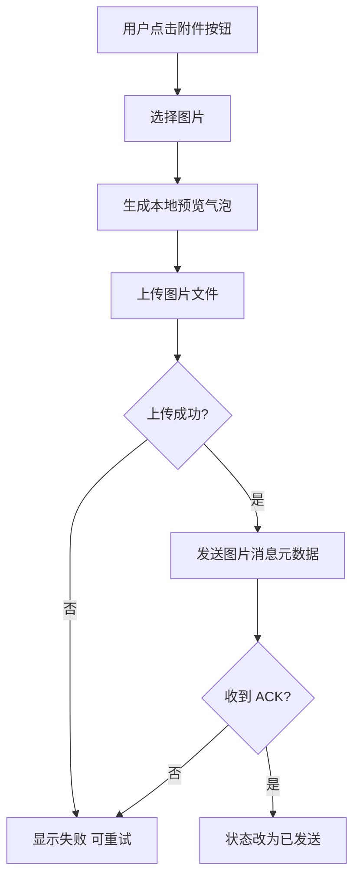
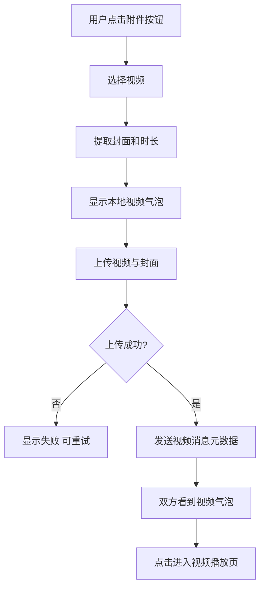
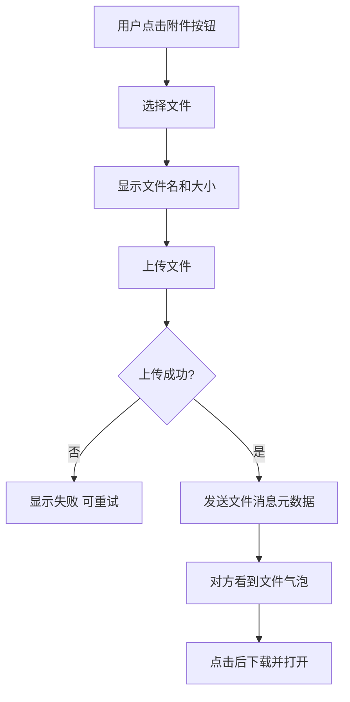
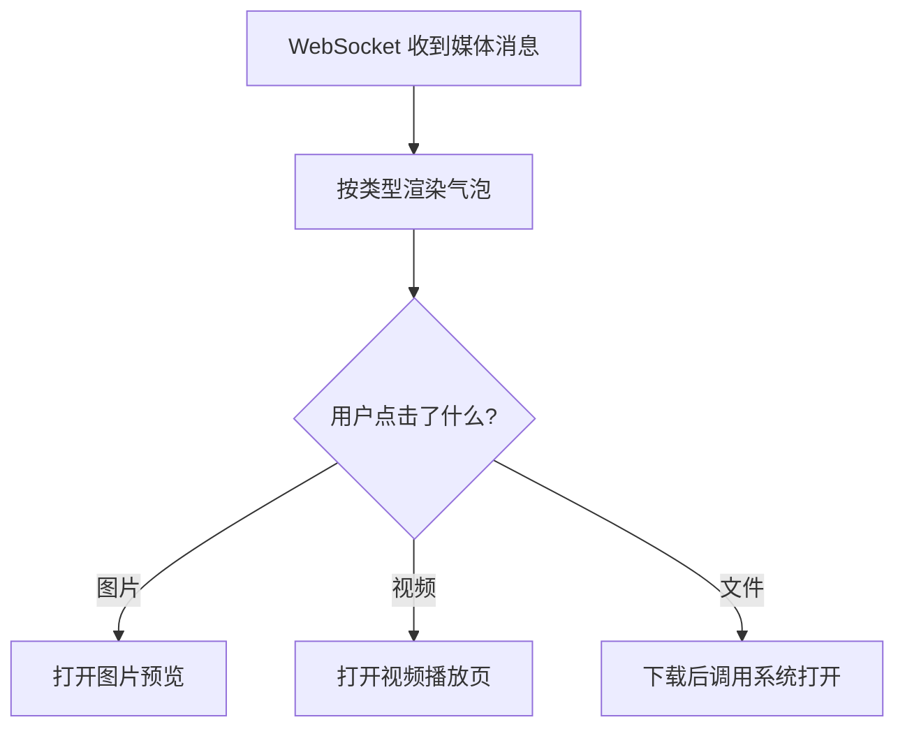
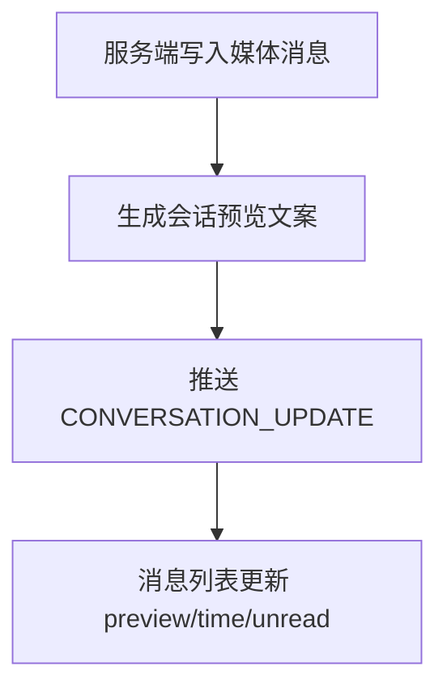

# IM Core v0.0.4 Media 消息 — 功能分析

## 概述

v0.0.4_media 的目标，是在现有 v0.0.3 文本消息闭环之上，补齐 **图片、视频、文件消息** 的最小可用产品链路：选择本地资源、上传媒体文件、发送消息元数据、会话实时收发、历史回放、会话列表预览，以及点击后的预览/打开行为。

这不是一个单纯的 UI 扩展。当前正式 IM 链路里，消息体通过 WebSocket `CHAT_MESSAGE` 帧发送，服务端把消息持久化到 `messages` 表，并通过 `CONVERSATION_UPDATE` 同步会话列表；但当前实现只允许 `type=0` 的文本消息，且聊天页、历史消息模型、输入区都按“纯文本 content”来渲染。因此 v0.0.4_media 必须同时覆盖：

- 客户端选择器与发送态
- 媒体文件上传与下载
- 消息元数据结构
- 服务端消息类型扩展与预览文案生成
- 聊天气泡与点击行为
- 历史消息回放的一致性

### 当前已确认边界

基于当前仓库代码，以下事实已经确认：

- `client/modules/flash_im_chat/lib/src/view/chat_input.dart` 只有文本输入框和“发送”按钮，没有附件入口。
- `client/modules/flash_im_chat/lib/src/view/message_bubble.dart` 只会把 `message.content` 当纯文本渲染。
- `client/modules/flash_im_chat/lib/src/data/message.dart` 目前消息模型没有图片、视频、文件的专用字段。
- `client/modules/flash_im_chat/lib/src/logic/chat_cubit.dart` 目前只暴露 `sendText`，本地状态只有 `sending / sent / failed`。
- `server/modules/im-message/src/service.rs` 明确拒绝 `msg_type != 0`，即当前正式服务端只支持文本消息。
- `server/migrations/20260708000100_im_messages.sql` 已经有 `type SMALLINT` 和 `extra JSONB`，说明数据表为富媒体预留了扩展位，但运行时逻辑尚未启用。
- `proto/message.proto` 已经有 `type`、`extra`、`client_id` 字段，可承载媒体消息元数据，但当前客户端/服务端没有定义统一的 `extra` 结构。
- 当前仓库里没有正式媒体上传接口，也没有现成的 `image_picker` / `file_picker` / `video_player` / `open_file` 这一类依赖。

### 需求假设

- v0.0.4_media 仍然只覆盖 **单聊**，不扩展到群聊特有能力。
- 每条消息只承载 **一个媒体对象**，不做多图合并发送。
- 正式消息内容仍然以“数据库为权威事实源，WebSocket 只做实时通知”为原则，不把二进制文件直接塞进 WebSocket 帧。
- 媒体文件先走 **HTTP 上传**，上传成功后再走 `CHAT_MESSAGE` 发送消息元数据。
- 文件存储可以先落到本地磁盘或对象存储抽象层，但对消息模块暴露的必须是稳定的 `media_id + download_url/thumbnail_url` 契约，而不是让聊天模块关心磁盘路径。

### 暂不实现

- 语音消息
- 多图选择与批量发送
- 断点续传、秒传、云端转码队列
- 媒体消息撤回、引用、转发、收藏
- 本地下载缓存管理页
- 端到端加密

## 一、交互链

### 场景 1：发送图片消息

**用户故事**：作为聊天用户，我想从相册或文件里选一张图片发送出去，以便快速分享截图、照片或设计稿。

用户进入聊天页后，点击输入区左侧的附件入口，选择“图片”。系统打开图片选择器，用户选定一张图片后先看到本地预览气泡和上传中状态。上传成功后，客户端再发送正式消息；服务端确认后，该图片消息变成已发送，对方实时收到缩略图气泡。若上传失败或发送超时，气泡显示失败态，用户可点击重试。

### 场景 2：发送视频消息

**用户故事**：作为聊天用户，我想发送一段短视频，以便传达画面和声音信息。

用户点击附件入口后选择“视频”。系统打开视频选择器，用户选定后先看到视频封面、时长和上传进度。上传成功后，客户端发送视频消息元数据；接收方聊天页显示视频封面和播放标记。用户点击后进入视频预览页播放。

### 场景 3：发送文件消息

**用户故事**：作为聊天用户，我想发送 PDF、压缩包或文档文件，以便共享正式资料。

用户点击附件入口后选择“文件”。系统打开文件选择器，用户选中文件后看到文件名、大小和扩展名组成的本地文件气泡。文件上传完成后，客户端发送文件消息元数据；接收方点击文件气泡时，系统先下载，再交给系统能力打开。

### 场景 4：接收媒体消息并查看

**用户故事**：作为接收方，我想在会话中识别不同媒体类型，并能直接查看图片、播放视频或打开文件。

用户停留在聊天页时，收到新的媒体消息后，页面根据消息类型展示不同气泡。图片显示缩略图；视频显示封面、时长和播放标记；文件显示图标、文件名、大小和扩展名。点击图片进入大图预览，点击视频进入播放页，点击文件触发下载并调用系统打开。

### 场景 5：会话列表显示媒体预览

**用户故事**：作为消息列表用户，我想在列表里一眼知道最后一条消息是图片、视频还是文件，以便快速判断会话内容。

当会话最后一条消息是媒体消息时，会话列表不直接展示原始 URL 或 JSON，而是展示规范化预览文案，例如 `[图片]`、`[视频]`、`[文件] 产品方案.pdf`。未读数、排序时间和实时联动行为与文本消息保持一致。

## 二、逻辑树

### 事件流：发送图片/视频/文件消息

| 时刻 | 事件 | 处理 | 产生的新事件 |
| --- | --- | --- | --- |
| T1 | 用户点击附件入口 | `ChatInput` 打开附件面板 | 用户选择图片/视频/文件 |
| T2 | 用户选定本地资源 | 客户端读取本地路径、文件名、大小、mime_type | 创建本地媒体发送任务 |
| T3 | 媒体预处理 | 图片读宽高；视频提取封面、宽高、时长；文件读扩展名 | 本地预览气泡上屏 |
| T4 | 客户端发起 HTTP 上传 | 上传原始文件，必要时视频封面单独上传 | 服务端返回媒体元数据 |
| T5 | 上传成功 | 客户端得到 `media_id`、`download_url`、`thumbnail_url` 等 | 组装 `SendMessageRequest(type, content, extra, client_id)` |
| T6 | 客户端发送 `CHAT_MESSAGE` | 仍走现有 `WsClient.sendChatMessage` | 服务端 `im-ws/dispatcher.rs` 处理 |
| T7 | 服务端校验 | 校验会话成员、消息类型、媒体元数据结构、媒体资源可引用性 | 调用 `MessageService.send` |
| T8 | 服务端持久化 | 写入 `messages(type!=0, content, extra)`，更新摘要和未读 | 推送 `MESSAGE_ACK`、`CHAT_MESSAGE`、`CONVERSATION_UPDATE` |
| T9 | 客户端收到 ACK | 本地 pending 媒体消息从发送中变为已发送 | UI 状态更新 |

### 事件流：接收媒体消息

| 时刻 | 事件 | 处理 | 产生的新事件 |
| --- | --- | --- | --- |
| T1 | 服务端广播 `CHAT_MESSAGE` | 带上 `type`、`content`、`extra`、发送者信息 | 接收方 `WsClient.chatMessageStream` 收到事件 |
| T2 | `ChatCubit` 收到消息 | 过滤非当前会话、自己发送、重复消息 | 转换为本地 `Message` |
| T3 | 客户端解析媒体元数据 | 从 `extra` 解析缩略图、文件名、大小、时长等 | 渲染对应气泡 |
| T4 | 用户点击媒体气泡 | 按类型分发到图片预览、视频播放、文件下载打开 | 新页面或系统打开流程 |

### 事件流：媒体文件下载与打开

| 时刻 | 事件 | 处理 | 产生的新事件 |
| --- | --- | --- | --- |
| T1 | 用户点击文件消息 | 客户端检查本地是否已缓存 | 若未缓存则发起下载 |
| T2 | HTTP 下载完成 | 保存到应用可访问路径 | 调用系统打开能力 |
| T3 | 打开失败 | 系统无匹配应用或路径失效 | 提示“文件无法打开” |
| T4 | 下载失败 | 网络错误、URL 失效、权限问题 | 保持消息气泡不变，允许重试 |

### 事件流：会话预览生成

| 时刻 | 事件 | 处理 | 产生的新事件 |
| --- | --- | --- | --- |
| T1 | 服务端写入媒体消息 | `MessageService.send` 根据消息类型生成摘要文案 | 更新 `conversations.last_message_preview` |
| T2 | 服务端推送会话更新 | 构造 `ConversationUpdate(last_message_preview, unread_count, total_unread)` | 消息列表实时联动 |
| T3 | 客户端收到会话更新 | 沿用现有 `ConversationListCubit` 更新会话行 | 用户看到 `[图片]` / `[视频]` / `[文件] xxx` |

### 状态流转

| 实体 | 触发事件 | 前状态 | 后状态 |
| --- | --- | --- | --- |
| 本地媒体发送任务 | 用户选中文件 | 不存在 | `preparing` |
| 本地媒体发送任务 | 开始上传 | `preparing` | `uploading(progress)` |
| 本地媒体发送任务 | 上传成功并开始发消息 | `uploading` | `sending` |
| 本地媒体发送任务 | 收到 `MESSAGE_ACK` | `sending` | `sent` |
| 本地媒体发送任务 | 上传失败 | `uploading` | `failed(upload)` |
| 本地媒体发送任务 | ACK 超时 | `sending` | `failed(send)` |
| 服务端消息记录 | 收到合法媒体消息 | 不存在 | `messages.type=1/3/4`，`extra` 写入媒体元数据 |
| 会话摘要 | 媒体消息入库成功 | 旧 preview | 新 preview，例如 `[图片]` |
| 文件下载任务 | 用户点击文件气泡 | `idle` | `downloading` |
| 文件下载任务 | 下载成功 | `downloading` | `ready_to_open` |
| 文件下载任务 | 下载失败 | `downloading` | `failed(download)` |

### 异常流与回退

| 异常 | 触发条件 | 用户反馈 | 系统回退 |
| --- | --- | --- | --- |
| 未选择资源 | 用户取消系统选择器 | 无新消息出现 | 结束当前流程 |
| 本地文件不存在 | 选择后文件路径失效 | 提示“文件不可用” | 不创建发送消息 |
| 不支持的文件类型 | mime 或扩展名不在白名单 | 提示“不支持该类型” | 不上传 |
| 文件过大 | 超过图片/视频/文件大小限制 | 提示“文件过大” | 不上传 |
| 权限拒绝 | 系统相册/文件访问权限被拒绝 | 提示并引导重试 | 不进入上传 |
| 上传失败 | 网络失败、服务端返回 4xx/5xx | 气泡显示失败态 | 允许用户点击重试上传 |
| 上传成功但消息发送失败 | WebSocket 断开、ACK 超时 | 气泡显示失败态 | 可复用已上传媒体，重试发送元数据 |
| 媒体元数据非法 | `extra` 缺字段或 JSON 结构错误 | 发送方失败，接收方忽略渲染 | 服务端拒绝入库 |
| 缩略图缺失 | 视频封面生成失败 | 展示默认占位 | 不阻塞正式发送 |
| 下载失败 | 文件 URL 失效或网络异常 | 提示“下载失败” | 保留消息，允许重试 |
| 系统无法打开文件 | 无对应 App 或打开器失败 | 提示“文件无法打开” | 下载文件保留本地 |

## 三、功能编号与网络定位

### 本次新增节点

| 编号 | 功能节点 | 层级 | 简介 |
| --- | --- | --- | --- |
| I-3 | 媒体上传接口与存储抽象 | 基础设施 | 新增 HTTP 上传入口，返回稳定媒体标识与访问元数据。 |
| I-4 | 媒体下载与本地落盘能力 | 基础设施 | 提供文件下载、缓存路径和系统打开前的本地文件准备。 |
| D-6 | 媒体消息元数据规范 | 领域 | 统一图片、视频、文件消息在 `extra` 中的 JSON 结构。 |
| D-7 | 媒体消息类型校验 | 领域 | 服务端允许 `type=1/3/4`，并校验每种类型的必要字段。 |
| D-8 | 媒体会话摘要生成 | 领域 | 服务端按消息类型生成 `[图片]`、`[视频]`、`[文件] 文件名` 预览文案。 |
| F-4 | 客户端媒体选择器适配层 | 前端基础 | 接入图片、视频、文件选择能力，屏蔽平台差异。 |
| F-5 | 客户端媒体消息模型 | 前端基础 | `Message` 从纯文本模型扩展为可表达图片、视频、文件及其本地/远端元数据。 |
| F-6 | 客户端媒体渲染组件 | 前端基础 | 图片缩略图气泡、视频封面气泡、文件卡片气泡。 |
| F-7 | 客户端上传任务状态机 | 前端基础 | 处理 preparing/uploading/sending/sent/failed 的状态与重试。 |
| P-7 | 图片消息发送与预览 | 前端业务 | 选择图片、上传、发送、缩略图展示、点击大图查看。 |
| P-8 | 视频消息发送与播放 | 前端业务 | 选择视频、封面预处理、上传、发送、点击播放。 |
| P-9 | 文件消息发送与打开 | 前端业务 | 选择文件、上传、发送、下载、系统打开。 |
| P-10 | 媒体消息历史回放 | 前端业务 | 历史接口返回媒体消息时，聊天页能按类型恢复显示。 |
| P-11 | 媒体消息会话列表联动 | 前端业务 | 列表预览和未读同步继续通过 `CONVERSATION_UPDATE` 工作。 |

### 前置依赖

| 依赖节点 | 依赖方式 | 是否已有 |
| --- | --- | --- |
| `WsClient.sendChatMessage` | 发送正式消息元数据 | 是 |
| `messages.type` / `messages.extra` | 持久化媒体消息 | 部分已有，运行时未启用 |
| `GET /conversations/{id}/messages` | 历史回放媒体消息 | 是，但当前客户端只按文本解析 |
| `ConversationUpdate` | 会话列表实时联动 | 是 |
| 媒体上传 HTTP API | 上传原始文件，换取媒体元数据 | 否 |
| 媒体下载 HTTP 能力 | 下载文件或获取稳定直链 | 否 |
| 图片/视频/文件选择器 | 选本地资源 | 否 |
| 图片预览/视频播放/文件打开 | 点击媒体消息后的查看能力 | 否 |

### 边界接口

| 接口/协议/数据结构 | 定义方 | 消费方 | 敏感度 |
| --- | --- | --- | --- |
| `POST /media/upload`（建议） | 服务端媒体模块 | 客户端聊天模块 | 高 |
| `SendMessageRequest.type` | `proto/message.proto` | 客户端/服务端 WS 链路 | 高 |
| `SendMessageRequest.extra` 媒体 JSON 结构 | IM 消息领域 | 客户端发送、服务端校验、客户端渲染 | 高 |
| `ChatMessage.extra` 媒体 JSON 结构 | 服务端广播 | 客户端聊天页 | 高 |
| `GET /conversations/{id}/messages` 返回的 `extra` | 服务端历史接口 | 客户端历史回放 | 高 |
| `last_message_preview` 生成规则 | 服务端消息服务 | 会话列表 | 中 |
| 下载 URL / 缩略图 URL / 媒体 ID | 服务端媒体模块 | 客户端预览与下载 | 高 |

## 四、结论

- **开发顺序建议**
  1. 先定义媒体消息契约：`type` 取值、`extra` JSON 结构、会话摘要规则。
  2. 再补服务端媒体上传接口和下载访问路径。
  3. 然后放开 `im-message` 对 `type=1/3/4` 的校验，并补历史/广播一致性。
  4. 最后做客户端输入区、上传态、媒体气泡、点击预览/打开。

- **复杂度集中的地方**
  - 上传成功但消息发送失败时，如何复用已上传媒体而不是重复上传。
  - `extra` JSON 结构一旦散乱，历史消息、实时消息和列表预览会很快失配。
  - 视频消息比图片/文件多一个封面、时长和播放页链路，复杂度明显更高。
  - 文件消息需要处理“能下载但不能打开”的系统边界。

- **建议的媒体元数据方向**
  - 图片：`content="[图片]"`，`extra` 包含 `media_id / download_url / thumbnail_url / width / height / size_bytes / mime_type`
  - 视频：`content="[视频]"`，`extra` 包含 `media_id / download_url / thumbnail_url / width / height / duration_ms / size_bytes / mime_type / file_name`
  - 文件：`content="[文件] xxx.pdf"`，`extra` 包含 `media_id / download_url / file_name / file_ext / size_bytes / mime_type`

- **暂不实现的部分及理由**
  - 不做多图、转发、撤回、断点续传，因为这些都会显著放大状态机复杂度，超出 v0.0.4 的“先把三类媒体消息跑通”目标。
  - 不把二进制直接走 WebSocket，因为当前正式 IM 的可靠性设计是“数据库与 HTTP 存储为事实源，WebSocket 只负责消息事件”。

- **建议下一步**
  - 基于本分析继续拆 `design.md`，优先把服务端媒体契约与客户端消息模型定下来，再生成 `tasks.md`。
