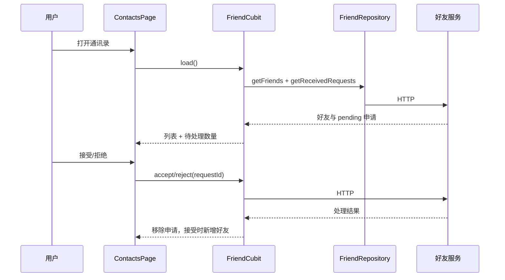
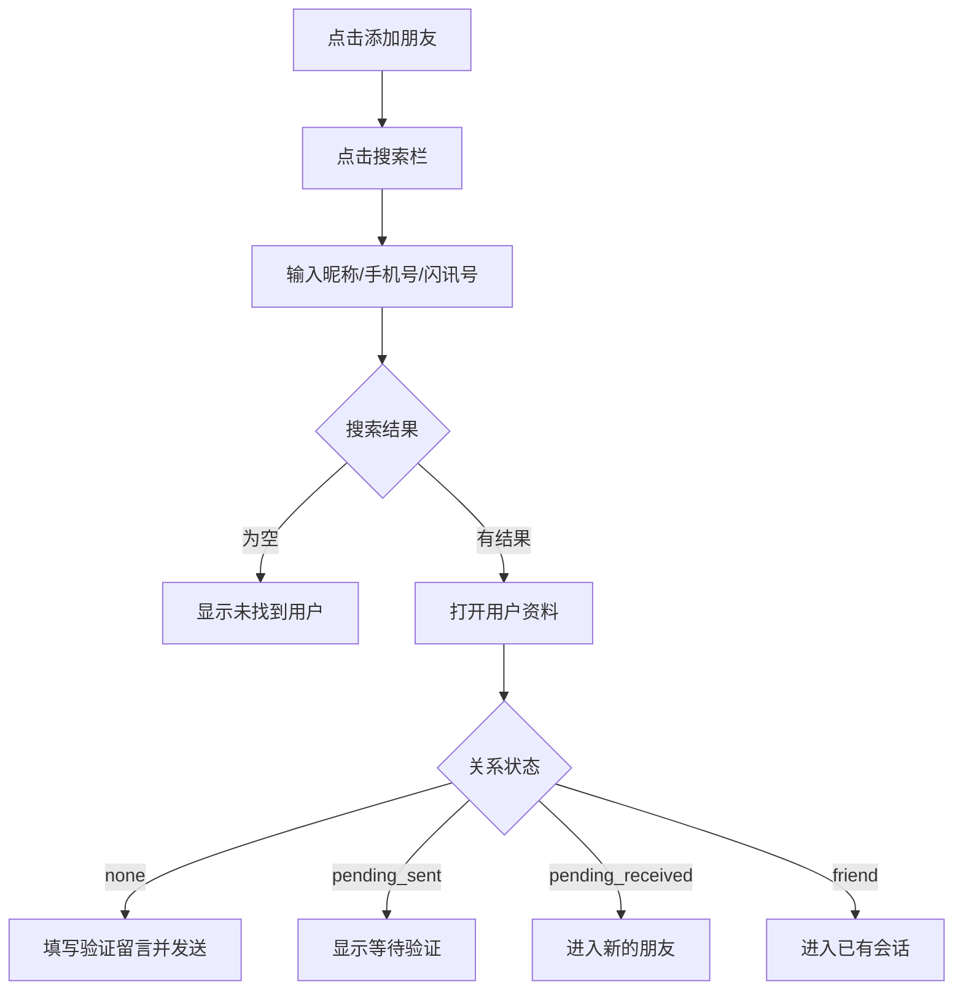

# 好友关系 v0.0.1 — 客户端设计报告

> 关联需求：[好友关系功能分析](../analysis.md)；服务端契约：[服务端设计](../server/design.md)。

## 1. 目标

- 新建独立 Flutter 包 `flash_im_friend`，承载好友数据、状态与页面。
- 将宿主“通讯录”占位页替换为好友列表页，并显示待处理申请数量。
- 实现“新的朋友”：拉取收到的申请并支持接受、拒绝。
- 实现“添加朋友”：按昵称、手机号或闪讯号搜索用户，查看资料并发送验证申请。
- 实现好友资料页：发消息、删除好友；删除前二次确认。
- 扩展 `WsClient` 的好友事件流，使申请、接受与删除能够实时刷新客户端状态。
- 视觉层级参考微信截图，沿用 Flash IM 现有主题、导航、头像组件和错误反馈方式。

## 2. 现状分析

- 服务端 v0.0.1 已提供好友列表、申请处理、用户搜索、资料查询、删除好友及三类好友 WS 事件。
- 宿主已有“通讯录”底部导航，但内容仍是 `ContactsPlaceholderPage`。
- `flash_im_core` 已有 `FRIEND_REQUEST`、`FRIEND_ACCEPTED`、`FRIEND_REMOVED` 枚举值，但尚未生成 `friend.proto` Dart 类型，也未分发对应强类型 Stream。
- 接受好友时服务端会创建或复用私聊会话；当前没有单独的客户端“创建私聊”HTTP 接口，因此好友资料页的“发消息”通过既有会话列表定位该好友会话。
- `flash_shared` 已提供支持网络头像与 identicon 的 `AvatarWidget`，客户端无需新增头像实现。

## 3. 数据模型与接口

### 数据模型

| 模型/状态 | 关键字段 | 用途 |
| --- | --- | --- |
| `FriendUser` | accountId, nickname, avatar, signature, flashId, relationStatus | 好友列表、搜索结果和资料页统一用户模型 |
| `FriendRequest` | id, fromUser, message, status, createdAt | “新的朋友”列表项与处理状态 |
| `FriendAcceptResult` | requestId, friend, conversationId | 接受成功后同步好友列表及会话入口 |
| `FriendState` | friends, receivedRequests, searchResults, loading/action flags, error | 页面共享的好友业务状态 |

`relationStatus` 取值与交互：

| 值 | 页面动作 |
| --- | --- |
| `none` | 显示“添加到通讯录” |
| `pending_sent` | 显示“等待验证”，不可重复发送 |
| `pending_received` | 引导到“新的朋友”处理 |
| `friend` | 显示“发消息”和“删除好友” |

### 接口契约

| 方法 | 路径 | 客户端用途 |
| --- | --- | --- |
| `GET` | `/api/friends` | 拉取好友列表 |
| `GET` | `/api/friends/requests/received?status=pending` | 拉取待处理申请 |
| `POST` | `/api/friends/requests/{id}/accept` | 接受申请并获得会话 ID |
| `POST` | `/api/friends/requests/{id}/reject` | 拒绝申请 |
| `POST` | `/api/friends/requests` | 发送验证申请，body 为 `to_user_id`、`message` |
| `DELETE` | `/api/friends/{friend_user_id}` | 删除好友 |
| `GET` | `/api/users/search?q={keyword}&limit=30` | 搜索用户 |
| `GET` | `/api/users/{account_id}` | 拉取公开资料 |

错误处理规则：

- 优先展示服务端 JSON 的 `error` 文案；无法解析时退回中文通用提示。
- 搜索词为空时不发请求；发送验证留言最多 200 字。
- 列表首屏失败显示错误与重试，局部操作失败保留原列表并通过 `SnackBar` 提示。

### WS 事件

| 帧 | 强类型流 | 状态影响 |
| --- | --- | --- |
| `FRIEND_REQUEST` | `friendRequestStream` | 新增/覆盖 pending 申请，更新红点 |
| `FRIEND_ACCEPTED` | `friendAcceptedStream` | 新增好友，移除对应申请 |
| `FRIEND_REMOVED` | `friendRemovedStream` | 移除好友 |

## 4. 核心流程

### 通讯录与申请处理



### 搜索并发送申请



### 实时事件与失败回退

- WS 只作为实时增量；页面进入、下拉刷新和 WS 重连后仍以 HTTP 全量数据为准。
- 同一申请按 request ID 去重，同一好友按 account ID 去重。
- 处理请求时锁定当前行，避免重复点击；请求失败后恢复可操作状态。
- 发消息找不到对应会话时刷新会话列表一次；仍找不到则提示“会话尚未创建，请稍后重试”。

## 5. 项目结构与技术决策

### 项目结构

```text
client/modules/flash_im_friend/
├── lib/
│   ├── flash_im_friend.dart
│   └── src/
│       ├── data/                 # FriendUser、FriendRequest、HTTP Repository
│       ├── logic/                # FriendCubit 与不可变 FriendState
│       └── view/                 # 通讯录、申请、添加、搜索、资料、验证页面与复用组件
├── test/                         # 模型、Repository/Cubit、关键页面测试
└── pubspec.yaml

client/modules/flash_im_core/
└── lib/src/data/proto/           # 生成 friend.proto 并扩展 WsClient 分发

client/lib/
├── app/flash_im_app.dart         # 构建并注入 FriendRepository
└── features/home/...             # 创建 FriendCubit、替换通讯录占位页、聊天接线与红点
```

### 职责划分

- `flash_im_friend` 可依赖 `flash_im_core` 与 `flash_shared`，不能依赖宿主 `client/lib`。
- 包内负责好友业务和页面跳转；进入聊天通过 `ValueChanged<FriendUser>` 回调交给宿主。
- 宿主负责认证 Dio、Repository 注入、Cubit 生命周期及把好友映射到既有 `ChatPage`。
- `flash_im_core` 只负责协议解析与事件流，不依赖好友 UI 包。

### 技术决策

| 决策 | 方案 | 理由 |
| --- | --- | --- |
| 模块边界 | 新建 `flash_im_friend` 包 | 与现有 conversation/chat 模块一致，避免继续膨胀宿主页面 |
| 状态管理 | 单个 `FriendCubit` 维护列表、申请、搜索和操作状态 | 首版数据量与交互有限，可共享 WS 增量并避免多 Cubit 同步 |
| 实时与全量 | WS 增量 + HTTP 校准 | 离线期间 WS 会丢失，HTTP 是最终真相 |
| 页面视觉 | 微信式白色列表/灰色分组背景 + Flash IM 蓝色主色 | 保留参考图的信息密度，同时维持应用品牌一致性 |
| 发消息 | 从会话仓储定位服务端已创建的私聊 | 当前服务端没有客户端主动创建私聊接口，不扩张服务端范围 |

| 依赖 | 用途 | 已有/需新增 |
| --- | --- | --- |
| dio | 好友 HTTP API | 已有 |
| flutter_bloc / equatable | 好友状态 | 已有于其他模块，好友包新增声明 |
| flash_im_core | 好友 WS 强类型事件 | 已有，需扩展 |
| flash_shared | 头像渲染 | 已有 |

## 6. 暂不实现

| 功能 | 理由 |
| --- | --- |
| 手机通讯录、扫一扫、雷达、面对面建群、个人二维码 | 当前没有完整权限、扫描或服务端契约；不绘制空壳入口 |
| 群聊、标签、公众号、服务号、企业联系人 | 不属于好友 v0.0.1 服务端能力；不绘制空壳入口 |
| 好友备注、分组、黑名单 | 服务端数据模型未支持 |
| 已有好友内搜索与字母索引栏 | 首版好友量没有分页/索引契约，先按创建时间展示；后续可扩展 |
| 发出的申请历史与删除申请记录 UI | 首版聚焦“收到并处理”和“发送验证”闭环，服务端接口保留 |
| 客户端主动创建私聊 | 服务端仅在接受申请时创建会话，待新增明确接口后再接入 |
