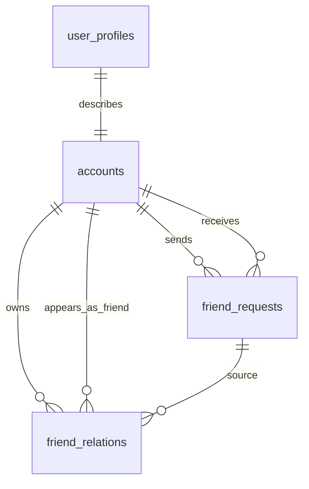
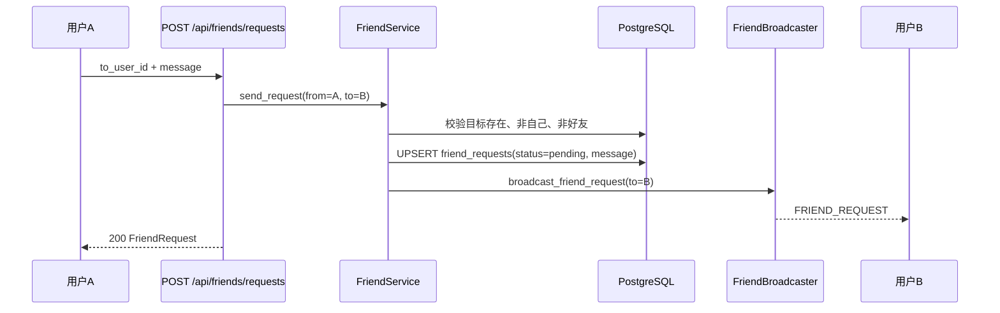
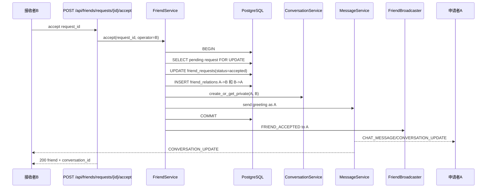
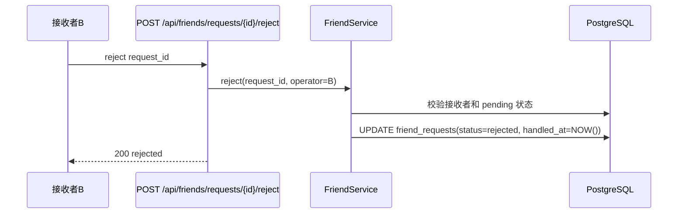
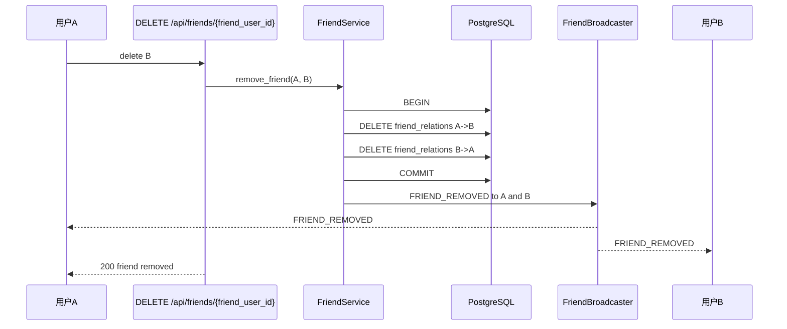
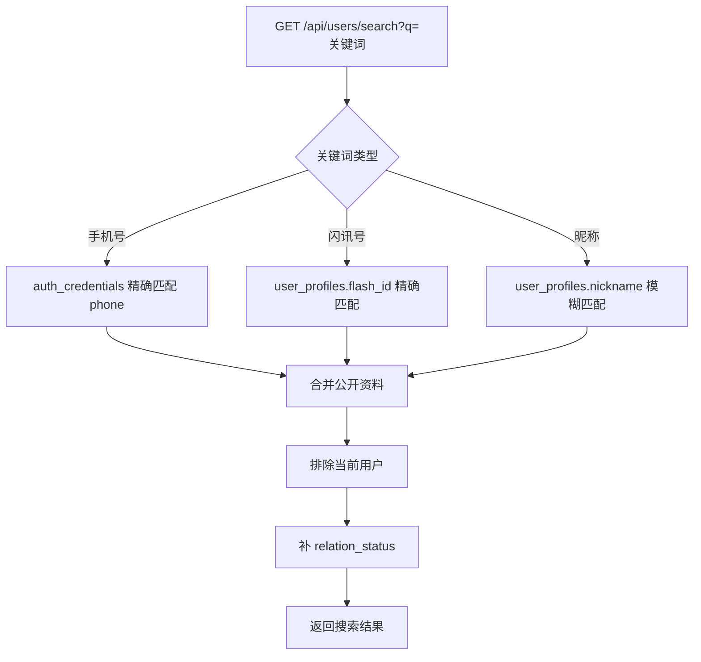

# 好友关系 v0.0.1 — 服务端设计报告

> 关联需求：[好友关系功能分析](../analysis.md)

## 1. 目标

- 新增好友申请能力：发送申请、查看收到/发出的申请、接受、拒绝、删除申请记录。
- 新增好友关系能力：双向好友关系建立、好友列表查询、解除好友关系。
- 新增用户发现能力：按昵称、手机号、闪讯号搜索用户，并查询用户公开资料。
- 扩展 WebSocket 协议：推送 FRIEND_REQUEST、FRIEND_ACCEPTED、FRIEND_REMOVED 三类好友事件。
- 接受好友申请后自动创建或复用私聊会话，并发送一条打招呼消息。
- 保持好友申请、好友关系、会话创建、首条消息写入在服务端事务边界内可恢复。

## 2. 现状分析

- 账号与用户资料已经存在：accounts、auth_credentials、user_profiles 可提供 account_id、手机号、昵称、头像、签名。
- im-ws 已有认证、在线用户状态、二进制 Protobuf 帧、CHAT_MESSAGE/MESSAGE_ACK/CONVERSATION_UPDATE 广播链路。
- im-conversation 已有会话列表、会话详情、已读、成员校验、未读数和会话预览更新能力，但缺少服务端公开的“创建或复用私聊会话”能力。
- im-message 已有消息写入、会话预览更新、未读数增加、消息广播能力，可复用为好友接受后的打招呼消息链路。
- 当前没有 friend_requests、friend_relations 表，也没有好友事件的 HTTP 路由、领域 crate、Protobuf 消息和 WS 推送方法。
- “闪讯号”没有独立存储字段；本版本需要在用户资料侧补一个可搜索、唯一、稳定的公开标识，避免把手机号作为唯一搜索入口。

## 3. 数据模型与接口

### 数据模型

#### 数据库表

```sql
-- 用户公开标识补充：用于“闪讯号”搜索和二维码跳转
ALTER TABLE user_profiles
ADD COLUMN flash_id VARCHAR(64);

CREATE UNIQUE INDEX idx_user_profiles_flash_id
    ON user_profiles(flash_id)
    WHERE flash_id IS NOT NULL;

CREATE INDEX idx_user_profiles_nickname
    ON user_profiles(nickname);

-- 好友申请
CREATE TABLE friend_requests (
    id UUID PRIMARY KEY DEFAULT gen_random_uuid(),
    from_user_id BIGINT NOT NULL REFERENCES accounts(id) ON DELETE CASCADE,
    to_user_id BIGINT NOT NULL REFERENCES accounts(id) ON DELETE CASCADE,
    message VARCHAR(200) NOT NULL DEFAULT '',
    status SMALLINT NOT NULL DEFAULT 0, -- 0:pending 1:accepted 2:rejected
    created_at TIMESTAMPTZ NOT NULL DEFAULT NOW(),
    updated_at TIMESTAMPTZ NOT NULL DEFAULT NOW(),
    handled_at TIMESTAMPTZ,
    from_deleted_at TIMESTAMPTZ,
    to_deleted_at TIMESTAMPTZ,
    UNIQUE (from_user_id, to_user_id),
    CHECK (from_user_id <> to_user_id)
);

CREATE INDEX idx_friend_requests_to_status
    ON friend_requests(to_user_id, status, updated_at DESC);

CREATE INDEX idx_friend_requests_from_status
    ON friend_requests(from_user_id, status, updated_at DESC);

-- 好友关系：一段关系写两行，方便按当前用户查询列表
CREATE TABLE friend_relations (
    user_id BIGINT NOT NULL REFERENCES accounts(id) ON DELETE CASCADE,
    friend_user_id BIGINT NOT NULL REFERENCES accounts(id) ON DELETE CASCADE,
    source_request_id UUID REFERENCES friend_requests(id) ON DELETE SET NULL,
    created_at TIMESTAMPTZ NOT NULL DEFAULT NOW(),
    PRIMARY KEY (user_id, friend_user_id),
    CHECK (user_id <> friend_user_id)
);

CREATE INDEX idx_friend_relations_friend_user
    ON friend_relations(friend_user_id);
```

#### ER 关系



#### 核心模型

| 模型 | 关键字段 | 说明 |
|------|----------|------|
| FriendRequest | id, from_user_id, to_user_id, message, status, created_at, handled_at, from_deleted_at, to_deleted_at | 好友申请与处理状态，以及双方视角的历史隐藏状态 |
| FriendRelation | user_id, friend_user_id, source_request_id, created_at | 单向查询行；业务语义上两行组成一段双向关系 |
| FriendUserProfile | account_id, nickname, avatar, signature, flash_id, relation_status | 搜索、资料页、好友列表共用的公开资料 |
| FriendEvent | type, request_id, actor, target, message, created_at | WS 好友事件载荷 |

| 决策 | 方案 | 理由 |
|------|------|------|
| 好友关系存储 | friend_relations 双向两行 | 查询“我的好友列表”只按 user_id 扫描，删除时事务内删除两行 |
| 重复申请 | `UNIQUE(from_user_id, to_user_id)` + pending upsert | 满足需求中的“重复申请覆盖留言”，避免制造多条待处理记录 |
| 反向申请 | 接受任一 pending 后建立好友关系，并将双方 pending 申请收敛为 accepted | 避免 A 请求 B、B 又请求 A 时出现双份待处理状态 |
| 闪讯号 | user_profiles.flash_id 唯一可空 | 贴近公开资料语义，不污染认证凭据；后续可扩展为用户自定义号 |
| 好友事件广播 | im-friend 定义 FriendBroadcaster trait，im-ws 实现 | 保持领域模块不直接依赖 WebSocket 实现，沿用 im-message 的解耦方式 |
| 接受后的首条消息 | 复用 im-message 的发送链路，消息类型为 TEXT | 自动获得消息存储、会话预览、未读数和 CONVERSATION_UPDATE 推送 |

### 接口契约

所有 `/api/friends` 和 `/api/users` 接口都需要 Bearer Token。错误响应沿用现有 AppError JSON 结构，至少包含 `error` 字段。

#### POST /api/friends/requests — 发送好友申请

请求：

```json
{
  "to_user_id": 10002,
  "message": "我是小雨"
}
```

响应 200：

```json
{
  "id": "00000000-0000-0000-0000-000000000001",
  "from_user_id": 10001,
  "to_user_id": 10002,
  "message": "我是小雨",
  "status": "pending",
  "created_at": "2026-07-20T09:00:00Z"
}
```

错误：

| 状态码 | 场景 |
|--------|------|
| 400 | 不能添加自己、message 超过 200 字 |
| 401 | 未认证 |
| 404 | 目标用户不存在 |
| 409 | 双方已经是好友 |

#### GET /api/friends/requests/received — 收到的申请

查询参数：

| 参数 | 类型 | 默认值 | 说明 |
|------|------|--------|------|
| status | string | pending | pending/accepted/rejected/all |
| limit | int | 50 | 最大 100 |
| offset | int | 0 | 分页偏移 |

响应 200：

```json
[
  {
    "id": "00000000-0000-0000-0000-000000000001",
    "from_user": {
      "account_id": 10001,
      "nickname": "小雨",
      "avatar": "identicon:10001",
      "signature": "",
      "flash_id": "flash_10001"
    },
    "message": "我是小雨",
    "status": "pending",
    "created_at": "2026-07-20T09:00:00Z"
  }
]
```

#### GET /api/friends/requests/sent — 发出的申请

响应结构与 received 一致，但用户字段为 `to_user`。

#### POST /api/friends/requests/{id}/accept — 接受申请

响应 200：

```json
{
  "request_id": "00000000-0000-0000-0000-000000000001",
  "friend": {
    "account_id": 10001,
    "nickname": "小雨",
    "avatar": "identicon:10001",
    "signature": "",
    "flash_id": "flash_10001"
  },
  "conversation_id": "00000000-0000-0000-0000-000000000010"
}
```

错误：

| 状态码 | 场景 |
|--------|------|
| 401 | 未认证 |
| 403 | 当前用户不是申请接收者 |
| 404 | 申请不存在 |
| 409 | 申请不是 pending 状态 |

#### POST /api/friends/requests/{id}/reject — 拒绝申请

响应 200：

```json
{
  "request_id": "00000000-0000-0000-0000-000000000001",
  "status": "rejected"
}
```

拒绝不向申请方推送 WS 通知。

#### DELETE /api/friends/requests/{id} — 删除申请记录

只删除当前用户视角中的历史记录：发起方更新 `from_deleted_at`，接收方更新 `to_deleted_at`。pending 申请不允许通过该接口隐藏，避免接收方还未处理时申请方把待处理状态抹掉。

响应 200：

```json
{
  "message": "friend request deleted"
}
```

#### GET /api/friends — 好友列表

响应 200：

```json
[
  {
    "account_id": 10002,
    "nickname": "阿江",
    "avatar": "identicon:10002",
    "signature": "",
    "flash_id": "flash_10002",
    "created_at": "2026-07-20T09:10:00Z"
  }
]
```

#### DELETE /api/friends/{friend_user_id} — 删除好友

响应 200：

```json
{
  "message": "friend removed"
}
```

错误：

| 状态码 | 场景 |
|--------|------|
| 401 | 未认证 |
| 404 | 好友关系不存在 |

#### GET /api/users/search — 搜索用户

查询参数：

| 参数 | 类型 | 必填 | 说明 |
|------|------|------|------|
| q | string | 是 | 昵称、手机号或闪讯号 |
| limit | int | 否 | 默认 20，最大 50 |

响应 200：

```json
[
  {
    "account_id": 10002,
    "nickname": "阿江",
    "avatar": "identicon:10002",
    "signature": "",
    "flash_id": "flash_10002",
    "relation_status": "none"
  }
]
```

搜索规则：

- 不返回当前登录用户。
- 手机号走精确匹配，flash_id 走精确匹配，昵称走模糊匹配。
- relation_status 返回 none/pending_sent/pending_received/friend，供客户端决定按钮文案。

#### GET /api/users/{account_id} — 用户公开资料

响应 200：

```json
{
  "account_id": 10002,
  "nickname": "阿江",
  "avatar": "identicon:10002",
  "signature": "",
  "flash_id": "flash_10002",
  "relation_status": "friend"
}
```

### WebSocket 契约

#### ws.proto 帧类型扩展

| type | 编号 | 方向 | 用途 |
|------|------|------|------|
| FRIEND_REQUEST | 7 | 服务端 → 客户端 | 收到好友申请 |
| FRIEND_ACCEPTED | 8 | 服务端 → 客户端 | 对方接受好友申请 |
| FRIEND_REMOVED | 9 | 服务端 → 客户端 | 好友关系被解除 |

#### friend.proto 消息结构

```protobuf
message FriendUser {
  int64 account_id = 1;
  string nickname = 2;
  string avatar = 3;
  string signature = 4;
  string flash_id = 5;
}

message FriendRequestEvent {
  string request_id = 1;
  FriendUser from_user = 2;
  string message = 3;
  string created_at = 4;
}

message FriendAcceptedEvent {
  string request_id = 1;
  FriendUser friend = 2;
  string conversation_id = 3;
  string accepted_at = 4;
}

message FriendRemovedEvent {
  FriendUser friend = 1;
  string removed_at = 2;
}
```

## 4. 核心流程

### 发送好友申请



边界规则：

- B 不在线时，WS 发送可丢失；B 下次进入申请页通过 HTTP 拉取 pending 列表。
- 重复申请只刷新 message、status、updated_at，不生成第二条申请。
- 已经是好友时返回 409，不允许重新发起申请。

### 接受好友申请



边界规则：

- 只有 to_user_id 才能接受申请。
- 申请状态必须是 pending；accepted/rejected 再次处理返回 409。
- 好友关系、私聊会话、打招呼消息必须在同一个业务提交窗口内保持一致；如果后续实现无法把 im-message 纳入同一数据库事务，必须保证失败后不会留下半段好友关系。
- 打招呼消息优先使用申请留言；留言为空时使用默认文案“我们已经是好友了”。

### 拒绝好友申请



拒绝不通知申请方，避免制造额外打扰；申请方只能在发出的申请列表里看到状态变化。

### 删除好友



会话和历史消息不删除；好友关系解除只影响通讯录和后续好友状态判断。

### 搜索用户与资料页



## 5. 项目结构与技术决策

### 项目结构

```text
server/modules/im-friend/              # 新增 crate：好友领域
├── Cargo.toml
└── src/
    ├── lib.rs                         # 模块入口，导出 router/service
    ├── models.rs                      # FriendRequest、FriendRelation、DTO、查询参数
    ├── repository.rs                  # friend_requests/friend_relations/user search SQL
    ├── service.rs                     # 申请、接受、拒绝、删除、列表、搜索业务规则
    ├── broadcast.rs                   # FriendBroadcaster trait + NoopBroadcaster
    └── routes.rs                      # /api/friends、/api/users/search、/api/users/{id}

server/modules/im-conversation/src/
    ├── service.rs                     # 扩展 create_or_get_private(A, B)
    └── repository.rs                  # 扩展私聊会话查找、创建、成员 upsert

server/modules/im-ws/src/
    ├── broadcaster.rs                 # 实现 FriendBroadcaster
    ├── frame.rs                       # 新增 friend event frame 编码
    └── dispatcher.rs                  # 忽略客户端发来的好友事件帧

proto/
    ├── ws.proto                       # 新增 FRIEND_REQUEST/ACCEPTED/REMOVED
    └── friend.proto                   # 新增好友事件消息

server/migrations/
    └── 20260720000100_im_friends.sql  # 新增好友申请、好友关系、flash_id

server/src/routes/mod.rs               # merge im-friend router
```

### 职责划分

| 层 | 职责 | 不能做的事 |
|----|------|------------|
| im-friend/routes.rs | 鉴权、参数绑定、响应 DTO | 不直接写 SQL，不直接操作 WS 在线状态 |
| im-friend/service.rs | 好友业务规则、事务边界、调用会话/消息能力 | 不编码 Protobuf 帧 |
| im-friend/repository.rs | SQL 查询与写入 | 不做跨领域业务编排 |
| im-friend/broadcast.rs | 定义好友事件广播抽象 | 不依赖 im-ws 具体类型 |
| im-ws/broadcaster.rs | 把好友事件转换为 Protobuf 帧并发送给在线用户 | 不判断好友业务是否合法 |
| im-conversation | 创建或复用私聊会话、维护成员关系 | 不感知好友申请状态 |
| im-message | 写入打招呼消息、更新会话预览和未读 | 不感知好友关系建立原因 |

### 技术决策

| 决策 | 方案 | 理由 |
|------|------|------|
| 新增模块 | `server/modules/im-friend` | 好友是独立领域，不应塞进 im-conversation 或 flash_user |
| API 前缀 | 使用 `/api/friends` 和 `/api/users/...` | 与需求和现有上传接口的 `/api` 风格一致 |
| 会话复用 | im-conversation 暴露 `create_or_get_private` | 接受好友与直接发消息都可能需要私聊会话，能力应归属会话领域 |
| 自动消息 | im-friend 调用 im-message service | 复用消息链路，避免手写 messages、unread、broadcast 多处逻辑 |
| WS 推送时机 | 数据提交成功后推送 | 避免客户端收到事件后 HTTP 拉取不到对应数据 |
| 删除好友 | 只删好友关系，不删会话 | 符合 IM 常见行为，也避免破坏历史消息和会话索引 |
| 申请记录删除 | 按用户视角软隐藏 | 不影响另一方的申请历史，也避免 pending 状态被物理删除 |
| 搜索关系态 | 服务端返回 relation_status | 客户端不需要并发拉多组接口，按钮状态一致性更好 |

### 第三方依赖

| 依赖 | 用途 | 已有/需新增 |
|------|------|-------------|
| flash-core | AppResult、AppError、SharedContext、JWT user_id 提取 | 已有 |
| axum | HTTP 路由 | 已有 |
| sqlx | PostgreSQL 查询、事务 | 已有 |
| serde / serde_json | DTO 序列化 | 已有 |
| chrono | 时间字段 | 已有 |
| uuid | request_id、conversation_id | 已有 |
| async-trait | FriendBroadcaster trait 异步方法 | 已有 |
| im-conversation | 创建或复用私聊会话 | 已有，需扩展 |
| im-message | 发送打招呼消息 | 已有 |
| im-ws | 好友事件 WS 推送 | 已有，需扩展 |

## 6. 暂不实现

| 功能 | 理由 |
|------|------|
| 好友备注 | 需要额外的单向好友元数据，不影响本版本主链路 |
| 好友分组 | 需要分组表和排序规则，先保持好友列表扁平 |
| 黑名单 | 会影响搜索、申请、消息发送、会话展示等多条规则，单独设计 |
| 好友数量限制 | 需要产品策略和服务端配额配置，本版本不预设 |
| 共同好友、可能认识的人 | 需要推荐逻辑和隐私边界，暂不进入基础好友链路 |
| 二维码生成与扫描解析 | 服务端只提供公开资料与 flash_id；扫码 UI 和相机权限属于客户端设计 |
| 删除好友后清空聊天记录 | 历史消息归属会话领域，删除关系不破坏已有会话数据 |
| 群聊好友邀请 | 群聊能力不在当前 friend v0.0.1 范围 |
