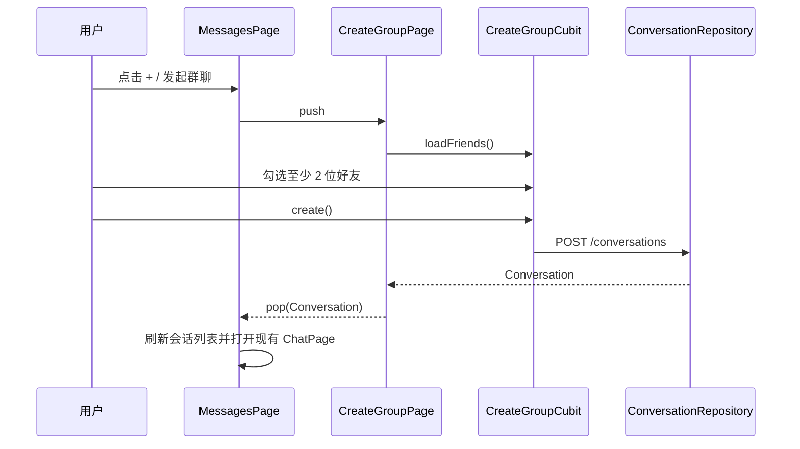
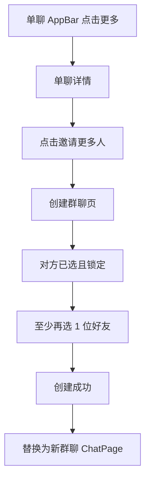
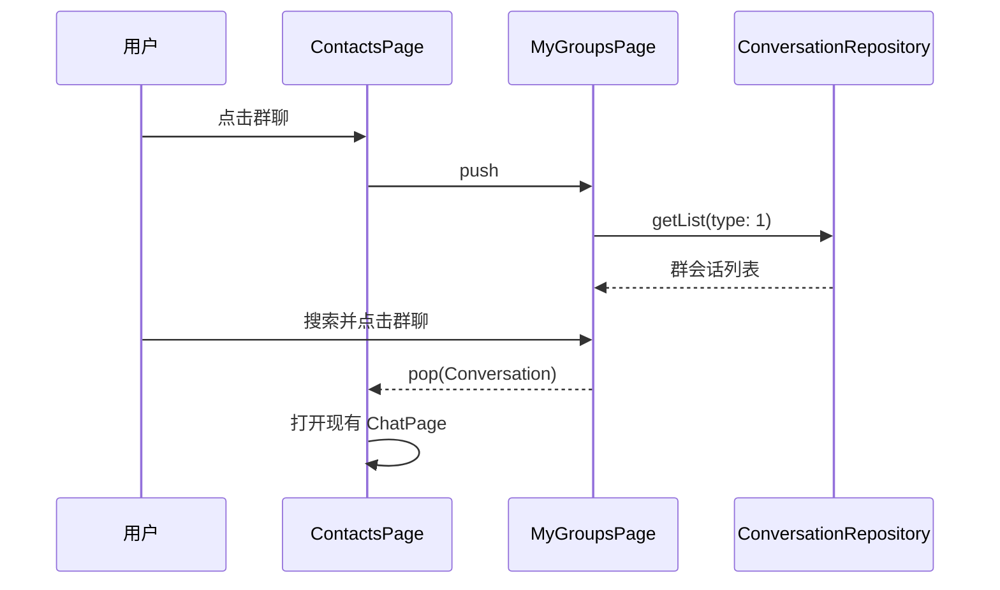

# 群聊 v0.0.1 — 客户端设计报告

> 关联需求：[群聊功能分析](../analysis.md)；服务端契约：[服务端设计](../server/design.md)。客户端仅在服务端创建、查询和 API 链路验证完成后开始编码。

## 1. 目标

- 在消息页提供“发起群聊”入口，从好友中选择至少 2 人创建群聊并进入现有 `ChatPage`。
- 在单聊页提供详情入口，从当前聊天对象开始选择至少 1 位其他好友，创建一个新群聊。
- 在通讯录提供“群聊”入口，查看、搜索并进入自己已加入的群聊。
- 扩展会话模型与头像组件，正确展示群名称和成员组合头像。
- 完全复用现有 `ChatCubit`、消息 Repository、WebSocket 和消息气泡，不新增群消息发送逻辑。

## 2. 现状分析

- `flash_im_conversation` 已有会话模型、Repository、列表 Cubit 与列表项，但 Repository 不支持 `type` 过滤和创建群聊，模型也没有群主/成员头像字段。
- `flash_im_friend` 已有好友 Repository、`FriendUser`、联系人字母分组工具和好友列表数据，可作为选人来源。
- `ChatPage` 已显示会话名称，`MessageBubble` 已展示他人头像与昵称，群聊消息 UI 无需分叉。
- `MainShellPage` 持有会话与好友 Cubit，负责从消息/通讯录打开聊天；新群聊页面应通过返回 `Conversation` 继续复用该入口。
- 当前聊天 AppBar 没有详情按钮，消息页也没有创建入口；通讯录只有“新的朋友”入口。

## 3. 数据模型与接口

### 核心模型

#### Conversation 扩展

```dart
class Conversation extends Equatable {
  final String id;
  final int type;
  final String? name;
  final String? avatar;
  final String? ownerId;
  final List<String> memberAvatars;
  // 现有 peer、preview、unread、time 字段保持不变
}
```

#### 创建群聊状态

```dart
class CreateGroupState extends Equatable {
  final List<FriendUser> friends;
  final Set<int> selectedIds;
  final Set<int> lockedIds;
  final String query;
  final bool isLoading;
  final bool isCreating;
  final String? errorMessage;
}
```

#### 我的群聊状态

```dart
sealed class GroupListState extends Equatable {}
// initial/loading/loaded(groups, query)/error
```

| 决策 | 方案 | 理由 |
| --- | --- | --- |
| 群业务包 | 新建 `flash_im_group`，依赖 friend/conversation/shared | 选人和群列表属于群业务，避免继续膨胀宿主或好友包 |
| API 所有权 | 扩展 `ConversationRepository` | 两个接口仍属于 `/conversations` 聚合，不重复创建 GroupRepository |
| 固定预选 | `lockedIds` 与 `selectedIds` 分离 | 单聊对象必须已选且不可取消，普通入口则全部可取消 |
| 创建结果 | 页面 `pop(Conversation)` | 宿主统一负责刷新列表和打开现有聊天页 |

### 接口依赖

| 方法 | 路径 | 客户端用途 |
| --- | --- | --- |
| `GET` | `/api/friends` | 创建页加载可选好友 |
| `POST` | `/conversations` | 创建群聊，body 为 type/name/member_ids |
| `GET` | `/conversations?type=1&limit=...&offset=...` | 我的群聊列表 |
| `GET` | `/conversations/{id}/messages` | 现有聊天历史，直接复用 |
| WebSocket | `CHAT_MESSAGE` / `MESSAGE_ACK` / `CONVERSATION_UPDATE` | 现有群消息收发，直接复用 |

错误与交互规则：

- 好友未加载成功时显示错误与重试，不允许提交。
- 普通入口选择少于 2 人、单聊入口总选择少于 2 人时禁用完成按钮。
- 创建期间锁定按钮；失败后保留搜索词和选择，展示服务端 `message` 或中文兜底。
- 群名从已选好友的 `displayName` 生成：不超过 3 人用顿号连接，超过 3 人取前三并追加“等”；提交前限制为最多 100 字。
- 我的群聊页对已加载群名做本地搜索，分页仍由服务端 `type=1` 查询保证完整性。

## 4. 核心流程

### 从消息页创建群聊



### 从单聊发起新群聊



### 查看我的群聊



## 5. 项目结构与技术决策

### 项目结构

```text
client/modules/flash_im_group/
├── lib/
│   ├── flash_im_group.dart
│   └── src/
│       ├── logic/
│       │   ├── create_group_cubit.dart
│       │   ├── create_group_state.dart
│       │   ├── group_list_cubit.dart
│       │   └── group_list_state.dart
│       └── view/
│           ├── create_group_page.dart
│           ├── my_groups_page.dart
│           ├── private_chat_details_page.dart
│           └── widgets/            # 已选头像、好友选择行、空态/错误态
├── test/
└── pubspec.yaml

client/modules/flash_im_conversation/
├── lib/src/data/                   # Conversation 字段、筛选与创建 API
└── lib/src/view/                   # 组合群头像与会话列表展示

client/modules/flash_im_chat/
└── lib/src/view/chat_page.dart     # 仅新增可选详情回调

client/lib/
├── app/app_router.dart             # 创建群、我的群聊、单聊详情路由接线
├── app/flash_im_app.dart           # 无新增 Repository，只接入 package
└── features/
    ├── home/presentation/main_shell_page.dart
    └── messages/presentation/messages_placeholder_page.dart
```

### 职责划分

- `flash_im_group` 负责选人状态、群列表状态和群业务页面，不依赖宿主 `client/lib`。
- `flash_im_conversation` 负责会话 DTO/API 与通用会话展示，不依赖群 UI 包。
- `flash_im_chat` 只暴露可选详情点击回调，继续只依赖会话与消息模块。
- 宿主负责路由、会话刷新、把创建/选择结果交给现有 `_openChat`。
- `flash_im_friend` 继续拥有好友数据；只公开必要的排序工具，不接收群创建职责。

### 技术决策

| 决策 | 方案 | 理由 |
| --- | --- | --- |
| 状态管理 | 两个 Cubit：创建群聊、我的群聊 | 选择/提交状态与列表/搜索状态生命周期不同，避免单状态类膨胀 |
| 页面拆分 | 大页面的选择行、已选头像和反馈态放 `widgets/` | 延续仓库对增长型 Flutter 页面按职责拆分的约定 |
| 群消息 | 复用 `ChatPage` 与 `ChatCubit` | 消息实体、气泡和 WS 已携带发送者信息，不增加 type 分支 |
| 群头像 | `GroupAvatar` 组合最多 4 个 `AvatarWidget` | 与服务端响应一致，网络/identicon 均沿用共享组件 |
| 导航 | typed arguments + 页面返回 `Conversation` | 保持 Material route 风格，不把宿主路由常量下沉到业务包 |

| 依赖 | 用途 | 已有/需新增 |
| --- | --- | --- |
| flutter_bloc / equatable | Cubit 与状态 | 已有版本，群包新增声明 |
| flash_im_friend | 好友模型与 Repository | 已有 |
| flash_im_conversation | 会话 API、模型与列表项 | 已有，需扩展 |
| flash_shared | 主题、头像、搜索视觉 | 已有 |

## 6. 暂不实现

| 功能 | 理由 |
| --- | --- |
| 向已有群继续加人、群成员管理 | 本版单聊“拉人”只创建新群 |
| 退群、解散、转让、群公告、群昵称、入群验证 | 服务端没有对应契约 |
| 自定义群名输入和群头像上传 | 首版自动群名与成员组合头像足够完成闭环 |
| 群聊专属消息模型、Cubit、气泡或 WS 帧 | 与“消息收发完全复用已有链路”冲突 |
| 创建成功后的系统消息 | 协议没有系统消息类型，服务端也不发送 |
| 群创建邀请实时事件 | 本版依赖列表刷新与现有首条消息更新链路 |
