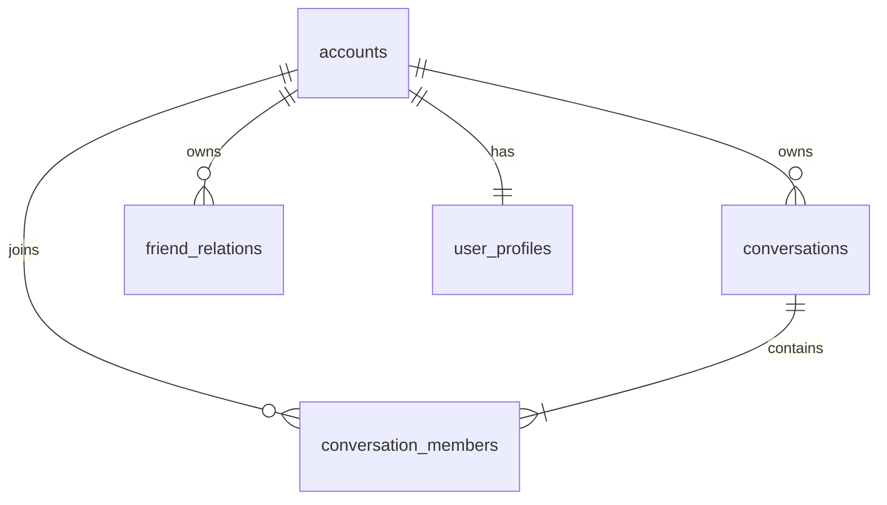
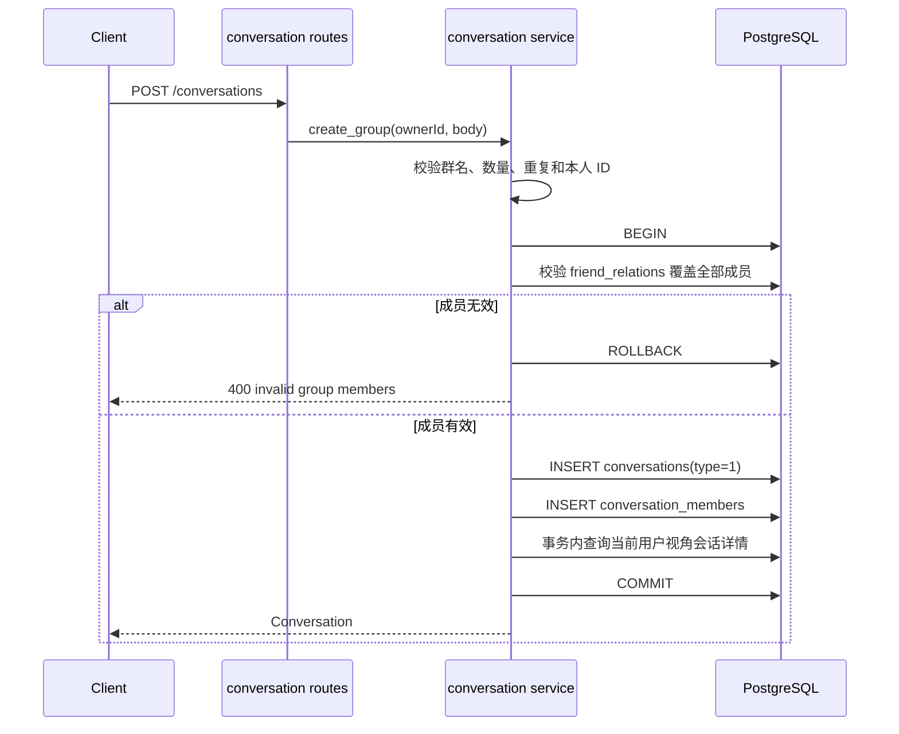
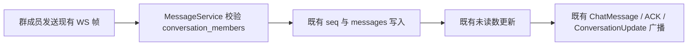

# 群聊 v0.0.1 — 服务端设计报告

> 关联需求：[群聊功能分析](../analysis.md)。本版本按“后端优先”交付，服务端验证通过后再接入客户端。

## 1. 目标

- 扩展 `POST /conversations`，支持登录用户从好友中选择 2～199 人创建总人数不超过 200 的群聊。
- 在单次数据库事务中写入群会话和全部成员，确保创建结果原子可见。
- 扩展 `GET /conversations` 的 `type` 过滤，使用户只查询自己仍有效加入的群聊。
- 扩展会话响应，返回群主标识和最多 4 个群成员头像，供客户端绘制组合头像。
- 保持现有消息发送、历史、ACK、未读数和 WebSocket 广播实现不变，并用既有链路验证群成员消息收发。

## 2. 现状分析

- `conversations` 已有 `type`、`name`、`avatar`、`owner_id`，其中 `type=0` 表示私聊，`type=1` 可直接表示群聊；本版本不需要数据库迁移。
- `conversation_members` 已支持任意数量成员，`MessageService` 通过成员表校验发送者、增加其他成员未读并广播，因此消息主链天然支持群聊。
- `GET /conversations` 和 `GET /conversations/{id}` 当前只返回私聊对端字段，缺少 `owner_id`、群头像成员数据和类型过滤。
- `im-conversation` 仅注册 GET/已读路由，尚未提供创建群聊的 POST 入口。
- 好友关系保存在 `friend_relations`，创建群聊时必须以服务端数据重新校验，不能只信任客户端选人结果。
- 现有消息类型只有文本、图片、视频和文件，没有系统消息类型；本版本不通过伪造普通消息实现“创建了群聊”提示。

## 3. 数据模型与接口

### 数据模型

本版本复用现有表，不新增迁移：

```sql
-- 群会话
INSERT INTO conversations (type, name, owner_id)
VALUES (1, $1, $2)
RETURNING id;

-- 成员包含群主和全部受邀好友
INSERT INTO conversation_members (conversation_id, user_id, is_deleted)
SELECT $1, member_id, FALSE
FROM UNNEST($2::BIGINT[]) AS member_id;
```



#### 会话响应扩展

| 字段 | 类型 | 私聊 | 群聊 |
| --- | --- | --- | --- |
| `owner_id` | string/null | null | 群主账号 ID |
| `avatar` | string/null | 预留 | 自定义群头像，当前为空 |
| `member_avatars` | string[] | 空数组 | 按入群顺序最多返回 4 个有效成员头像 |

| 决策 | 方案 | 理由 |
| --- | --- | --- |
| 表结构 | 复用 `conversations` 与 `conversation_members` | 当前结构已能表达群聊，新增 `group_info` 会制造未使用的数据模型 |
| 群头像 | 查询时返回最多 4 个成员头像，由客户端组合绘制 | 头像随成员资料更新，不引入无法被现有 `AvatarWidget` 识别的 `grid:` 私有字符串 |
| 成员权限 | 所有受邀 ID 必须是群主当前好友 | 服务端守住“从好友中选人”边界，阻止伪造任意用户 ID |
| 创建原子性 | 好友校验、会话写入、成员写入在同一事务内完成 | 任一步失败都不留下半成品群聊 |

### 接口契约

#### POST /conversations — 创建群聊

请求：

```json
{
  "type": "group",
  "name": "小雨、朱红",
  "member_ids": [10002, 10003]
}
```

规则：

- `name.trim()` 长度为 1～100 个字符。
- `member_ids` 不包含当前用户，必须无重复，数量为 2～199。
- 每个成员都必须存在于当前用户的有效好友关系中。
- 服务端自动把当前用户加入成员列表并写为 `owner_id`。

响应 200：

```json
{
  "id": "00000000-0000-0000-0000-000000000101",
  "type": 1,
  "name": "小雨、朱红",
  "avatar": null,
  "owner_id": "10001",
  "member_avatars": ["identicon:10001", "identicon:10002", "identicon:10003"],
  "peer_user_id": null,
  "peer_nickname": null,
  "peer_avatar": null,
  "last_message_at": null,
  "last_message_preview": null,
  "unread_count": 0,
  "created_at": "2026-08-14T12:00:00Z"
}
```

#### GET /conversations?type=1 — 查询我的群聊

- `type` 可省略；省略时保持现有全部会话列表行为。
- `type=0` 只返回私聊，`type=1` 只返回群聊；其他值返回 400。
- `limit`/`offset` 规则保持不变，列表仍按最后消息时间、创建时间倒序。
- 只返回当前用户 `conversation_members.is_deleted=false` 的会话。

#### GET /conversations/{id} — 查询会话详情

响应结构同步增加 `avatar`、`owner_id`、`member_avatars`，且仍只允许有效成员查询。

#### 错误响应

| 状态码 | 场景 |
| --- | --- |
| 400 | type 非 group、群名非法、成员不足/超限、包含自己、重复成员、成员不存在或不是好友、非法查询类型 |
| 401 | 未认证 |
| 404 | 会话详情不存在或当前用户不是有效成员 |
| 500 | 数据库事务或查询失败 |

错误 JSON 沿用现有 `AppError`：`{"message":"..."}`。

## 4. 核心流程

### 创建群聊



### 群消息复用验证



服务端不为创建群聊新增 WS 帧。创建者在 POST 成功后刷新列表；其他成员可在下次列表刷新看到群聊，并会在群内出现第一条真实消息后通过现有 `ConversationUpdate` 自动补齐会话。

## 5. 项目结构与技术决策

### 项目结构

```text
server/modules/im-conversation/src/
├── models.rs       # 创建请求、type 查询、扩展后的会话响应
├── repository.rs   # 群创建事务、好友校验、群头像成员查询
├── service.rs      # 输入规则、创建编排、分页与 type 校验
└── routes.rs       # POST /conversations 与现有 GET 路由

server/src/lib.rs   # 路由鉴权回归测试
```

### 职责划分

- `routes` 只做鉴权、提取参数和 JSON 响应，不拼装 SQL。
- `service` 负责业务校验、成员规范化与错误语义。
- `repository` 负责 SQL、事务和响应查询，不依赖客户端规则。
- `im-message`、`im-ws`、protobuf 与数据库迁移保持不变。
- `im-conversation` 可读取 `friend_relations` 做创建边界校验；不得反向依赖 `im-friend` crate，避免与现有 `im-friend -> im-conversation` 形成循环依赖。

### 技术决策

| 决策 | 方案 | 理由 |
| --- | --- | --- |
| 模块归属 | 扩展 `im-conversation` | 群聊首版只新增会话创建/查询，没有独立群管理领域 |
| API 兼容 | 在现有列表响应追加可空/空数组字段 | 旧客户端可忽略新字段，现有路径保持稳定 |
| 查询类型 | `GET /conversations?type=0|1` | “我的群聊”可服务端分页过滤，避免先取 100 条再客户端漏数据 |
| ID 序列化 | `owner_id` 返回字符串 | 延续 `peer_user_id` 的跨端精度策略 |
| 消息链路 | 零生产代码改动，只做回归验证 | 用户明确要求完全复用已有链路 |

| 依赖 | 用途 | 已有/需新增 |
| --- | --- | --- |
| axum / serde | HTTP 与 JSON | 已有 |
| sqlx / PostgreSQL | 事务与查询 | 已有 |
| uuid / chrono | 会话标识与时间 | 已有 |

## 6. 暂不实现

| 功能 | 理由 |
| --- | --- |
| `group_info`、入群验证、群公告、群昵称 | 当前需求无管理能力，不新增闲置表或接口 |
| 向已有群加人、退群、踢人、转让群主、解散群 | 本版本“从单聊拉人”是创建新群，不修改现有会话成员 |
| 自定义群头像上传 | 先使用成员组合头像；`conversations.avatar` 保留扩展位 |
| 创建群聊系统消息 | 现有消息协议无系统类型，不能伪装成普通用户文本 |
| 新增消息 HTTP 接口或修改 WS/protobuf | 消息链已满足群成员收发，严格复用 |
| 群创建实时邀请事件 | 首版通过 HTTP 刷新和首条真实消息的现有更新链路收敛 |
