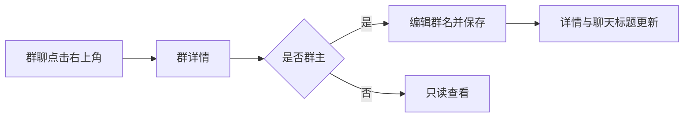
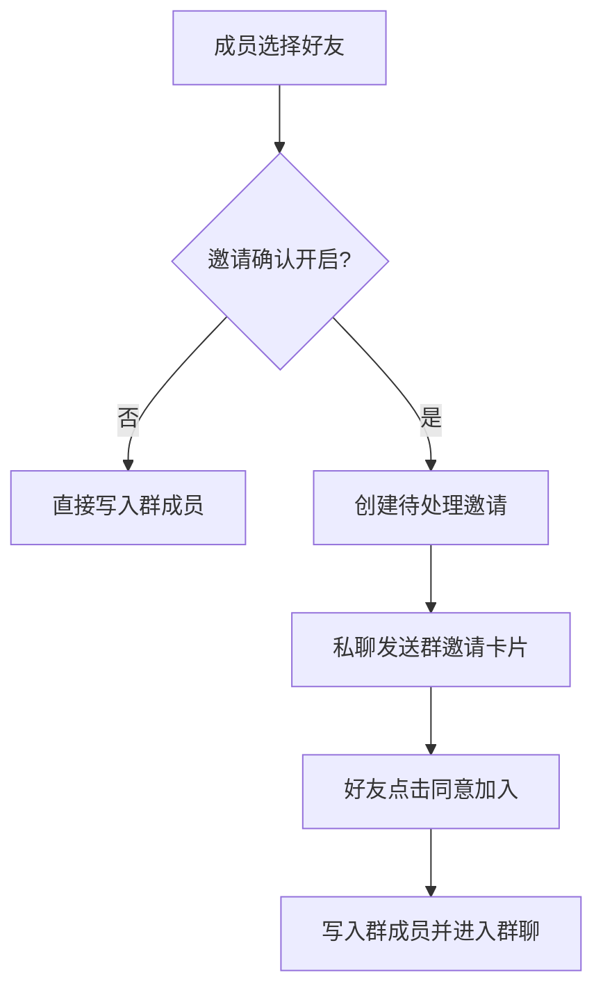

# 群聊详情、成员管理与邀请确认 — 功能分析

## 概述

本版本在 v0.0.1 已有的建群、群列表和群消息能力上补齐群聊管理闭环：群聊页右上角进入微信式群详情，查看成员、修改群名、增删成员，并由群主控制“邀请确认”。关闭邀请确认时，普通成员可以直接把自己的好友加入群聊；开启后普通成员只能向好友发送群邀请卡片，好友点击“同意加入”后才成为群成员。首页创建群聊入口同步改为锚定在入口正下方、可继续扩展其他快捷入口的简约菜单。

### 已确认需求

- 群聊页右上角提供群详情入口。
- 群详情支持修改群名、展示群成员，成员列表末尾提供添加入口。
- 普通群成员可以邀请自己的好友加入群聊。
- 群主开启邀请确认后，普通成员邀请好友时必须发送邀请卡片；好友点击同意后才加入。
- 群主可以直接添加或删除群成员。
- 群主可以解散群聊。
- 首页创建群聊弹层重新设计，弹层位于入口正下方，并支持后续增加其他入口。

### 实现假设

- 邀请确认关闭时，普通成员添加自己的好友会直接入群；开启时改走邀请卡片。
- 群主不受邀请确认限制，始终可以直接添加自己的好友。
- 群主不能删除自己；本版本不包含转让群主或成员主动退出群聊。
- 邀请卡片提供“同意加入”；不单独实现拒绝接口，用户可以忽略卡片。
- 仍沿用 v0.0.1 的 200 人上限，重复添加、非好友、已入群用户由服务端拒绝。

## 一、交互链

### 场景 1：进入群详情并修改群名

**用户故事**：作为群成员，我想从群聊页查看群信息；作为群主，我想修改群名，以便维护群聊。

1. 用户进入群聊，点击右上角“…”按钮。
2. 页面进入“聊天信息”，顶部以网格展示所有有效群成员。
3. 群主点击“群聊名称”，输入 1～100 个字符并保存；普通成员只能查看。
4. 保存成功后详情页和返回后的群聊标题同步显示新群名。

### 场景 2：群主增删成员

**用户故事**：作为群主，我想直接添加或删除群成员，以便管理群聊范围。

1. 群主在成员网格末尾点击“+”。
2. 选择页只展示群主的好友，已在群内的好友不可再次选择。
3. 群主选择一个或多个好友并确认，服务端校验后直接入群，详情页刷新。
4. 群主点击成员区的“−”，进入删除模式；选择非群主成员并二次确认后移出群聊。

### 场景 3：普通成员邀请好友

**用户故事**：作为普通群成员，我想邀请自己的好友加入群聊，以便扩大讨论范围。

1. 普通成员点击成员列表末尾的“+”，选择自己的好友。
2. 若群主关闭“邀请确认”，好友直接加入，群详情刷新。
3. 若群主开启“邀请确认”，系统在邀请人与好友的私聊中发送群邀请卡片，好友此时尚未入群。
4. 好友点击卡片中的“同意加入”，服务端原子更新邀请状态和群成员关系，随后进入群聊。

### 场景 4：群主设置邀请确认

**用户故事**：作为群主，我想控制普通成员能否直接拉人，以便平衡便利性和群管理秩序。

1. 群主在群详情打开或关闭“邀请确认”开关。
2. 修改成功后立即生效；失败时开关回退并显示原因。
3. 普通成员可看到当前状态，但不能修改。

### 场景 5：首页快捷入口菜单

**用户故事**：作为用户，我想从首页快速发起群聊，并在未来看到更多同类快捷操作。

1. 用户点击消息首页右上角“+”。
2. 简约圆角菜单以按钮为锚点，紧贴入口正下方展开。
3. 当前展示“发起群聊”，点击后关闭菜单并进入选人建群页。
4. 菜单由快捷入口数据列表生成，后续新增入口无需重写弹层结构。

### 场景 6：群主解散群聊

**用户故事**：作为群主，我想解散不再使用的群聊，以便终止该群的成员关系和后续消息。

1. 群主在群详情底部点击红色“解散群聊”。
2. 系统二次确认，明确所有成员将无法继续使用该群。
3. 群主确认后，服务端标记群已解散、撤销全部成员资格并使待处理邀请失效。
4. 客户端关闭群详情和当前群聊并刷新首页；其他成员后续读取或发消息时均被拒绝。

## 二、逻辑树

### 事件流：加载和编辑群详情

| 时刻 | 事件 | 处理 | 产生的新事件 |
| --- | --- | --- | --- |
| T1 | 打开群详情 | `GET /groups/{id}` 校验当前用户仍是成员 | 返回群名、群主、邀请确认状态和成员列表 |
| T2 | 群主保存群名 | `PATCH /groups/{id}/name` 校验群主权限和名称长度 | 更新 `conversations.name/updated_at` |
| T3 | 群主切换邀请确认 | `PATCH /groups/{id}/settings` 校验群主权限 | 更新 `join_approval_required` |

### 事件流：添加或邀请成员

| 时刻 | 事件 | 处理 | 产生的新事件 |
| --- | --- | --- | --- |
| T1 | 选择好友并提交 | 服务端校验操作者是群成员、目标是其好友、目标尚未入群、总人数未超限 | 进入权限分支 |
| T2a | 群主或无需确认 | 批量恢复/插入 `conversation_members` | 新成员可进入群聊 |
| T2b | 普通成员且需确认 | 写入 `group_invitations(status=pending)`，找到或创建双方私聊，通过现有消息服务发送 `GROUP_INVITATION` 卡片 | 好友收到邀请卡片，尚未入群 |
| T3 | 好友同意邀请 | 锁定邀请与群记录，校验邀请人/被邀请人/群仍有效，插入成员并将邀请置为 accepted | 返回群会话并进入群聊 |
| T4 | 群主解散群 | 锁定群记录，标记 dissolved，软删除全部成员并删除 pending 邀请 | 群不再可查询、发消息或接受邀请 |

### 状态流转

| 实体 | 触发事件 | 前状态 | 后状态 |
| --- | --- | --- | --- |
| Conversation | 群主修改群名 | 原名称 | 新名称 |
| Conversation | 群主切换设置 | `join_approval_required=false/true` | 取反后的设置 |
| ConversationMember | 直接添加 | 不存在或 `is_deleted=true` | `is_deleted=false` |
| ConversationMember | 群主删除 | `is_deleted=false` | `is_deleted=true` |
| GroupInvitation | 普通成员发邀请 | 不存在 | pending |
| GroupInvitation | 被邀请人同意 | pending | accepted，同时新增群成员 |
| Conversation | 群主确认解散 | active | dissolved |
| ConversationMember | 群解散 | `is_deleted=false` | `is_deleted=true`（全部成员） |

### 异常流与回退

| 异常 | 触发条件 | 用户反馈 | 系统回退 |
| --- | --- | --- | --- |
| 无群权限 | 当前用户已被移出群或不是成员 | “群聊不存在或你已不在群内” | 返回上一页，不泄露群信息 |
| 非群主修改 | 普通成员改群名、设置或删除成员 | “仅群主可操作” | 不写数据 |
| 非好友邀请 | 目标不是操作者好友 | “只能邀请自己的好友” | 整批请求不写入 |
| 重复或已入群 | ID 重复、目标已是有效成员 | “成员已在群聊中” | 整批请求不写入 |
| 超过人数上限 | 添加后总人数大于 200 | “群成员已达上限” | 整批请求不写入 |
| 邀请重复 | 同群同一被邀请人已有 pending 邀请 | 返回现有邀请并避免重复卡片 | 保持原邀请 |
| 邀请失效 | 已接受、群被删除、邀请人不再是成员 | 卡片显示无法加入 | 不新增成员 |
| 网络失败 | 保存、添加、删除或接受失败 | 保留页面状态并支持重试 | 乐观开关回退；列表以服务端为准刷新 |
| 重复解散/非群主解散 | 群已解散或操作者不是群主 | “群聊不存在”或“仅群主可解散” | 不重复变更数据 |

## 三、功能编号与网络定位

### 本次新增节点

| 编号 | 功能节点 | 层级 | 简介 |
| --- | --- | --- | --- |
| D-20 | 群详情查询 | 领域 | 按成员权限返回群设置和完整成员列表 |
| D-21 | 群资料与邀请设置 | 领域 | 群主修改群名和邀请确认 |
| D-22 | 群成员管理 | 领域 | 群主增删成员、关闭确认时成员直接拉好友 |
| D-23 | 群邀请审批 | 领域 | 创建邀请卡片并由被邀请人同意后入群 |
| D-24 | 群聊解散 | 领域 | 群主终止群、撤销成员资格并失效邀请 |
| P-34 | 群详情页 | 前端业务 | 成员网格、群名和邀请确认设置 |
| P-35 | 群成员选择与删除 | 前端业务 | 过滤已入群好友并执行增删成员 |
| P-36 | 群邀请卡片 | 前端业务 | 私聊卡片展示、同意加入与进入群聊 |
| P-37 | 首页锚点快捷菜单 | 前端业务 | 位于入口正下方、数据驱动的可扩展菜单 |

### 前置依赖

| 依赖节点 | 依赖方式 | 是否已有 |
| --- | --- | --- |
| D-18 群聊创建 | 复用群会话和 owner_id | 是 |
| D-15 好友关系 | 校验只能邀请操作者好友 | 是 |
| D-06～D-10 消息链路 | 持久化并广播邀请卡片 | 是，需扩展消息类型 |
| P-06～P-09 聊天页 | 增加群详情入口和邀请卡片气泡 | 是，需扩展 |
| P-28 好友选择 | 复用好友加载、搜索和选择视觉 | 是，需抽取/复用 |

### 边界接口

| 接口/协议/数据结构 | 定义方 | 消费方 | 敏感度 |
| --- | --- | --- | --- |
| `GET /groups/{id}` | 服务端群模块 | 群详情页 | 高 |
| `PATCH /groups/{id}/name` | 服务端群模块 | 群主编辑页 | 高 |
| `PATCH /groups/{id}/settings` | 服务端群模块 | 群主设置开关 | 高 |
| `POST /groups/{id}/members` | 服务端群模块 | 群成员选择页 | 高 |
| `DELETE /groups/{id}/members/{user_id}` | 服务端群模块 | 群主删除模式 | 高 |
| `POST /groups/{id}/invitations` | 服务端群模块 | 普通成员邀请 | 高 |
| `POST /group-invitations/{id}/accept` | 服务端群模块 | 私聊邀请卡片 | 高 |
| `DELETE /groups/{id}` | 服务端群模块 | 群主解散确认 | 高 |
| `MessageType.GROUP_INVITATION=4` | protobuf / 消息模块 | WS、历史消息、客户端卡片 | 高 |

## 四、结论

- 开发顺序：迁移和服务端群模块 → 邀请消息类型与服务端链路 → 客户端 Repository/Cubit → 群详情和选人页面 → 邀请卡片与路由 → 首页锚点菜单 → 全链路测试。
- 复杂度集中在服务端权限矩阵、邀请幂等和“同意后才入群”的事务边界；客户端重点是详情返回后标题同步和卡片接受后的会话导航。
- 暂不实现：拒绝邀请、群主转让、成员主动退出群、群公告、群内昵称、自定义群头像、管理员角色、邀请链接或二维码。
