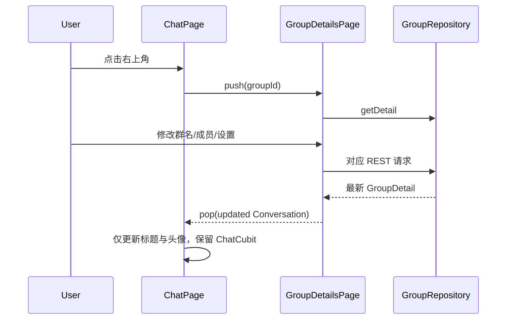
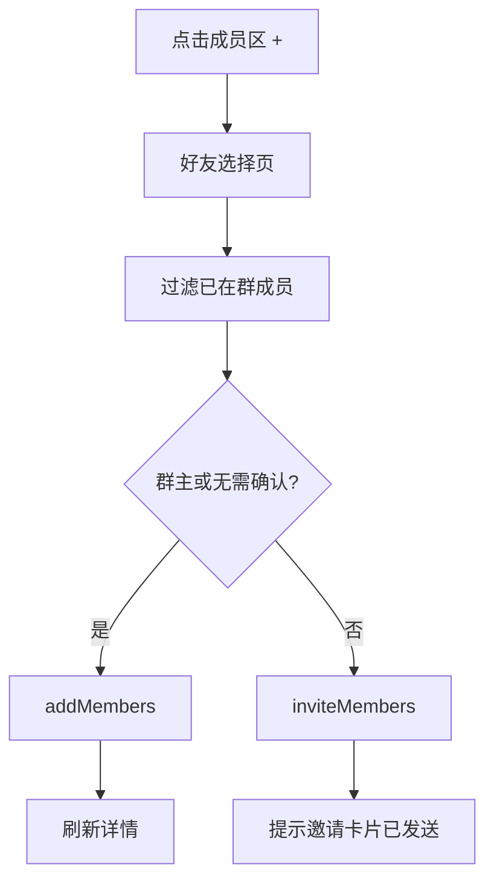
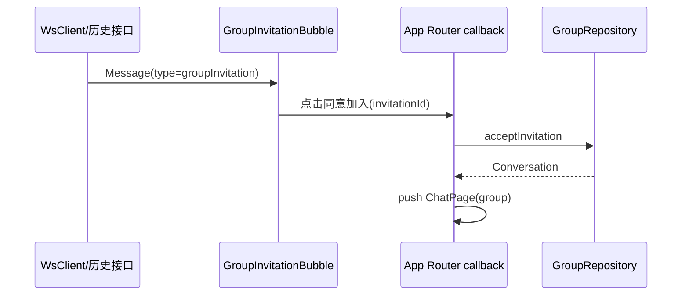

# 群聊详情与成员邀请 — 客户端设计报告

## 1. 目标

- 群聊页右上角进入微信式群详情并显示完整成员网格。
- 群主可修改群名、切换邀请确认、直接添加和删除成员。
- 普通成员可添加好友；需确认时改为发送群邀请卡片。
- 群主可在二次确认后解散群聊并退出当前聊天。
- 私聊展示群邀请卡片，好友同意后进入群聊。
- 首页“+”使用入口正下方的简约、数据驱动快捷菜单。

## 2. 现状分析

- `flash_im_group` v0.0.1 已有创建群和我的群聊页面，但没有 Repository、群详情状态或成员管理页面。
- `ChatPage` 详情按钮只对私聊显示，回调不返回更新后的会话，因此群名修改后无法即时更新标题。
- `flash_im_chat` 已按消息类型分派 text/image/video/file 气泡，可新增邀请卡片气泡并通过宿主回调处理同意与导航。
- 首页仍使用 Material `PopupMenuButton`，菜单定位和视觉不可控，且只有硬编码单入口。

## 3. 数据模型与接口

### 核心模型

```dart
class GroupMember extends Equatable {
  final int accountId;
  final String nickname;
  final String avatar;
  final bool isOwner;
  final DateTime joinedAt;
}

class GroupDetail extends Equatable {
  final String conversationId;
  final String name;
  final int ownerId;
  final bool joinApprovalRequired;
  final String currentUserRole;
  final List<GroupMember> members;
}

class GroupInvitationExtra extends Equatable {
  final String invitationId;
  final String groupId;
  final String groupName;
  final String inviterName;
}
```

```dart
class GroupDetailState extends Equatable {
  final GroupDetail? detail;
  final bool isLoading;
  final bool isSaving;
  final bool isDeleteMode;
  final String? errorMessage;
}

class GroupMemberPickerState extends Equatable {
  final List<FriendUser> friends;
  final Set<int> existingMemberIds;
  final Set<int> selectedIds;
  final String query;
  final bool isSubmitting;
}
```

| 决策 | 理由 |
| --- | --- |
| 群 Repository 放 `flash_im_group` | API 和 DTO 是群领域专属，不再扩展通用 `ConversationRepository` |
| 邀请接受由 ChatPage callback 上抛 | `flash_im_chat` 不依赖 `flash_im_group`，避免反向业务依赖 |
| 群详情成功操作后重新取服务端详情 | 成员/权限以服务端为准，避免多个乐观状态分叉 |
| 群详情返回更新后的 `Conversation` | 返回聊天页后立即刷新标题和组合头像，不重建消息 Cubit |

### 客户端依赖接口

```dart
abstract interface class GroupRepository {
  Future<GroupDetail> getDetail(String groupId);
  Future<GroupDetail> updateName(String groupId, String name);
  Future<GroupDetail> updateSettings(String groupId, bool required);
  Future<GroupDetail> addMembers(String groupId, List<int> memberIds);
  Future<GroupDetail> removeMember(String groupId, int memberId);
  Future<void> inviteMembers(String groupId, List<int> inviteeIds);
  Future<Conversation> acceptInvitation(String invitationId);
  Future<void> dissolveGroup(String groupId);
}
```

`MessageType` 新增 `groupInvitation`，其 `extra` 严格解析 `invitation_id/group_id/group_name/inviter_name`。非法 extra 显示不可操作的兜底卡片，不让聊天页崩溃。

## 4. 核心流程

### 群详情与标题同步



### 普通成员添加或邀请



### 私聊邀请卡片



失败时卡片保留可重试状态；成功后当前卡片显示“已加入”，并进入群聊。

### 群主解散

```mermaid
flowchart LR
    A[点击解散群聊] --> B[危险操作二次确认]
    B -->|取消| C[留在详情页]
    B -->|确认| D[DELETE /groups/{id}]
    D --> E[关闭详情和群聊]
    E --> F[刷新首页会话列表]
```

## 5. 项目结构与技术决策

### 项目结构

```text
client/modules/flash_im_group/
├── lib/src/
│   ├── data/
│   │   ├── group_detail.dart
│   │   └── group_repository.dart
│   ├── logic/
│   │   ├── group_detail_cubit.dart
│   │   └── group_detail_state.dart
│   └── view/
│       ├── group_details_page.dart
│       ├── group_member_picker_page.dart
│       └── widgets/
│           ├── group_member_grid.dart
│           ├── group_member_tile.dart
│           └── group_name_editor.dart
client/modules/flash_im_chat/
├── lib/src/data/message.dart
└── lib/src/view/bubble/group_invitation_bubble.dart
client/lib/
├── app/app_router.dart
└── features/messages/presentation/
    ├── messages_placeholder_page.dart
    └── widgets/message_quick_actions_menu.dart
```

### 职责划分

- `flash_im_group` 负责群 DTO、REST、状态和群页面；可依赖 friend/conversation/shared，不依赖 chat 或宿主。
- `flash_im_chat` 负责把邀请消息渲染为卡片，只暴露 `onAcceptGroupInvitation` 回调，不直接调用群 API。
- 宿主路由读取 `GroupRepository`，串联卡片接受、群详情返回和进入群聊。
- 首页快捷菜单留在宿主消息 feature，接收数据化 action 列表，不下沉业务路由。

### 技术决策

| 决策 | 方案 | 理由 |
| --- | --- | --- |
| 群详情状态 | 单 `GroupDetailCubit` | 加载、改名、设置、增删均围绕同一服务端快照 |
| 成员网格 | 独立 widget，成员后追加 + / 群主 − | 贴近微信认知并保持大页面轻量 |
| 删除交互 | `−` 进入删除模式，成员角标选择并二次确认 | 避免误触头像即踢人 |
| 快捷菜单 | `MenuAnchor` + action model 列表 | 原生锚点定位、键盘/无障碍支持和后续入口扩展 |
| ChatPage 更新 | 详情 callback 返回可选 `Conversation` | 同群只更新标题/头像，不销毁消息加载与输入状态 |
| 解散结果 | `GroupDetailsResult.dissolved` 上抛宿主 | 宿主统一关闭当前 Chat 路由并刷新会话列表 |

| 依赖 | 用途 | 已有/需新增 |
| --- | --- | --- |
| dio | 群 REST Repository | 客户端已有，群包需声明 |
| flutter_bloc / equatable | 群详情状态 | 已有 |
| flash_im_friend | 好友选择 | 已有 |
| flash_im_conversation | 接受邀请和标题更新 | 已有 |
| flash_shared | 颜色、卡片和头像 | 已有 |

## 6. 暂不实现

| 功能 | 理由 |
| --- | --- |
| 拒绝邀请按钮 | 服务端本版只有 pending/accepted；卡片可忽略 |
| 群主转让、成员主动退出 | 服务端无对应契约 |
| 成员详情、群内昵称、管理员 | 不属于本次成员加入权限闭环 |
| 邀请二维码或链接 | 本版本选择来源仅为好友 Repository |
| 自定义群头像和群公告 | 保持 v0.0.1 组合头像与消息能力 |
