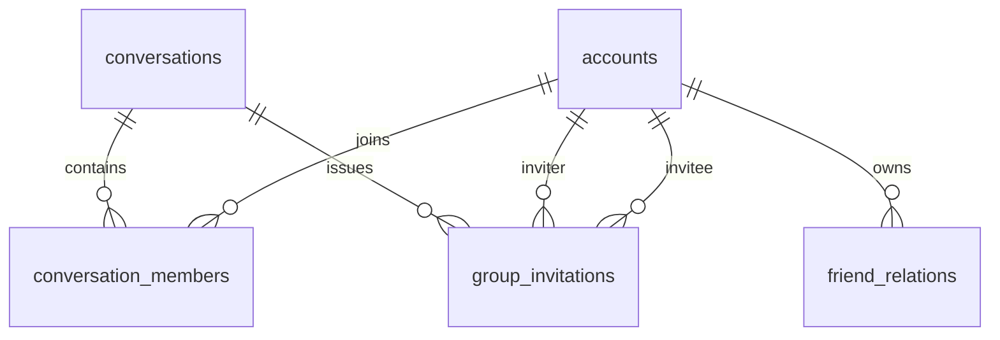
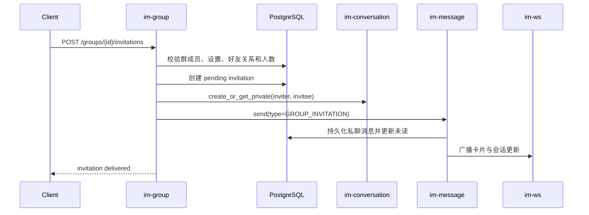
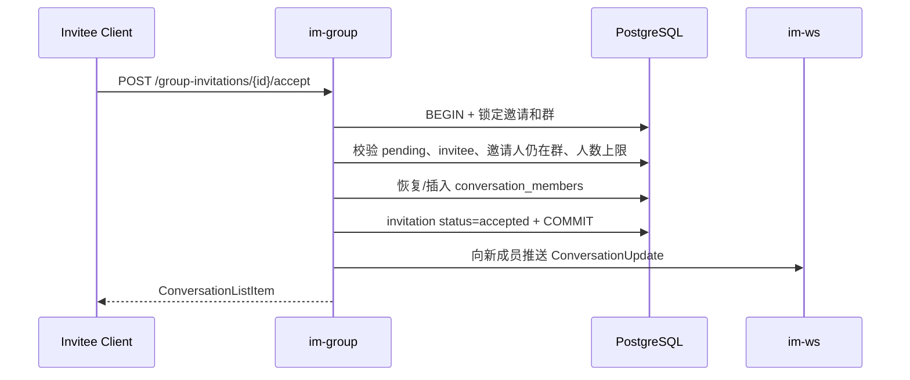
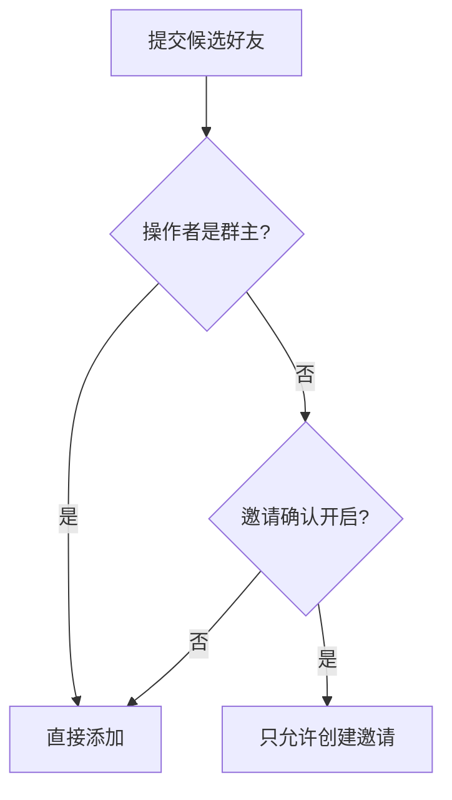
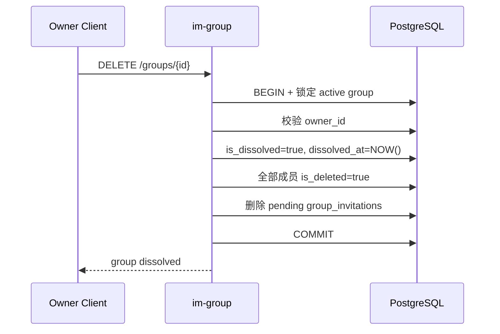

# 群聊详情与成员邀请 — 服务端设计报告

## 1. 目标

- 提供仅群成员可见的群详情和完整成员列表。
- 提供群主修改群名、邀请确认设置和增删成员的接口。
- 支持普通成员在无需确认时直接添加自己的好友。
- 支持开启确认后创建群邀请、发送私聊邀请卡片并由被邀请人同意入群。
- 支持群主解散群聊并原子撤销全部成员资格与待处理邀请。
- 延续 200 人上限、好友关系校验和现有会话/消息实时推送链路。

## 2. 现状分析

- v0.0.1 已使用 `conversations(type=1, owner_id)` 与 `conversation_members` 创建群聊，群消息复用 `im-message` 和 `im-ws`。
- `im-conversation` 已具备成员校验、成员 ID 查询和私聊创建/复用能力，但没有群设置、完整成员资料、成员管理接口或邀请状态。
- `im-message` 仅允许 text/image/video/file；`extra` JSON 和 WS 广播能力可安全扩展群邀请卡片。
- 当前服务端按业务 crate 分层。群管理横跨会话、好友和消息，不继续堆入 `im-conversation`，新增 `im-group` 聚合领域规则。

## 3. 数据模型与接口

### 数据模型

```sql
ALTER TABLE conversations
ADD COLUMN join_approval_required BOOLEAN NOT NULL DEFAULT FALSE,
ADD COLUMN is_dissolved BOOLEAN NOT NULL DEFAULT FALSE,
ADD COLUMN dissolved_at TIMESTAMPTZ;

CREATE TABLE group_invitations (
    id UUID PRIMARY KEY DEFAULT gen_random_uuid(),
    conversation_id UUID NOT NULL REFERENCES conversations(id) ON DELETE CASCADE,
    inviter_id BIGINT NOT NULL REFERENCES accounts(id) ON DELETE CASCADE,
    invitee_id BIGINT NOT NULL REFERENCES accounts(id) ON DELETE CASCADE,
    status SMALLINT NOT NULL DEFAULT 0,
    created_at TIMESTAMPTZ NOT NULL DEFAULT NOW(),
    handled_at TIMESTAMPTZ,
    CHECK (inviter_id <> invitee_id),
    CHECK (status IN (0, 1))
);

CREATE UNIQUE INDEX idx_group_invitations_pending
ON group_invitations(conversation_id, invitee_id)
WHERE status = 0;
```



| 决策 | 理由 |
| --- | --- |
| 邀请确认放在 `conversations` | 每个群只有一个布尔设置，无需为单字段新建 `group_info` |
| 邀请单独持久化 | 卡片必须在点击时以服务端状态判定是否还能加入，不能只信消息 `extra` |
| pending 唯一索引 | 同一好友对同一群只保留一条待处理邀请，避免重复卡片和重复加入 |
| 成员删除继续使用 `is_deleted` | 与现有会话权限和历史数据模型一致，重新加入可恢复同一成员行 |

### 核心响应

```json
{
  "conversation_id": "uuid",
  "name": "周末读书会",
  "owner_id": "10001",
  "join_approval_required": true,
  "current_user_role": "owner",
  "member_count": 3,
  "members": [
    {
      "account_id": "10001",
      "nickname": "小雨",
      "avatar": "identicon:10001",
      "is_owner": true,
      "joined_at": "2026-08-17T00:00:00Z"
    }
  ]
}
```

### 接口契约

| 方法 | 路径 | 权限 | 响应 |
| --- | --- | --- | --- |
| `GET` | `/groups/{id}` | 有效群成员 | `GroupDetail` |
| `PATCH` | `/groups/{id}/name` | 群主 | 更新后的 `GroupDetail` |
| `PATCH` | `/groups/{id}/settings` | 群主 | 更新后的 `GroupDetail` |
| `POST` | `/groups/{id}/members` | 群成员；是否直加由权限矩阵决定 | 更新后的 `GroupDetail` |
| `DELETE` | `/groups/{id}/members/{user_id}` | 群主 | 更新后的 `GroupDetail` |
| `POST` | `/groups/{id}/invitations` | 开启确认时的普通群成员 | 邀请结果列表 |
| `POST` | `/group-invitations/{id}/accept` | 被邀请人 | 群 `ConversationListItem` |
| `DELETE` | `/groups/{id}` | 群主 | `{ "message": "group dissolved" }` |

修改群名：

```json
{ "name": "新群名" }
```

修改设置：

```json
{ "join_approval_required": true }
```

添加成员或创建邀请：

```json
{ "member_ids": [10002, 10003] }
```

邀请响应：

```json
{
  "invitations": [
    {
      "id": "uuid",
      "conversation_id": "group-uuid",
      "invitee_id": "10003",
      "status": "pending",
      "delivered": true
    }
  ]
}
```

投递失败项返回 `id: null`、`status: "failed"`、`delivered: false`；服务端已回收该项待处理邀请，客户端不得把它当作可接受邀请。批量中其他已成功投递的邀请不受影响。

邀请消息协议：

```protobuf
enum MessageType {
  TEXT = 0;
  IMAGE = 1;
  VIDEO = 2;
  FILE = 3;
  GROUP_INVITATION = 4;
}
```

`GROUP_INVITATION.extra`：

```json
{
  "invitation_id": "uuid",
  "group_id": "uuid",
  "group_name": "周末读书会",
  "inviter_name": "小雨"
}
```

| 状态 | 典型条件 | message |
| --- | --- | --- |
| 400 | 空名称、重复 ID、超过 200 人 | 稳定英文错误信息 |
| 401 | 未登录 | 复用 JWT 错误 |
| 403 | 非群主执行管理操作、普通成员绕过确认直加 | `group operation is not allowed` |
| 404 | 群不存在、当前用户非成员、邀请不存在 | 不泄露群信息 |
| 409 | 已在群中、邀请已处理或成员状态冲突 | 稳定英文错误信息 |

## 4. 核心流程

### 普通成员发送邀请卡片



若卡片发送失败，本次新建邀请回收为无效结果并返回失败；已存在 pending 邀请不重复发送卡片。

### 被邀请人同意加入



### 权限分支



### 群主解散



通用会话列表、详情、成员校验和消息发送均排除 `is_dissolved=true`，避免只依赖客户端退出页面。

## 5. 项目结构与技术决策

### 项目结构

```text
server/
├── migrations/*_group_management.sql
├── modules/im-group/
│   ├── Cargo.toml
│   └── src/
│       ├── lib.rs          # 对外 router
│       ├── models.rs       # GroupDetail / Invitation DTO
│       ├── repository.rs   # SQL、事务与锁
│       ├── service.rs      # 权限矩阵、邀请编排
│       └── routes.rs       # REST handler
├── modules/im-message/     # 扩展邀请卡片类型、校验和预览
├── modules/im-conversation/# 复用并按需公开会话查询能力
└── src/routes/mod.rs       # 注入 WsBroadcaster 并合并 im-group router
proto/message.proto         # GROUP_INVITATION=4
```

### 职责划分

- `im-group` 拥有群资料、成员管理和邀请规则；它可以调用 `im-conversation` 与 `im-message`，反向依赖禁止。
- `im-conversation` 继续拥有通用会话查询、成员校验和私聊创建，不感知邀请表。
- `im-message` 只验证并持久化邀请卡片消息，不判断谁可以邀请谁。
- `im-ws` 继续只负责广播；`im-group` 从宿主接收 `WsBroadcaster`，不持有全局 UI 或认证状态。

### 技术决策

| 决策 | 方案 | 理由 |
| --- | --- | --- |
| 新服务端 crate | `im-group` | 群管理是跨会话/好友/消息的聚合领域，避免 `im-conversation` 职责膨胀 |
| 卡片发送 | 服务端通过现有 `MessageService` 发送 | 保证持久化、未读、历史消息和实时广播保持一条事实链 |
| 接受邀请 | 单事务锁邀请和群 | 防止重复点击、并发满员与重复成员 |
| 新成员实时可见 | 提交后向新成员发会话更新 | 让在线用户无需重登即可在会话列表 hydrate 群聊 |
| 解散语义 | 软解散群并软删除成员，不级联删除消息 | 保留历史事实和审计数据，同时立即阻止继续访问 |

| 依赖 | 用途 | 已有/需新增 |
| --- | --- | --- |
| axum / serde / sqlx / uuid / chrono | REST、DTO、事务和时间 | 已有 workspace 版本 |
| im-conversation | 会话详情、成员和私聊复用 | 已有依赖，新增到 `im-group` |
| im-message | 邀请卡片持久化和广播 | 已有依赖，新增到 `im-group` |
| im-ws | 宿主提供实时 broadcaster | 已有依赖，新增到 `im-group` |

## 6. 暂不实现

| 功能 | 理由 |
| --- | --- |
| 拒绝邀请 | 用户只要求同意入群；pending 卡片可忽略，状态枚举可后续扩展 |
| 群主转让、成员主动退群 | 涉及 owner 生命周期和个人会话保留策略，另立版本 |
| 管理员与多角色 | 当前只有 owner/member 权限矩阵 |
| 邀请链接、二维码、非好友邀请 | 本版明确限制为邀请者自己的好友 |
| 群公告、群昵称、自定义群头像 | 与成员邀请闭环无直接依赖 |
