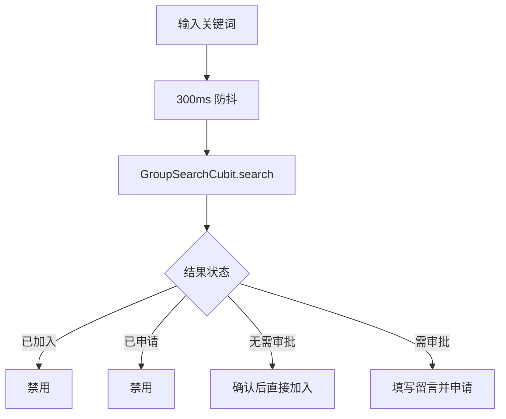
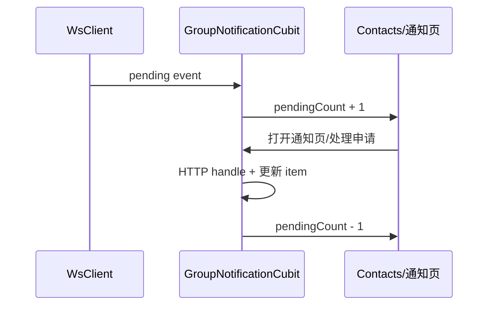

# 搜索加群与入群审批 — 客户端设计报告

## 1. 目标

- 在“添加朋友”页增加搜索群聊入口，交付 300ms 防抖搜索和四态入群操作。
- 提供群通知列表，允许群主同意或拒绝申请，并展示已处理状态。
- 用 HTTP 初始值和 WS 增量共同维护群通知红点。
- 复用既有群详情页，把邀请确认文案扩展为同时说明主动入群审批。
- 保持 `flash_im_group` 独立于宿主页面，由宿主负责路由、Repository 和跨模块 callback 接线。

## 2. 现状分析

- `flash_im_group` 已有 Dio Repository、Cubit、群详情和群列表；需增加 `flash_im_core` 依赖以消费新 WS protobuf 事件。
- `AddFriendPage` 和 `ContactsPage` 属于 `flash_im_friend`，不能反向依赖群模块；通过 callback 和整数角标扩展。
- `MainShellPage` 已持有 `WsClient`、FriendCubit 和会话 Cubit，适合创建并关闭 `GroupNotificationCubit`。
- 已加入群的会话可由现有 `ConversationListCubit.refresh()` 刷新；直接加入或审批同意后的系统消息也会触发 conversation update。
- 客户端群聊视觉参考为 `/Users/rainyjiang/Downloads/群聊设计图`。参考图提供信息层级和交互布局，颜色、圆角、字体、间距、AppBar、卡片和反馈组件继续使用当前 `FlashPalette`、`FriendPalette` 与现有页面风格。

### 参考图映射

| 参考页面 | 本版映射 | 与当前项目融合方式 |
| --- | --- | --- |
| “加好友/群” | `AddFriendPage` 的搜索群聊入口 | 保留当前渐变/圆角卡片，不实现扫码和二维码名片 |
| “搜索群聊” | `SearchGroupPage` | 采用顶部搜索框、扁平结果行、头像/群名/人数群号/右侧状态按钮层级 |
| “申请加入群聊”弹窗 | 申请确认 Dialog | 展示群摘要、留言输入、字符计数、取消/发送申请；上限以本版契约 200 字为准 |
| “群通知” | `GroupNotificationsPage` | 头像 + 申请者 + 群名 + 留言，右侧拒绝/同意；已处理态替换按钮 |
| “通讯录” | `ContactsPage` 群通知入口 | 放在新的朋友与群聊之间，角标沿用当前 `FriendIconBadge` |
| “群聊信息” | 既有 `GroupDetailsPage` | 保留当前卡片和成员管理行为，补充群号行与“入群验证”说明 |

## 3. 数据模型与接口

### 客户端模型

```dart
class GroupSearchItem {
  String conversationId;
  String groupNumber;
  String name;
  String avatar;
  int memberCount;
  bool joinApprovalRequired;
  bool isMember;
  bool hasPendingRequest;
}

class GroupJoinRequest {
  String id;
  String conversationId;
  String groupName;
  String groupAvatar;
  int applicantId;
  String applicantName;
  String applicantAvatar;
  String message;
  GroupJoinRequestStatus status;
  DateTime createdAt;
  DateTime? handledAt;
}
```

`GroupRepository` 增加：

```dart
Future<List<GroupSearchItem>> searchGroups(String keyword);
Future<JoinGroupResult> joinGroup(String groupId, {String? message});
Future<GroupJoinRequestList> getJoinRequests();
Future<GroupJoinRequest> handleJoinRequest(
  String groupId,
  String requestId, {
  required bool approved,
});
```

### 状态

- `GroupSearchCubit`：`keyword/items/isLoading/actionGroupId/errorMessage`；防抖只存在页面输入层，Cubit 接受稳定关键词并丢弃过期响应。
- `GroupNotificationCubit`：`requests/pendingCount/isLoading/handlingRequestId/errorMessage/latestResult`；构造后订阅 `groupJoinRequestStream`，pending 事件触发增量插入，处理结果或重连后通过 HTTP 回源纠偏。

| 决策 | 理由 |
| --- | --- |
| Repository 解析所有 JSON | 页面和 Cubit 不依赖 Dio/Map，保持数据边界 |
| Cubit 防过期响应 | 300ms 防抖不能阻止慢请求乱序覆盖新关键词 |
| HTTP + WS 双通道 | WS 只保证在线增量，进入页面和启动时必须回源 |

## 4. 核心流程





- 直接加入成功时将当前搜索项置为 `isMember=true`，刷新会话列表，并允许用户继续从“我的群聊”进入。
- 申请成功时将当前项置为 `hasPendingRequest=true`。
- 群主处理失败时保留按钮和列表项，显示中文 SnackBar；不做乐观状态变更。
- WS 处理结果到达申请者时，搜索页若仍打开则更新对应项目；approved 置为已加入，rejected 恢复可申请。
- 搜索结果按钮遵循参考图：`加入` 使用当前主题主色实心按钮，`申请` 使用 warning 色描边按钮，`已加入/已申请` 使用灰色禁用容器。
- 申请弹窗遵循参考图的信息结构，但用当前 `AlertDialog` 圆角和主题色；群摘要复用 `GroupAvatarWidget`，留言输入显示 `当前字符数/200`。

## 5. 项目结构与技术决策

```text
client/modules/flash_im_core/
├── lib/src/data/proto/group.pb*.dart
└── lib/src/logic/ws_client.dart
client/modules/flash_im_group/lib/src/
├── data/{group_discovery.dart,group_repository.dart}
├── logic/{group_search_*,group_notification_*}.dart
└── view/{search_group_page.dart,group_notifications_page.dart,widgets/...}
client/modules/flash_im_friend/lib/src/view/
├── add_friend_page.dart                  # onSearchGroups callback
└── contacts_page.dart                    # 群通知入口/角标参数
client/lib/features/home/presentation/main_shell_page.dart
```

| 决策 | 方案 | 理由 |
| --- | --- | --- |
| 跨模块 UI | friend 只接 callback/count | 防止 friend -> group 反向依赖 |
| 页面导航 | 宿主用 `MaterialPageRoute` 组装 | 页面沿用已注入 Repository/WsClient，不扩张公共 named route |
| 群详情 | 修改现有 Switch 文案并增加群号行 | v0.0.2 已有完整页面和接口，参考图只补信息层级，不重复实现 |
| 申请列表 | pending 优先、已处理只读 | 与服务端排序和审批状态一致 |

### 依赖

| 依赖 | 用途 | 已有/需新增 |
| --- | --- | --- |
| `flash_im_core` | WS protobuf 与 WsClient | `flash_im_group` 需新增 path 依赖 |
| Dio / Cubit / Equatable | REST、状态与模型 | 已有 |

## 6. 暂不实现

| 功能 | 理由 |
| --- | --- |
| 群公开/私密配置 UI | 服务端本版无对应字段 |
| 申请撤回、批量审批 | 超出 v0.0.3 |
| 系统通知中心和离线推送 | 当前仅通讯录入口和在线 WS |
| 申请历史分页和筛选 | 本版使用单列表 |
| 新建另一套群详情页 | 必须复用 v0.0.2 `GroupDetailsPage` |
