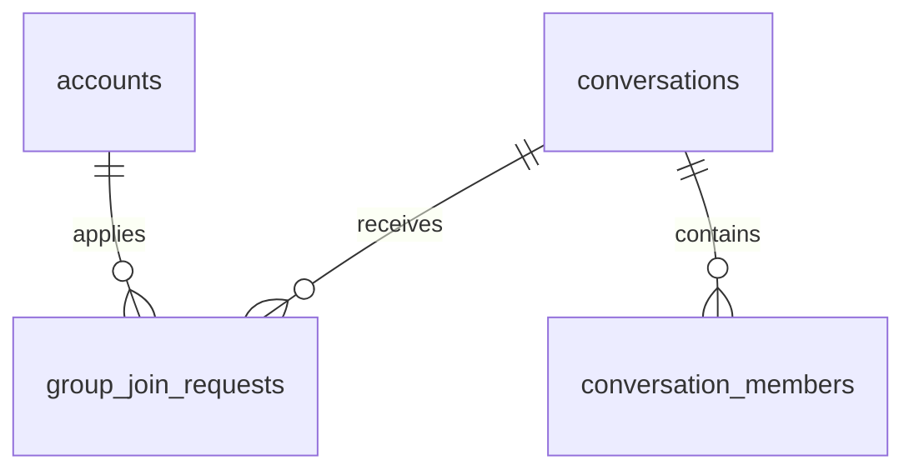
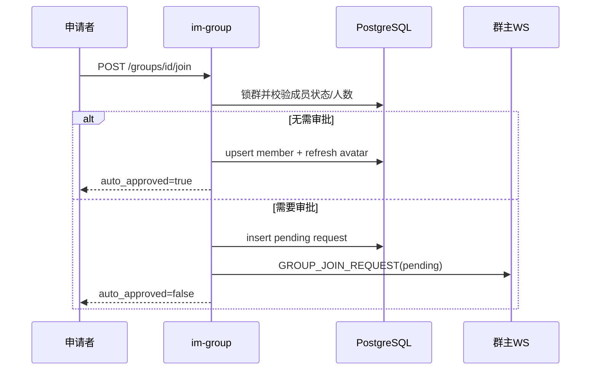
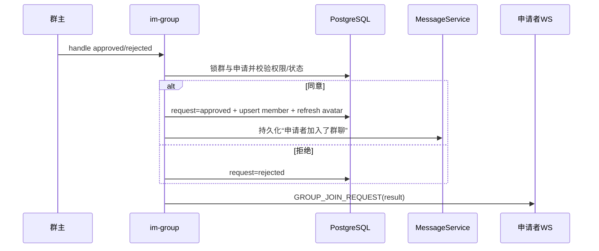

# 搜索加群与入群审批 — 服务端设计报告

## 1. 目标

- 在 `im-group` 提供未解散群搜索，支持群名模糊搜索和完整 UUID 群号精确匹配。
- 复用 `conversations.join_approval_required`，分别完成直接入群或创建待审批申请。
- 提供群主入群申请列表与同意/拒绝接口，并保证权限、状态和 200 人上限在事务内生效。
- 通过新 WS 帧把新申请推给群主、把处理结果推给申请者。
- 直接加入或审批同意后刷新宫格头像，并通过既有持久化消息链发送入群系统消息。

## 2. 现状分析

- `server/modules/im-group` 已拥有群详情、改名、邀请确认、增删成员、邀请卡片、解散群和 WS broadcaster 注入。
- `conversations.join_approval_required` 当前控制普通成员邀请好友的确认流程，本版扩展为同时控制用户主动入群。
- `conversation_members` 使用软删除，可通过 upsert 恢复历史成员；群头像由 `im-conversation` 的事务内刷新函数生成。
- `im-ws` 已实现消息和好友领域 broadcaster，可按相同依赖方向实现 `GroupBroadcaster`，避免 `im-group` 依赖传输层。
- 当前没有群可见性字段，因此本版所有 `type=1 AND is_dissolved=false` 的群都可搜索。

## 3. 数据模型与接口

### 数据模型

```sql
CREATE TABLE group_join_requests (
    id UUID PRIMARY KEY DEFAULT gen_random_uuid(),
    conversation_id UUID NOT NULL REFERENCES conversations(id) ON DELETE CASCADE,
    applicant_id BIGINT NOT NULL REFERENCES accounts(id) ON DELETE CASCADE,
    message VARCHAR(200) NOT NULL,
    status SMALLINT NOT NULL DEFAULT 0 CHECK (status IN (0, 1, 2)),
    created_at TIMESTAMPTZ NOT NULL DEFAULT NOW(),
    handled_at TIMESTAMPTZ
);

CREATE UNIQUE INDEX idx_group_join_requests_pending
ON group_join_requests(conversation_id, applicant_id)
WHERE status = 0;
```

状态：`0=pending`、`1=approved`、`2=rejected`。群主从 `conversations.owner_id` 解析，不在申请表冗余保存。



| 决策 | 理由 |
| --- | --- |
| 复用 `join_approval_required` | 保持 v0.0.2 群设置唯一来源，避免两个语义相近开关漂移 |
| 待处理部分唯一索引 | 允许拒绝后重申，同时阻止并发产生多条 pending |
| 申请表不保存 owner_id | 群主以会话实时 owner 为准，避免转让能力加入后历史数据失真 |

### 接口契约

#### `GET /groups/search?keyword={keyword}`

关键词去除首尾空格后必须为 1～100 个字符，最多返回 50 条。

```json
{
  "groups": [{
    "conversation_id": "uuid",
    "group_number": "uuid",
    "name": "产品交流群",
    "avatar": "grid:...",
    "member_count": 18,
    "join_approval_required": true,
    "is_member": false,
    "has_pending_request": true
  }]
}
```

#### `POST /groups/{id}/join`

```json
{ "message": "请求加入群聊" }
```

直接加入：

```json
{
  "auto_approved": true,
  "request_id": null,
  "conversation": { "id": "uuid", "type": 1 }
}
```

待审批：

```json
{
  "auto_approved": false,
  "request_id": "uuid",
  "conversation": null
}
```

#### `GET /groups/join-requests`

返回当前用户作为群主的所有群申请，pending 优先、其余按创建时间倒序。

```json
{
  "pending_count": 1,
  "requests": [{
    "id": "uuid",
    "conversation_id": "uuid",
    "group_name": "产品交流群",
    "group_avatar": "grid:...",
    "applicant_id": "10002",
    "applicant_name": "小雨",
    "applicant_avatar": "identicon:10002",
    "message": "请求加入群聊",
    "status": "pending",
    "created_at": "2026-08-31T08:00:00Z",
    "handled_at": null
  }]
}
```

#### `POST /groups/{id}/join-requests/{request_id}/handle`

```json
{ "approved": true }
```

返回处理后的 `JoinRequestItem`。同意后成员关系和申请状态在同一事务提交；提交后发送系统消息和 WS 结果事件。

| 条件 | HTTP | message |
| --- | --- | --- |
| 关键词或留言非法 | 400 | `invalid group search keyword` / `invalid join request message` |
| 已是成员 | 400 | `already a group member` |
| 申请已处理 | 400 | `group join request already handled` |
| 非群主处理 | 403 | `group operation is not allowed` |
| 群或申请不存在 | 404 | `group not found` / `group join request not found` |
| 待处理申请重复 | 409 | `group join request already pending` |
| 成员达到 200 | 409 | `group member limit reached` |

### WS 契约

`WsFrameType.GROUP_JOIN_REQUEST = 10`，payload 为 `GroupJoinRequestNotification`：包含 request/group/applicant/message/status/created_at/handled_at。`pending` 只发给群主，`approved/rejected` 只发给申请者。

## 4. 核心流程





- 入群事务先锁群再锁申请，统一并发顺序。
- 系统消息和 WS 都在业务事务提交后执行；通知失败不回滚已经成功的成员/审批状态，也不把成功操作响应成 500。
- 同意时若申请者已通过其他路径入群，返回“已经是群成员”并保留申请 pending，供群主明确拒绝或后续处理。

## 5. 项目结构与技术决策

```text
server/migrations/20260831000100_group_join_requests.sql
proto/group.proto                         # 入群申请 WS payload
proto/ws.proto                            # 新帧编号
server/modules/im-group/src/
├── broadcast.rs                          # 领域广播接口
├── models.rs                             # API/DB 模型
├── repository.rs                         # 搜索、申请和审批事务
├── service.rs                            # 规则与通知编排
└── routes.rs                             # HTTP 路由
server/modules/im-ws/src/{frame,broadcaster,dispatcher}.rs
```

| 决策 | 方案 | 理由 |
| --- | --- | --- |
| 依赖方向 | `im-group` 定义 trait，`im-ws` 实现 | 领域层不依赖 WS 传输实现 |
| 搜索分页 | 本版固定最多 50 条 | 当前 UI 为即时搜索，避免无界查询；正式分页后续补充 |
| 入群系统消息 | 扩展既有 type=5 持久化系统消息内容 | 复用普通消息的持久化、广播、会话预览和历史链 |
| 通知失败 | 提交后 best effort | 不制造“成员已加入但接口 500”的假失败 |

## 6. 暂不实现

| 功能 | 理由 |
| --- | --- |
| 群公开/私密设置 | 当前 schema 与 v0.0.3 交互未定义 |
| 撤回、批量审批、管理员审批 | 不在分析范围 |
| 入群问题、黑名单、二维码和邀请链接 | 需要独立规则与安全设计 |
| 离线推送 | 当前只承诺在线 WS + HTTP 回源 |
| 历史申请分页 | 本版申请量有限，保留后续 query 扩展 |
