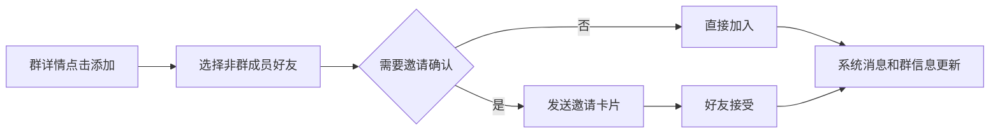
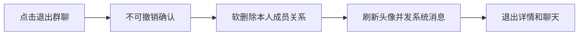
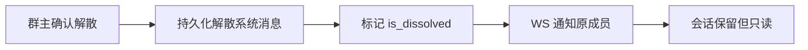
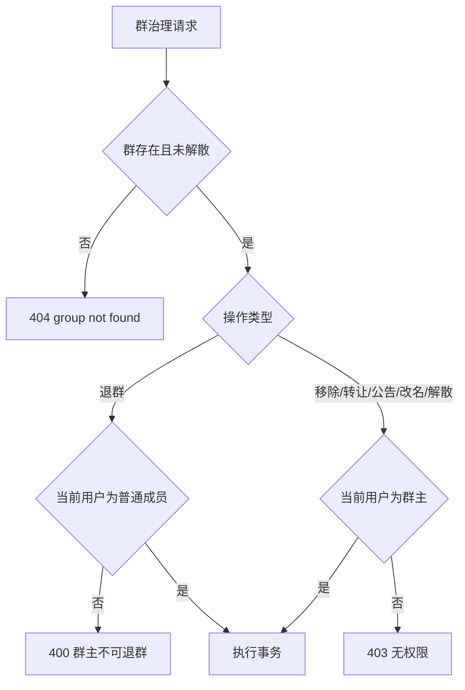

# 群治理与群信息实时同步 — 功能分析

## 概述

v0.0.1～v0.0.3 已完成群创建、群列表、群详情、增删成员、邀请卡片、改名、入群验证、解散、搜索加群和入群审批。v0.0.4 不重复建设这些入口，而是在现有实现上补齐群治理闭环：普通成员退群、群主转让、群公告、治理类持久化系统消息、群信息实时同步，以及解散群的只读历史状态。

本次继续沿用 `conversations.is_dissolved`、`conversation_members.is_deleted`、宫格头像和 type=5 持久化系统消息链。公告字段直接扩展 `conversations`；不新建 `group_info`，不新增与现有 `PATCH /groups/{id}/name`、`DELETE /groups/{id}` 重复的路由。

### 当前实现对账

| 能力 | 当前状态 | v0.0.4 动作 |
| --- | --- | --- |
| 增加成员/邀请卡片 | 已有 HTTP、事务、头像刷新和客户端选人页 | 增加治理系统消息与群信息 WS |
| 群主移除成员 | 已有单成员删除、权限和 UI | 增加系统消息、被移除用户实时退场 |
| 群名修改 | 已有 `PATCH /groups/{id}/name` 和内嵌编辑 | 增加系统消息、独立编辑页和实时同步 |
| 入群验证 | 已有设置接口与 iOS 风格开关 | 保持，不重复实现 |
| 解散群聊 | 已有 `DELETE /groups/{id}`，当前会软删全部成员 | 改为保留成员关系与历史、前端只读；增加系统消息和 WS |
| 退群/转让/公告 | 尚无 | 本版新增 |

## 一、交互链

### 场景 1：邀请或直接增加成员

**用户故事**：作为群成员，我想邀请好友加入群聊，以便扩大讨论范围。

用户从群详情成员网格点击“添加”，在现有选人页选择非群成员好友。群主或关闭入群验证时直接加入；普通成员且开启入群验证时继续发送邀请卡片。直接加入或接受邀请成功后，群内出现“XXX 邀请 YYY 加入了群聊”或“YYY 加入了群聊”，成员数和群头像实时刷新。

### 场景 2：群主移除成员

**用户故事**：作为群主，我想移除不合适的成员，以便维护群秩序。

群主沿用成员网格的删除模式，点击成员右上角删除目标并确认。成功后目标从网格和群头像移除，群内出现“YYY 被 XXX 移出群聊”；被移除用户在线时立即从会话列表移除并退出当前 ChatPage。

### 场景 3：普通成员退出群聊

**用户故事**：作为普通成员，我想退出不再参与的群聊。

普通成员在群详情底部点击“退出群聊”，确认后返回会话列表，该群从自己的列表消失；剩余成员看到“XXX 退出了群聊”。群主没有退出入口，必须先转让群主或解散。

### 场景 4：转让群主

**用户故事**：作为群主，我想把群主身份转让给其他活跃成员。

群主点击“转让群主”，从排除自己的当前成员列表中选择一人并二次确认。成功后双方角色立即变化，所有成员看到“XXX 将群主转让给了 YYY”，详情页权限和会话信息实时刷新。

### 场景 5：发布或查看群公告

**用户故事**：作为群成员，我想查看公告；作为群主，我想发布重要信息。

所有成员可从群详情进入公告页。无公告时显示空态；普通成员只读。群主可编辑并发布 1～2000 字公告，成功后显示更新人和更新时间，群内出现“XXX 更新了群公告”，在线成员的详情页同步刷新。

### 场景 6：修改群名

**用户故事**：作为群主，我想修改群名并让所有在线成员及时看到。

群主点击“群聊名称”进入独立编辑页，提交 1～100 字名称。成功后返回详情页，群内出现“XXX 将群名修改为「YYY」”，会话列表和 ChatPage 标题通过群信息 WS 更新。

### 场景 7：解散并查看只读历史

**用户故事**：作为群主，我想解散群聊；作为原成员，我仍希望保留历史记录。

群主二次确认解散。服务端先持久化“群聊已解散”，再设置 `is_dissolved=true`，但不删除成员关系和消息。所有原成员的会话列表保留该群并标记“已解散”；进入后可查看历史，输入区替换为“该群聊已解散”，不再显示群详情入口，也不能发送消息。

## 二、逻辑树

### 事件流

| 场景 | HTTP/事件 | 事务处理 | 提交后副作用 |
| --- | --- | --- | --- |
| 直接增加成员 | 既有 `POST /groups/{id}/members` | 锁群、校验权限/好友/200 人、恢复成员、刷新头像 | type=5 系统消息 + `GROUP_INFO_UPDATE` |
| 移除成员 | 既有 `DELETE /groups/{id}/members/{uid}` | 仅群主、禁止移除群主、软删成员、刷新头像 | 系统消息 + 对全员含被移除者推送 |
| 退出群聊 | 新增 `POST /groups/{id}/leave` | 锁群、校验普通成员、软删本人、刷新头像 | 系统消息 + 本人退场事件 |
| 转让群主 | 新增 `PATCH /groups/{id}/owner` | 锁群、仅当前群主、目标为活跃成员、更新 owner_id | 系统消息 + 全员群信息更新 |
| 更新公告 | 新增 `PATCH /groups/{id}/announcement` | 锁群、仅群主、校验 1～2000 字、更新公告字段 | 系统消息 + 全员群信息更新 |
| 修改群名 | 既有 `PATCH /groups/{id}/name` | 仅群主、校验 1～100 字、更新 name | 系统消息 + 全员群信息更新 |
| 解散群聊 | 既有 `DELETE /groups/{id}` | 锁群、仅群主、写解散消息后设置 is_dissolved；保留成员 | 全员 `is_dissolved=true` 更新 |

### 状态流转

| 实体 | 事件 | 前状态 | 后状态 |
| --- | --- | --- | --- |
| `conversation_members` | 加入/接受邀请 | 不存在或 `is_deleted=true` | `is_deleted=false`、重置 joined_at |
| `conversation_members` | 被移除/退群 | `is_deleted=false` | `is_deleted=true`、未读清零 |
| `conversations.owner_id` | 转让群主 | 原群主 | 新群主 |
| `conversations.announcement` | 发布公告 | NULL/旧公告 | 新公告 |
| `conversations.is_dissolved` | 解散 | false | true |
| 解散群成员关系 | 解散 | 活跃 | 保持活跃，仅用于只读历史授权 |

### 权限逻辑

### 异常流与回退

| 异常 | HTTP/客户端反馈 | 回退规则 |
| --- | --- | --- |
| 非群主执行群主操作 | 403 / 当前没有权限 | 不改变任何状态 |
| 群主退群 | 400 / 请先转让或解散 | 保留群主与群状态 |
| 新群主不是活跃成员或等于自己 | 400 | owner_id 不变 |
| 公告/群名为空或超长 | 400 / 输入提示 | 保留旧值 |
| 群达到 200 人 | 409 | 不增加任何成员 |
| 重复点击/并发处理 | 事务锁 + 当前状态复核 | 只允许一次成功 |
| 系统消息或 WS 发送失败 | 业务事务已提交时不伪装为失败 | HTTP 返回成功，客户端可通过回源纠偏 |
| 已解散群发消息 | 404 `conversation not found` | 不生成 seq、不写消息 |
| 被移除/退群用户仍停留聊天页 | WS 退场；重连后接口 404 兜底 | 返回会话列表并刷新 |

## 三、功能编号与网络定位

### 本次新增节点

| 编号 | 功能节点 | 层级 | 简介 |
| --- | --- | --- | --- |
| D-24 | 普通成员退群 | 领域 | 软删本人关系、刷新头像、系统消息 |
| D-25 | 群主转让 | 领域 | 原子更新 owner_id 与权限状态 |
| D-26 | 群公告 | 领域 | 公告存储、权限与更新时间 |
| D-27 | 解散只读历史 | 领域 | 解散后保留成员和消息，仅允许历史读取 |
| D-28 | 群治理系统消息 | 领域 | 复用 type=5 普通消息链并增加 system_event |
| F-11 | 群信息 WS | 前端基础 | `GROUP_INFO_UPDATE` 解码与广播 stream |
| P-38 | 群详情治理入口 | 前端业务 | 退群、转让、公告和角色化操作区 |
| P-39 | 群公告页 | 前端业务 | 普通成员只读、群主编辑发布 |
| P-40 | 已解散聊天态 | 前端业务 | 历史可读、输入禁用、隐藏详情入口 |

### 扩展节点

| 编号 | 既有能力 | 本版扩展 |
| --- | --- | --- |
| D-14 | 增加成员/邀请 | 增加持久化系统消息和群信息推送 |
| D-15 | 移除成员 | 增加退场推送和系统消息 |
| D-16 | 群名修改 | 增加独立编辑页、系统消息和实时同步 |
| D-17 | 解散群聊 | 从软删全部成员调整为保留只读历史 |
| D-23 | 群详情 | 返回公告、公告更新时间/更新人和解散状态 |
| F-06 | `WsClient` | 增加 `groupInfoUpdateStream` |

### 前置依赖

| 依赖 | 使用方式 | 当前状态 |
| --- | --- | --- |
| `im-group` Repository/Service/Routes | 承载事务与权限 | ✅ 已有，需扩展 |
| `conversation_members` 软删除 | 入群、退群和踢人 | ✅ 已有 |
| `conversations.is_dissolved` | 解散状态 | ✅ 已有 |
| type=5 系统消息链 | 治理通知、历史、预览和 WS | ✅ 已有，需泛化事件显示 |
| `WsBroadcaster` 在线定向推送 | 群信息更新 | ✅ 已有基础设施，需新增领域契约 |
| `GroupDetailsPage/GroupDetailCubit` | 治理 UI 与状态 | ✅ 已有，需扩展 |

### 边界接口

| 接口/协议/结构 | 定义方 | 消费方 | 敏感度 |
| --- | --- | --- | --- |
| `POST /groups/{id}/leave` | im-group | GroupRepository/详情页 | 高：成员权限与退场 |
| `PATCH /groups/{id}/owner` | im-group | GroupRepository/转让页 | 高：所有权 |
| `PATCH /groups/{id}/announcement` | im-group | 公告页 | 中 |
| `PATCH /groups/{id}/name` | 既有 im-group | 编辑群名页 | 中 |
| `DELETE /groups/{id}` | 既有 im-group | 群详情页 | 高：不可逆状态 |
| `GroupInfoUpdate` / WS type 11 | proto + im-ws | WsClient/群详情/聊天/会话列表 | 高：跨端状态一致性 |
| `GroupDetail` 公告字段 | im-group | flash_im_group | 中 |
| `Conversation.is_dissolved` | im-conversation | ChatPage/会话列表 | 中 |

## 四、范围与结论

### 确认范围

- 后端优先完成迁移、事务、权限、系统消息、API 和 WS 契约，再接客户端。
- 复用当前接口、Cubit、Repository、宫格头像和消息链；不另建平行群模块。
- 解散群在主会话列表保留只读入口；“我的群聊”和群搜索只显示未解散群。
- 现有 v0.0.2/v0.0.3 行为必须有回归测试，不因治理扩展而退化。

### 暂不实现

- 群管理员、多群主、禁言、全员禁言、@所有人。
- 公告历史、已读回执、附件、置顶公告。
- 群二维码、邀请链接、群公开/私密、黑名单。
- 主动撤回入群申请、批量审批、离线推送。
- 恢复历史上已经解散并软删全部成员的旧群；只保证 v0.0.4 之后的解散行为。

### 开发顺序

1. 扩展 `conversations` 公告字段和协议；
2. 服务端退群、转让、公告及现有操作副作用；
3. 解散只读历史和消息授权；
4. 后端 API/WS 链路测试；
5. 客户端协议、Repository/Cubit、详情/公告/编辑页；
6. 会话列表与 ChatPage 实时状态；
7. Harness、测试 Agent、架构 Agent、最终 Harness。
