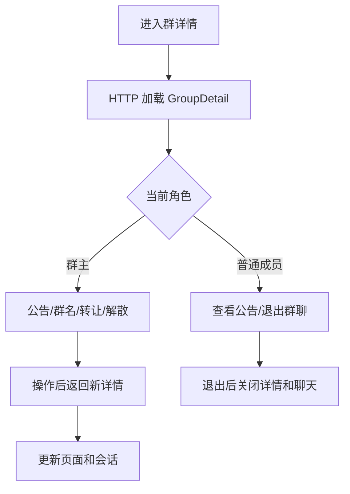
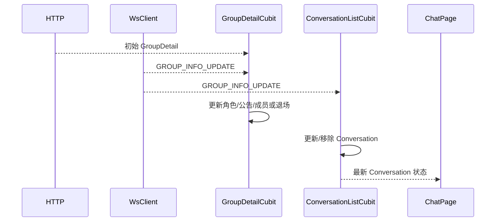
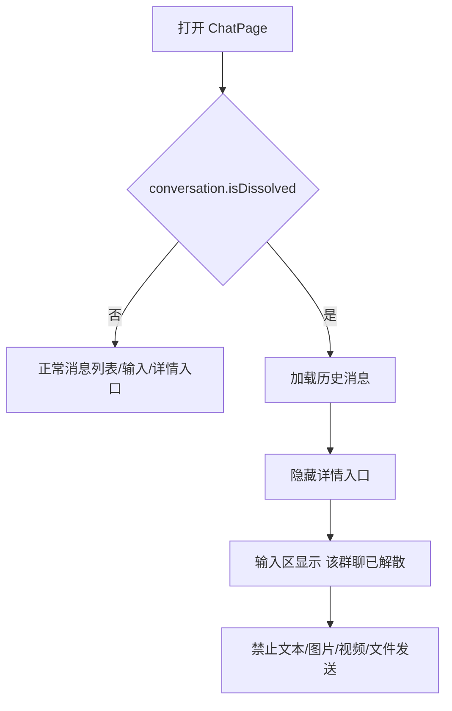
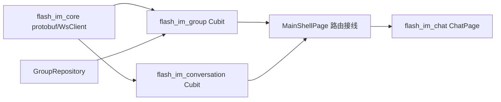

# 群治理与群信息实时同步 — 客户端设计报告

## 1. 目标

- 扩展既有群详情页，按群主/普通成员展示公告、转让、退出或解散入口。
- 提供独立群名编辑页、群公告查看/编辑页和群主转让选择页。
- 消费 `GROUP_INFO_UPDATE`，实时更新群详情、会话列表和 ChatPage 标题/权限。
- 已解散群保留在主会话列表和历史聊天页，显示只读状态并禁用输入。
- 泛化 type=5 系统消息展示，未知治理事件也始终显示服务端 `content`。

## 2. 现状分析

- `flash_im_group` 已有 `GroupRepository`、`GroupDetailCubit`、`GroupDetailsPage`、成员宫格、增删成员、改名、入群验证开关和解散能力，可直接增量扩展。
- 群名当前以内嵌编辑器修改；本版需要独立编辑页，但保留原 Repository 接口和校验规则。
- `WsClient` 已解码 type 10 入群申请并暴露广播 stream，可按同一方式增加 type 11。
- `ConversationListCubit` 只订阅最后消息更新；`Conversation` 尚无 `isDissolved`，ChatPage 也默认始终可发送并显示详情入口。
- type=5 气泡目前只识别创建/加入，未知事件存在错误回退成“创建了群聊”的风险。

## 3. 数据模型与接口

### 客户端模型

`GroupDetail` 增加：

```dart
final String announcement;
final DateTime? announcementUpdatedAt;
final int? announcementUpdatedBy;
final String announcementUpdatedByName;
final bool isDissolved;
```

`Conversation` 增加：

```dart
final bool isDissolved;
```

protobuf `GroupInfoUpdateNotification` 映射为领域值：

```dart
class GroupInfoUpdate {
  String conversationId;
  String name;
  String avatar;
  int ownerId;
  int memberCount;
  String announcement;
  DateTime? announcementUpdatedAt;
  int? announcementUpdatedBy;
  bool isDissolved;
  bool membershipActive;
  String currentUserRole;
  String changeType;
}
```

`GroupRepository` 增加：

```dart
Future<void> leaveGroup(String groupId);
Future<GroupDetail> transferOwner(String groupId, int ownerId);
Future<GroupDetail> updateAnnouncement(String groupId, String announcement);
```

继续使用既有：

```dart
Future<GroupDetail> updateName(String groupId, String name);
Future<GroupDetail> removeMember(String groupId, int memberId);
Future<void> dissolveGroup(String groupId);
```

### 状态与结果

`GroupDetailCubit` 构造时接收 `WsClient` 并订阅当前群事件；关闭时取消订阅。状态增加独立动作标记，避免公告保存、转让和退出并发触发。

```dart
enum GroupDetailsOutcome { updated, left, removed, dissolved }
```

| outcome | 上层动作 |
| --- | --- |
| `updated` | 用最新名称/头像更新当前会话 |
| `left` / `removed` | 关闭详情和 ChatPage，并从主会话列表移除 |
| `dissolved` | 关闭详情，保留 ChatPage 但切换只读，并更新会话列表标记 |

`ConversationListCubit` 订阅 `groupInfoUpdateStream`：成员有效时更新名称、头像和解散状态；`membershipActive=false` 时删除对应会话；重连或数据不完整时调用现有 `refresh()` 回源。

| 决策 | 理由 |
| --- | --- |
| 服务端 `content` 是系统消息展示源 | 新事件无需客户端拼接文案，也不会错误回退为“创建群聊” |
| HTTP 初始值 + WS 增量 | 页面首次进入和重连必须回源，WS 仅负责在线实时性 |
| 群详情 Cubit 自己订阅当前群 | 页面只渲染状态，不直接处理 protobuf 或生命周期 |
| 解散状态放在 `Conversation` | 会话列表与 ChatPage 使用同一权威状态 |

### 页面接口

```dart
GroupDetailsPage(conversation: conversation)
GroupNameEditPage(initialName: detail.name)
GroupAnnouncementPage(detail: detail, canEdit: detail.isOwner)
TransferGroupOwnerPage(members: detail.membersWithoutOwner)
ChatPage(conversation: conversation, onOpenDetails: ...)
```

页面不直接依赖 Dio；所有网络错误由 Cubit 转为中文状态或 SnackBar。

## 4. 核心流程



群详情的信息层级沿用当前 iOS 风格分组列表：成员宫格在上，名称、群号、公告、入群验证为信息组；群主转让与解散、普通成员退出放在底部危险操作组。未选中/关闭状态仍需保持足够对比度，不使用低透明度文字表达可操作性。



- `GroupDetailCubit` 只处理 `conversationId` 相同的事件。
- `membershipActive=false` 优先于其他字段，当前页立即产生 `removed` 结果并退出。
- `isDissolved=true` 不删除会话，ChatPage 切换为只读；不再允许打开群详情。
- WS 事件可能重复，状态合并必须幂等。



- 在聊天页期间收到解散事件时，不强制返回列表；保留当前历史并立即替换输入区。
- 若发消息与解散并发，服务端 404 时客户端刷新会话状态并显示“该群聊已解散”，不重复发送。
- 已解散群会话行展示“已解散”标识；最后消息仍显示服务端系统消息预览。

### 页面细节

| 页面 | 群主 | 普通成员 |
| --- | --- | --- |
| 群名称 | 可进入独立编辑页 | 只读 |
| 群公告 | 可查看和编辑发布 | 只读查看 |
| 入群验证 | iOS 风格开关，可修改 | 只读状态文案 |
| 转让群主 | 显示 | 隐藏 |
| 底部动作 | 解散群聊 | 退出群聊 |

公告页空态为“暂无群公告”；编辑态限制 2000 字并显示计数，发布成功后返回最新详情。转让页排除当前群主，选择目标后必须二次确认。

## 5. 项目结构与技术决策

```text
client/modules/
├── flash_im_core/
│   └── lib/src/{data/proto,logic/ws_client.dart} # type 11 解码与 stream
├── flash_im_group/lib/src/
│   ├── data/{group_detail,group_repository}.dart
│   ├── logic/{group_detail_cubit,group_detail_state}.dart
│   └── view/
│       ├── group_details_page.dart
│       ├── group_name_edit_page.dart
│       ├── group_announcement_page.dart
│       └── transfer_group_owner_page.dart
├── flash_im_conversation/lib/src/
│   ├── data/conversation.dart
│   ├── logic/conversation_list_cubit.dart
│   └── view/conversation_tile.dart
└── flash_im_chat/lib/src/view/
    ├── chat_page.dart
    └── bubble/message_bubble.dart
client/lib/features/home/presentation/main_shell_page.dart # 路由结果和共享状态接线
```

### 职责划分



- `flash_im_core` 只负责协议解码，不解释群业务。
- `flash_im_group` 负责群详情、权限和治理页面，不直接操作主会话列表。
- `flash_im_conversation` 负责群信息事件对会话集合的影响。
- `MainShellPage` 负责模块间路由与返回结果，不复制业务判断。
- `flash_im_chat` 仅按传入会话状态控制读写和详情入口。

| 决策 | 方案 | 理由 |
| --- | --- | --- |
| 群名编辑 | 从详情页抽成独立页面 | 与公告/转让形成一致导航层级，减少详情页内状态耦合 |
| 公告页面 | 同页查看，群主进入编辑态 | 避免为读写各建一页，同时保持普通成员只读 |
| 路由依赖 | 宿主注入已有 Repository/Cubit | 避免模块反向依赖和重复实例 |
| 解散 UI | 只读而非强制退出 | 与服务端保留历史契约一致 |

### 依赖

| 依赖 | 用途 | 已有/需新增 |
| --- | --- | --- |
| Dio / Cubit / Equatable | REST、状态和模型 | 已有 |
| `flash_im_core` | `GroupInfoUpdateNotification` 与 WS stream | 已有依赖，扩展导出 |
| `flash_im_conversation` | `Conversation.isDissolved` | 已有依赖，扩展模型 |
| Cupertino / Material | iOS 风格交互与现有主题 | 已有 |

## 6. 暂不实现

| 功能 | 理由 |
| --- | --- |
| 管理员、禁言、@所有人 | 服务端无契约 |
| 公告历史、已读列表、附件 | 本版只支持当前文本公告 |
| 已退出/被移除后的历史入口 | 服务端不再授权 |
| 恢复旧版已解散群 | 服务端不恢复旧成员关系 |
| 客户端自造群治理通知 | 必须使用服务端持久化 type=5 消息 |
| 另一套群详情页面 | 必须继续扩展现有 `GroupDetailsPage` |
