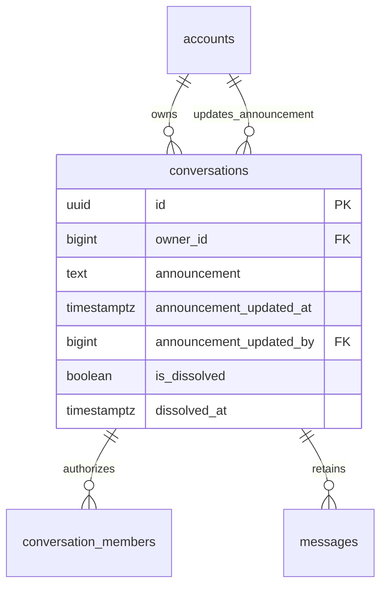
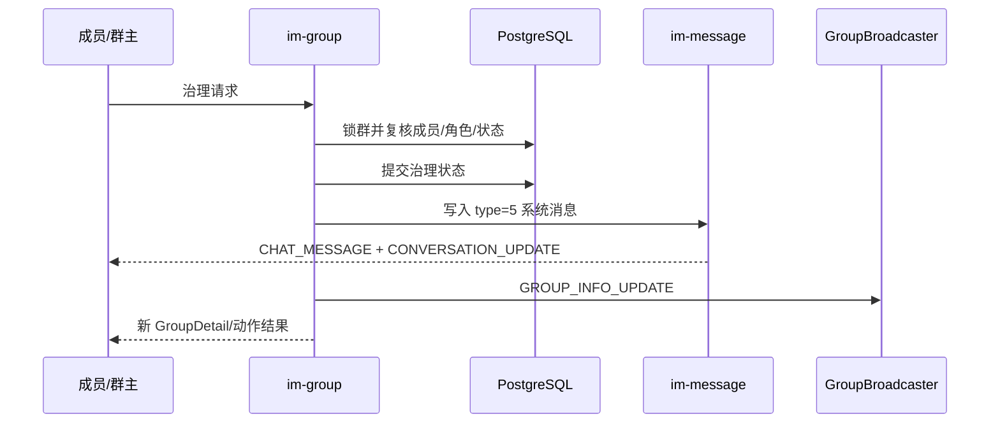
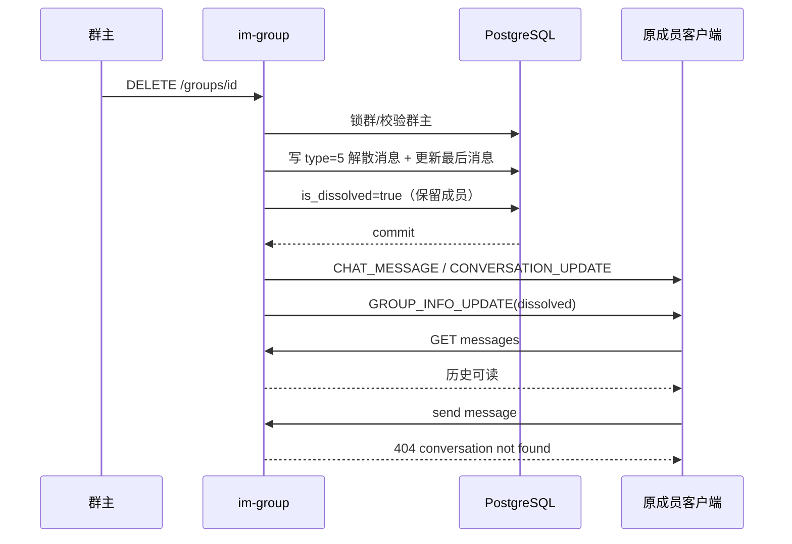
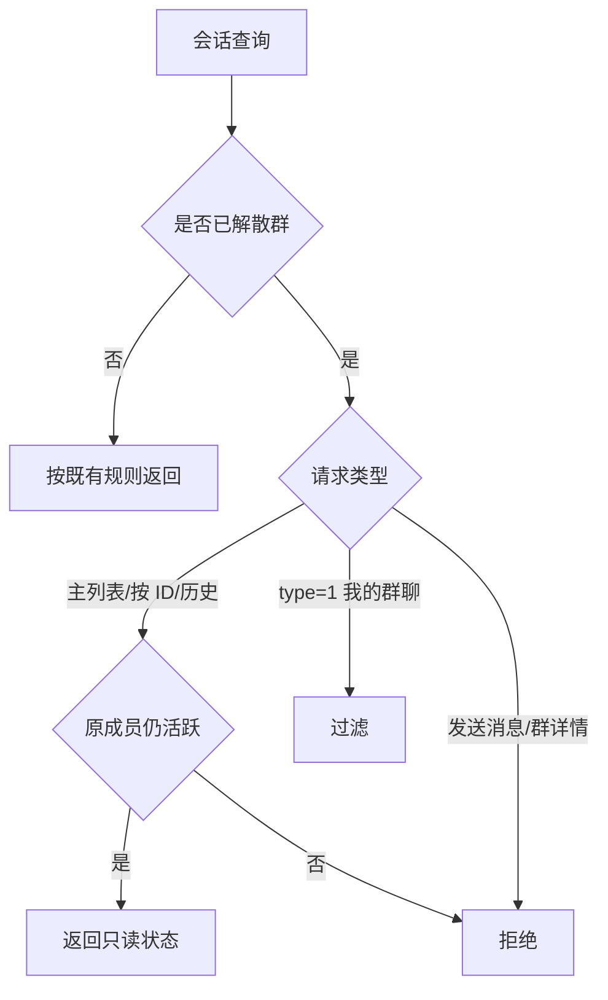

# 群治理与群信息实时同步 — 服务端设计报告

## 1. 目标

- 在既有 `im-group` 上新增普通成员退群、群主转让和群公告能力。
- 为增员、移除、退群、转让、改名、公告和解散补齐 type=5 持久化系统消息。
- 增加 `GROUP_INFO_UPDATE` WS 事件，使成员、角色、名称、头像、公告和解散状态实时同步。
- 将解散调整为保留原成员关系和消息，允许原成员继续读取历史但禁止发送。
- 保持现有搜索、入群审批、邀请卡片、宫格头像和 HTTP 路由兼容。

## 2. 现状分析

- `im-group` 已有详情、设置、成员增删、邀请、搜索入群、审批、改名和解散接口，领域层已通过 `GroupBroadcaster` 与 `MessageBroadcaster` 隔离 WS 传输。
- `conversations` 已有 `owner_id`、`join_approval_required`、`is_dissolved` 和 `dissolved_at`；公告信息尚无存储字段。
- type=5 消息已走普通消息的 seq、持久化、未读、会话预览和 WS 链路，但目前只有 `group_created`、`member_joined` 两种事件。
- 当前解散会软删全部成员；会话列表、单会话查询和历史鉴权也都排除 `is_dissolved=true`，无法保留只读历史。
- 当前增删成员、改名和解散成功后没有统一群信息事件，在线客户端只能依赖手动回源。

## 3. 数据模型与接口

### 数据模型

```sql
ALTER TABLE conversations
ADD COLUMN announcement TEXT,
ADD COLUMN announcement_updated_at TIMESTAMPTZ,
ADD COLUMN announcement_updated_by BIGINT
    REFERENCES accounts(id) ON DELETE SET NULL;

ALTER TABLE conversations
ADD CONSTRAINT conversations_announcement_length
CHECK (announcement IS NULL OR char_length(announcement) BETWEEN 1 AND 2000);
```



| 决策 | 理由 |
| --- | --- |
| 公告字段直接放在 `conversations` | 本版只保留当前公告，不需要单独实体和历史表 |
| 解散后保留 `conversation_members.is_deleted=false` | 原成员关系是只读历史授权依据，也能保留主会话列表入口 |
| 被移除/主动退群仍软删成员 | 与解散语义区分，离群用户不能继续读历史 |
| 治理通知继续使用消息 type=5 | 复用消息顺序、历史、会话预览和跨端广播，不建立第二套通知存储 |

### 群详情

既有 `GET /groups/{id}` 和所有返回 `GroupDetail` 的接口扩展：

```json
{
  "conversation_id": "uuid",
  "name": "产品交流群",
  "avatar": "grid:...",
  "owner_id": "10001",
  "join_approval_required": true,
  "announcement": "周五 18:00 发布",
  "announcement_updated_at": "2026-08-31T08:00:00Z",
  "announcement_updated_by": "10001",
  "announcement_updated_by_name": "小雨",
  "is_dissolved": false,
  "current_user_role": "owner",
  "member_count": 3,
  "members": []
}
```

已解散群不开放群详情接口；只读状态由会话接口的 `is_dissolved` 返回。

### `POST /groups/{id}/leave`

无请求体。成功返回：

```json
{ "message": "left group" }
```

仅活跃普通成员可执行。群主必须先转让或解散。

### `PATCH /groups/{id}/owner`

```json
{ "owner_id": 10002 }
```

成功返回更新后的 `GroupDetail`。目标必须是当前活跃成员且不能是当前群主。

### `PATCH /groups/{id}/announcement`

```json
{ "announcement": "周五 18:00 发布" }
```

内容去除首尾空白后必须为 1～2000 个字符。成功返回更新后的 `GroupDetail`。

### 既有接口扩展

| 接口 | 本版变化 |
| --- | --- |
| `POST /groups/{id}/members` | 成功后生成成员加入系统消息并广播群信息 |
| `DELETE /groups/{id}/members/{uid}` | 生成移除系统消息；群信息事件同时发给剩余成员和被移除者 |
| `PATCH /groups/{id}/name` | 生成改名系统消息并广播群信息 |
| `DELETE /groups/{id}` | 先形成解散系统消息，原子标记解散，不再软删成员 |
| `GET /conversations` | 未传 `type` 时包含原成员的已解散群 |
| `GET /conversations?type=1` | 继续只返回未解散群，供“我的群聊”使用 |
| `GET /conversations/{id}` | 原成员可获取已解散群，并返回 `is_dissolved=true` |
| `GET /conversations/{id}/messages` | 原成员可读已解散群历史 |
| WS/HTTP 发送消息 | 已解散群继续返回 `404 conversation not found` |

会话 JSON 增加：

```json
{ "is_dissolved": true }
```

### 错误契约

| 条件 | HTTP | message |
| --- | --- | --- |
| 群不存在、已解散或请求者不在群内 | 404 | `group not found` |
| 非群主执行转让、公告、移除、改名、解散 | 403 | `group operation is not allowed` |
| 群主主动退群 | 400 | `group owner cannot leave` |
| 新群主等于自己 | 400 | `new owner must be another member` |
| 新群主不是活跃成员 | 400 | `new owner must be an active member` |
| 公告为空或超过 2000 字 | 400 | `invalid group announcement` |
| 已解散群发送消息 | 404 | `conversation not found` |

### WS 契约

`WsFrameType.GROUP_INFO_UPDATE = 11`，payload：

```protobuf
message GroupInfoUpdateNotification {
  string conversation_id = 1;
  string name = 2;
  string avatar = 3;
  int64 owner_id = 4;
  int32 member_count = 5;
  string announcement = 6;
  string announcement_updated_at = 7;
  int64 announcement_updated_by = 8;
  bool is_dissolved = 9;
  bool membership_active = 10;
  string current_user_role = 11;
  string change_type = 12;
}
```

`change_type` 为 `members_added`、`member_removed`、`member_left`、`owner_transferred`、`announcement_updated`、`name_updated`、`dissolved`。服务端按收件人计算 `membership_active` 和 `current_user_role`；被移除或退群用户收到 `membership_active=false`，解散时原成员仍为 `true`。

### 系统消息契约

所有治理消息均为 `type=5`，`content` 是可直接展示的权威中文文本，`extra.system_event` 用于语义识别：

| system_event | 文案模式 |
| --- | --- |
| `member_joined` | `YYY 加入了群聊` 或 `XXX 邀请 YYY 加入了群聊` |
| `member_removed` | `YYY 被 XXX 移出群聊` |
| `member_left` | `XXX 退出了群聊` |
| `owner_transferred` | `XXX 将群主转让给了 YYY` |
| `announcement_updated` | `XXX 更新了群公告` |
| `group_name_updated` | `XXX 将群名修改为「YYY」` |
| `group_dissolved` | `群聊已解散` |

客户端必须优先展示 `content`，不能把未知 `system_event` 回退为“创建了群聊”。

## 4. 核心流程



- 并发顺序统一为先锁 `conversations`，再校验或更新 `conversation_members`。
- HTTP 成功以治理事务提交为准；提交后的 WS 失败不把已成功操作伪装成 500，客户端可通过 HTTP 回源纠偏。
- 解散是例外：解散系统消息和解散标记必须在同一数据库事务中形成，提交后再统一广播，避免出现“已解散但无最后通知”或“通知已出现但未解散”。





## 5. 项目结构与技术决策

```text
server/migrations/20260831000200_group_governance.sql
proto/
├── group.proto                         # GroupInfoUpdateNotification
└── ws.proto                            # GROUP_INFO_UPDATE = 11
server/modules/
├── im-group/src/
│   ├── broadcast.rs                   # 群信息领域广播契约
│   ├── models.rs                      # 公告、转让、详情模型
│   ├── repository.rs                  # 治理事务与快照
│   ├── service.rs                     # 规则、系统消息和广播编排
│   └── routes.rs                      # 新增 leave/owner/announcement
├── im-message/src/{repository,service}.rs # 通用治理系统消息与解散事务支持
├── im-conversation/src/{models,repository,service}.rs # 解散状态和读写鉴权分流
└── im-ws/src/{frame,broadcaster}.rs   # protobuf 编码和在线定向推送
```

| 决策 | 方案 | 理由 |
| --- | --- | --- |
| 领域与传输边界 | `im-group` 定义 payload/trait，`im-ws` 实现 | 保持领域模块不依赖 WebSocket 细节 |
| 详情同步 | WS 发完整轻量群快照 | 事件到达后无需连发多个 HTTP；重连仍可回源 |
| 收件人状态 | 服务端逐用户计算角色和成员有效性 | 客户端无需持有完整权限推导逻辑 |
| 历史鉴权 | 拆分“可发送成员”和“可读历史成员”判断 | 只对已解散原成员放开读取，不扩大写权限 |
| 旧解散数据 | 不恢复旧成员关系 | 旧版本已删除授权依据，自动恢复会造成越权 |

### 依赖

| 依赖 | 用途 | 已有/需新增 |
| --- | --- | --- |
| PostgreSQL / SQLx | 治理事务、公告和历史授权 | 已有 |
| Prost / protobuf | WS type 11 payload | 已有，扩展协议 |
| `MessageBroadcaster` | type=5 消息和会话预览 | 已有，扩展系统事件入口 |
| `GroupBroadcaster` | 群详情增量事件 | 已有 trait，新增方法 |

## 6. 暂不实现

| 功能 | 理由 |
| --- | --- |
| 管理员、多群主、禁言、全员禁言 | 需要新的角色模型和权限矩阵 |
| 公告历史、已读、附件和置顶 | 本版只保留当前公告 |
| 群二维码、邀请链接、公开/私密 | 需要独立安全与有效期设计 |
| 恢复 v0.0.4 以前已解散群 | 旧成员关系已被软删，无法可靠重建授权 |
| 对离群用户开放退出前历史 | 当前产品规则为离群即失去访问权 |
| WS 离线可靠投递 | 本版由 HTTP 回源保证最终纠偏 |
