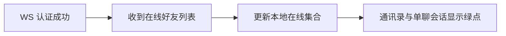

# 在线状态与已读回执 — 功能分析

## 概述

本版本为现有单聊和群聊补齐两类实时感知能力：好友在线状态，以及消息已读回执。在线状态只在好友关系范围内传播；已读位置以会话内单调递增的消息 `seq` 为准。两者复用现有 WebSocket、`conversation_members.last_read_seq`、消息历史和会话未读链路，不新增数据库表。

代码基线已经确认：

- `server/modules/im-ws/src/state.rs` 已使用 `account_id -> connection_id -> sender` 保存同一账号的多个连接，本版本只补首次上线、最后下线和在线查询语义，不重做容器。
- `conversation_members` 已有 `last_read_seq` 与 `unread_count`；现有 `POST /conversations/{id}/read` 只清零未读，没有已读位置和回执通知。
- `ChatCubit` 已订阅实时消息，`WsClient` 已提供 typed stream 分发模式，可沿用该结构增加在线事件和已读事件。
- 消息历史当前不返回已读人数；若只依赖本次连接收到的回执，重新进入页面会丢失历史已读状态，因此历史消息需要返回权威 `read_count`。

## 一、交互链

### 场景 1：登录后查看好友在线状态

**用户故事**：作为已登录用户，我想立即看到哪些好友在线，以便判断对方是否方便沟通。

用户完成 WS 认证后，服务端推送当前在线好友列表。通讯录与单聊会话头像右下角显示绿色在线点；不在线或状态尚未同步时不显示绿点。

### 场景 2：好友上线或下线

**用户故事**：作为在线用户，我想实时看到好友上下线，不必手动刷新列表。

好友的第一个连接建立后，当前页面的在线标记立即出现；好友仍有其他设备在线时，关闭其中一个连接不会显示离线；最后一个连接断开后在线标记消失。

### 场景 3：单聊页显示对方状态

**用户故事**：作为正在单聊的用户，我想在标题下看到对方是否在线。

进入单聊后，标题下显示“在线”或“离线”。状态变化由共享在线集合驱动；群聊标题不显示个人在线状态。

### 场景 4：单聊已读回执

**用户故事**：作为消息发送者，我想知道对方是否已经看到我发送的消息。

接收方进入聊天页并加载到最新消息，客户端在 1 秒防抖后上报当前最大有效 `seq`；停留在页面收到新消息时再次上报。发送方收到回执后，所有满足 `message.seq <= readSeq` 的本人消息显示“已读”，否则不显示。

### 场景 5：群聊已读人数与详情

**用户故事**：作为群消息发送者，我想知道多少群成员看过消息，并查看已读和未读成员。

本人发送的群消息下方显示“N 人已读”。点击该文字打开 BottomSheet，包含“已读”和“未读”两个页签以及成员列表。发送者本人不计入人数；离群成员不参与当前统计；群已解散但仍保留历史读取资格的原成员仍可查看历史回执。

## 二、逻辑树

### 事件流：上线与下线

| 时刻 | 事件 | 处理 | 产生的新事件 |
| --- | --- | --- | --- |
| T1 | WS 认证成功 | `WsState.register` 注册 `connection_id` 并返回是否为该账号首个连接 | 当前连接可收发业务帧 |
| T2 | 首个连接上线 | 查询该账号好友 ID，向在线好友发送 `USER_ONLINE` | 好友在线集合增加该账号 |
| T3 | 初始化当前连接 | 查询在线好友交集，仅向新连接发送 `ONLINE_LIST` | 当前账号得到权威在线集合 |
| T4 | WS 连接结束 | `WsState.unregister` 删除指定连接并返回是否为最后连接 | 若仍有其他连接则不广播 |
| T5 | 最后连接下线 | 查询好友 ID，向在线好友发送 `USER_OFFLINE` | 好友在线集合移除该账号 |

### 事件流：已读上报

| 时刻 | 事件 | 处理 | 产生的新事件 |
| --- | --- | --- | --- |
| T1 | 聊天历史加载完成或收到新消息 | 客户端计算已加载消息最大正数 `seq` | 启动或重置 1 秒防抖 |
| T2 | 防抖到期 | 客户端发送 `READ_RECEIPT(conversation_id, read_seq)` | WS 上行帧 |
| T3 | 服务端校验 | 校验活跃成员身份、`read_seq > 0` 且不超过会话当前序号 | 非法请求不修改数据 |
| T4 | 原子更新 | `last_read_seq = GREATEST(old, read_seq)`，按有效已读位置重算本人 `unread_count` | 返回前后已读位置 |
| T5 | 实时通知 | 向会话活跃成员广播服务端重建的 `READ_RECEIPT` | 客户端幂等更新本人消息已读数 |
| T6 | 历史初始化 | 历史查询按消息统计除发送者外 `last_read_seq >= message.seq` 的成员数 | 重进页面仍显示权威已读数 |

### 状态流转

| 实体 | 触发事件 | 前状态 | 后状态 |
| --- | --- | --- | --- |
| `WsState` 连接集合 | 首个连接认证 | 无该账号连接 | 有一个连接，账号在线 |
| `WsState` 连接集合 | 非最后连接断开 | N 个连接 | N-1 个连接，账号仍在线 |
| `WsState` 连接集合 | 最后连接断开 | 一个连接 | 无连接，账号离线 |
| 客户端在线集合 | `ONLINE_LIST` | 任意旧集合 | 替换为服务端列表 |
| 客户端在线集合 | `USER_ONLINE/OFFLINE` | 不含/包含账号 | 增加/移除账号 |
| `last_read_seq` | 合法已读上报 | old | `max(old, read_seq)` |
| `unread_count` | 已读位置推进 | 旧未读数 | `seq > effective_read_seq` 且非本人发送的消息数 |
| 消息 `read_count` | 回执从 previous 推进至 current | N | 对落在增量区间内的消息加一 |

### 异常流与回退

| 异常 | 触发条件 | 用户反馈 | 系统回退 |
| --- | --- | --- | --- |
| 在线列表查询失败 | 认证后数据库不可用 | 不阻断登录，暂按离线展示 | 保持 WS，等待重连后的新列表 |
| 重复上下线事件 | 重连或乱序到达 | 无额外提示 | 在线集合使用 Set 幂等增删 |
| 非成员上报已读 | 会话无活跃成员关系 | 无 UI 弹窗 | 服务端拒绝且不修改数据库 |
| `read_seq` 越界 | 小于等于 0 或大于当前会话序号 | 保持原状态 | 服务端返回错误并记录日志 |
| 已读位置回退 | 上报值小于已保存值 | UI 不回退 | 服务端保留旧值，通知携带相同前后位置 |
| 已读详情加载失败 | BottomSheet HTTP 请求失败 | 显示“加载失败，请重试” | 保留消息列表，不影响聊天 |
| WS 暂时断开 | 上报时通道不可用 | 不阻塞页面 | 重连后由历史 `read_count` 和下一次上报纠偏 |

### 设计决策

| 决策 | 方案 | 理由 |
| --- | --- | --- |
| 在线状态传播范围 | 仅好友 | 避免向非好友泄露在线信息并减少广播 |
| 多端在线判断 | 复用现有多连接 Map，注册返回 `is_first`、注销返回 `is_last` | 现有结构已经支持多端，无需重构数据结构 |
| 在线状态持久化 | 不落库，仅保存在当前服务进程 | 在线是瞬时状态，首版不引入 Redis |
| 已读位置 | 使用已有 `last_read_seq` 单调递增 | 与消息排序、分页和未读模型一致 |
| 已读上报时机 | 历史加载完成与收到当前会话新消息时，1 秒防抖 | 覆盖进入页面和持续阅读，避免逐条请求 |
| 历史已读初始化 | 消息历史增加 `read_count` | 避免每条消息单独请求，也避免重进页面丢状态 |
| 群已读详情 | 单消息 HTTP 查询 | 详情不是高频实时路径，HTTP 更适合失败重试和结构化列表 |
| 回执幂等 | 通知同时携带 `previous_read_seq` 与 `read_seq` | 客户端只对推进区间加一，避免重复回执重复计数 |

## 三、功能编号与网络定位

### 本次新增节点

| 编号 | 功能节点 | 层级 | 简介 |
| --- | --- | --- | --- |
| I-08 | 在线连接语义 | 基础设施 | 在既有多连接 WsState 上补首连、末连和在线查询 |
| D-31 | 好友在线广播 | 领域 | 首次上线和最后下线只通知在线好友 |
| D-32 | 在线列表初始化 | 领域 | 认证后向当前连接发送在线好友列表 |
| D-33 | 已读位置处理 | 领域 | 校验并推进 last_read_seq、重算未读、广播回执 |
| D-34 | 单消息已读详情 | 领域 | 返回当前已读和未读成员列表 |
| F-12 | 在线状态 typed stream | 前端基础 | WsClient 分发上线、下线和在线列表 |
| F-13 | 已读回执 typed stream | 前端基础 | WsClient 发送并分发已读回执 |
| F-14 | 在线状态共享存储 | 前端基础 | 维护在线账号 Set，供多个页面复用 |
| P-41 | 在线状态展示 | 前端业务 | 通讯录、单聊会话头像绿点和单聊标题状态 |
| P-42 | 已读状态展示 | 前端业务 | 单聊“已读”、群聊人数和成员详情 |
| P-43 | 已读位置上报 | 前端业务 | ChatCubit 防抖发送当前会话最大已读 seq |

### 前置依赖

| 依赖节点 | 依赖方式 | 是否已有 |
| --- | --- | --- |
| WS 认证与重连 | 扩展认证后流程 | 是 |
| 多连接 `WsState` | 扩展返回值与查询方法 | 是 |
| 好友关系 `friend_relations` | 查询好友 ID | 是 |
| 消息 `seq` 与历史接口 | 共享顺序和返回结构 | 是 |
| `conversation_members.last_read_seq` | 更新已有字段 | 是 |
| 会话未读推送 | 已读后同步清零结果 | 是 |

### 边界接口

| 接口/协议/数据结构 | 定义方 | 消费方 | 敏感度 |
| --- | --- | --- | --- |
| `USER_ONLINE` / `USER_OFFLINE` | `proto/ws.proto`、im-ws | WsClient / 在线存储 | 高 |
| `ONLINE_LIST` | `proto/ws.proto`、`presence.proto` | WsClient / 在线存储 | 高 |
| `READ_RECEIPT` | `proto/ws.proto`、`message.proto` | ChatCubit / im-ws dispatcher | 高 |
| 历史消息 `read_count` | im-message HTTP | MessageRepository / 消息气泡 | 中 |
| `GET /conversations/{id}/messages/{mid}/read-status` | im-message | 群聊已读详情 BottomSheet | 中 |

## 四、范围与结论

### 确认范围

- 服务端协议、连接状态、好友范围广播、已读位置事务、历史已读数和已读详情接口。
- Flutter WsClient、共享在线集合、通讯录/会话/聊天页在线展示、已读上报和回执 UI。
- Rust 单元/数据库路由测试、Flutter 单元/Widget 测试、API/WS 链路脚本和质量门禁。

### 暂不实现

- 不记录“最后在线时间”，离线只展示“离线”。
- 不提供关闭已读回执或隐藏在线状态的隐私开关。
- 不做推送通知、后台保活或操作系统级在线判断。
- 不引入 Redis；多实例部署时跨实例在线状态与广播留待后续版本。
- 不记录每条消息的精确阅读时间或阅读停留时长。

### 开发顺序

`Proto` → `WsState` 首连/末连语义 → 好友在线广播 → 已读事务与详情接口 → Flutter typed streams 与在线存储 → 在线 UI → ChatCubit 已读上报与气泡/详情 UI → API 链路与质量门禁。
