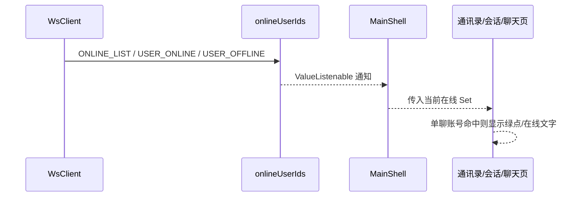
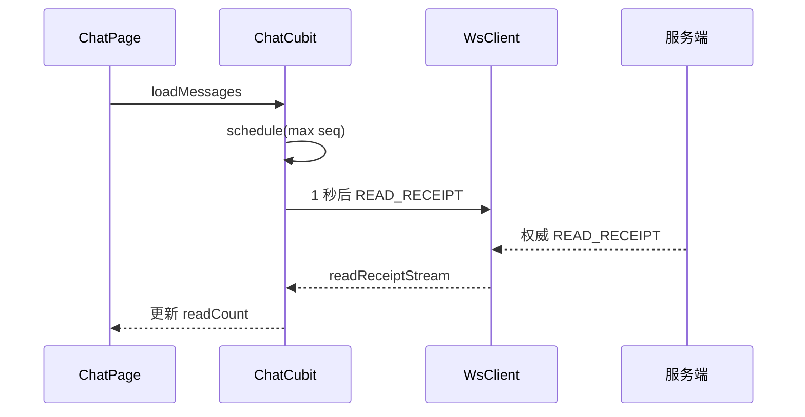
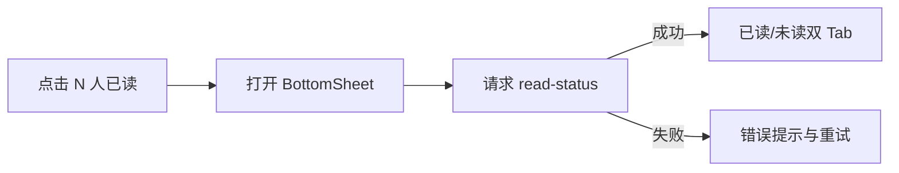

# 在线状态与已读回执 — 客户端设计报告

## 1. 目标

- 分发在线列表、上下线和已读回执 protobuf 帧。
- 在共享 `WsClient` 生命周期内维护在线账号集合。
- 通讯录与单聊会话显示在线绿点，单聊标题显示在线/离线。
- ChatCubit 自动防抖上报已读位置，并实时更新本人消息的已读状态。
- 单聊显示“已读”，群聊显示“N 人已读”并提供已读/未读成员 BottomSheet。

## 2. 现状分析

- `WsClient` 是应用级单例，已负责认证、重连、心跳和 typed stream 分发，适合作为在线集合的生命周期宿主。
- `FriendAvatarTile`、`ConversationTile` 和 `ChatPage` 分属不同模块，但都已依赖 `flash_im_core` 或由宿主注入数据。
- `ChatCubit` 已持有 `WsClient`、当前会话和当前用户，并在历史加载与实时消息处形成自然的已读上报触发点。
- `Message` 当前没有 `readCount`，已发送状态图标只表示传输成功，不代表对方已读。
- `MessageRepository` 已承载消息 HTTP 接口，适合增加单消息读取详情。

## 3. 数据模型与接口

### 在线状态

`WsClient` 暴露：

```dart
Stream<UserPresenceEvent> get userPresenceStream;
Stream<OnlineUserList> get onlineListStream;
ValueListenable<Set<int>> get onlineUserIds;
bool isUserOnline(int userId);
```

处理规则：

- `ONLINE_LIST` 原子替换 Set。
- `USER_ONLINE` 幂等增加，`USER_OFFLINE` 幂等移除。
- WS 进入 `disconnected` 时清空 Set，避免展示陈旧在线状态。

### 已读状态

```dart
class Message {
  final int readCount;
}

class ReadStatusMember {
  final String userId;
  final String nickname;
  final String avatar;
}

class MessageReadStatus {
  final String messageId;
  final int seq;
  final List<ReadStatusMember> readMembers;
  final List<ReadStatusMember> unreadMembers;
}
```

`MessageRepository` 增加：

```dart
Future<MessageReadStatus> getReadStatus({
  required String conversationId,
  required String messageId,
});
```

`WsClient` 增加：

```dart
Stream<ReadReceipt> get readReceiptStream;
bool sendReadReceipt({required String conversationId, required int readSeq});
```

仅当 WS 已认证时返回 `true`。发送失败时 ChatCubit 不推进本地 `_lastReportedReadSeq`，并在下一次认证成功时重试。

### ChatCubit 状态规则

- 历史加载成功后取最大正数 `seq`，1 秒防抖上报。
- 收到当前会话的新消息并上屏后再次调度。
- 对服务端回执，仅更新当前用户发送且 `previous_read_seq < message.seq <= read_seq` 的消息。
- `reader_id == currentUserId` 时不增加本人消息的 `readCount`。
- 历史返回的 `readCount` 是基线，实时回执只叠加推进区间。

## 4. 核心流程

### 在线状态 UI



群聊头像不显示在线点；通讯录和会话列表不自行订阅 protobuf，避免每个列表项建立监听。

### 已读上报与展示



### 群聊已读详情



## 5. 项目结构与技术决策

### 项目结构

```text
client/
├── lib/
│   ├── app/flash_im_app.dart                 # 继续注入共享 WsClient
│   └── features/home/main_shell_page.dart    # 监听在线集合并下发
└── modules/
    ├── flash_im_core/
    │   ├── lib/src/data/proto/               # 生成 presence/message/ws Dart
    │   └── lib/src/logic/ws_client.dart       # typed streams + 在线 Set + 回执发送
    ├── flash_im_friend/
    │   └── lib/src/view/                      # 通讯录头像在线点
    ├── flash_im_conversation/
    │   └── lib/src/view/                      # 单聊会话头像在线点
    └── flash_im_chat/
        ├── lib/src/data/                      # readCount/read-status DTO 与 API
        ├── lib/src/logic/chat_cubit.dart      # 防抖上报与回执合并
        └── lib/src/view/                      # 标题状态、气泡回执、详情 Sheet
```

### 职责划分

- `flash_im_core` 只处理协议、连接和跨模块在线集合，不依赖业务页面。
- `flash_im_chat` 解释回执对消息的含义并负责详情 API，不修改会话列表状态管理。
- `flash_im_friend` 与 `flash_im_conversation` 只接收 `isOnline`/在线 Set 展示，不解析 WS 帧。
- App 层负责把共享 `WsClient.onlineUserIds` 传给首页业务页面；聊天路由直接复用同一 WsClient。

### 技术决策

| 决策 | 方案 | 理由 |
| --- | --- | --- |
| 在线集合宿主 | `WsClient` 内部 `ValueNotifier<Set<int>>` | 与连接生命周期一致，不新增跨包 Cubit 依赖 |
| 列表更新粒度 | 页面级监听后向 tile 传 bool | 避免每个列表项订阅流 |
| 回执状态归属 | `Message.readCount` | 历史和实时使用同一渲染数据源 |
| 防抖位置 | ChatCubit | 便于测试 Timer、页面保持纯展示 |
| 详情加载 | 独立 Stateful BottomSheet | 不把低频详情请求塞进长期 ChatState |
| 失败策略 | 上报静默重试、详情显式重试 | 阅读动作不应被错误弹窗打断 |

## 6. 暂不实现

| 功能 | 理由 |
| --- | --- |
| 最后在线时间 | 服务端无数据契约 |
| 隐身与回执开关 | 本版无用户设置模型 |
| 后台推送/角标 | 不属于前台 WS 在线状态 |
| 精确可视区域逐条曝光 | 当前列表以最新消息可见为产品前提，本版按最大已加载 seq 上报 |
| 已读详情实时保持打开更新 | 打开时请求权威快照即可 |
