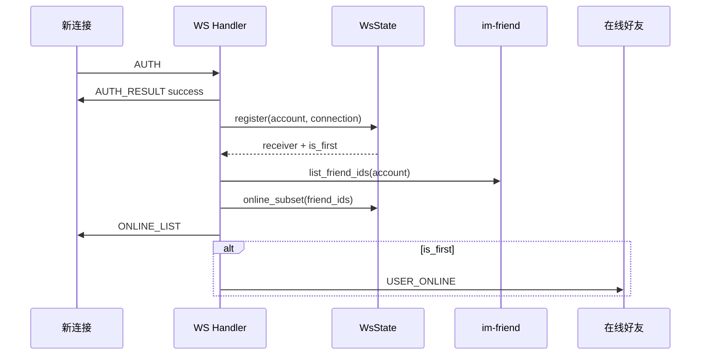
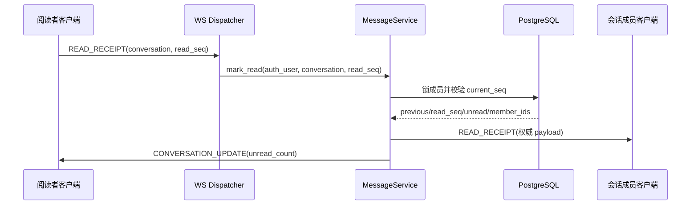

# 在线状态与已读回执 — 服务端设计报告

## 1. 目标

- 在好友范围内推送首次上线、最后下线和认证后的在线好友列表。
- 通过 WS 接收并广播基于消息 `seq` 的已读回执。
- 使用已有 `conversation_members.last_read_seq` 原子推进已读位置并重算未读数。
- 消息历史返回权威 `read_count`，群聊提供单消息已读/未读成员详情接口。
- 保持现有消息发送、历史读取、HTTP 清未读和群聊只读历史兼容。

## 2. 现状分析

- `WsState` 已按账号保存多个 `connection_id`，具备多端容器但没有首连/末连返回值及在线查询。
- WS 认证成功后直接进入业务循环，没有在线好友初始化与好友范围状态广播。
- `conversation_members.last_read_seq` 已存在但没有被当前已读接口更新；`POST /conversations/{id}/read` 只清零 `unread_count`。
- 消息历史已按 `seq` 查询，适合同时统计读取该消息的活跃成员数量。
- `MessageBroadcaster` 已隔离消息领域与 WS 传输，可继续承载已读回执和会话未读纠偏。

## 3. 数据模型与接口

### 数据模型

本版本不新增迁移，复用：

```sql
conversation_members.last_read_seq BIGINT NOT NULL DEFAULT 0;
conversation_members.unread_count INT NOT NULL DEFAULT 0;
messages.seq BIGINT NOT NULL;
```

已读推进事务输出：

```text
ReadAdvance {
  conversation_id: Uuid,
  reader_id: i64,
  previous_read_seq: i64,
  read_seq: i64,
  unread_count: i32,
  member_ids: Vec<i64>
}
```

规则：

- 请求者必须是未删除、未解散会话的活跃成员。
- `read_seq` 必须大于 0 且不超过 `conversation_seq.current_seq`。
- 有效位置是 `max(previous_read_seq, requested_read_seq)`。
- 未读数重新计算为有效位置之后、且发送者不是当前读取者的消息数量。

### Protobuf 契约

`proto/ws.proto` 追加且不复用既有编号：

```protobuf
USER_ONLINE = 12;
USER_OFFLINE = 13;
ONLINE_LIST = 14;
READ_RECEIPT = 15;
```

新建 `proto/presence.proto`：

```protobuf
message UserPresenceEvent {
  int64 user_id = 1;
}

message OnlineUserList {
  repeated int64 user_ids = 1;
}
```

`proto/message.proto` 追加：

```protobuf
message ReadReceipt {
  string conversation_id = 1;
  int64 reader_id = 2;
  int64 previous_read_seq = 3;
  int64 read_seq = 4;
}

message ChatMessage {
  // 保留字段 1～11
  int32 read_count = 12;
}
```

客户端上报时 `reader_id` 和 `previous_read_seq` 不可信，服务端只读取 `conversation_id/read_seq`，并用认证账号和数据库旧值重建广播 payload。

### 消息历史扩展

`GET /conversations/{id}/messages` 中每条消息新增：

```json
{
  "id": "message-uuid",
  "seq": 42,
  "sender_id": "10001",
  "read_count": 2
}
```

`read_count` 统计当前未软删成员中除消息发送者外，满足 `last_read_seq >= message.seq` 的人数。

### 单消息已读详情

`GET /conversations/{conversation_id}/messages/{message_id}/read-status`

成功响应：

```json
{
  "message_id": "message-uuid",
  "conversation_id": "conversation-uuid",
  "seq": 42,
  "read_members": [
    {
      "user_id": "10002",
      "nickname": "橘橙",
      "avatar": "identicon:10002"
    }
  ],
  "unread_members": []
}
```

约束：

- 请求者必须具备当前会话历史读取权限。
- 仅消息发送者可查看该消息的成员级回执详情。
- 消息必须属于路径中的会话。
- 发送者本人不进入已读或未读列表。
- 成员昵称优先群昵称，再回退个人昵称和 `用户 {id}`。

### 错误契约

| 条件 | WS/HTTP 结果 | message |
| --- | --- | --- |
| 会话不存在或不是活跃成员 | 拒绝回执 / 404 | `conversation not found` |
| `read_seq <= 0` 或超过当前序号 | 拒绝回执 | `invalid read sequence` |
| 消息不存在或不属于会话 | 404 | `message not found` |
| 非发送者查询成员级详情 | 403 | `read status is not allowed` |

## 4. 核心流程

### 在线状态



断开时仅 `unregister` 返回 `is_last=true` 才查询好友并发送 `USER_OFFLINE`。好友查询或通知失败只记录日志，不中断其他连接清理。

### 已读回执



- 相同或更小的 `read_seq` 允许幂等处理，广播中前后位置相同，客户端不会重复加已读人数。
- 事务提交后广播失败不回滚已读事实；重进页面由历史 `read_count` 纠偏。
- 旧 HTTP `POST /conversations/{id}/read` 保留，继续用于进入页面时立即清除本地/服务端未读；精确 `last_read_seq` 由 WS 回执补齐。

## 5. 项目结构与技术决策

### 项目结构

```text
proto/
├── ws.proto                         # 新增帧 12～15
├── presence.proto                   # 在线事件 payload
└── message.proto                    # ReadReceipt + ChatMessage.read_count
server/modules/
├── im-friend/src/repository.rs      # 好友 ID 查询
├── im-message/src/
│   ├── models.rs                    # read_count / read-status DTO
│   ├── repository.rs                # 已读推进、历史统计、详情查询
│   ├── service.rs                   # 校验、广播和详情权限
│   ├── routes.rs                    # read-status HTTP
│   └── broadcast.rs                 # ReadReceiptPayload 抽象
└── im-ws/src/
    ├── state.rs                     # 首连/末连/在线查询
    ├── handler.rs                   # 在线列表及上线/下线广播
    ├── dispatcher.rs                # READ_RECEIPT 上行
    ├── frame.rs                     # 新帧编码
    ├── broadcaster.rs               # 回执 protobuf 映射
    └── build.rs                     # 编译 presence.proto
```

### 职责划分

- `im-friend` 只提供好友关系查询，不依赖 WS 状态。
- `im-message` 持有已读业务规则、数据库事务和 HTTP 详情契约，不直接操作连接。
- `im-ws` 持有瞬时在线状态、认证生命周期和 protobuf 编解码，通过 broadcaster 实现消息领域通知。
- `im-conversation` 的旧 HTTP 清未读接口保持不变，本版本不把精确回执逻辑拆成第二套实现。

### 技术决策

| 决策 | 方案 | 理由 |
| --- | --- | --- |
| 在线范围 | 每次首连/末连查询当前好友关系 | 删除好友后不会继续收到后续状态 |
| 多端判断 | 在同一互斥锁内计算首连/末连 | 避免并发连接产生重复上下线事件 |
| 已读事务归属 | `im-message` | 输入和统计均围绕消息 `seq`，同时复用 MessageBroadcaster |
| 历史计数 | SQL 相关子查询 | 页大小最多 100、群成员最多 200，无需新增冗余表 |
| 详情权限 | 仅消息发送者 | 成员级阅读情况属于敏感信息 |
| 数据库迁移 | 无 | 所需字段与索引已存在 |

## 6. 暂不实现

| 功能 | 理由 |
| --- | --- |
| Redis/跨服务实例 Presence | 当前运行模型为单实例，后续独立扩展 |
| 最后在线时间 | 需要持久化和隐私策略 |
| 精确阅读时间 | 现有模型只保存连续 read seq |
| 隐身或关闭回执 | 需要新增用户设置与双方产品规则 |
| APNs/后台在线 | 不属于 WS 前台连接语义 |
