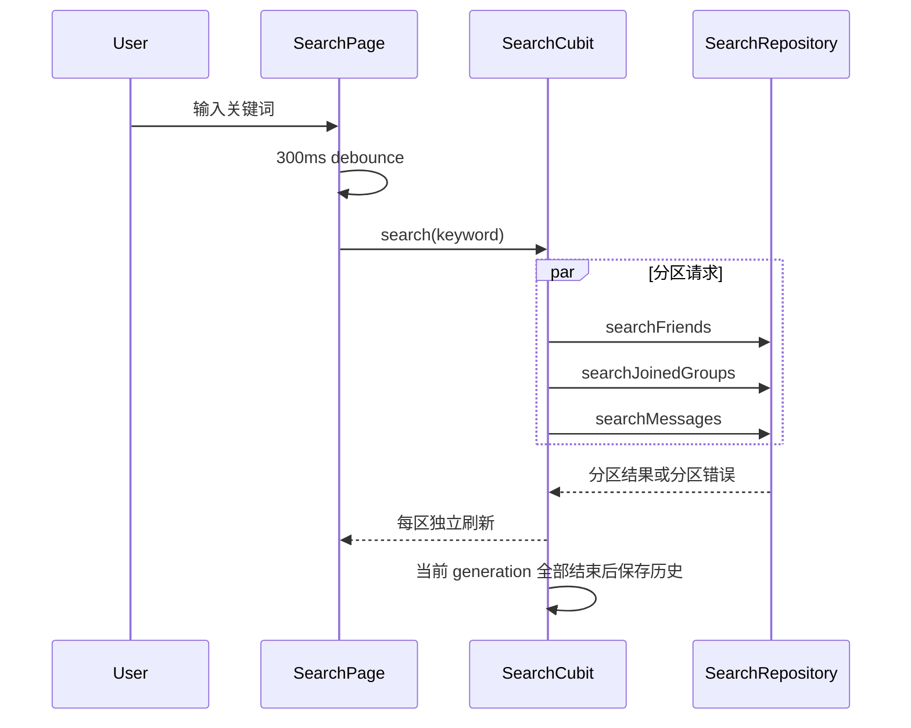
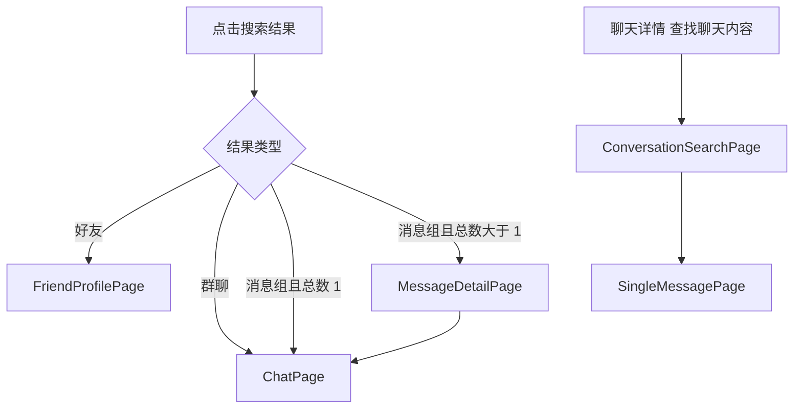

# 综合搜索 — 客户端设计报告

## 1. 目标

- 新增独立 `flash_im_search` Flutter package，承载模型、Repository、Cubit、历史存储和搜索页面。
- 消息与通讯录首页共用综合搜索入口。
- 分区展示好友、已加入群和按会话分组的消息，默认每区 3 条并可展开。
- 支持三个请求并发、分区逐个完成和部分失败重试。
- 在单聊与群聊详情页提供会话内搜索入口，并展示单条消息详情。

## 2. 现状分析

宿主采用 `MultiRepositoryProvider + Cubit + Navigator`，业务 package 对外导出稳定类型，页面通过回调把跨模块导航交给宿主。现有 `FriendUser`、`Conversation`、`Message`、头像组件和 `DioFactory` 鉴权链可复用；`shared_preferences` 已是根应用依赖。

当前消息首页没有搜索栏，通讯录右上角搜索进入的是仅好友搜索；聊天详情页也没有“查找聊天内容”。本版本保留既有加好友和公开群搜索流程，把两个首页搜索入口改接综合搜索。

## 3. 数据模型与接口

### 数据模型

```text
MessageSearchGroup
├── Conversation conversation
├── int matchCount
└── List<Message> messages

SearchState
├── String keyword
├── List<FriendUser> friends
├── List<Conversation> groups
├── List<MessageSearchGroup> messageGroups
├── Set<SearchSection> pendingSections
├── Set<SearchSection> failedSections
├── List<String> history
└── bool hasSearched
```

`ConversationSearchState` 独立管理当前会话的关键词、消息、加载和错误，避免综合搜索状态污染聊天详情流程。

| 决策 | 理由 |
|---|---|
| 复用已有领域模型 | 搜索结果点击后可直接进入现有资料页和 ChatPage |
| 每个请求完成即 emit | 慢接口不阻塞其他分区先展示 |
| generation 丢弃过期结果 | 300ms 防抖仍可能出现响应乱序 |
| 历史存储抽象接口 | SharedPreferences 可替换，Cubit 单测无需平台通道 |

### 接口依赖

`SearchRepository` 依赖服务端四个搜索接口：

```dart
abstract interface class SearchRepository {
  Future<List<FriendUser>> searchFriends(String query);
  Future<List<Conversation>> searchJoinedGroups(String query);
  Future<List<MessageSearchGroup>> searchMessages(String query);
  Future<List<Message>> searchConversationMessages({
    required String conversationId,
    required String query,
  });
}
```

`SearchHistoryStore` 提供 `load`、`save`、`clear`；默认 SharedPreferences key 为 `im_search_history_v1`，去重置顶并保留 20 条。

## 4. 核心流程





空关键词显示历史；点击历史重新搜索。三个分区全部失败时仍保留每区重试入口，任一区成功即展示成功数据。新的搜索开始时保留上一关键词的数据会造成视觉误导，因此清空旧分区结果。

## 5. 项目结构与技术决策

```text
client/modules/flash_im_search/
├── lib/flash_im_search.dart
├── lib/src/data/
│   ├── search_models.dart
│   ├── search_repository.dart
│   └── search_history_store.dart
├── lib/src/logic/
│   ├── search_cubit.dart
│   ├── search_state.dart
│   ├── conversation_search_cubit.dart
│   └── conversation_search_state.dart
└── lib/src/view/
    ├── search_page.dart
    ├── message_detail_page.dart
    ├── conversation_search_page.dart
    ├── single_message_page.dart
    └── widgets/highlight_text.dart
```

依赖方向：`view -> logic -> data`；search package 只依赖现有 friend/conversation/chat/shared package，不依赖宿主路由或 group package。跨业务导航通过 `ValueChanged<FriendUser>`、`ValueChanged<Conversation>` 回调交给宿主。

| 决策 | 方案 | 理由 |
|---|---|---|
| 状态管理 | Cubit，不引入 Event 层 | 与当前项目一致 |
| 导航 | package 内页面自导航，跨领域目标使用回调 | 防止 feature package 反向依赖宿主 |
| 详情入口集成 | 现有详情页新增 `onSearchMessages` 回调 | 避免 `flash_im_group -> flash_im_search` 循环依赖 |
| 文本高亮 | 本地 RichText span | 无需新增第三方依赖 |

| 依赖 | 用途 | 已有/需新增 |
|---|---|---|
| Dio / flutter_bloc / equatable | 网络与状态 | 已有版本 |
| shared_preferences | 搜索历史 | 根应用已有，search package 新增声明 |
| flash_im_friend / conversation / chat / shared | 复用领域模型和 UI | workspace 已有 |

## 6. 暂不实现

| 功能 | 理由 |
|---|---|
| 搜索陌生人、公开群 | 保留既有专用入口 |
| 搜索历史云同步、多设备同步 | 首版只做本地最多 20 条 |
| 聊天列表滚动并定位/闪烁目标消息 | 服务端和 ChatCubit 尚无锚点加载协议，首版进入详情页或 ChatPage |
| 拼音、语音、图片 OCR、附件内容索引 | 不在分析范围 |
| UI 动效和平台原生搜索组件 | 首版沿用当前 Material 设计系统 |
