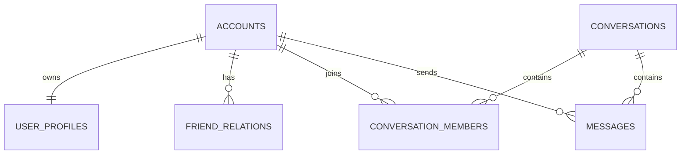
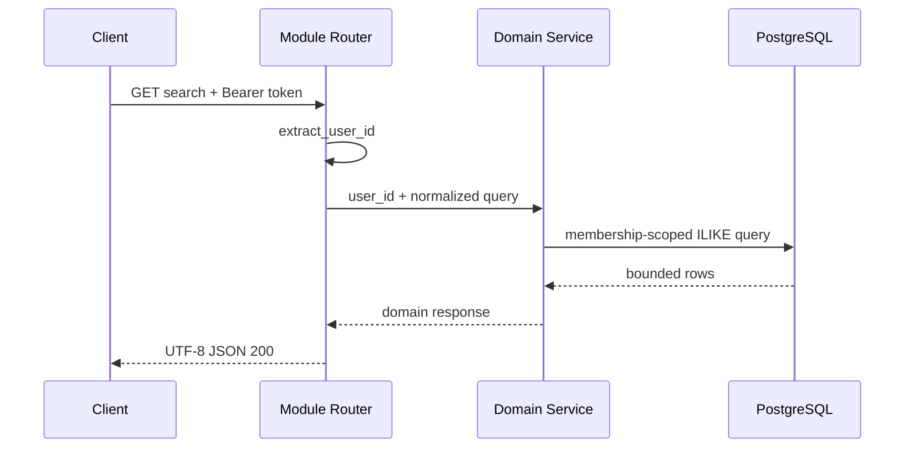

# 综合搜索 — 服务端设计报告

## 1. 目标

- 提供仅搜索当前用户好友的接口。
- 提供仅搜索当前用户已加入且未解散群聊的接口。
- 提供跨当前用户可见会话的消息搜索，并按会话分组返回。
- 提供单个可见会话内的消息搜索。
- 对关键词、结果上限、会话可见性和系统消息过滤执行统一约束。

## 2. 现状分析

服务端是 Axum + SQLx + PostgreSQL workspace，好友、会话、消息分别由 `im-friend`、`im-conversation`、`im-message` 管理，根路由只负责合并模块 Router。已有 JWT 用户提取、统一 `{ "message": ... }` 错误响应、会话成员可见性和消息发送者资料投影。

本版本不新增业务表。现有普通 B-tree 索引不能有效支撑 `%keyword%` 的 `ILIKE`，需增加 `pg_trgm` GIN 索引。分析稿中的 `sender_id != 0` 与当前实现冲突：系统消息使用真实操作者账号并以消息类型 `5` 标识，因此统一按 `messages.type <> 5` 过滤。

## 3. 数据模型与接口

### 数据模型

```sql
CREATE EXTENSION IF NOT EXISTS pg_trgm;
CREATE INDEX IF NOT EXISTS idx_user_profiles_nickname_trgm
  ON user_profiles USING GIN (nickname gin_trgm_ops);
CREATE INDEX IF NOT EXISTS idx_conversations_name_trgm
  ON conversations USING GIN (name gin_trgm_ops);
CREATE INDEX IF NOT EXISTS idx_messages_content_search_trgm
  ON messages USING GIN (content gin_trgm_ops)
  WHERE type <> 5;
```



新增响应模型：

- `MessageSearchGroup { conversation, match_count, messages }`
- `conversation` 沿用 `ConversationListItem`，避免客户端出现第二套会话模型。
- `messages` 沿用 `MessageWithSender`，包含发送者昵称、头像、内容、类型、序号和时间。

| 决策 | 理由 |
|---|---|
| 不新增搜索聚合服务 crate | 搜索权限和 SQL 仍属于现有领域模块，根 Router 不承载业务 |
| 通配符按普通字符转义 | 防止用户输入 `%`、`_` 意外扩大查询范围 |
| 系统消息按 `type = 5` 排除 | 当前系统消息发送者是真实账号，不存在 `sender_id = 0` |
| 消息分组复用会话详情投影 | 私聊对端资料、群头像和解散状态保持单一语义来源 |

### 接口契约

所有接口要求 `Authorization: Bearer <token>`；`q` 去首尾空格后长度为 1–100 个 Unicode 字符。非法参数返回 `400`，无权限的会话返回 `404`，认证失败返回 `401`。

#### `GET /api/friends/search?q=小明&limit=20`

- `limit` 默认 20，最大 50。
- 只返回 `friend_relations.user_id = 当前用户` 对应好友。

```json
[
  {
    "account_id": 10002,
    "nickname": "小明",
    "avatar": "identicon:10002",
    "signature": "",
    "flash_id": "flash_10002",
    "relation_status": "friend",
    "created_at": "2026-09-04T08:00:00Z"
  }
]
```

#### `GET /api/conversations/search-joined-groups?q=项目&limit=20`

- `limit` 默认 20，最大 50。
- 只返回当前用户成员关系有效、`type = 1` 且未解散的群聊。

```json
[
  {
    "id": "39d1d652-5558-4f90-bfab-8c32ac58df91",
    "type": 1,
    "name": "项目群",
    "avatar": "grid:identicon:10001,identicon:10002",
    "owner_id": "10001",
    "member_avatars": ["identicon:10001", "identicon:10002"],
    "member_count": 2,
    "unread_count": 0,
    "announcement": "",
    "is_dissolved": false,
    "created_at": "2026-09-04T08:00:00Z"
  }
]
```

#### `GET /api/messages/search?q=发布&group_limit=20&message_limit=50`

- `group_limit` 默认 20、最大 50；`message_limit` 为每个会话最多返回的最近匹配消息数，默认 50、最大 100。
- `match_count` 是该会话完整匹配数，`messages` 可能因上限被截断。
- 分组按最近匹配时间降序，组内按消息序号降序。

```json
[
  {
    "conversation": { "id": "39d1d652-5558-4f90-bfab-8c32ac58df91", "type": 1, "name": "项目群", "unread_count": 0, "member_avatars": [], "member_count": 2, "announcement": "", "is_dissolved": false, "created_at": "2026-09-04T08:00:00Z" },
    "match_count": 2,
    "messages": [
      { "id": "76113368-7d2d-4672-b817-df84a36c18d0", "conversation_id": "39d1d652-5558-4f90-bfab-8c32ac58df91", "sender_id": "10002", "sender_name": "小明", "sender_avatar": "identicon:10002", "seq": 8, "msg_type": 0, "content": "今天发布", "extra": null, "status": 0, "created_at": "2026-09-04T09:00:00Z", "read_count": 0 }
    ]
  }
]
```

#### `GET /conversations/{id}/messages/search?q=发布&limit=100`

- `limit` 默认 50，最大 100。
- 仅当前有效成员可查询；系统消息不返回；结果按消息序号降序。

错误示例：

```json
{ "message": "search query is required" }
```

## 4. 核心流程



跨会话消息搜索先在单条 SQL 中做成员权限过滤、会话排名和每组消息排名，再由服务层按会话聚合，并通过 `im-conversation` 获取统一会话投影。任何会话在聚合期间不可见时不泄露其消息。

主要失败路径：认证失败立即 `401`；空白/过长关键词或非法上限为 `400`；单会话无权限与不存在统一为 `404`；数据库错误为不暴露内部细节的 `500`。

## 5. 项目结构与技术决策

```text
server/
├── migrations/20260904000100_search_indexes.sql
└── modules/
    ├── im-friend/src/{models,repository,service,routes}.rs
    ├── im-conversation/src/{models,repository,service,routes}.rs
    └── im-message/src/{models,repository,service,routes}.rs
```

调用方向保持 `routes -> service -> repository -> PostgreSQL`。`im-message` 可调用其既有依赖 `im-conversation::service` 生成会话投影；`im-conversation` 和 `im-friend` 不反向依赖消息搜索。

| 决策 | 方案 | 理由 |
|---|---|---|
| 分页边界 | 有限结果上限，不增加游标协议 | 满足首版展开需求并控制数据库/响应体成本 |
| 部分失败 | 由客户端分别请求、分别展示 | 服务端接口保持单一职责，不引入聚合端点 |
| 可见性 | SQL 层绑定当前用户有效成员/好友关系 | 避免取回后过滤造成越权泄露 |
| 排序 | 最近匹配会话优先、组内最新消息优先 | 与聊天查找的定位习惯一致 |

| 依赖 | 用途 | 已有/需新增 |
|---|---|---|
| `pg_trgm` | substring 搜索索引 | 需在迁移启用 |
| Axum / SQLx / Serde | 路由、查询、序列化 | 已有 |

## 6. 暂不实现

| 功能 | 理由 |
|---|---|
| Elasticsearch、全文分词、拼音和模糊纠错 | 首版数据规模与需求不足以引入独立搜索基础设施 |
| 陌生人和未加入群搜索 | 已有添加好友/搜索加群入口，综合搜索只覆盖与我相关内容 |
| 搜索历史云同步 | 历史仅保存在客户端 |
| 消息游标翻页与精确跳转到聊天滚动位置 | 分析稿要求详情查看，首版不扩展 ChatPage 定位协议 |
| 搜索系统事件 | 产品分析明确无业务价值，且可能暴露协议文本 |
