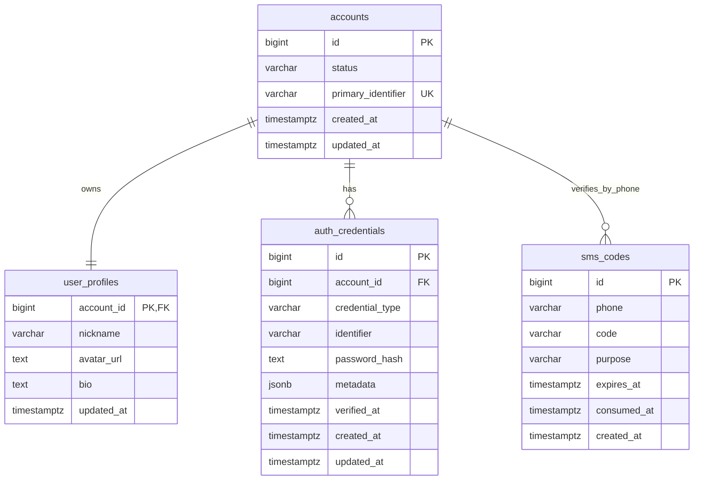
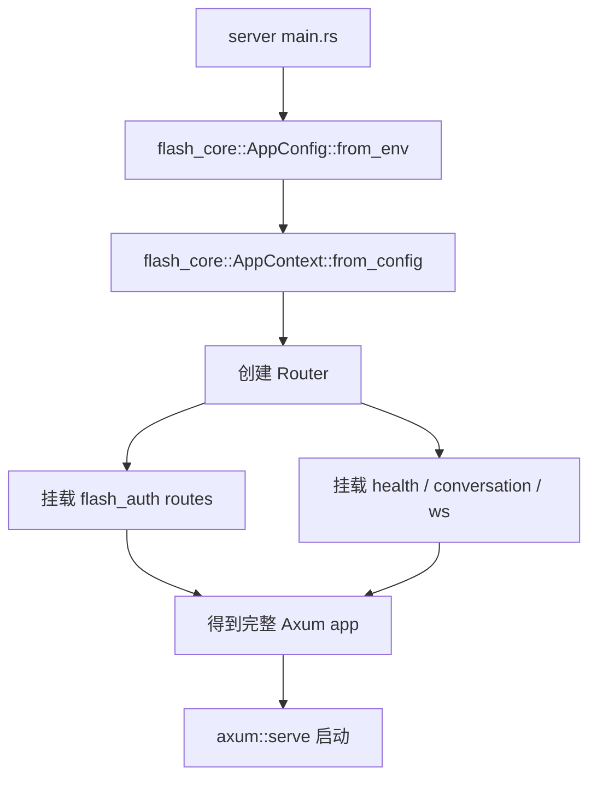
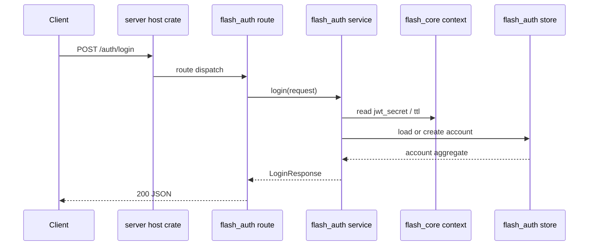
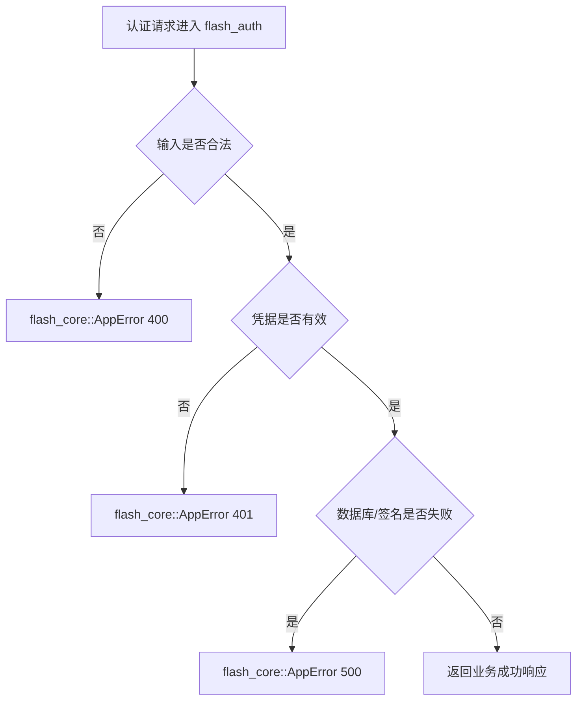
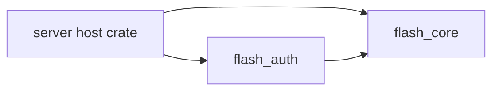

请求：

```json---
module: server-modularization
version: v0.1.0
date: 2026-06-15
tags: [server, rust, cargo-workspace, modularization, auth, core]
---

# server-modularization 模块 — Server 设计报告

## 1. 目标

- 在 `server/modules/` 下建立两个独立 Rust package：`flash_core` 和 `flash_auth`
- 将当前服务端认证链路从宿主 crate 中抽离到 `flash_auth`，形成独立模块边界
- 将配置、错误、通用响应、应用状态、共享存储抽象等基础能力下沉到 `flash_core`
- 将当前 `server` 重构为“宿主组合层”，只负责启动、模块注册和临时保留的非认证路由
- 保持现有认证 API、JWT 鉴权语义和数据库表结构不变，先完成模块隔离，再考虑更深层业务拆分

---

## 2. 现状分析

- 当前 `server` 还是单 crate 结构，所有能力都直接堆在 `server/src/`：
  - `auth/` 负责 JWT 和密码能力
  - `routes/auth.rs`、`services/auth_service.rs`、`models/auth.rs` 共同构成认证主链路
  - `config.rs`、`error.rs`、`response.rs`、`state.rs` 属于全局基础设施，但仍和业务代码同层
  - `store/` 同时承载认证存储抽象、内存测试实现和 PostgreSQL 实现
- 当前认证模型已经升级到 `accounts / user_profiles / auth_credentials / sms_codes`，并且真实链路可用，但“认证模块”和“服务端基础设施”尚未形成清晰边界
- 当前 `build_app()` 直接拼装所有路由，测试也主要依赖整个宿主 crate，后续如果继续扩展消息、会话、联系人，会让 `server/src/lib.rs` 持续膨胀
- 当前还有一些暂时性现状：
  - `conversation` 和 `ws` 仍是 demo / 占位能力
  - `ChatRoomStore` 放在 `store/memory.rs`，职责和认证存储混在一起
  - crate 名当前仍为 `falsh-im`，存在命名历史包袱
- 所以 `v0.1.0` 的目标不是做完整微服务拆分，而是先把当前单体整理成“模块化单体”：
  - `flash_core` 负责基础运行时
  - `flash_auth` 负责认证域
  - 宿主 crate 负责组合和过渡期模块承载

---

## 3. 数据模型与接口

### 数据模型

本次模块化不改认证数据库骨架，继续沿用当前已落地的账户模型：

```sql
CREATE TABLE accounts (
    id BIGSERIAL PRIMARY KEY,
    status VARCHAR(32) NOT NULL DEFAULT 'active',
    primary_identifier VARCHAR(128) NOT NULL UNIQUE,
    created_at TIMESTAMPTZ NOT NULL DEFAULT NOW(),
    updated_at TIMESTAMPTZ NOT NULL DEFAULT NOW()
);

CREATE TABLE user_profiles (
    account_id BIGINT PRIMARY KEY REFERENCES accounts(id) ON DELETE CASCADE,
    nickname VARCHAR(64) NOT NULL,
    avatar_url TEXT NOT NULL,
    bio TEXT NOT NULL DEFAULT '',
    updated_at TIMESTAMPTZ NOT NULL DEFAULT NOW()
);

CREATE TABLE auth_credentials (
    id BIGSERIAL PRIMARY KEY,
    account_id BIGINT NOT NULL REFERENCES accounts(id) ON DELETE CASCADE,
    credential_type VARCHAR(32) NOT NULL,
    identifier VARCHAR(128) NOT NULL,
    password_hash TEXT NULL,
    metadata JSONB NOT NULL DEFAULT '{}'::jsonb,
    verified_at TIMESTAMPTZ NULL,
    created_at TIMESTAMPTZ NOT NULL DEFAULT NOW(),
    updated_at TIMESTAMPTZ NOT NULL DEFAULT NOW(),
    UNIQUE (credential_type, identifier)
);

CREATE TABLE sms_codes (
    id BIGSERIAL PRIMARY KEY,
    phone VARCHAR(20) NOT NULL,
    code VARCHAR(6) NOT NULL,
    purpose VARCHAR(32) NOT NULL DEFAULT 'login',
    expires_at TIMESTAMPTZ NOT NULL,
    consumed_at TIMESTAMPTZ NULL,
    created_at TIMESTAMPTZ NOT NULL DEFAULT NOW()
);
```

#### 认证 ER 关系



#### 运行时模型

`flash_core` 提供共享运行时骨架：

- `AppConfig`：数据库地址、JWT 密钥、TTL、调试开关
- `AppContext`：共享状态容器，持有跨模块基础依赖
- `AppError / AppResult`：统一错误出参与 HTTP 错误映射
- `HttpJson` / `json_error`：统一响应包装
- `CoreStoreSet`：核心基础设施聚合，承载 PostgreSQL pool、迁移入口、临时聊天室连接仓等通用依赖

`flash_auth` 提供认证域模型：

- `AuthClaims`
- `LoginRequest / LoginResponse`
- `SmsRequest / SmsResponse`
- `SetPasswordRequest / SetPasswordResponse`
- `ChangePasswordRequest / PasswordUpdatedResponse`
- `ProfileResponse`
- `AuthStore` 及其相关聚合记录类型

#### 关键设计选择

| 决策 | 理由 |
|------|------|
| 数据库表结构保持不变 | 本期目标是模块边界重构，不引入额外数据迁移风险 |
| `AuthStore` 归属 `flash_auth` | 它是认证域仓储抽象，不应继续挂在全局 `server/src/store` |
| `PgPool`、迁移能力和通用状态装配放入 `flash_core` | 这些属于服务端基础设施，不只服务认证模块 |
| `ChatRoomStore` 从认证内存存储中拆开，归入 `flash_core` | 聊天连接管理不是认证职责，继续混放会污染模块边界 |
| 宿主 crate 保留组合职责 | 这样可以在不一次性拆完所有业务的前提下完成平滑过渡 |

### 接口契约

#### 对外 HTTP / WS 接口

`v0.1.0` 不改变当前对客户端可见的接口：

- `GET /v`
- `POST /auth/sms`
- `POST /auth/login`
- `POST /auth/password/set`
- `POST /auth/password/change`
- `GET /user/profile`
- `GET /conversation`
- `GET /ws`
- `GET /chat_room/ws`

#### 认证接口保持兼容

`POST /auth/sms`

{
  "phone": "13800138000"
}
```

响应：

```json
{
  "phone": "13800138000",
  "code": "123456"
}
```

`POST /auth/login`

短信登录请求：

```json
{
  "login_type": "sms_code",
  "phone": "13800138000",
  "code": "123456"
}
```

密码登录请求：

```json
{
  "login_type": "password",
  "identifier": "13800138000",
  "password": "new-password"
}
```

成功响应：

```json
{
  "token": "jwt-token",
  "account_id": 10001,
  "password_setup_required": true
}
```

`GET /user/profile`

成功响应：

```json
{
  "account_id": 10001,
  "nickname": "13800138000",
  "avatar": "https://picsum.photos/seed/123/120/120",
  "phone": "13800138000",
  "has_password": false
}
```

统一错误响应继续保持：

```json
{
  "message": "invalid token"
}
```

#### 模块装配接口

本期新增的是“crate 间装配契约”，不是新的外部 API：

- `flash_core` 暴露：
  - 配置加载
  - 核心状态构建
  - 通用错误与响应能力
  - 通用基础设施初始化
- `flash_auth` 暴露：
  - 认证路由挂载入口
  - 认证服务能力
  - 认证存储抽象与实现
  - 认证测试辅助入口

宿主 `server` 负责：

- 创建 `AppConfig`
- 初始化 `AppContext`
- 挂载 `flash_auth` 路由
- 挂载暂未模块化的 `health / conversation / ws`

---

## 4. 核心流程

### 模块装配流程



边界说明：

- 宿主 crate 不再直接实现认证业务逻辑
- `flash_auth` 不负责整个 server 的启动生命周期
- `flash_core` 不承载认证业务判断，只承载共享运行时能力

### 认证请求主链路



### 失败路径



关键规则：

- 错误语义仍统一走 `AppError -> IntoResponse`
- JWT 的生成与解析继续由认证模块负责，但使用 `flash_core` 提供的配置上下文
- 测试态仍允许内存认证存储实现存在，但它不再和聊天室连接仓写在同一个模块文件中
- 非认证路由即使暂时留在宿主 crate，也不得反向引用 `flash_auth` 内部实现细节

---

## 5. 项目结构与技术决策

### 项目结构

```text
server/
├── Cargo.toml                    # workspace root + host package
├── src/
│   ├── lib.rs                    # 宿主路由组装入口
│   ├── main.rs                   # 启动入口
│   ├── routes/
│   │   ├── health.rs             # 暂留宿主
│   │   ├── conversation.rs       # 暂留宿主
│   │   ├── ws.rs                 # 暂留宿主
│   │   └── mod.rs
│   └── services/
│       ├── chat_room_service.rs  # 暂留宿主
│       └── mod.rs
└── modules/
    ├── flash_core/
    │   ├── Cargo.toml
    │   └── src/
    │       ├── lib.rs
    │       ├── config.rs
    │       ├── error.rs
    │       ├── response.rs
    │       ├── context.rs
    │       ├── runtime/
    │       │   ├── postgres.rs
    │       │   └── chat_room.rs
    │       └── testing/
    │           └── mod.rs
    └── flash_auth/
        ├── Cargo.toml
        └── src/
            ├── lib.rs
            ├── jwt.rs
            ├── password.rs
            ├── models/
            ├── routes/
            ├── services/
            ├── store/
            │   ├── mod.rs
            │   ├── memory.rs
            │   └── postgres.rs
            └── testing/
                └── mod.rs
```

### 职责划分

- `flash_core`
  - 负责配置、状态上下文、共享错误模型、统一响应能力、运行时基础设施
  - 不负责认证业务规则
- `flash_auth`
  - 负责 JWT、密码、短信验证码、账户资料读取、认证路由和认证仓储
  - 依赖 `flash_core`，但不反向被 `flash_core` 依赖
- 宿主 `server`
  - 负责组装 Router、启动 HTTP 服务、承载过渡期未拆分业务模块
  - 不直接实现认证领域细节

依赖方向：



约束：

- `flash_core` 不能 import `flash_auth`
- `flash_auth` 不能 import 宿主 `server/src/...`
- 宿主 crate 只能通过模块公开接口接入认证能力，不得再直接调用认证内部文件函数

### 技术决策

| 决策 | 方案 | 理由 |
|------|------|------|
| 模块形态 | Cargo workspace + path member crates | 与客户端 `modules/*` 方向一致，最适合当前仓库演进 |
| 核心模块职责 | `flash_core` 承载共享运行时 | 避免后续每个业务模块重复定义 config / error / state |
| 认证模块职责 | `flash_auth` 独立承载 auth domain | 当前认证能力已成形，最适合先抽离 |
| 宿主过渡策略 | 保留 host crate 作为组合层 | 降低一次性重构风险，不强迫消息/会话同步拆分 |
| 数据库连接 | 连接池与迁移入口放 `flash_core`，认证查询实现放 `flash_auth` | 兼顾共享基础设施和领域仓储边界 |
| 测试策略 | 保留模块内单测 + 宿主集成测试 | 既验证模块边界，也验证真实装配链路 |

| 依赖 | 用途 | 已有/需新增 |
|------|------|-----------|
| `axum` | HTTP / WS 框架 | 已有 |
| `sqlx` | PostgreSQL 与迁移 | 已有 |
| `jsonwebtoken` | JWT 签发与解析 | 已有 |
| `argon2` | 密码哈希与校验 | 已有 |
| `tokio` | 异步运行时 | 已有 |
| `async-trait` | 仓储 trait 异步抽象 | 已有 |

---

## 6. 暂不实现

| 功能 | 理由 |
|------|------|
| 将 `conversation`、`ws`、`chat_room_service` 一次性拆成 `flash_chat` | 本期只先完成 `core + auth` 两个基础模块，避免重构面过大 |
| 重命名当前根 package `falsh-im` | 这会带来 workspace、构建脚本、产物名联动修改，不属于 v0.1.0 的最小范围 |
| 引入独立 `flash_http`、`flash_db` 等更多子模块 | 现在拆得太细会先增加复杂度，不利于快速稳定落地 |
| 改造客户端接口或认证返回字段 | 本期目标是服务端内部模块化，不改变对外协议 |
| 新增 refresh token、session 黑名单、RBAC | 这些属于认证能力增强，不属于本轮结构隔离 |
| 微服务化部署、独立进程拆分 | 当前仍是模块化单体，不进入分布式架构阶段 |

