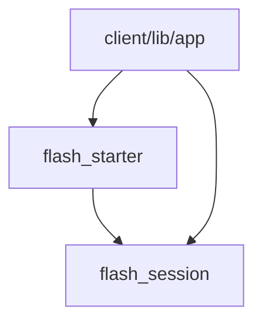
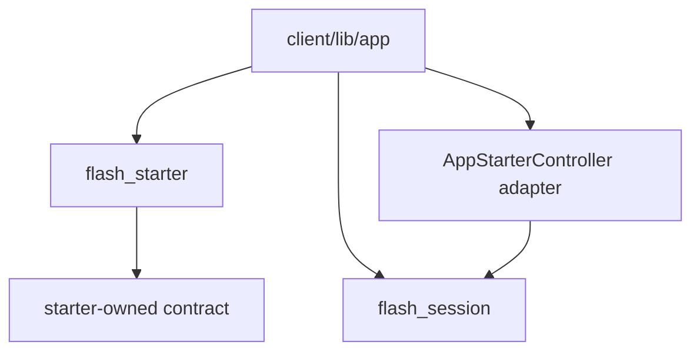
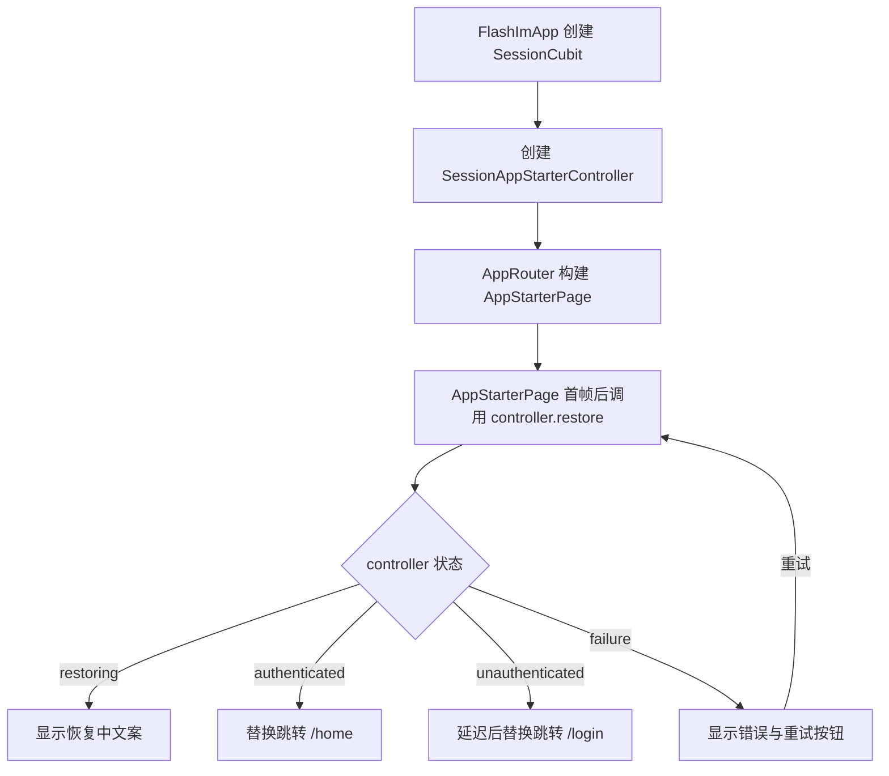
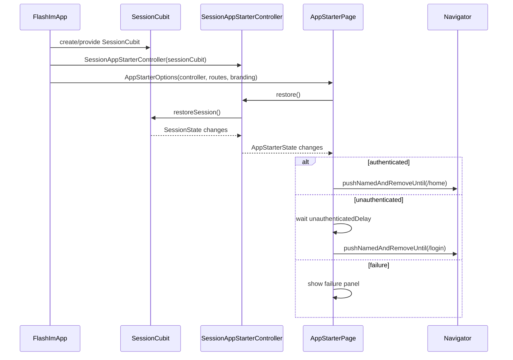

# flash_starter 模块 — Client 设计报告

## 1. 目标

- 将 `flash_starter` 从 `flash_session` 直接依赖中解耦，改为由宿主 App 注入启动状态与动作。
- 保留现有启动体验：品牌展示、恢复中状态、已登录进首页、未登录延迟进登录页、失败重试。
- 让 `flash_starter` 成为纯启动壳 package，只关心启动状态协议、UI 和路由分流。
- 由宿主 `client/lib/app` 负责把 `SessionCubit` 适配成 `flash_starter` 可消费的启动控制器。
- 更新 package 测试与宿主测试，证明解耦后启动链路行为不变。

---

## 2. 现状分析

- 当前真实 package 是 `client/modules/flash_starter`，宿主通过 `flash_starter: path: modules/flash_starter` 接入。
- `flash_starter` 当前在 `pubspec.yaml` 中依赖 `flash_session`，并在 `AppStarterPage` 中直接 import `package:flash_session/flash_session.dart`。
- `AppStarterPage` 当前直接读取 `SessionCubit`：
  - 首帧后调用 `SessionCubit.restoreSession()`。
  - 监听 `SessionState.status`。
  - 根据 `SessionStatus.authenticated / unauthenticated / failure` 跳转或展示失败态。
- 这条链路能工作，但模块边界不干净：启动壳被绑定到具体会话模块，后续如果替换会话实现、复用启动壳或调整认证状态源，都必须改 `flash_starter`。
- 宿主 App 本来已经创建并持有 `SessionCubit`，也已经负责路由、品牌资源、Repository 和 WebSocket token 注入；因此启动状态适配放在宿主层更符合依赖方向。

当前问题不是启动行为错误，而是依赖方向偏重：



目标依赖方向：



---

## 3. 数据模型与接口

### 数据模型

`flash_starter` 内部保留 UI 展示阶段：

- `AppStarterStage.idle`
- `AppStarterStage.loading`
- `AppStarterStage.ready`
- `AppStarterStage.failed`

新增启动状态协议，由 `flash_starter` 自己定义，不引用 `flash_session`：

```dart
enum AppStarterStatus {
  initial,
  restoring,
  authenticated,
  unauthenticated,
  failure,
}

class AppStarterState {
  const AppStarterState({
    required this.status,
    this.errorMessage,
  });

  final AppStarterStatus status;
  final String? errorMessage;
}
```

新增启动控制器协议：

```dart
abstract interface class AppStarterController {
  AppStarterState get state;
  Stream<AppStarterState> get stream;
  Future<void> restore();
}
```

`AppStarterOptions` 保留品牌、路由、延迟和失败文案，并增加控制器输入：

```dart
class AppStarterOptions {
  const AppStarterOptions({
    required this.routes,
    required this.branding,
    required this.controller,
    this.unauthenticatedDelay = const Duration(seconds: 3),
    this.failureMessage = '启动失败，请重试',
    this.retryLabel = '重试',
  });

  final AppStarterRoutes routes;
  final AppStarterBranding branding;
  final AppStarterController controller;
  final Duration unauthenticatedDelay;
  final String failureMessage;
  final String retryLabel;
}
```

关键设计选择：

| 决策 | 理由 |
|------|------|
| `flash_starter` 自定义 `AppStarterStatus/AppStarterState` | 避免 package 依赖 `flash_session` 的状态类型 |
| `AppStarterController` 由宿主实现或适配 | 启动壳只依赖稳定协议，具体会话恢复属于宿主编排 |
| `AppStarterPage` 不再使用 `BlocListener<SessionCubit, SessionState>` | 去掉对 `flutter_bloc` 和 `flash_session` 的双重实现耦合 |
| 路由名与品牌资源继续由宿主传入 | 保留当前已完成的宿主解耦能力 |

### 接口契约

`flash_starter` 对外暴露：

- `AppStarterPage`
- `AppStarterOptions`
- `AppStarterRoutes`
- `AppStarterBranding`
- `AppStarterStage`
- `AppStarterStatus`
- `AppStarterState`
- `AppStarterController`

`flash_starter` 不再暴露或依赖：

- `SessionCubit`
- `SessionState`
- `SessionStatus`
- `SessionRepository`
- `flash_session.dart`

宿主 App 负责提供适配器，把现有会话状态映射到启动状态：

```dart
class SessionAppStarterController implements AppStarterController {
  SessionAppStarterController(this._sessionCubit);

  final SessionCubit _sessionCubit;
}
```

状态映射：

| `SessionStatus` | `AppStarterStatus` |
|------|------|
| `initial` | `initial` |
| `restoring` | `restoring` |
| `authenticated` | `authenticated` |
| `unauthenticated` | `unauthenticated` |
| `failure` | `failure` |

---

## 4. 核心流程

### 启动流程



### 启动时序



### 关键规则

- `flash_starter` 不读取 `BuildContext.read<SessionCubit>()`。
- `flash_starter` 不 import `flutter_bloc`，除非未来有 starter 自己的 Cubit；本期不需要。
- `AppStarterPage` 首帧后调用 `controller.restore()`，保持当前避免 build 期间触发状态变化的行为。
- `AppStarterPage` 订阅 `controller.stream`，并在 `dispose()` 中取消订阅和未登录延迟 timer。
- 已登录跳转 `/home`、未登录延迟跳 `/login`、失败重试的用户体验必须保持不变。
- 适配器在宿主层集中处理 `SessionStatus -> AppStarterStatus`，后续替换会话模块时只改适配器。

---

## 5. 项目结构与技术决策

### 项目结构

```text
client/
├── modules/
│   └── flash_starter/
│       ├── pubspec.yaml                         # 移除 flash_session 依赖
│       ├── lib/
│       │   ├── flash_starter.dart               # 导出 starter 协议与页面
│       │   └── src/
│       │       ├── domain/
│       │       │   ├── app_starter_branding.dart
│       │       │   ├── app_starter_controller.dart
│       │       │   ├── app_starter_options.dart
│       │       │   ├── app_starter_routes.dart
│       │       │   ├── app_starter_stage.dart
│       │       │   └── app_starter_state.dart
│       │       └── presentation/
│       │           ├── app_starter_page.dart
│       │           └── widgets/
│       │               ├── starter_brand_panel.dart
│       │               └── starter_failure_panel.dart
│       └── test/
│           └── app_starter_test.dart
└── lib/
    └── app/
        ├── app_router.dart                      # 传入 AppStarterOptions.controller
        ├── flash_im_app.dart                    # 创建并注入 starter controller
        └── session_app_starter_controller.dart  # 新增 SessionCubit 适配器
```

### 职责划分

- `flash_starter`：启动页 UI、启动状态协议、状态订阅、路由分流、失败重试。
- `flash_session`：会话缓存、资料接口、`SessionCubit` 和全局会话状态。
- `client/lib/app/session_app_starter_controller.dart`：把 `SessionCubit` 适配成 `AppStarterController`。
- `client/lib/app/flash_im_app.dart`：创建 App 级依赖，保证 `SessionCubit` 与 starter controller 生命周期一致。
- `client/lib/app/app_router.dart`：构建 `AppStarterPage` 并传入品牌、路由与 controller。

依赖方向：

- `flash_starter` 不依赖 `flash_session`。
- `flash_session` 不依赖 `flash_starter`。
- 宿主 `client/lib/app` 同时依赖二者，并负责适配。

### 技术决策

| 决策 | 方案 | 理由 |
|------|------|------|
| 控制反转方式 | `AppStarterController` 注入 | 去掉 starter 对具体 session 实现的编译期依赖 |
| 状态监听方式 | `StreamSubscription<AppStarterState>` | package 内不需要引入 Bloc 语义 |
| 适配器位置 | `client/lib/app/session_app_starter_controller.dart` | 适配属于宿主编排，不属于 starter 或 session |
| 路由配置 | 保持 `AppStarterRoutes` | 当前能力已满足 package 不反向依赖宿主路由 |
| 品牌配置 | 保持 `AppStarterBranding` | 当前能力已满足资源不硬编码 |

依赖变化：

| 依赖 | 用途 | 本期变化 |
|------|------|------|
| `flash_session` | 会话恢复与状态 | 从 `flash_starter` 移除，保留在宿主 App |
| `flutter_bloc` | `SessionCubit` Provider 与宿主状态管理 | 从 `flash_starter` 移除，宿主继续保留 |
| `flutter` | UI | `flash_starter` 保留 |

---

## 6. 暂不实现

| 功能 | 理由 |
|------|------|
| 重写 `SessionCubit` 或 `flash_session` 状态模型 | 本期只做 starter 边界解耦，不改会话业务 |
| 改登录、资料、密码、IM token 注入流程 | 这些属于认证/会话/IM 模块，不能混入 starter v0.0.2 |
| 引入新的状态管理库或路由库 | 现有 `Navigator` 和简单 stream 订阅足够 |
| 将 `AppStarterController` 下沉到 `flash_session` | 会重新制造 session 对 starter 的反向依赖 |
| 改启动 UI 视觉、动画、引导页、版本检查 | 本期目标是模块边界，不做体验扩展 |
| 服务端 API 或链路测试脚本 | 本功能是 client-only 架构调整，没有后端 API 变更 |
