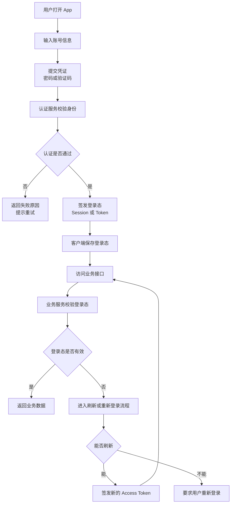
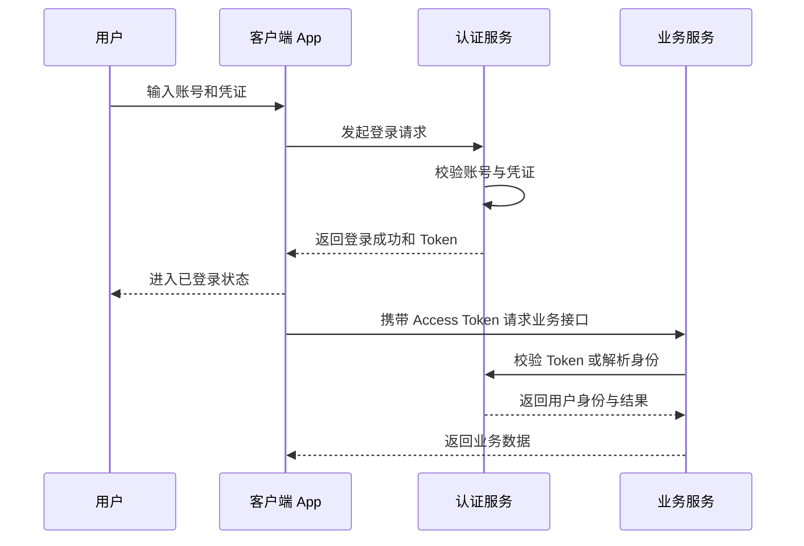
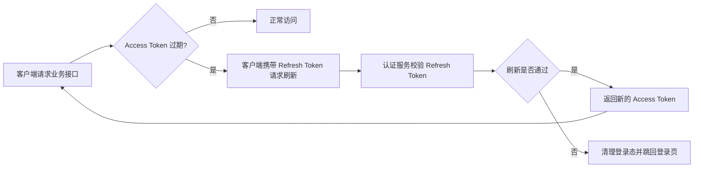

# 用户认证系统基础概念梳理

## 1. 文档信息

- 项目：`flash_im`
- 主题：用户认证系统基础概念
- 目标：用通俗方式说明“认证”是什么、解决什么问题、常见流程长什么样
- 边界：只讲概念和流程，不进入具体代码实现与技术选型
- 时间：2026-06-03

## 2. 先说人话：认证到底是在解决什么

做即时通信产品时，系统首先要回答一个最基本的问题：

**你是谁？**

如果系统不能确认“当前操作的人到底是谁”，后面的事情都没法安全开展，比如：

- 这条消息到底是谁发的
- 这个会话列表该展示给谁
- 这个用户能不能进入某个群
- 这个账号是不是被别人盗用了

所以，“用户认证”本质上就是一套机制，用来确认：

1. 当前这个人声称自己是谁
2. 系统是否相信这个说法
3. 系统确认后，后续请求怎么持续识别这个人

可以把它理解成现实生活里的“门禁 + 工牌 + 通行记录”。

- 输入账号密码/验证码：像“出示身份证明”
- 系统核验：像“门卫检查证件真假”
- 登录成功后的令牌或会话：像“发给你一张临时通行证”
- 访问具体功能：像“拿着通行证进入不同区域”

## 3. 认证、授权、会话，三者不要混

这三个词经常一起出现，但不是一回事。

### 3.1 认证 Authentication

认证解决的是：

**“你是不是你说的那个人？”**

例如：

- 输入账号和密码
- 输入短信验证码
- 使用邮箱验证码
- 使用第三方登录

认证通过后，系统知道“你是谁”。

### 3.2 授权 Authorization

授权解决的是：

**“你能做什么？”**

例如：

- 普通用户能否创建群
- 管理员能否踢人
- 某用户能否查看这个会话
- 某设备是否允许同时在线

认证通过，不代表什么都能做。

系统先确认“你是谁”，再决定“你有没有权限做这件事”。

### 3.3 会话 Session

会话解决的是：

**“系统怎样在后续请求里持续记住你？”**

因为用户不可能每点一下按钮就重新输一次密码。

所以登录成功后，系统通常会建立一种“持续识别关系”，常见方式有两类：

- 服务端保存会话状态
- 客户端持有令牌，后续请求带上令牌

## 4. 常见基础术语

### 4.1 账号标识

系统用来区分用户身份的字段，比如：

- 手机号
- 邮箱
- 用户名
- 第三方平台唯一 ID

它回答的是“你以什么身份来登录”。

### 4.2 凭证 Credential

凭证是你用来证明身份的东西，比如：

- 密码
- 验证码
- 登录链接
- 第三方登录回调结果

它回答的是“你拿什么来证明你就是这个账号的主人”。

### 4.3 令牌 Token

令牌可以理解成：

**登录成功后，系统发给客户端的一张数字通行证。**

后续客户端访问接口时，把这张“通行证”带上，系统就能识别是谁。

常见令牌包括：

- `access token`：短期使用，访问接口时携带
- `refresh token`：用于换取新的 `access token`

### 4.4 访问令牌 Access Token

它通常生命周期比较短。

好处是：

- 泄露后的风险相对更可控
- 便于系统定期重新校验登录状态

你可以把它理解成“短时有效的门禁卡”。

### 4.5 刷新令牌 Refresh Token

当 `access token` 过期时，客户端可以拿 `refresh token` 去换一个新的 `access token`，避免让用户频繁重新登录。

你可以把它理解成“补办临时门禁卡的凭据”。

### 4.6 密码哈希

系统一般**不应该直接保存用户明文密码**。

更合理的做法是保存密码经过单向处理后的结果，也就是“哈希值”。

通俗理解：

- 明文密码：原始密码本身
- 哈希值：把密码经过不可逆处理后的结果

这样即使数据库泄露，风险也比直接存明文小很多。

### 4.7 多因素认证 MFA

多因素认证就是不只验证一件事，而是验证两件或更多件事，比如：

- 你知道什么：密码
- 你拥有什么：手机验证码、验证器 App
- 你本身是什么：指纹、人脸

它的目标是降低账号被盗风险。

## 5. 一个完整的认证流程长什么样

先看总图。

这个流程可以拆成四个阶段：

### 5.1 登录前

用户还没有被系统识别，只能访问公开页面或登录页面。

### 5.2 登录时

用户提交账号标识和凭证，认证服务做核验。

如果核验失败，登录结束；如果成功，系统创建登录态。

### 5.3 登录后

客户端带着登录态访问业务接口，业务系统据此知道“这是哪个用户发来的请求”。

### 5.4 令牌过期后

如果使用的是 Token 模式，短期令牌过期后，系统要么允许刷新，要么要求重新登录。

## 6. 用时序图看一次典型登录

这张图体现了一件很重要的事：

**认证服务负责“确认你是谁”，业务服务负责“基于这个身份处理业务”。**

这样职责更清楚，也更容易维护。

## 7. 为什么很多系统喜欢用 Access Token + Refresh Token

因为它在“安全性”和“用户体验”之间做了一个折中。

### 7.1 只有长期 Token 的问题

如果一个长期有效的 Token 泄露了，攻击者可能长期冒充用户。

### 7.2 只有短期 Token 的问题

如果只有短期 Token，用户可能会频繁掉登录，体验很差。

### 7.3 两者配合的思路

- `access token` 短期有效，降低泄露风险
- `refresh token` 用来续期，减少频繁登录

再看一次刷新流程。

## 8. Session 模式和 Token 模式怎么理解

这也是认证里最常见的一组概念。

### 8.1 Session 模式

可以理解成：

- 客户端拿到一个会话标识
- 服务端保存这段会话对应的用户信息
- 后续请求带上会话标识
- 服务端查到这段会话，就知道是谁

特点是：

- 服务端更“记得住”用户
- 服务端需要保存更多状态

### 8.2 Token 模式

可以理解成：

- 服务端签发一个带身份信息的令牌
- 客户端自己保存
- 后续请求带上令牌
- 服务端验证令牌后识别用户

特点是：

- 更适合接口化、跨端化场景
- 客户端保存登录态的责任更重

### 8.3 不必急着争论谁绝对更好

本质上它们都在解决同一个问题：

**登录成功后，怎样在后续请求里持续识别用户。**

实际项目里，很多系统也会混合使用。

## 9. 登出 Logout 到底在做什么

登出并不只是“跳回登录页”。

它真正做的是：

- 让当前登录态失效
- 清理本地保存的令牌或会话信息
- 必要时撤销服务端会话或刷新凭证

如果系统支持多设备登录，还会涉及：

- 只退出当前设备
- 退出所有设备
- 踢掉旧设备

这些都属于认证系统和会话管理的一部分。

## 10. 在 IM 场景里，认证为什么更重要

在即时通信产品中，认证不只是“进不进得去 App”，它还直接影响很多核心链路：

- 发消息前，系统要先确认发送者身份
- 拉会话列表时，系统要知道当前用户是谁
- 建立 WebSocket 或长连接时，系统要确认这条连接属于谁
- 多端同时在线时，系统要知道哪些设备属于同一个账号
- 被封禁、被踢下线、令牌失效时，系统要能及时让连接失效

可以把它理解成：

**认证是 IM 系统的入口，连接管理、消息投递、会话同步，都会建立在这个入口之上。**

## 11. 新手最容易混淆的几个点

### 11.1 “登录成功”不等于“有所有权限”

登录成功只是说明系统确认了你的身份，不代表你对所有资源都有权限。

### 11.2 “有 Token”不等于“一定合法”

Token 还要看：

- 是否过期
- 是否被篡改
- 是否已被撤销
- 是否与当前设备策略匹配

### 11.3 “退出登录”不只是前端删个变量

如果只在前端页面层面退出，但服务端登录态还有效，安全上是不完整的。

### 11.4 “认证”和“用户系统”不是完全同义

认证更关注“确认身份”和“维持登录态”，用户系统还可能包括：

- 个人资料
- 关系链
- 黑名单
- 设备管理
- 安全中心

## 12. 可以先记住的最小认知模型

如果现在只想先抓住骨架，记住下面这 4 句话就够了：

1. 认证是在回答“你是谁”。
2. 授权是在回答“你能做什么”。
3. 登录成功后，系统需要用 Session 或 Token 持续记住你。
4. 在 IM 里，接口访问和长连接建立都离不开认证。

## 13. 后续进入实现阶段时，通常要继续细化什么

当后面开始设计具体方案时，通常还要继续回答这些问题：

- 账号体系用什么做主标识：手机号、邮箱、用户名，还是混合模式
- 登录方式有哪些：密码、验证码、第三方登录，还是多种并存
- 是否支持多设备同时在线
- Token 生命周期如何划分
- 刷新策略是什么
- WebSocket 握手时怎样携带认证信息
- 被踢下线、封禁、改密后，已有登录态如何失效
- 风控、限流、设备指纹是否要纳入一期

这些属于“认证设计”和“认证实现”阶段，不属于本文的概念扫盲范围。

## 14. 总结

用户认证系统并不神秘，它的核心就是三件事：

- 确认用户身份
- 在后续请求中持续识别用户
- 在安全和体验之间找到合理平衡

对于 IM 产品来说，认证不是边角能力，而是所有业务链路的起点。先把这些基本概念理顺，后面再讨论登录方式、Token 设计、会话管理、WebSocket 鉴权，思路就会清晰很多。
