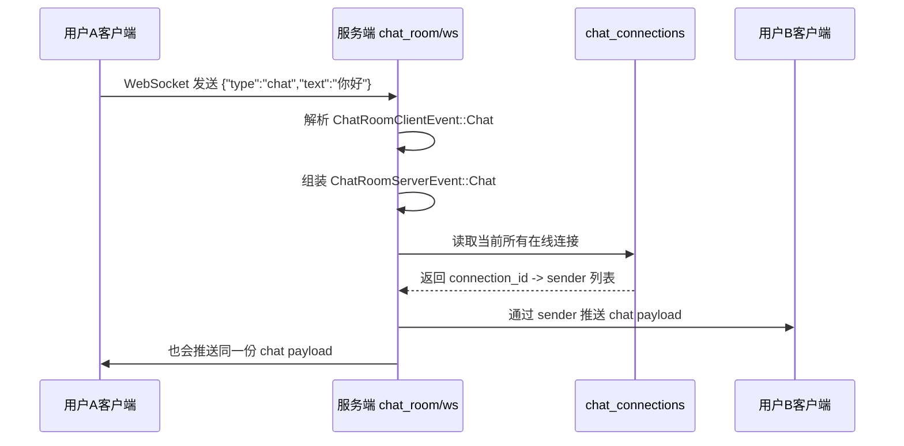

# 当前后端如何把 A 的消息通知给其他人

## 1. 先说结论

当前 `flash_im` 的 playground 服务端里，A 发出一条聊天室消息后，后端的处理方式是：

1. 从 A 的 WebSocket 连接里收到一条 `chat` 消息
2. 把它组装成统一的服务端消息结构
3. 遍历当前保存的所有聊天室连接
4. 把同一份消息推送给这些连接

也就是说，**当前实现是“聊天室广播”模型，不是“点对点私聊路由”模型。**

所以它的语义更接近：

- “A 在聊天室里发了一句话，聊天室里所有在线连接都能收到”

而不是：

- “A 只把消息发给 B，只有 B 会收到”

## 2. 关键代码位置

当前实现都在：

- [server/src/main.rs](/Users/rainyjiang/AndroidStudioProjects/flash_im/server/src/main.rs)

最关键的几个位置如下。

### 2.1 在线连接保存在哪里

`AppState` 里维护了一个 `chat_connections`：

- [server/src/main.rs:39](/Users/rainyjiang/AndroidStudioProjects/flash_im/server/src/main.rs:39)

它的作用是保存当前所有已接入聊天室的 WebSocket 连接。

对应结构：

- [server/src/main.rs:57](/Users/rainyjiang/AndroidStudioProjects/flash_im/server/src/main.rs:57)

```rust
struct ChatRoomConnection {
    sender: mpsc::UnboundedSender<String>,
}
```

这里保存的不是“用户关系列表”，而是“可以往这个连接发消息的 sender”。

### 2.2 连接建立时，怎么登记到在线连接表里

在 `handle_chat_room_socket(...)` 里，连接建立后会插入 `chat_connections`：

- [server/src/main.rs:443](/Users/rainyjiang/AndroidStudioProjects/flash_im/server/src/main.rs:443)
- [server/src/main.rs:457](/Users/rainyjiang/AndroidStudioProjects/flash_im/server/src/main.rs:457)

核心逻辑：

```rust
state.chat_connections.write().await.insert(
    connection_id,
    ChatRoomConnection {
        sender: outgoing_tx.clone(),
    },
);
```

这一步的含义是：

- 给这条 WebSocket 分配一个 `connection_id`
- 把“如何向这条连接发消息”的 sender 保存起来

后面只要服务端想推消息，就会用到这里保存的 sender。

### 2.3 A 发消息后，是在哪里进入处理逻辑的

还是在 `handle_chat_room_socket(...)` 里。

- [server/src/main.rs:481](/Users/rainyjiang/AndroidStudioProjects/flash_im/server/src/main.rs:481)
- [server/src/main.rs:492](/Users/rainyjiang/AndroidStudioProjects/flash_im/server/src/main.rs:492)

当服务端收到：

```json
{"type":"chat","text":"hello"}
```

会进入：

```rust
Ok(ChatRoomClientEvent::Chat { text }) => {
    let content = text.trim().to_string();
    if content.is_empty() {
        ...
    }

    broadcast_chat_room_message(state.as_ref(), &user, content).await;
}
```

这里的 `user` 就是当前这条 WebSocket 连接已经鉴权得到的用户，也就是 A。

## 3. 真正把消息“通知给别人”的位置

真正的通知动作发生在这两个函数里：

- [server/src/main.rs:537](/Users/rainyjiang/AndroidStudioProjects/flash_im/server/src/main.rs:537)
- [server/src/main.rs:551](/Users/rainyjiang/AndroidStudioProjects/flash_im/server/src/main.rs:551)

### 3.1 先把 A 的消息组装成服务端事件

`broadcast_chat_room_message(...)` 负责把 A 的消息打包成统一 payload：

```rust
let payload = serialize_chat_room_event(ChatRoomServerEvent::Chat {
    message_id,
    user_id: user.user_id,
    nickname: user.nickname.clone(),
    avatar: user.avatar.clone(),
    text,
    sent_at: unix_timestamp(),
});
```

这一步做的事情是：

- 生成 `message_id`
- 带上发送者 `user_id`
- 带上昵称、头像、文本内容、发送时间
- 序列化成一个字符串 payload

然后调用：

```rust
broadcast_chat_payload(state, payload, None).await;
```

### 3.2 再遍历所有在线连接逐个发送

真正的广播在 `broadcast_chat_payload(...)`：

```rust
let connections: Vec<(usize, ChatRoomConnection)> = state
    .chat_connections
    .read()
    .await
    .iter()
    .map(|(connection_id, connection)| (*connection_id, connection.clone()))
    .collect();
```

它会先把当前所有在线连接取出来。

然后逐个发送：

```rust
for (connection_id, connection) in connections {
    if exclude == Some(connection_id) {
        continue;
    }

    if connection.sender.send(payload.clone()).is_err() {
        stale_connections.push(connection_id);
    }
}
```

这就是“通知其他人”的真实实现位置。

含义非常直接：

- 遍历所有在线连接
- 给每个连接的 `sender` 发同一份消息
- 如果某条连接已经失效，就记下来，后面清掉

## 4. Mermaid 时序图



注意最后一行：

**当前实现里，A 自己也会收到这条广播后的消息。**

原因是调用时传的是：

```rust
broadcast_chat_payload(state, payload, None)
```

也就是没有排除发送者连接。

## 5. 当前实现的特点

### 5.1 这是“全聊天室广播”

当前代码里没有这些信息：

- `conversation_id`
- `room_id`
- “A 和 B 是一对私聊参与者”的成员关系

因此服务端目前并不知道：

- 这条消息应该只发给哪两个人

它知道的只有：

- 当前有哪些 WebSocket 连接在线

所以它做的是：

- 给所有在线聊天室连接广播

### 5.2 它不是正式 IM 私聊实现

如果要做正式的“用户 A 发给用户 B”，后端通常至少要有下面这些信息：

1. 这条消息属于哪个会话 `conversation_id`
2. 这个会话有哪些参与者
3. 这些参与者当前各自有哪些在线连接
4. 应该投递给哪些连接，是否要排除发送端当前连接

当前 playground 代码还没有这层路由能力。

## 6. 如果以后要改成真正的双人私聊，后端应该怎么变

大方向通常是这样：

### 6.1 不再只维护“所有聊天室连接”

现在是：

- `chat_connections: HashMap<connection_id, sender>`

后面至少要扩成类似：

- `user_connections: HashMap<user_id, Vec<connection_id>>`
- `conversation_members: HashMap<conversation_id, Vec<user_id>>`

### 6.2 消息里要带目标会话

客户端发消息时不能只有：

```json
{"type":"chat","text":"你好"}
```

而应该类似：

```json
{"type":"chat","conversation_id":"c_1001","text":"你好"}
```

### 6.3 服务端按会话成员做定向投递

这时服务端流程会变成：

1. 从 JWT 连接上下文里拿到发送者 A
2. 从消息体里拿到 `conversation_id`
3. 查出这个会话的参与者是 A、B
4. 找到 B 当前在线的连接
5. 把消息投递给 B
6. 再决定是否回推给 A 当前设备做确认

## 7. 一句话总结

**当前代码里，A 发消息后，后端不是“找到 B 再发给 B”，而是“把消息广播给当前聊天室的所有在线连接”。**

如果你要做正式 IM 私聊，下一步就该把这套“聊天室广播”升级成“按会话成员定向投递”。
