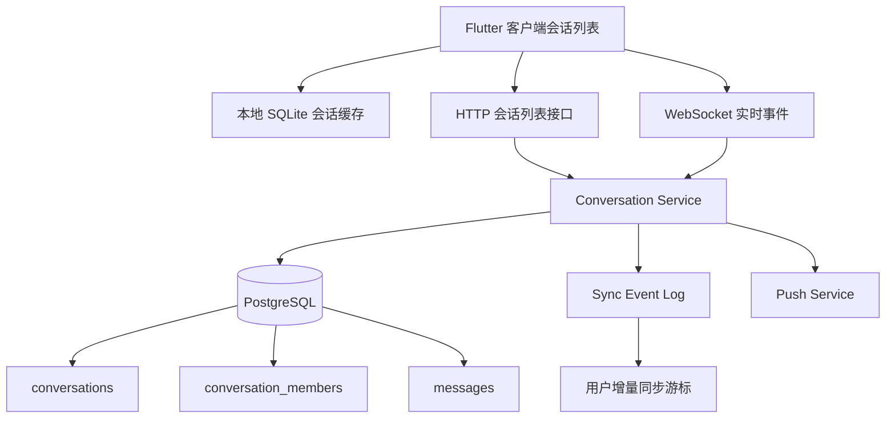

# 结合微信日常体验看会话列表背后的技术考量

## 1. 文档信息

- 项目：`flash_im`
- 主题：从微信类 App 的日常使用体验出发，分析 IM 会话列表背后的技术问题
- 目标：为后续 `flash_im` 的消息首页、会话模块、同步模块和本地存储设计提供参考
- 结论类型：产品体验反推技术设计
- 时间：2026-07-01

## 2. 先说结论

会话列表看起来只是一个列表：头像、昵称、最后一条消息、时间、未读数。

但如果结合微信的日常使用体验，它实际上是 IM 产品里最复杂的“状态聚合页”之一。

它不是简单从数据库查几条消息然后展示，而是同时承载：

1. 最近会话排序
2. 最后一条消息摘要
3. 未读数
4. 置顶
5. 免打扰
6. 草稿
7. @我
8. 群聊状态
9. 多端同步
10. 离线补偿
11. 删除、隐藏、折叠
12. 网络异常后的状态恢复

所以，会话列表真正要解决的问题是：

**如何在消息持续变化、用户多端在线、网络不稳定、客户端可离线的前提下，让用户始终看到一个“符合直觉、稳定、及时、可恢复”的最近联系人入口。**

## 3. 从微信日常体验观察会话列表

日常使用微信时，用户对会话列表的感知通常不是“技术功能”，而是一些很自然的体验预期。

### 3.1 收到新消息，会话自动上浮

当某个好友或群发来新消息时，这个会话会出现在列表更靠前的位置。

用户的直觉是：

- 谁刚找我，谁就应该在上面
- 我不用搜索，也能马上看到最近的沟通对象
- 多个群连续来消息时，列表顺序要跟最近消息时间一致

背后的技术问题：

- 每个会话都需要维护 `last_message_id`
- 每个会话都需要维护 `last_message_at`
- 收到消息时，不能只插入消息表，还要更新会话索引
- 排序不能只靠客户端临时计算，否则冷启动和多端同步会不一致
- 服务端和客户端都要知道“什么事件会影响会话排序”

### 3.2 置顶会话永远在上面

微信里常见做法是把家人、工作群、文件传输助手等会话置顶。

用户的直觉是：

- 置顶优先级高于普通最近消息
- 置顶内部也要能按最近活跃时间排序
- 普通会话再活跃，也不能顶过置顶会话

背后的技术问题：

- 会话列表排序不是单字段排序，而是复合排序
- 典型排序规则是：`pinned desc, pinned_order asc, last_message_at desc`
- 置顶是用户维度状态，不是会话全局状态
- A 把群置顶，不代表 B 也置顶这个群
- 多端修改置顶状态时，要解决冲突和覆盖顺序

### 3.3 未读数必须可靠

微信里看到红点或数字，用户会天然相信它代表“我还没看过的消息”。

用户的直觉是：

- 点进会话后，未读数应该清零
- 在电脑端读过，手机端也应该同步变成已读
- 免打扰群可以有小红点，但不一定显示强提醒
- 群里有人 @我，要比普通未读更醒目

背后的技术问题：

- 未读数不能只靠“最后一条消息时间”粗略判断
- 需要维护用户在每个会话中的 `read_seq` 或 `read_message_id`
- 消息需要有单调递增的 `conversation_seq`
- 未读数可以通过 `latest_seq - read_seq` 计算，也可以做冗余计数
- 多端已读要同步，且要避免旧设备把新设备的已读状态覆盖回去
- 群聊里还要区分普通未读、@我、@所有人、特别关注等状态

### 3.4 最后一条消息摘要并不只是文本

微信会话列表里，最后一条消息可能显示：

- 文本内容
- `[图片]`
- `[语音]`
- `[视频]`
- `[文件]`
- `[动画表情]`
- `你撤回了一条消息`
- `对方撤回了一条消息`
- `有人@我`
- `草稿内容`

用户的直觉是：

- 摘要要能快速判断这条会话有没有必要点开
- 草稿通常比最后一条历史消息更优先显示
- 撤回、删除、屏蔽后，摘要要立刻变化

背后的技术问题：

- 消息需要统一的类型系统，而不是只有 `text`
- 会话摘要最好由后端或统一领域层生成，不能每个端各写一套规则
- 草稿是客户端本地状态，但会影响会话列表展示
- 撤回消息会反向影响会话摘要
- 如果最后一条消息被删除或不可见，需要回退到上一条可展示消息
- 媒体消息摘要要和上传、转码、审核状态联动

### 3.5 时间展示有强体验预期

微信会话列表的时间展示不是完整时间戳，而是按用户直觉变化：

- 今天显示 `09:30`
- 昨天显示 `昨天`
- 更早显示星期或日期
- 跨年后可能显示年份

背后的技术问题：

- 服务端存储必须使用稳定时间，如 UTC 时间戳
- 客户端展示要按用户本地时区格式化
- 排序用机器时间，展示用本地规则
- 本地时钟不可信，发消息时间应以服务端落库时间为准
- 离线消息补偿回来时，不能因为客户端接收时间晚就排错位置

### 3.6 删除会话不是删除消息

微信里用户可以从会话列表删除某个聊天入口，但历史消息可能仍然存在。

用户的直觉是：

- 删除会话后，列表里暂时看不到它
- 对方再发新消息，这个会话会重新出现
- 这不同于清空聊天记录

背后的技术问题：

- “删除会话入口”和“删除消息记录”是两个概念
- 用户维度需要记录 `hidden_at` 或 `deleted_at`
- 新消息到达后，要判断是否恢复这个会话入口
- 删除操作不能影响其他参与者
- 本地删除和服务端删除状态要能同步

### 3.7 免打扰不是不收消息

微信群设置免打扰后，消息仍然会进来，只是不强提醒。

用户的直觉是：

- 不弹通知
- 不震动
- 会话列表里仍然能看到更新
- 有人 @我 时可能仍然要特殊提醒

背后的技术问题：

- 免打扰是通知策略，不是消息投递策略
- 推送服务要读取用户会话级通知设置
- 客户端会话列表仍要更新最新消息和未读状态
- @我、特别关注、关键词提醒可能覆盖普通免打扰
- 后端需要区分“是否投递消息”和“是否触达通知”

### 3.8 草稿是本地体验，但要进入排序规则

微信里输入了内容没发送，回到会话列表后会看到草稿提示。

用户的直觉是：

- 草稿要保留
- 草稿应该比最后一条消息更容易被看到
- 切换页面、锁屏、重启后最好还在

背后的技术问题：

- 草稿通常先存在客户端本地数据库
- 草稿是否多端同步，需要产品决策
- 草稿会影响摘要展示，但通常不应该改变服务端会话的 `last_message_at`
- 如果草稿参与排序，要定义是本地排序还是服务端排序
- 发出消息后，要可靠清理草稿

### 3.9 群聊会话比单聊复杂很多

微信群会话列表里，一个群不仅有最后一条消息，还涉及成员、群名、群头像、@状态、公告、退群、解散等。

背后的技术问题：

- 群成员变更会影响会话可见性
- 群名、群头像变化要同步到会话列表
- 群消息需要判断当前用户是否仍是成员
- 群内 @我 要单独建索引或事件状态
- 群被解散后，会话仍可能保留历史记录，但不能继续发送消息
- 群聊未读数可能很大，需要控制展示上限，如 `99+`

## 4. 会话列表背后的核心数据模型

一个可演进的 IM 系统，通常不能只靠 `messages` 表临时查最近消息来拼列表。

建议至少拆出这些概念。

### 4.1 会话表

会话表表达“这个聊天空间是什么”。

示例字段：

```text
conversations
- id
- type                 # direct / group / system
- title
- avatar
- created_at
- updated_at
- latest_message_id
- latest_message_seq
- latest_message_at
```

### 4.2 会话成员表

会话成员表表达“某个用户在这个会话里的个人状态”。

示例字段：

```text
conversation_members
- conversation_id
- account_id
- role
- joined_at
- left_at
- pinned
- muted
- hidden_at
- read_seq
- unread_count         # 可选冗余
- mention_count
- last_read_at
```

### 4.3 消息表

消息表表达“会话里发生了什么”。

示例字段：

```text
messages
- id
- conversation_id
- conversation_seq
- sender_account_id
- message_type
- content
- status
- created_at
- edited_at
- recalled_at
```

关键点是 `conversation_seq`。

它比单纯的时间戳更适合做：

- 顺序控制
- 未读计算
- 增量同步
- 去重
- 断线补偿

### 4.4 客户端本地会话缓存

客户端不能每次打开首页都等网络。

需要本地缓存：

```text
local_conversation_snapshots
- conversation_id
- title
- avatar
- latest_message_summary
- latest_message_at
- latest_message_seq
- unread_count
- mention_count
- pinned
- muted
- draft_text
- sync_version
```

这样用户打开 App 时，可以先看到旧列表，再做增量同步。

## 5. 会话列表需要解决的关键技术问题

### 5.1 排序一致性

会话列表最容易出问题的是排序。

常见异常包括：

- 新消息来了但会话没上浮
- 置顶会话被普通消息顶下去
- 离线消息补回来后顺序跳动
- 本地草稿把服务端排序覆盖乱了

建议：

- 服务端维护权威的 `latest_message_seq` 和 `latest_message_at`
- 客户端只在本地状态上做有限增强，如草稿、临时发送中
- 排序规则写成明确函数，并在客户端和服务端保持一致
- 每次会话列表增量更新都带上可比较的版本或序列号

### 5.2 未读数准确性

未读数是强信任入口，不能长期错。

建议：

- 单聊和群聊都采用 `read_seq` 模型
- 每条消息写入时分配会话内递增 `conversation_seq`
- 用户进入会话时上报已读到某个 seq
- 服务端持久化 `read_seq`
- 多端只允许已读进度向前推进，不允许回退

### 5.3 多端一致性

微信常见场景是手机、电脑、平板同时在线。

用户期望：

- 手机读过，电脑未读数减少
- 电脑置顶，手机也置顶
- 电脑删除会话，手机也能同步
- 某端弱网恢复后，不把旧状态写回去

建议：

- 用户会话状态要有独立版本号
- 置顶、免打扰、已读、删除都作为用户维度状态同步
- 状态更新采用“版本递增”或“更新时间比较”
- 已读状态只允许单调前进
- 客户端重连后先拉状态增量，再恢复实时订阅

### 5.4 离线与弱网恢复

真实用户经常遇到：

- 地铁弱网
- App 后台被杀
- 手机断网后重连
- 推送先到，消息详情后到

会话列表必须能恢复。

建议：

- WebSocket 只负责实时推送，不承担全部可靠性
- 客户端重连后要调用 HTTP 或同步协议拉取缺失会话变更
- 每个用户维护一个全局同步游标，如 `user_event_seq`
- 会话列表更新、消息新增、已读变更、置顶变更都进入同步事件流
- 客户端按游标补偿，避免只靠“当前在线时收到的事件”

### 5.5 最后一条消息摘要稳定性

最后一条消息摘要看似 UI 问题，本质是数据一致性问题。

需要处理：

- 发送中
- 发送失败
- 已撤回
- 已删除
- 媒体上传中
- 审核中
- 消息不可见
- 草稿覆盖展示

建议：

- 消息状态机要明确
- 会话摘要生成逻辑集中维护
- 撤回或删除最后一条消息时，重新计算会话摘要
- 客户端本地发送中消息可以临时参与展示，但必须能被服务端结果替换

### 5.6 性能与分页

微信用户可能有几百个会话，但首屏只看十几个。

建议：

- 会话列表接口分页
- 首屏优先返回置顶和最近活跃会话
- 本地数据库按排序字段建索引
- 未读会话、置顶会话可以有快速查询索引
- 头像和群头像做缓存
- 列表 UI 只渲染可见区域，避免一次构建全部会话项

### 5.7 通知与会话列表的关系

推送通知和会话列表不是同一个系统，但必须一致。

例如：

- 收到推送后点开 App，会话列表必须能看到对应会话
- 免打扰群不强通知，但列表仍更新
- 已读后通知角标要减少

建议：

- 推送只作为唤醒和提示，不作为权威消息来源
- 客户端启动后必须从服务端同步真实会话状态
- App badge 数应由未读聚合结果驱动
- 通知策略读取会话成员状态中的 `muted`、`mention_count` 等字段

## 6. 推荐的整体架构



核心原则：

1. `PostgreSQL` 保存权威会话、成员、消息状态
2. `WebSocket` 推送实时变更
3. `HTTP / sync` 负责冷启动、分页、重连补偿
4. `SQLite` 保存客户端本地快照和草稿
5. 推送服务只负责提醒，不能代替会话同步

## 7. 对 flash_im 的落地建议

当前 `flash_im` 已经有：

- 登录认证
- session 状态
- WebSocket 鉴权和心跳
- 消息页入口
- playground 聊天室能力

下一阶段如果要做真正的会话列表，建议按以下顺序推进。

### 7.1 第一阶段：单聊会话列表 MVP

目标：

- 有正式 `conversation` 模块
- 能创建或获取单聊会话
- 发消息后更新会话列表
- 会话列表显示头像、昵称、最后一条消息、时间

需要实现：

- `conversations`
- `conversation_members`
- `messages`
- `GET /conversations`
- `POST /messages`
- WebSocket 推送 `conversation_updated`

暂不做：

- 群聊
- @我
- 复杂免打扰
- 多端状态冲突

### 7.2 第二阶段：未读与已读

目标：

- 会话列表显示未读数
- 进入会话后清除未读
- 多端已读可以同步

需要实现：

- `conversation_seq`
- `read_seq`
- `POST /conversations/{id}/read`
- WebSocket 推送 `conversation_read_updated`

### 7.3 第三阶段：置顶、免打扰、删除会话

目标：

- 接近微信的基础会话管理体验

需要实现：

- `pinned`
- `muted`
- `hidden_at`
- 用户维度会话设置接口
- 本地缓存同步

### 7.4 第四阶段：群聊、@我、草稿和推送

目标：

- 支撑真实多人 IM 使用

需要实现：

- 群成员表
- mention 解析与索引
- 草稿本地存储
- Push Service
- App badge 聚合

## 8. 风险点

### 8.1 只靠 WebSocket 会漏状态

WebSocket 在线时很好用，但用户不可能永远在线。

如果没有增量同步机制，客户端断线期间的会话变化就容易丢。

### 8.2 只存消息不存会话索引会很慢

每次打开会话列表都从消息表聚合最后一条消息，在数据量变大后会明显拖慢。

会话列表应该有专门的会话索引和用户会话状态表。

### 8.3 未读数如果早期设计粗糙，后面很难补

未读数和已读进度会影响：

- 会话列表
- App badge
- 推送
- 多端同步
- 群聊 @状态

建议早期就采用 `conversation_seq + read_seq`，不要只用时间戳。

### 8.4 草稿和删除会话容易混淆本地状态与服务端状态

草稿偏本地体验，删除会话偏用户服务端状态。

这两类状态都影响列表展示，但权威来源不同，需要明确边界。

## 9. 汇报用总结

会话列表不是一个简单 UI 列表，而是 IM 系统的状态聚合入口。

微信式体验之所以自然，是因为它在背后解决了最近消息排序、置顶、未读、已读、多端同步、离线补偿、草稿、免打扰、群聊 @、通知策略等一系列问题。

对 `flash_im` 来说，下一步不应该直接堆一个静态消息列表，而应该先建立：

1. 权威会话表
2. 用户会话状态表
3. 会话内消息序列号
4. 客户端本地会话缓存
5. WebSocket 实时变更
6. HTTP 增量同步补偿

这样后续再扩展群聊、推送、多端同步和未读角标时，系统不会反复推倒重来。
