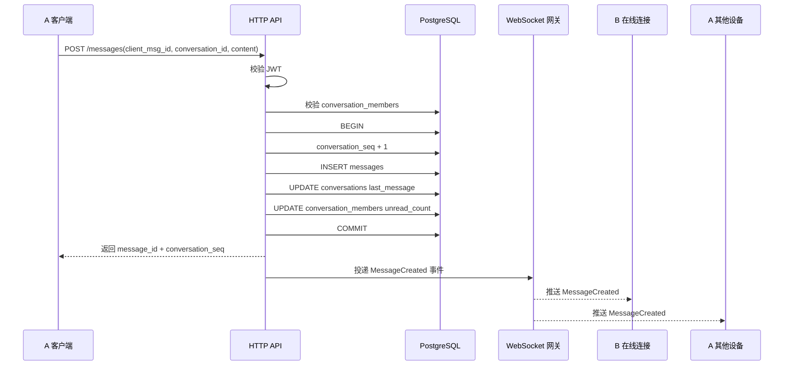

# IM 消息收发后端链路设计

## 1. 结论

`flash_im` 后端要实现正式的消息收发，不能直接把当前 `/chat_room/ws` 聊天室广播代码扩成私聊。

当前项目里已经有三块基础：

- 会话列表数据模型：`conversations`、`conversation_members`、`conversation_seq`
- 正式 IM WebSocket 骨架：`GET /ws/im`，已支持 Protobuf 鉴权和 `PING/PONG`
- playground 聊天室广播：`GET /chat_room/ws?token=...`，能证明 WebSocket 在线连接与广播可行

正式消息链路应该走这个方向：

1. 客户端通过 HTTP 或 WebSocket 发 `SendMessage` 请求
2. 后端校验登录态、会话成员关系、消息幂等键
3. 在一个数据库事务里分配 `conversation_seq`、写入 `messages`、更新 `conversations` 摘要和成员未读数
4. 提交事务后，把 `MessageCreated` 事件投递给会话成员的在线连接
5. 离线或断线客户端通过 HTTP/同步接口按 `conversation_seq` 拉取缺失消息

核心原则是：**数据库是权威事实源，WebSocket 只负责实时通知，不能承担可靠存储。**

## 2. 当前后端边界

### 2.1 已有正式基础

会话表已经存在于：

- `server/migrations/20260707000100_im_conversations.sql`

关键表：

```text
conversations
- id
- type
- name
- avatar
- owner_id
- last_message_at
- last_message_preview
- created_at
- updated_at

conversation_members
- conversation_id
- user_id
- unread_count
- last_read_seq
- is_deleted
- is_pinned
- is_muted
- joined_at

conversation_seq
- conversation_id
- current_seq
- updated_at
```

这些表已经具备做消息收发的核心骨架：

- `conversation_members` 能判断某个用户是否属于会话
- `conversation_seq` 能为每个会话分配单调递增序号
- `conversations.last_message_*` 能支撑会话列表排序和摘要
- `conversation_members.unread_count / last_read_seq` 能支撑未读和已读

### 2.2 WebSocket 现状

正式 IM WebSocket 在：

- `server/modules/im-ws/src/handler.rs`
- `server/modules/im-ws/src/frame.rs`
- `server/modules/im-ws/src/dispatcher.rs`
- `proto/ws.proto`

当前 `proto/ws.proto` 只定义了：

```proto
enum WsFrameType {
  PING = 0;
  PONG = 1;
  AUTH = 2;
  AUTH_RESULT = 3;
}
```

所以现在的 `/ws/im` 只适合做：

- 建立连接
- 认证 token
- 心跳
- 后续业务帧分发骨架

它还没有正式消息类型。

### 2.3 不能直接复用聊天室广播为正式私聊

当前 `/chat_room/ws` 在：

- `server/src/services/chat_room_service.rs`
- `server/modules/flash_core/src/runtime/chat_room.rs`

它维护的是：

```text
chat_connections: HashMap<connection_id, sender>
```

A 发消息后，服务端遍历所有聊天室连接并推送给所有人。这是“聊天室广播”模型，不是正式 IM 的“按会话成员定向投递”模型。

正式私聊至少需要：

- `conversation_id`
- 会话成员列表
- 用户在线连接表
- 消息持久化
- 每个会话内的 seq
- 离线补偿

因此 `/chat_room/ws` 可以作为连接管理参考，但不能成为正式消息链路的事实源。

## 3. 推荐后端模块拆分

建议新增一个正式消息模块：

```text
server/modules/im-message/
├── Cargo.toml
└── src/
    ├── lib.rs
    ├── model.rs
    ├── routes.rs
    ├── repository.rs
    ├── service.rs
    ├── event.rs
    └── delivery.rs
```

职责划分：

| 文件 | 职责 |
| --- | --- |
| `model.rs` | 请求、响应、消息实体、消息类型 |
| `routes.rs` | HTTP 路由，如发送消息、拉历史、已读上报 |
| `repository.rs` | SQL 查询和事务内写入 |
| `service.rs` | 业务编排：鉴权、成员校验、幂等、事务 |
| `event.rs` | WebSocket 事件结构，如 `MessageCreated` |
| `delivery.rs` | 在线连接投递，按 user_id 找连接并发送 |

`im-ws` 保持为实时连接层，逐步加入：

```text
server/modules/im-ws/
├── connection_store.rs   # user_id -> connections
├── dispatcher.rs         # 分发 SendMessage / Ack / Read 等业务帧
└── handler.rs            # 鉴权后登记连接、断开后清理连接
```

## 4. 数据库设计

### 4.1 新增 messages 表

建议新增：

```sql
CREATE TABLE messages (
    id UUID PRIMARY KEY DEFAULT gen_random_uuid(),
    conversation_id UUID NOT NULL REFERENCES conversations(id) ON DELETE CASCADE,
    conversation_seq BIGINT NOT NULL,
    sender_user_id BIGINT NOT NULL REFERENCES accounts(id) ON DELETE CASCADE,
    client_msg_id VARCHAR(64) NOT NULL,
    message_type SMALLINT NOT NULL DEFAULT 0,
    content JSONB NOT NULL,
    status SMALLINT NOT NULL DEFAULT 0,
    created_at TIMESTAMPTZ NOT NULL DEFAULT NOW(),
    updated_at TIMESTAMPTZ NOT NULL DEFAULT NOW(),
    UNIQUE (conversation_id, conversation_seq),
    UNIQUE (sender_user_id, client_msg_id)
);

CREATE INDEX idx_messages_conversation_seq
    ON messages(conversation_id, conversation_seq);

CREATE INDEX idx_messages_sender_client_msg
    ON messages(sender_user_id, client_msg_id);
```

字段含义：

| 字段 | 说明 |
| --- | --- |
| `conversation_id` | 消息所属会话 |
| `conversation_seq` | 会话内单调递增序号 |
| `sender_user_id` | 发送人 |
| `client_msg_id` | 客户端生成的幂等 ID |
| `message_type` | 文本、图片、语音、系统消息等 |
| `content` | 消息体，文本可为 `{"text":"hello"}` |
| `status` | 正常、撤回、删除等状态 |

### 4.2 为什么必须有 client_msg_id

客户端发送消息时，网络可能出现：

- 请求已到服务端，但客户端没有收到响应
- WebSocket 断开后客户端重试
- App 重启后把本地 pending 消息再次发送

如果没有 `client_msg_id`，服务端无法区分“新消息”和“同一条消息重试”。

推荐规则：

- 客户端每条待发送消息生成一个稳定 `client_msg_id`
- 服务端对 `(sender_user_id, client_msg_id)` 建唯一索引
- 重试命中唯一索引时，返回已存在的那条消息，不重复插入

## 5. 发送消息链路

### 5.1 客户端请求

早期建议先用 HTTP 发送消息，WebSocket 只做推送：

```http
POST /messages
Authorization: Bearer <token>
Content-Type: application/json
```

```json
{
  "conversation_id": "ef16d0bf-a21a-cee2-0610-1ab56f3cc2f3",
  "client_msg_id": "local-uuid-001",
  "message_type": 0,
  "content": {
    "text": "你好"
  }
}
```

这样做的好处是：

- HTTP 更容易测试、重试和定位问题
- WebSocket 推送失败不会影响消息入库
- 后续再把发送动作迁到 WebSocket 也不会改变底层 service

### 5.2 服务端处理顺序

服务端 `POST /messages` 的处理顺序：

1. 从 `Authorization` 提取 `sender_user_id`
2. 校验 `conversation_id` 是否存在
3. 校验发送者是否在 `conversation_members` 中，且 `is_deleted = false`
4. 校验消息体非空、类型合法、长度合法
5. 用 `(sender_user_id, client_msg_id)` 做幂等检查
6. 开启数据库事务
7. 锁定并递增 `conversation_seq.current_seq`
8. 插入 `messages`
9. 更新 `conversations.last_message_at / last_message_preview`
10. 更新其他成员的 `unread_count`
11. 提交事务
12. 事务提交后投递 `MessageCreated` 在线事件
13. 返回发送成功响应

### 5.3 事务内 SQL 关键点

分配 seq 时必须按会话加锁：

```sql
UPDATE conversation_seq
SET current_seq = current_seq + 1,
    updated_at = NOW()
WHERE conversation_id = $1
RETURNING current_seq;
```

这一步必须和插入消息在同一个事务里。

插入消息：

```sql
INSERT INTO messages (
    conversation_id,
    conversation_seq,
    sender_user_id,
    client_msg_id,
    message_type,
    content
)
VALUES ($1, $2, $3, $4, $5, $6)
RETURNING id, conversation_seq, created_at;
```

更新会话摘要：

```sql
UPDATE conversations
SET last_message_at = $1,
    last_message_preview = $2,
    updated_at = NOW()
WHERE id = $3;
```

更新未读：

```sql
UPDATE conversation_members
SET unread_count = unread_count + 1
WHERE conversation_id = $1
  AND user_id <> $2
  AND is_deleted = FALSE;
```

### 5.4 响应

```json
{
  "message_id": "b13ef36a-7c07-49d7-94ed-7d094b2a9b32",
  "conversation_id": "ef16d0bf-a21a-cee2-0610-1ab56f3cc2f3",
  "conversation_seq": 18,
  "client_msg_id": "local-uuid-001",
  "sender_user_id": "2",
  "message_type": 0,
  "content": {
    "text": "你好"
  },
  "created_at": "2026-07-07T09:20:00Z"
}
```

客户端拿到响应后，可以把本地 pending 消息改成 sent，并用服务端 `message_id / conversation_seq / created_at` 覆盖本地临时字段。

## 6. 在线投递链路

### 6.1 连接登记

`/ws/im` 鉴权成功后，不能只进入读循环，还要把连接登记到在线连接表。

建议结构：

```rust
struct ImConnection {
    connection_id: Uuid,
    user_id: i64,
    sender: mpsc::UnboundedSender<Vec<u8>>,
    connected_at: DateTime<Utc>,
}

struct ImConnectionStore {
    by_connection_id: HashMap<Uuid, ImConnection>,
    by_user_id: HashMap<i64, HashSet<Uuid>>,
}
```

登记时机：

1. WebSocket 建立
2. 首帧 `AUTH`
3. JWT 校验成功
4. 插入 `ImConnectionStore`
5. 回复 `AUTH_RESULT success=true`

断开时清理：

1. 读循环结束或发送失败
2. 从 `by_connection_id` 删除
3. 从 `by_user_id` 删除对应 connection_id

### 6.2 事件投递

消息事务提交后，service 组装事件：

```json
{
  "type": "message_created",
  "conversation_id": "ef16d0bf-a21a-cee2-0610-1ab56f3cc2f3",
  "message": {
    "message_id": "b13ef36a-7c07-49d7-94ed-7d094b2a9b32",
    "conversation_seq": 18,
    "sender_user_id": "2",
    "message_type": 0,
    "content": {
      "text": "你好"
    },
    "created_at": "2026-07-07T09:20:00Z"
  },
  "conversation": {
    "last_message_preview": "你好",
    "last_message_at": "2026-07-07T09:20:00Z"
  }
}
```

投递步骤：

1. 查 `conversation_members` 得到会话成员 user_id 列表
2. 对每个 user_id 查询在线连接
3. 给该用户所有连接发送事件
4. 发送失败的连接标记为 stale 并清理

是否给发送者自己的其他设备推送：

- 当前发送连接：可以不推，因为 HTTP 响应已包含消息结果
- 发送者其他设备：必须推，否则多端会话不同步
- 接收者所有在线设备：必须推

如果早期实现简单，可以先给会话内所有在线连接都推送，包括发送连接本身。客户端用 `message_id` 或 `client_msg_id` 做去重即可。

## 7. WebSocket 协议扩展

当前 `WsFrameType` 只有认证和心跳。建议扩展：

```proto
enum WsFrameType {
  PING = 0;
  PONG = 1;
  AUTH = 2;
  AUTH_RESULT = 3;
  SEND_MESSAGE = 4;
  SEND_MESSAGE_RESULT = 5;
  MESSAGE_CREATED = 6;
  READ_CONVERSATION = 7;
  CONVERSATION_UPDATED = 8;
  ERROR = 9;
}

message SendMessageRequest {
  string conversation_id = 1;
  string client_msg_id = 2;
  int32 message_type = 3;
  bytes content_json = 4;
}

message SendMessageResult {
  bool success = 1;
  string client_msg_id = 2;
  string message_id = 3;
  string conversation_id = 4;
  int64 conversation_seq = 5;
  string message = 6;
}

message MessageCreated {
  string message_id = 1;
  string conversation_id = 2;
  int64 conversation_seq = 3;
  string sender_user_id = 4;
  int32 message_type = 5;
  bytes content_json = 6;
  int64 created_at_ms = 7;
}
```

短期可以先不实现 `SEND_MESSAGE`，但应该先定义 `MESSAGE_CREATED`，让服务端能通过 WebSocket 推送 HTTP 发送后的结果。

## 8. 离线同步链路

只靠 WebSocket 会漏消息。用户可能：

- App 在后台被系统杀掉
- 网络断开
- WebSocket 重连前已经错过推送
- 多端登录状态不同步

必须提供 HTTP 补偿接口。

### 8.1 拉取某会话消息

```http
GET /conversations/{conversation_id}/messages?after_seq=10&limit=50
Authorization: Bearer <token>
```

规则：

- 先校验当前用户是会话成员
- 按 `conversation_seq ASC` 返回 `after_seq` 之后的消息
- `limit` 默认 50，最大 100 或 200

响应：

```json
{
  "conversation_id": "ef16d0bf-a21a-cee2-0610-1ab56f3cc2f3",
  "messages": [
    {
      "message_id": "b13ef36a-7c07-49d7-94ed-7d094b2a9b32",
      "conversation_seq": 18,
      "sender_user_id": "2",
      "message_type": 0,
      "content": {
        "text": "你好"
      },
      "created_at": "2026-07-07T09:20:00Z"
    }
  ],
  "has_more": false
}
```

### 8.2 拉取会话增量

会话列表当前已有 `GET /conversations`。后续可以扩展增量：

```http
GET /conversations/sync?after_updated_at=2026-07-07T09:00:00Z
```

或使用更稳定的全局 sync version。

早期如果没有全局版本，可以先让客户端：

1. 启动时拉 `GET /conversations`
2. 点进某个会话时按 `last_read_seq` 拉消息
3. WebSocket 重连后重新拉首屏会话列表

## 9. 已读链路

进入会话后，客户端上报已读：

```http
POST /conversations/{conversation_id}/read
Authorization: Bearer <token>
Content-Type: application/json
```

```json
{
  "read_seq": 18
}
```

服务端处理：

1. 校验当前用户是会话成员
2. `last_read_seq = max(last_read_seq, read_seq)`
3. `unread_count = 0` 或按 `current_seq - read_seq` 重新计算
4. 推送 `conversation_read_updated` 给当前用户其他设备

不要由客户端直接传 `unread_count`，未读数应该由服务端根据消息 seq 和成员状态维护。

## 10. 端到端时序图



## 11. 错误处理

常见错误：

| 场景 | HTTP 状态 | message |
| --- | --- | --- |
| 未登录 | `401` | `missing token` / `invalid token` |
| 会话不存在 | `404` | `conversation not found` |
| 不是会话成员 | `403` | `conversation forbidden` |
| 空文本 | `400` | `message content is empty` |
| 消息过长 | `400` | `message content too long` |
| 重复 client_msg_id | `200` 或 `409` | 推荐返回已有消息，避免客户端误判失败 |

幂等重试推荐返回 `200` 和已有消息体，而不是 `409`。因为客户端最关心的是“这条本地消息是否已经成功落库”。

## 12. 推荐落地顺序

### 第一阶段：HTTP 发送 + WebSocket 推送

目标：最小可用私聊链路。

任务：

1. 新增 `messages` 表
2. 新增 `server/modules/im-message`
3. 实现 `POST /messages`
4. 实现 `GET /conversations/{id}/messages`
5. 扩展 `im-ws` 在线连接表
6. 事务提交后推送 `MESSAGE_CREATED`

这一阶段不必先做复杂 WebSocket 发送，先保证可靠入库和实时通知。

### 第二阶段：已读和未读闭环

任务：

1. 实现 `POST /conversations/{id}/read`
2. 更新 `conversation_members.last_read_seq`
3. 修正 `unread_count`
4. 推送 `CONVERSATION_UPDATED`

### 第三阶段：WebSocket 发送

任务：

1. 扩展 `proto/ws.proto` 的 `SEND_MESSAGE`
2. `dispatcher` 将业务帧转给 `im-message::service`
3. 复用 HTTP 发送的同一套 service
4. 返回 `SEND_MESSAGE_RESULT`

注意：HTTP 发送和 WebSocket 发送不能各写一套逻辑，否则幂等、seq、未读和摘要很容易不一致。

### 第四阶段：离线同步和多端一致性

任务：

1. 增量同步接口
2. 客户端断线重连补偿
3. 多端已读同步
4. 消息撤回、删除、编辑等状态事件

## 13. 白盒检查点

实现时重点看这些问题：

1. `conversation_seq` 是否在事务里分配，且不会并发重复
2. `messages` 插入和 `conversations.last_message_*` 更新是否同事务
3. `client_msg_id` 是否能防止重试产生重复消息
4. WebSocket 推送是否发生在事务提交之后
5. 离线用户是否能通过 HTTP 拉到漏掉的消息
6. 发送者多设备是否能收到同步事件
7. 会话成员校验是否覆盖所有消息读取和发送接口
8. 旧 `/chat_room/ws` 是否仍被限定为 playground，不混入正式私聊链路

## 14. 最终建议

先不要急着把所有消息收发都塞进 WebSocket。

更稳的路线是：

```text
HTTP 负责可靠写入
PostgreSQL 负责权威顺序和持久化
WebSocket 负责实时事件通知
HTTP 同步接口负责断线补偿
```

这样做会比“WebSocket 收到就直接转发”多一些代码，但能自然解决 IM 系统最容易出问题的四件事：

- 消息不重复
- 消息不丢
- 顺序可恢复
- 多端状态可对齐
