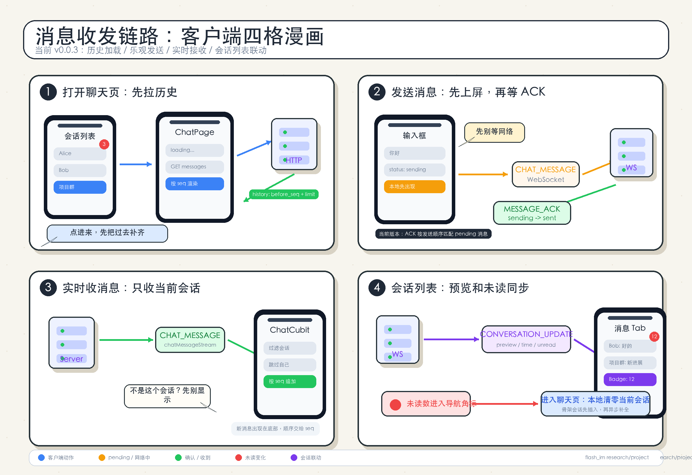

# 消息收发链路客户端四个场景漫画

> 范围：当前 v0.0.3 客户端文本消息闭环。依据 `docs/features/im/core/v0.0.3/client/design.md` 和 `docs/research/project/message_delivery_backend_chain.md`，这里把前端需要处理的四个场景压缩成一张漫画式图解。

## 四个场景

| 场景 | 前端要处理什么 | 当前版本边界 |
| --- | --- | --- |
| 1. 打开聊天页 | 从会话列表进入 `ChatPage`，通过 HTTP 拉历史消息，按 `seq` 渲染列表 | 只做历史分页加载，不做本地 SQLite 缓存 |
| 2. 发送消息 | 用户输入文本后先乐观上屏，状态为 `sending`，再通过 WebSocket 发送 `CHAT_MESSAGE` | 收到 `MESSAGE_ACK` 后更新为 `sent`；当前 ACK 不依赖精确 `client_id` 匹配 |
| 3. 实时收消息 | 监听 `chatMessageStream`，只处理当前会话、跳过自己发出的消息，追加到底部并按 `seq` 排序 | 只支持文本消息，不处理图片、文件、语音 |
| 4. 会话列表联动 | 监听 `CONVERSATION_UPDATE`，更新会话 preview、time、unread 和底部消息角标；进入聊天页本地清零当前会话未读 | 未加载会话先插入骨架，再异步补全；不做已读回执 |

## 读图方式

- 蓝色手机代表客户端页面和 Cubit。
- 绿色卡片代表服务端确认后的稳定状态。
- 橙色气泡代表本地 pending 或网络中的消息。
- 红点只表示未读变化，不表示错误。
