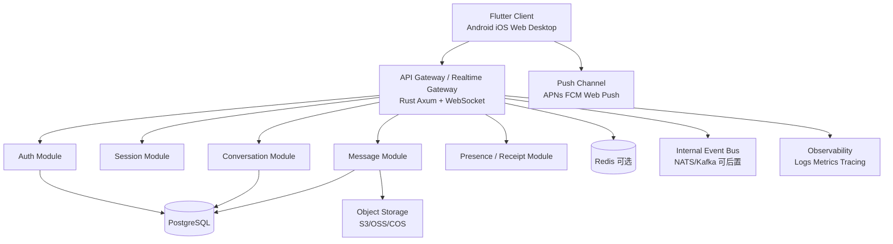
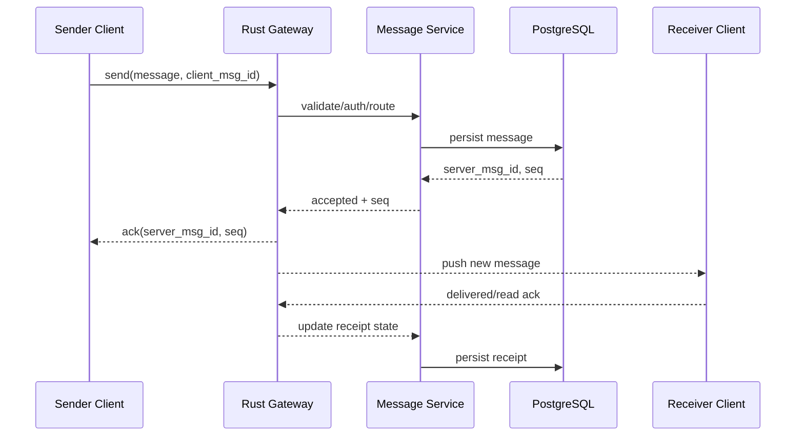

# Rust 后端 + Flutter 前端实现全栈全端 IM 的可行性评估

## 1. 文档信息

- 项目：`flash_im`
- 目标：评估基于 `Rust + Flutter` 实现全栈全端 IM 即时通信产品的可行性，并与其他主流方案对比
- 结论类型：技术决策研究
- 评估时间：2026-05-31
- 前提：基于 AI 编程，不重点考虑团队对单一语言/框架的学习成本，更关注最终系统质量、交付速度、跨端一致性、长期演进性

## 2. 执行摘要

结论先行：

`Rust 后端 + Flutter 前端` 对于“全栈全端 IM”是**可行且值得投入**的方案，尤其适合以下目标：

- 一套前端代码覆盖 Android、iOS、Web、Windows、macOS、Linux
- 后端希望兼顾高并发、低资源消耗、类型安全和长期稳定演进
- 计划把产品做成中长期基础设施，而不是短期验证后即废弃

但需要明确：

- IM 的真正难点不在“WebSocket 连上了”，而在消息投递语义、离线同步、多端一致性、顺序性、幂等、重连补偿、媒体消息、推送、风控、可观测性
- AI 编程能显著降低样板代码、接口联调、跨端 UI、CRUD、脚手架构建成本，但**不能替代协议设计、状态机校验、压测、故障演练和线上治理**
- 如果目标是“最快上线一个可商用 MVP”，`Rust + Flutter` 不是唯一解；如果目标是“兼顾中长期架构质量”，它处于第一梯队

总体判断：

- **技术可行性：高**
- **0 到 1 交付效率：中高**
- **长期维护价值：高**
- **高并发和资源效率：高**
- **跨端统一体验：高**
- **工程复杂度：中高**

## 3. 评估边界与假设

本报告默认产品范围包括：

- 单聊、群聊
- 文本、图片、文件、语音消息
- 已读/未读、送达回执、输入中状态
- 多端登录与会话同步
- 离线拉取与断线重连
- 系统通知与移动端推送
- 管理后台、基础风控、日志与监控

暂不把以下能力作为 MVP 必选：

- 端到端加密（E2EE）
- 多地域多活
- 音视频通话
- 超大规模公开频道/直播聊天室

如果未来要加入 `E2EE`、超大群、音视频，方案仍可扩展，但实现复杂度会明显上升。

## 4. IM 产品的核心技术难点

无论采用什么技术栈，IM 的复杂度主要集中在以下问题：

1. 连接层：连接建立、保活、重连、网络切换、弱网恢复
2. 协议层：消息编号、ACK、重发、去重、顺序控制、版本兼容
3. 存储层：消息持久化、游标同步、历史拉取、冷热分层
4. 多端一致性：同账号多设备登录、会话列表一致、未读数一致
5. 离线体验：App 被杀、推送唤醒、增量同步、补偿拉取
6. 媒体链路：上传、转码、缩略图、鉴权下载、CDN
7. 安全治理：鉴权、风控、审计、限流、黑产对抗
8. 线上治理：监控、Tracing、告警、压测、灰度、回滚

所以技术栈选择应该围绕这些问题，而不是只比较语言语法或框架流行度。

## 5. Rust + Flutter 方案的总体判断

### 5.1 为什么可行

该组合在职责划分上比较清晰：

- `Rust` 负责连接管理、消息处理、存储编排、异步并发、网关性能
- `Flutter` 负责多端 UI、一致交互、消息列表渲染、状态同步、桌面/移动/Web 统一产品体验

两者都适合“一个核心，多端复用”：

- Rust 适合把协议、消息模型、校验规则做得非常严格
- Flutter 适合把 IM 客户端 UI 和交互逻辑在多端做统一

### 5.2 为什么适合 AI 编程场景

在 AI 编程前提下，传统顾虑会下降：

- Rust 样板代码、Trait/泛型、序列化模型、接口封装可以由 AI 快速生成
- Flutter 页面、状态管理、主题适配、列表组件、表单与路由样板可以快速生成
- OpenAPI / Protobuf / JSON Schema 可以驱动前后端代码联动生成
- 测试桩、Mock 服务、集成测试、脚本化运维可以显著提速

但仍有三类内容不能过度依赖自动生成：

- 消息协议和状态机设计
- 跨端边界行为验证
- 高并发场景下的压测与异常恢复

### 5.3 主要风险

- Rust 的异步生命周期、错误传播、锁粒度设计一旦建模错误，问题会比较隐蔽
- Flutter Web 在超长消息列表、复杂富文本、超大房间场景下需要单独优化
- 移动端推送、后台保活、系统通知、音频录制、文件系统等能力仍需一定平台适配
- 如果早期就引入过度微服务，会放大复杂度

## 6. 推荐的技术架构

建议采用“**模块化单体优先，按压力拆分**”的策略，不要一开始就做重型微服务。

### 6.1 推荐架构图

### 6.2 建议的技术选型

后端建议：

- Web 框架：`Axum`
- 异步运行时：`Tokio`
- 数据库：`PostgreSQL`
- 缓存/会话/热点：`Redis`
- 实时通道：`WebSocket` 为主
- 内部 RPC：`gRPC` 或内部 HTTP
- 对象存储：S3 兼容存储
- 消息序列化：`Protobuf` 或稳定版本化 JSON
- 可观测性：`OpenTelemetry + Prometheus + Grafana + Loki/ELK`

前端建议：

- 客户端：`Flutter`
- 状态管理：`Riverpod` 或 `Bloc`，二选一并长期统一
- 本地存储：`SQLite`（如 `drift`）优先，消息类数据不要只依赖 KV
- 实时连接：WebSocket 客户端封装
- 媒体：对象存储直传 + 服务端签名
- 推送：`FCM + APNs`，Web 端补充 Web Push

## 7. 关键链路设计建议

### 7.1 消息主链路

### 7.2 设计原则

- 发送端必须带 `client_msg_id`，服务端做幂等去重
- 服务端分配 `server_msg_id` 和会话内 `seq`
- ACK 分层：接收成功 ACK、投递 ACK、已读 ACK 分开
- 历史同步基于游标或序列号，不依赖“最后一条消息时间”
- 重连后优先做增量补偿，而不是全量刷新
- 未读数、会话置顶、草稿等状态要区分“服务端状态”和“本地 UI 状态”

## 8. Rust + Flutter 的优势与短板

### 8.1 优势

| 维度 | 判断 | 说明 |
| --- | --- | --- |
| 跨端统一 | 强 | Flutter 可覆盖移动、Web、桌面，产品一致性高 |
| 性能与资源效率 | 强 | Rust 在高并发连接、内存占用、CPU 效率上有优势 |
| 类型安全 | 强 | 前后端都适合做严格模型约束 |
| 长期维护 | 强 | 适合把协议、领域模型、边界条件做得清晰 |
| AI 协作 | 强 | Rust/Flutter 样板、接口、测试、页面生成收益明显 |
| 多端产品速度 | 强 | 比原生多团队并行成本低很多 |

### 8.2 短板

| 维度 | 判断 | 说明 |
| --- | --- | --- |
| 初期复杂度 | 中高 | 如果一开始就追求完美协议和多服务拆分，推进会变慢 |
| Web 生态兼容 | 中 | 某些浏览器细节、文件与通知能力需要额外处理 |
| 原生平台能力 | 中 | 推送、后台、录音、通知等仍要做平台适配 |
| Rust 调试成本 | 中 | 异步问题和性能问题需要较强工程化验证 |

## 9. 与其他方案对比

### 9.1 方案对比总表

| 方案 | 0-1 速度 | 全端覆盖 | 高并发潜力 | 长期维护 | 实时能力 | 适合场景 | 主要问题 |
| --- | --- | --- | --- | --- | --- | --- | --- |
| `Rust + Flutter` | 中高 | 强 | 强 | 强 | 强 | 中长期 IM 主产品 | 架构与协议设计要求高 |
| `Go + Flutter` | 高 | 强 | 强 | 强 | 强 | 更偏工程效率导向 | 类型约束和复杂领域建模略弱于 Rust |
| `TypeScript/NestJS + Flutter` | 很高 | 强 | 中高 | 中高 | 中高 | 最快做业务 MVP | 高并发与运行时稳定性需更谨慎 |
| `Elixir/Phoenix + Flutter` | 中 | 强 | 很强 | 高 | 很强 | 超强实时互动/频道模型 | 生态与招聘面相对窄 |
| `Kotlin/Ktor + Compose Multiplatform` | 中 | 中高 | 中高 | 高 | 中高 | Android/后端一体化团队 | Web 与桌面成熟度、团队策略需评估 |
| `Flutter + Firebase/Supabase` | 很高 | 强 | 中 | 中 | 中高 | 验证型产品/轻后端团队 | 深度定制 IM 语义、迁移与成本控制受限 |

### 9.2 分方案分析

#### A. Rust + Flutter

适合度：**高**

优点：

- 前后端都适合做长期核心系统
- 性能、资源、类型安全、协议严谨性都很好
- 适合逐步演进为真正的平台型 IM 架构

缺点：

- 初期如果没有明确边界，容易陷入“工程过度设计”
- 需要把协议设计、压测、故障演练纳入常规流程

判断：

- 如果目标是认真做一个中长期 IM 产品，这是推荐方案

#### B. Go + Flutter

适合度：**高**

优点：

- 工程推进快，后端开发效率很高
- 网络服务、并发、部署、运维经验广泛
- AI 生成与人工审查都比较高效

缺点：

- 在复杂领域约束、状态建模、编译期安全性上弱于 Rust
- 超大代码库中更依赖工程纪律而非语言约束

判断：

- 如果更看重推进速度与招人普适性，`Go + Flutter` 是最直接的替代方案
- 对大多数 IM 商业场景，它是和 `Rust + Flutter` 同级的竞争者

#### C. TypeScript/NestJS + Flutter

适合度：**中高**

优点：

- 业务开发快，生态全，后台管理和业务接口效率高
- AI 编程配合 TypeScript 产出速度很高
- 全栈开发协作门槛低

缺点：

- 高连接数、实时链路稳定性、内存效率不如 Rust/Go/Elixir
- 对消息顺序、幂等、重试、投递保障做深时，运行时问题更需要防御

判断：

- 如果目标是“最快做出商业可用 MVP”，它很有竞争力
- 如果目标是“长期高并发 IM 基建”，不如 Rust/Go/Elixir 稳妥

#### D. Elixir/Phoenix + Flutter

适合度：**高，但更偏特定取向**

优点：

- 对高并发连接、频道广播、容错、分布式实时系统非常强
- `Phoenix Channels` 非常适合实时互动型产品

缺点：

- 生态和工程配套对多数团队不如 Go/TS/Rust 普遍
- AI 虽能补足语法产出，但很多问题最终仍依赖资深经验判断

判断：

- 如果产品更偏“超强实时广播/频道/社区互动”，这套非常强
- 如果要兼顾通用后端生态、招聘和多工具链协同，Rust/Go 通常更平衡

#### E. Kotlin/Ktor + Compose Multiplatform

适合度：**中高**

优点：

- 服务端和客户端语言统一度高
- Android 生态天然强，Kotlin 语言体验成熟

缺点：

- Compose Multiplatform 在“全端产品交付稳定性”上通常不如 Flutter 一致
- Web/桌面生态与产能稳定性仍需项目级验证

判断：

- 如果团队以 Android/Kotlin 为中心，值得考虑
- 如果追求最稳定的全端交付，Flutter 仍更稳

#### F. Flutter + Firebase / Supabase

适合度：**中高，偏 MVP**

优点：

- 上线极快
- 鉴权、存储、实时订阅、推送周边可快速搭建
- 适合低后端投入的产品验证

缺点：

- IM 深水区能力不够自由：投递语义、复杂会话模型、精准同步策略、风控治理都会受限
- 成本、锁定、迁移、复杂度在中后期可能反噬

判断：

- 适合作为验证产品和后台能力不重的方案
- 不建议作为中大型 IM 的终局方案

## 10. 基于 AI 编程后的重新排序

如果把“团队不会 Rust/Flutter”这类传统顾虑弱化，技术选型排序会发生变化。

### 10.1 AI 真正能放大的部分

- 脚手架初始化
- DTO / Protobuf / OpenAPI 模型生成
- Flutter 页面与组件生成
- 后端 CRUD、权限中间件、日志链路接入
- 测试用例、Mock、压测脚本、迁移脚本生成

### 10.2 AI 不能替代的部分

- 消息语义设计是否正确
- 断线重连和多端一致性是否真的可靠
- 线上异常是否可观测、可恢复
- 是否能在高并发和弱网场景下保持体验

### 10.3 因此的决策含义

在 AI 编程前提下：

- `Rust + Flutter` 的门槛相对下降
- `TypeScript` 的速度优势仍在，但优势没有以前那么绝对
- “语言易学”权重下降，“系统边界是否清晰、长期是否稳”权重上升

## 11. 推荐结论

### 11.1 最推荐方案

如果你要做的是“真正的 IM 产品”，推荐：

`Rust（Axum + Tokio + PostgreSQL + WebSocket） + Flutter`

推荐理由：

- 能兼顾移动、桌面、Web 的统一交付
- 后端能承接 IM 这类状态复杂、连接密集、长期在线的系统
- 在 AI 编程加持下，工程推进速度已经足以进入可接受区间
- 中长期重构成本低于偏脚本化/偏快速堆业务的方案

### 11.2 次优替代

如果你更想要“更快推进、依然足够强”，次优替代是：

`Go + Flutter`

这套方案的综合平衡性极强，尤其适合：

- 希望快速落地
- 更看重后端开发效率
- 未来也有不错的扩展空间

### 11.3 不同目标下的推荐

| 目标 | 推荐方案 |
| --- | --- |
| 做长期主产品 | `Rust + Flutter` |
| 更重视开发速度 | `Go + Flutter` |
| 先做最快 MVP | `TypeScript/NestJS + Flutter` 或 `Flutter + Supabase/Firebase` |
| 强频道广播/实时社区 | `Elixir/Phoenix + Flutter` |

## 12. 建议的实施路线

### 12.1 第一阶段：MVP

目标：

- 单聊、群聊、登录、会话列表、消息收发、历史同步、已读回执

建议：

- 先做模块化单体
- 只保留一个主实时网关
- PostgreSQL 作为权威存储
- Redis 只用于热点与会话辅助，不作为权威消息库
- 先不引入 Kafka 这类重组件

### 12.2 第二阶段：增强可用性

目标：

- 多端同步、弱网重连、推送、媒体消息、后台管理、审计日志

建议：

- 把消息投递、媒体处理、推送做成可独立扩展模块
- 完善可观测性和压测
- 引入灰度、限流、风控

### 12.3 第三阶段：规模化

目标：

- 高并发房间、跨机房、分区扩展、冷热分层、复杂权限体系

建议：

- 按连接网关、消息写入、会话聚合、搜索、推送逐步拆分
- 在真实瓶颈出现后再引入消息总线和更复杂分布式能力

## 13. 建议落地原则

1. 协议先行：先定义消息模型、ACK 语义、序列号、同步规则
2. 单体优先：先做清晰边界，再按压力拆服务
3. 存储保守：消息权威存储先放 PostgreSQL，不要过早引入太多中间件
4. 客户端离线优先：本地数据库、重连补偿、消息去重必须早做
5. 测试前置：协议测试、集成测试、压测、弱网测试必须自动化
6. 观测内建：日志、指标、Tracing 从第一版就接入

## 14. 最终结论

`Rust 后端 + Flutter 前端` 做全栈全端 IM，结论是：

- **可行**
- **适合认真做成长期产品**
- **在 AI 编程时代具备很强竞争力**

如果当前项目 `flash_im` 的目标是做一个真正能持续演进的 IM 系统，而不是只做一个短期演示，那么该方案是合理的主选项。

一句话建议：

**选 `Rust + Flutter`，但架构策略必须是“协议先行、模块化单体起步、压测和可观测性前置”。**

## 15. 参考资料

以下资料用于校验平台能力与方案判断，优先采用官方文档：

- Flutter 文档：<https://docs.flutter.dev/>
- Flutter 平台集成：<https://docs.flutter.dev/platform-integration>
- Axum 文档：<https://docs.rs/axum/latest/axum/>
- Tokio 文档：<https://docs.rs/tokio/latest/tokio/>
- Phoenix Channels：<https://hexdocs.pm/phoenix/channels.html>
- NestJS WebSockets：<https://docs.nestjs.com/websockets/gateways>
- Kotlin Multiplatform：<https://kotlinlang.org/docs/multiplatform.html>
- Supabase Realtime：<https://supabase.com/docs/guides/realtime>
- Firebase 实时数据能力：<https://firebase.google.com/docs>
