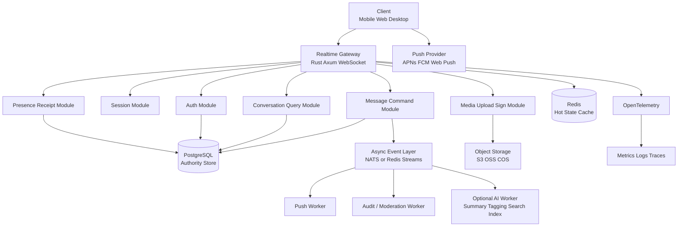
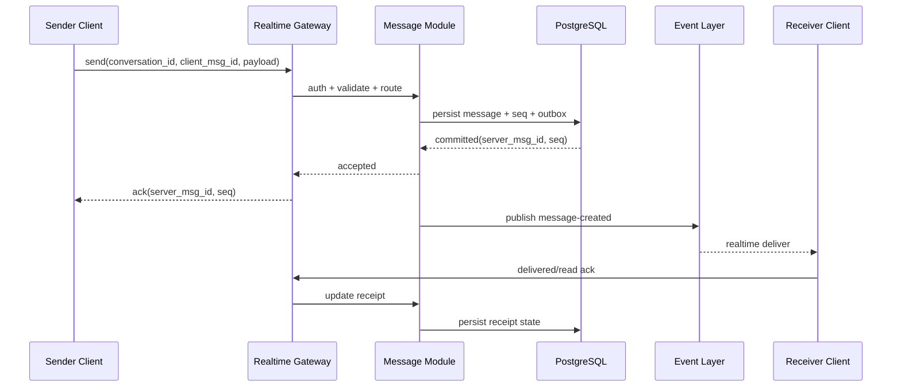
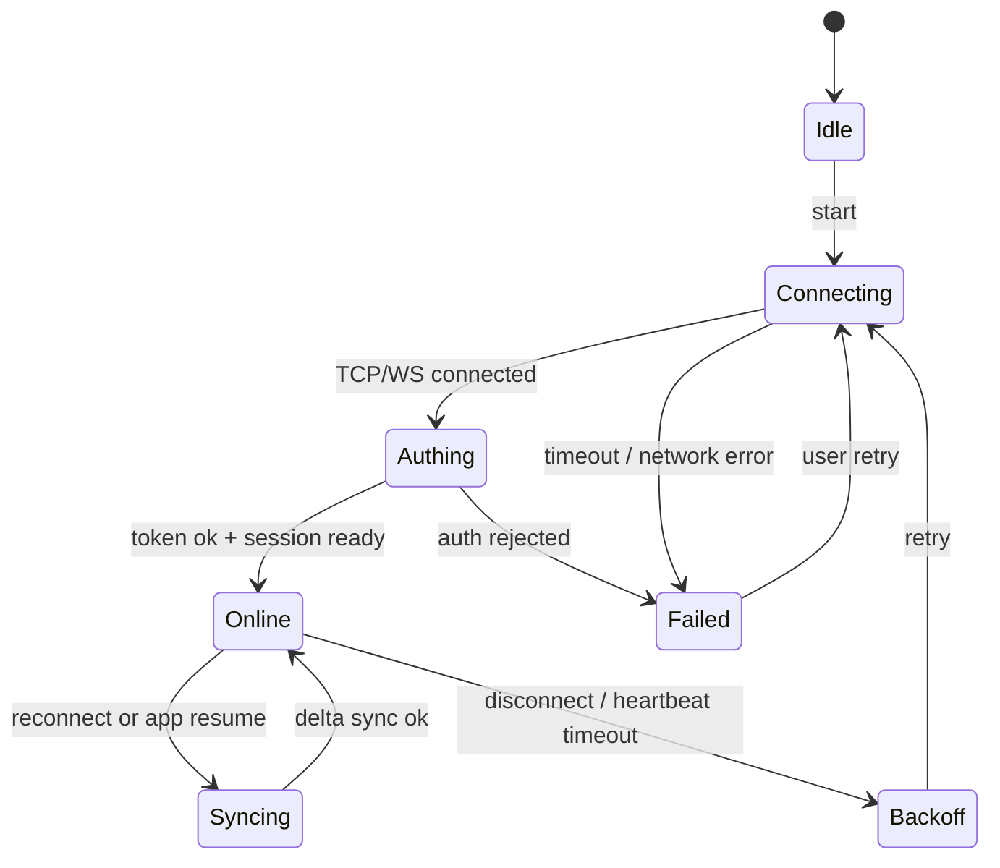

# Rust 及后端架构现状分析

## 1. 文档信息

- 项目：`flash_im`
- 目标：分析 `Rust` 与主流后端技术栈在 2026-06 的现状，并给出“基于 AI 辅助开发实现 IM 后端”的架构建议
- 文档类型：技术研究 / 架构决策参考
- 编写时间：`2026-06-01`
- 说明：
  - 文中“现状”部分优先基于官方文档与官方发布信息
  - 文中“推荐”与“取舍”部分，是结合 IM 场景做的工程推演，不是任何官方方案背书

## 2. 执行摘要

结论先行：

1. `Rust` 的后端生态已经过了“能不能上生产”的讨论阶段，进入“应该怎样用得更合理”的阶段。
2. 对 IM 这类“长连接 + 高并发 + 多端一致性 + 协议严格”的系统，`Rust` 是第一梯队方案。
3. 如果你打算在 `AI 辅助开发` 前提下做一个中长期 IM 后端，最合理的主线不是“重微服务起步”，而是：
   - `Rust + Tokio + Axum`
   - `PostgreSQL` 作为权威存储
   - `Redis` 作为热点状态与短期加速层
   - `WebSocket` 作为主实时通道
   - `gRPC` 作为内部 RPC 候选
   - `NATS` 或 `Kafka` 作为后置事件总线，而不是第一天就引入
4. 如果你把“整体交付速度”放在第一位，`Go` 仍然是最强替代方案；如果你把“协议严谨性、资源效率、长期稳定性”放在第一位，`Rust` 更优。
5. 对 IM 而言，真正的难点不是框架，而是：
   - 消息语义
   - 幂等与顺序
   - 多端同步
   - 离线补偿
   - 可观测性
   - 灰度与故障恢复

一句话结论：

**如果目标是做长期可演进的 IM 基础设施，推荐 `Rust` 作为后端主栈；如果目标是以最短时间做出稳定商用 MVP，`Go` 是最现实的对照组选项。**

## 3. 2026-06 时点的 Rust 后端现状

### 3.1 语言与运行时层面

截至 `2026-06-01`，Rust 官方已发布 `Rust 1.96.0`，发布日期是 `2026-05-28`。  
这意味着如果你现在启动新项目，已经不是在赌一门“新锐语言”的未来，而是在使用一门持续稳定演进、发布节奏明确、工具链成熟的系统语言。

在异步运行时方面，`Tokio` 仍然是事实标准。官方教程把它定义为 Rust 的异步运行时，提供：

- 多线程异步运行时
- 异步版标准库能力
- 大量生态库

并明确指出它主要适合 `I/O bound`、高并发网络应用，而不是 CPU 密集计算。这一点和 IM 后端的工作负载高度匹配。

### 3.2 Web 与 RPC 生态层面

Rust Web 后端现在不是“只有一个框架”，而是已经形成比较清晰的分工：

| 层次 | 当前主流选择 | 现状判断 |
| --- | --- | --- |
| Async Runtime | `Tokio` | 事实标准 |
| HTTP / Web API | `Axum` | 新项目默认优选 |
| 高性能 Web 框架 | `Actix Web` | 仍然强，尤其在成熟能力和性能导向场景 |
| 内部 RPC | `Tonic` | Rust 侧 gRPC 主流实现 |
| 低层 HTTP | `Hyper` | 底层基础设施 |
| 中间件抽象 | `Tower` | `Axum` / `Tonic` 生态统一层 |

这和几年前最大的区别在于：

- 现在不是“生态有没有”
- 而是“生态已经足够多，需要做合理裁剪”

### 3.3 数据与存储层面

Rust 数据访问生态也已经成熟到可以支撑生产：

- `SQLx`
  - 当前 `0.9.0`
  - 官方定位是 async SQL toolkit
  - 支持 `Tokio` 与 `async-std`
  - 适合显式 SQL、强控制、核心链路
- `SeaORM`
  - 当前 `1.1.20`
  - 官方定位是 async、dynamic、service oriented ORM
  - 适合后台管理、动态查询、通用业务服务

对 IM 后端而言，我的判断是：

- **核心消息链路优先 `SQLx` 或手写 SQL**
- **后台与非核心业务域可接受 `SeaORM`**

原因不是 ORM 不够成熟，而是 IM 的关键链路通常要求：

- 更严格的查询可控性
- 更清晰的事务边界
- 更容易做幂等与顺序推导

### 3.4 基础设施层面

数据库与基础设施的“当前现实”也很重要：

- `PostgreSQL 18` 已于 `2025-09-25` 发布
- PostgreSQL 官方说明这一版本带来了新的 I/O 子系统、开发体验增强、`uuidv7()`、以及 `OAuth 2.0` 认证支持
- `Redis Streams` 仍然是 append-only log 风格的数据结构，适合作为轻量事件流与消费队列
- `NATS` 官方明确区分：
  - Core NATS：`at most once`
  - JetStream：支持更高 QoS 与持久流
- `Kafka` 仍然是重量级 durable event streaming 平台，适合大规模事件流、长期保留、复杂消费组场景

因此，Rust 的问题已经不是“能否接住这些基础设施”，而是“团队是否需要一开始就引入这么多组件”。

## 4. Rust 后端生态怎么选才合理

### 4.1 Axum vs Actix Web

这两个框架都不是“错选”，但定位不同。

| 维度 | `Axum` | `Actix Web` |
| --- | --- | --- |
| 默认推荐度 | 高 | 中高 |
| 设计取向 | 更现代、模块化、Tower 统一 | 更成熟、偏一体化、性能导向强 |
| 中间件体系 | 直接复用 `Tower` | 自有风格更强 |
| 与 gRPC 组合 | 更自然，和 `Tonic` 一致性高 | 可做，但生态统一性略弱 |
| 新项目上手 | 更适合现在的新项目 | 更适合已有经验或性能偏执场景 |
| 我的推荐 | 作为默认主选 | 作为强替代方案 |

根据官方文档：

- `Axum 0.8.9` 强调 ergonomics、modularity，并直接复用 `tower::Service`
- `Actix Web 4.13.0` 明确支持 HTTP/1.x、HTTP/2、WebSocket、压缩、中间件，并保持与 Tokio 兼容

工程判断：

- 如果你要做一个新的 IM 后端主线，我会先选 `Axum`
- 如果你已经熟悉 `Actix Web`，或者你特别在意它的一体化体验与现成能力，也完全可以用

### 4.2 SQLx vs SeaORM

这是 Rust IM 项目里非常关键的一个取舍。

| 维度 | `SQLx` | `SeaORM` |
| --- | --- | --- |
| 查询控制力 | 强 | 中高 |
| 类型约束 | 强 | 强 |
| 动态查询开发体验 | 中 | 强 |
| IM 核心链路适配 | 高 | 中 |
| 后台 CRUD 适配 | 中 | 高 |
| 我的建议 | 消息、会话、回执主链路优先 | 后台、运营、管理域优先 |

推荐策略：

- `消息写入`
- `消息补偿拉取`
- `会话游标更新`
- `已读/送达状态写入`

这些地方优先 `SQLx`。

- `后台管理`
- `审计查询`
- `运营报表接口`
- `通用配置域`

这些地方可以用 `SeaORM`。

### 4.3 NATS vs Kafka vs Redis Streams

对 IM 后端来说，这三者常常被误用。

| 组件 | 更适合做什么 | 不适合一开始做什么 |
| --- | --- | --- |
| `Redis Streams` | 轻量事件流、简单消费队列、局部异步任务 | 作为长期权威消息总线 |
| `NATS` | 轻量服务间消息、低运维负担、JetStream 扩展持久流 | 一开始就承载复杂全局事件平台 |
| `Kafka` | 大规模 durable event streaming、复杂消费拓扑、长期保留 | MVP 阶段的默认总线 |

我的建议非常直接：

- MVP：**先不用 Kafka**
- 如果确实需要事件解耦：**先看 NATS / Redis Streams**
- 当你已经出现：
  - 多消费域
  - 长期回放
  - 大规模异步分析
  - 多团队共用事件平台

再考虑 Kafka

## 5. AI 辅助开发会怎样改变后端技术选型

这里的“基于 AI 实现 IM 后端”，我按“AI 辅助研发”理解，而不是“在 IM 产品里嵌入 AI 对话功能”。

### 5.1 AI 真正会抹平的部分

AI 对下面这些环节帮助很大：

- DTO / Protobuf / OpenAPI 模型生成
- handler / service / repository 样板生成
- Flutter / Web / 管理后台联调代码生成
- 数据库 migration 脚本初稿
- 压测脚本、Mock server、回放脚本
- 文档、接口说明、Mermaid 图

这会直接降低 Rust 的“语法门槛成本”。

### 5.2 AI 不能替代的部分

AI 无法替代下面这些架构决策：

- 消息唯一标识的定义是否正确
- ACK 分层是否合理
- 多端同步游标是否会打架
- 重连补偿是否会重复投递
- 数据库事务边界是否过大
- 线上故障时是否能快速定位

换句话说：

**AI 可以大幅降低“写代码”的成本，但不能替你定义“系统语义”。**

### 5.3 因而对 Rust 的影响

传统上，Rust 的劣势是：

- 写得慢
- 学习成本高
- 样板偏多

在 AI 辅助开发下，这些劣势都被削弱了。

于是技术选型的权重会变化：

- “语言是否容易写”权重下降
- “语言是否能把边界收紧”权重上升

这正好是 Rust 的受益点。

## 6. 面向 IM 的后端架构建议

### 6.1 先给结论

我不建议一开始就做重微服务。  
对 IM 来说，更合理的起手式是：

- 模块化单体
- 一个统一的实时网关入口
- 一个清晰的消息主链路
- 一个权威数据库
- 少量辅助基础设施
- 从第一天就接入观测体系

### 6.2 推荐逻辑架构

这个图的核心思想是：

- 权威数据统一落 `PostgreSQL`
- `Redis` 只做热点，不做消息权威库
- 异步扩展通过事件层解耦
- AI 能力是边缘异步模块，不侵入消息主链路

### 6.3 为什么不建议“消息直接靠 Redis”

因为 IM 的关键不是“快写入”，而是“可解释、可补偿、可追责”。

只要你要认真处理下面这些能力：

- 消息序列
- 历史拉取
- 已读回执
- 多端补偿
- 审计追踪

你最终都需要一个权威、可事务化、可查询、可回放的存储底座。  
对绝大多数中早期 IM 项目，这个底座首先应该是 `PostgreSQL`。

### 6.4 消息主链路

这里最关键的不是“图里有哪些框”，而是下面 5 条规则：

1. 客户端必须带 `client_msg_id`
2. 服务端必须生成 `server_msg_id`
3. 会话内必须有严格的 `seq`
4. ACK 必须分层
5. 重连同步必须基于游标 / seq，而不是时间戳猜测

### 6.5 连接状态与重连状态机

这个状态机比框架更重要。  
很多 IM 系统的问题，不是接口写错，而是连接状态机定义不清。

## 7. 你真正应该怎么拆模块

### 7.1 MVP 阶段

推荐按“模块化单体”组织：

- `auth`
- `gateway`
- `session`
- `message`
- `conversation`
- `receipt`
- `media`
- `push`
- `admin`

代码层面建议按边界拆，不按“controller/service/utils”硬切一整个仓库。

### 7.2 可扩展阶段

当下面这些压力出现时，再拆服务：

- 网关连接数压力明显高于业务写入压力
- 推送、审核、媒体处理开始拖慢主链路
- 后台报表查询对主库造成影响
- 多团队需要独立发布节奏

优先拆分顺序建议：

1. `push worker`
2. `media worker`
3. `audit/moderation worker`
4. `search/index worker`
5. `gateway` 与 `message command` 分离

不建议最先拆的：

- 会话聚合
- 读扩散优化
- 自定义事件平台

这些通常太早拆会把复杂度提前释放出来。

## 8. Rust 栈内部的推荐组合

### 8.1 我最推荐的基础组合

| 层次 | 推荐 |
| --- | --- |
| Language | `Rust` |
| Runtime | `Tokio` |
| HTTP / WS | `Axum` |
| Internal RPC | `Tonic` |
| DB Access | `SQLx` 为主，`SeaORM` 为辅 |
| DB | `PostgreSQL` |
| Cache | `Redis` |
| Async Bus | `NATS` 或 `Redis Streams` 起步 |
| Observability | `OpenTelemetry + Prometheus + Grafana + Loki/Jaeger` |

### 8.2 为什么是这个组合

- `Axum`
  - 与 `Tower` / `Hyper` / `Tonic` 组合自然
  - 适合把 HTTP、WebSocket、内部服务治理放到统一抽象上
- `SQLx`
  - 对核心链路可控性更高
  - 更利于 AI 生成后的人类复核
- `PostgreSQL`
  - 足够强、足够稳、足够通用
  - 在 IM 早中期远比“过度分布式消息库”更合适
- `NATS`
  - 比 Kafka 更轻
  - 适合做早期解耦
- `OpenTelemetry`
  - 官方定义明确它是 vendor-agnostic 的 observability framework
  - 适合从第一天就把 traces / metrics / logs 打通

### 8.3 哪些组合我不建议一开始上

- `Rust + Kafka + ScyllaDB + 多微服务 + CQRS + Event Sourcing 全套`
  - 不是不能做
  - 而是过早把系统复杂度拉满

- `Rust + ORM-only + Redis-only`
  - 开发看似快
  - 后面会在顺序性、查询可追踪性、数据回放上付代价

## 9. 与其他后端技术栈的横向对比

### 9.1 总表

| 技术栈 | 0 到 1 速度 | 长连接适配 | 资源效率 | 编译期约束 | AI 辅助收益 | 长期 IM 适配 |
| --- | --- | --- | --- | --- | --- | --- |
| `Rust + Axum/Tokio` | 中高 | 高 | 高 | 高 | 高 | 高 |
| `Go + Gin/Fiber/Chi` | 高 | 高 | 高 | 中 | 高 | 高 |
| `TypeScript + NestJS` | 很高 | 中高 | 中 | 中 | 很高 | 中高 |
| `Elixir + Phoenix` | 中 | 很高 | 高 | 中 | 中 | 高 |
| `Kotlin + Ktor` | 中高 | 中高 | 中高 | 高 | 中高 | 中高 |

### 9.2 Rust vs Go

这是最现实的一组对比。

`Go` 的优势：

- 更快起步
- 招人更普遍
- 生态与工程套路成熟
- 日常服务开发成本更低

`Rust` 的优势：

- 更强的类型约束
- 更低的运行时不确定性
- 更好的资源效率
- 更适合把复杂协议和边界压到编译期

判断：

- 如果你最关心 **研发速度和组织普适性**，选 `Go`
- 如果你最关心 **长期稳定性、协议严谨性、资源效率**，选 `Rust`

### 9.3 Rust vs TypeScript / NestJS

`NestJS` 的优势：

- 管理后台、业务接口、运营域推进非常快
- AI 生成代码速度极高
- 全栈团队协作门槛低

`Rust` 的优势：

- 在高连接数、长生命周期连接、细粒度状态控制上更稳
- 更适合 IM 主链路

判断：

- `NestJS` 很适合作为后台管理与业务平台
- 但如果要做 IM 核心后端，我不会把它排在 `Rust/Go/Elixir` 前面

### 9.4 Rust vs Elixir / Phoenix

Phoenix 官方文档仍然明确强调：

- Channels 支持 soft real-time communication
- 基于长连接
- 每个 client/topic 对应轻量进程
- 非常适合 chat room、messaging、multiplayer 等场景

这意味着：

- 在“实时广播模型”这件事上，`Phoenix` 依然很强

但现实取舍是：

- 如果你想要最强实时频道模型，可以认真看 `Elixir/Phoenix`
- 如果你要兼顾更通用的后端生态、更多语言协作、AI 辅助代码审查一致性，`Rust` 更均衡

### 9.5 Rust vs Kotlin / Ktor

Ktor 官方当前文档显示 `3.5.0` 仍然对 WebSocket 支持良好，且配置、安装、扩展清晰。

`Kotlin/Ktor` 的优势：

- 语言现代
- JVM 生态成熟
- Android 团队迁移自然

但 IM 后端实践里，它更多是“稳妥方案”，不是“最有性价比的主推方案”。

我的判断：

- 如果团队本身强 JVM / Android
  - 可以认真考虑
- 如果没有这个历史包袱
  - `Rust` 和 `Go` 的优先级更高

## 10. 最推荐的落地方案

### 10.1 如果你的目标是长期 IM 主产品

推荐：

`Rust + Tokio + Axum + PostgreSQL + Redis + WebSocket`

附加建议：

- 内部 RPC 用 `Tonic`
- 事件解耦先用 `NATS` 或 `Redis Streams`
- `OpenTelemetry` 从第一版就接

### 10.2 如果你的目标是更快上线且仍然够强

推荐替代：

`Go + PostgreSQL + Redis + WebSocket`

这是最现实、最稳的速度优先对照组。

### 10.3 如果你的目标是极致快做 MVP

推荐替代：

`TypeScript / NestJS + PostgreSQL + Redis`

但我只建议把它用在：

- 验证商业假设
- 非极限连接规模
- 后续允许重构

## 11. 最容易做错的 10 件事

1. 把“连上 WebSocket”误认为 IM 架构已经成立
2. 用时间戳而不是序列号做消息同步
3. 没有 `client_msg_id` 就做发送幂等
4. 让 `Redis` 承担权威消息存储
5. 一开始就上 Kafka 和多微服务
6. 没有定义清晰的 ACK 分层
7. 只做成功链路，不做断线补偿链路
8. 不做连接状态机建模
9. 不做压测、弱网测试、回放测试
10. 第二版才接日志、指标、Tracing

## 12. 最终结论

截至 `2026-06-01`，Rust 后端的现状可以概括为：

- 语言成熟
- 异步运行时成熟
- Web / gRPC / 数据访问生态成熟
- 足以支撑 IM 这类高要求实时系统

如果你的目标是：

- 基于 AI 辅助研发
- 做一个认真可演进的后端 IM
- 不想把长期质量押在运行时侥幸上

那么我的主推荐是：

**用 `Rust` 做后端主栈，但以“模块化单体 + PostgreSQL 权威存储 + WebSocket 主链路 + 观测前置”作为架构原则。**

如果只给一句最实用的决策建议，那就是：

**Rust 值得选，但不要把难点放在“学会框架”，要把精力放在“定义正确的 IM 语义和状态机”。**

## 13. 参考资料

以下链接在撰写时已核对，优先采用官方资料：

- Rust 1.96.0 发布说明：<https://blog.rust-lang.org/2026/05/28/Rust-1.96.0/>
- Rust 安装与工具链：<https://rust-lang.org/tools/install/>
- Tokio 教程概览：<https://tokio.rs/tokio/tutorial>
- Axum 文档：<https://docs.rs/axum/latest/axum/>
- Actix Web 文档：<https://docs.rs/actix-web/latest/actix_web/>
- Tonic 文档：<https://docs.rs/tonic/latest/tonic/>
- SQLx 文档：<https://docs.rs/sqlx/latest/sqlx/>
- SeaORM 文档：<https://docs.rs/sea-orm/latest/sea_orm/>
- PostgreSQL 18 发布说明：<https://www.postgresql.org/about/news/postgresql-18-released-3142/>
- PostgreSQL 当前发布信息：<https://www.postgresql.org/about/press/presskit18/>
- Redis Streams：<https://redis.io/docs/latest/develop/data-types/streams/>
- NATS 概念说明：<https://docs.nats.io/nats-concepts/what-is-nats>
- Apache Kafka 文档：<https://kafka.apache.org/documentation/>
- NestJS WebSocket Gateways：<https://docs.nestjs.com/websockets/gateways>
- Phoenix Channels：<https://phoenix.hexdocs.pm/channels.html>
- Ktor WebSockets：<https://ktor.io/docs/server-websockets.html>
- OpenTelemetry：<https://opentelemetry.io/docs/what-is-opentelemetry/>
